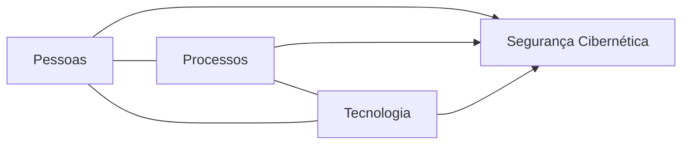
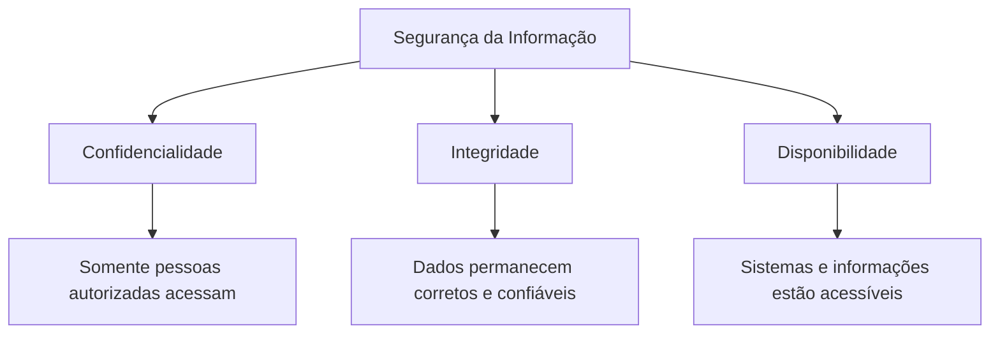
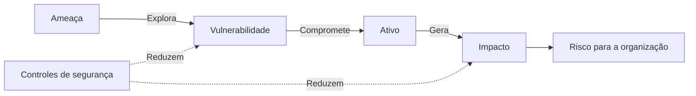
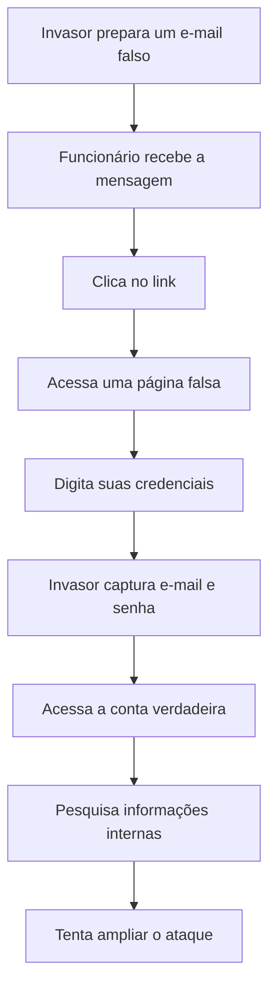
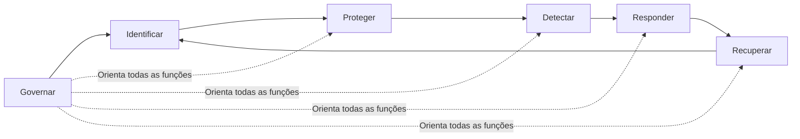

# Capítulo 001 — O que é Cybersecurity?

> **Entender antes de decorar.**

**Nível:** Iniciante
**Tempo estimado de leitura:** 15 minutos
**Pré-requisitos:** Nenhum

---

## O que você aprenderá neste capítulo?

Ao final deste capítulo, você será capaz de:

* compreender o que significa Cybersecurity;
* entender por que a segurança cibernética se tornou necessária;
* identificar o que precisa ser protegido;
* diferenciar ameaça, vulnerabilidade, risco e ataque;
* conhecer as principais etapas de uma estratégia de segurança;
* reconhecer exemplos de Cybersecurity no cotidiano;
* conhecer algumas das áreas profissionais existentes;
* entender como Cyber Threat Intelligence se relaciona com a segurança.

---

## Antes de começar...

Você já parou para pensar em quantas vezes utilizou a tecnologia somente hoje?

Talvez você tenha desligado o alarme do celular, acessado sua conta bancária, respondido a uma mensagem, aberto seu e-mail, realizado uma compra ou consultado o mapa para encontrar algum endereço.

Para nós, essas atividades parecem simples.

Basta tocar na tela, digitar uma senha e esperar alguns segundos.

Por trás dessa aparente simplicidade, porém, existem sistemas, servidores, redes, bancos de dados, aplicações e diversos outros recursos trabalhando para que tudo funcione corretamente.

Esses ambientes armazenam informações muito valiosas:

* senhas;
* documentos;
* conversas;
* dados bancários;
* prontuários médicos;
* informações empresariais;
* endereços;
* fotografias;
* dados de clientes;
* segredos comerciais.

Agora imagine que nenhuma dessas informações tivesse proteção.

Qualquer pessoa poderia acessar sua conta bancária.

Um funcionário sem autorização poderia visualizar o salário dos colegas.

Um criminoso poderia modificar os dados de uma transferência.

Um hospital poderia perder o acesso aos prontuários de seus pacientes.

Uma loja virtual poderia ficar indisponível durante uma importante campanha de vendas.

Foi para reduzir riscos como esses que a Cybersecurity se tornou necessária.

Antes de aprender ferramentas, comandos ou técnicas, precisamos compreender o problema que estamos tentando resolver.

---

# O problema que a Cybersecurity procura resolver

Vivemos em uma sociedade cada vez mais dependente de sistemas digitais.

Empresas utilizam computadores para administrar estoques, emitir notas fiscais, registrar vendas, armazenar contratos e se comunicar com clientes.

Hospitais dependem de sistemas para acessar exames, registrar medicamentos e acompanhar pacientes.

Bancos utilizam redes e aplicações para movimentar dinheiro.

Governos armazenam informações sobre milhões de cidadãos.

Até mesmo pequenos negócios dependem de e-mail, redes sociais, marketplaces, sistemas de pagamento e serviços na nuvem.

Essa dependência cria uma situação importante:

> Quanto maior o valor e a importância de um recurso digital, maior será a necessidade de protegê-lo.

Os riscos podem surgir de diferentes formas.

Um sistema pode apresentar uma falha de programação.

Um funcionário pode clicar em um link malicioso.

Um servidor pode ser configurado incorretamente.

Uma senha pode ser descoberta.

Um equipamento pode parar de funcionar.

Um criminoso pode tentar roubar informações.

Um funcionário autorizado pode utilizar seus acessos de maneira indevida.

Também podem ocorrer falhas sem qualquer ação criminosa, como incêndios, problemas elétricos, erros humanos e defeitos em equipamentos.

Por isso, Cybersecurity não significa apenas “impedir hackers”.

Ela envolve proteger sistemas e informações contra diferentes situações capazes de comprometer seu funcionamento ou causar prejuízos.

---

# Afinal, o que é Cybersecurity?

O termo **Cybersecurity**, traduzido normalmente como **Segurança Cibernética**, representa o conjunto de práticas utilizadas para proteger sistemas, redes, dispositivos, aplicações e informações contra ataques, acessos indevidos, danos e interrupções.

O NIST, instituto norte-americano responsável por desenvolver diversos padrões e orientações técnicas, apresenta Cybersecurity como a proteção das informações por meio da prevenção, detecção e resposta a ataques. Outras definições do instituto também incluem a recuperação dos sistemas após um incidente.

Essa definição pode parecer técnica em um primeiro momento.

Vamos traduzi-la.

> Cybersecurity é tudo aquilo que fazemos para evitar que recursos digitais sejam acessados, modificados, destruídos ou interrompidos de maneira indevida — e para recuperar esses recursos quando algo dá errado.

Observe que essa definição não menciona uma ferramenta específica.

Cybersecurity não é um antivírus.

Não é um firewall.

Não é um programa de monitoramento.

Não é o cara "Hackudão" com capuz diante de várias telas com um monte de código maluco.

Esses elementos podem fazer parte da segurança, mas nenhum deles representa a área inteira.

Cybersecurity é formada pela combinação de três componentes:

### Pessoas

São os usuários, analistas, gestores, desenvolvedores, clientes, fornecedores e todos os indivíduos que interagem com os sistemas.

### Processos

São as regras e os procedimentos que determinam como a organização deve prevenir, identificar e responder aos riscos.

### Tecnologia

São as ferramentas e os controles utilizados para proteger, monitorar e recuperar os ambientes.

Uma organização pode comprar a melhor tecnologia disponível e ainda permanecer vulnerável caso seus funcionários não sejam treinados ou seus processos sejam mal definidos.

Da mesma forma, uma empresa pode possuir boas políticas, mas não ter ferramentas suficientes para colocá-las em prática.

A segurança depende do equilíbrio entre esses elementos.

---

# Uma analogia simples

Imagine uma casa.

Ela pode possuir:

* muros;
* portões;
* fechaduras;
* câmeras;
* alarmes;
* sensores;
* iluminação externa;
* seguro residencial.

Cada elemento oferece uma camada diferente de proteção.

A fechadura dificulta a entrada.

A câmera ajuda a observar atividades suspeitas.

O alarme avisa quando uma invasão está acontecendo.

O seguro ajuda na recuperação após um prejuízo.

Mesmo com todos esses recursos, ainda não existe uma garantia absoluta de que nunca ocorrerá um problema.

A lógica da Cybersecurity é semelhante.

Uma empresa pode utilizar:

* senhas;
* autenticação multifator;
* firewalls;
* antivírus;
* backups;
* criptografia;
* monitoramento;
* políticas de acesso;
* treinamentos;
* planos de resposta a incidentes.

Cada controle reduz uma parte do risco.

Essa analogia também nos ensina algo essencial:

> Segurança não significa eliminar completamente todos os riscos. Significa conhecê-los, reduzi-los e estar preparado para responder quando necessário.

---

# Uma breve história da segurança cibernética

A preocupação com segurança não nasceu com os computadores.

Durante séculos, governos, exércitos e organizações utilizaram códigos, controles físicos e métodos de proteção para preservar informações.

Com o surgimento dos computadores, a informação começou a ser armazenada e processada digitalmente.

Nos primeiros ambientes computacionais, os equipamentos eram grandes, caros e utilizados por poucas pessoas. A segurança estava bastante ligada ao controle físico: proteger a sala onde o computador estava instalado já era uma parte importante da proteção.

À medida que diferentes usuários passaram a compartilhar computadores e, posteriormente, conectar equipamentos por meio de redes, novos problemas começaram a surgir.

Não era mais suficiente controlar quem entrava na sala.

Também era necessário controlar:

* quem podia acessar cada sistema;
* quais informações cada usuário podia visualizar;
* quais operações eram permitidas;
* como detectar comportamentos indevidos;
* como proteger dados transmitidos por uma rede.

Em 1972, o National Bureau of Standards, posteriormente renomeado como NIST, estabeleceu formalmente seu programa de segurança de computadores. Nas décadas seguintes, o instituto passou a desenvolver padrões, guias de gestão de riscos, orientações de autenticação, criptografia e resposta a incidentes.

Um acontecimento marcante ocorreu em novembro de 1988.

Um programa conhecido como **Morris Worm** espalhou-se por sistemas conectados à ainda jovem internet e provocou interrupções significativas. Como consequência do incidente, a agência norte-americana DARPA solicitou a criação de uma equipe especializada em responder a emergências computacionais. Assim nasceu o CERT Coordination Center, uma das primeiras grandes referências em resposta a incidentes.

Com a expansão da internet, a quantidade de dispositivos, usuários e serviços conectados cresceu de forma acelerada.

Depois vieram:

* comércio eletrônico;
* serviços bancários digitais;
* redes sociais;
* smartphones;
* computação em nuvem;
* Internet das Coisas;
* inteligência artificial;
* ambientes industriais conectados.

A superfície que precisa ser protegida tornou-se muito maior.

Hoje, Cybersecurity não protege somente computadores tradicionais. Ela pode envolver veículos, hospitais, fábricas, câmeras, dispositivos domésticos, satélites, serviços financeiros, identidades digitais e infraestruturas essenciais para o funcionamento de uma sociedade.

---

# O que a Cybersecurity protege?

Quando falamos em segurança, podemos imaginar diferentes tipos de ativos.

## 1. Informações

Informações podem incluir:

* dados pessoais;
* senhas;
* contratos;
* documentos;
* registros médicos;
* dados financeiros;
* pesquisas;
* códigos-fonte;
* estratégias empresariais.

A informação pode estar armazenada em um computador, enviada por uma rede, impressa em papel ou até mesmo presente no conhecimento de uma pessoa.

## 2. Dispositivos

São os equipamentos utilizados para processar ou acessar informações:

* computadores;
* celulares;
* servidores;
* roteadores;
* câmeras;
* sensores;
* equipamentos industriais;
* dispositivos inteligentes.

## 3. Redes

As redes permitem que os dispositivos se comuniquem.

Sem proteção adequada, um invasor pode tentar interceptar dados, acessar equipamentos ou utilizar a rede para alcançar outros sistemas.

## 4. Aplicações

Aplicações são os sistemas que utilizamos:

* sites;
* aplicativos móveis;
* sistemas empresariais;
* lojas virtuais;
* plataformas bancárias;
* APIs;
* serviços na nuvem.

O OWASP Top 10, por exemplo, é um documento de conscientização que reúne riscos críticos relacionados à segurança de aplicações web. A edição atual é a de 2025.

## 5. Identidades

Uma identidade digital representa uma pessoa, serviço ou dispositivo dentro de um sistema.

Proteger identidades significa garantir que:

* o usuário seja realmente quem afirma ser;
* somente pessoas autorizadas tenham acesso;
* cada usuário possua apenas as permissões necessárias;
* atividades importantes possam ser rastreadas.

## 6. Operações

Às vezes, o objetivo mais importante não é proteger um arquivo específico, mas garantir que um serviço continue funcionando.

Uma empresa de comércio eletrônico, por exemplo, depende da disponibilidade de sua plataforma.

Caso o site fique fora do ar, mesmo que nenhuma informação seja roubada, a empresa poderá perder vendas, clientes e reputação.

---

# Os três princípios fundamentais

Grande parte da Segurança da Informação está baseada em três princípios conhecidos como **Tríade CIA**.

A sigla vem dos termos em inglês:

* **Confidentiality:** Confidencialidade;
* **Integrity:** Integridade;
* **Availability:** Disponibilidade.

## Confidencialidade

Significa impedir que informações sejam acessadas por pessoas não autorizadas.

Exemplo:

Somente você e as pessoas autorizadas pelo banco devem conseguir visualizar os dados de sua conta.

## Integridade

Significa garantir que as informações não sejam modificadas de maneira indevida.

Exemplo:

Se você realizar uma transferência de R$ 100, ninguém deve conseguir alterar o valor para R$ 10.000 durante o processamento.

## Disponibilidade

Significa garantir que os sistemas e informações estejam acessíveis quando forem necessários.

Exemplo:

O aplicativo do banco precisa estar disponível para que você consiga pagar uma conta no vencimento.

Os três princípios precisam trabalhar juntos.

Um sistema totalmente inacessível pode manter os dados confidenciais, mas não é útil.

Um sistema disponível, mas que permite alterações não autorizadas, também não é seguro.

No próximo capítulo, estudaremos cada um desses princípios com maior profundidade.

---

# Traduzindo o “tecniquês”

Para compreender Cybersec, precisamos conhecer quatro palavras muito utilizadas:

* ativo;
* ameaça;
* vulnerabilidade;
* risco.

## Ativo

É qualquer recurso que possui valor e precisa ser protegido.

Pode ser um computador, uma informação, um sistema, uma conta ou até a reputação de uma empresa.

## Ameaça

É algo que possui potencial para causar dano.

Uma ameaça pode ser:

* um criminoso;
* um programa malicioso;
* um incêndio;
* um funcionário agindo de forma indevida;
* uma falha elétrica.

## Vulnerabilidade

É uma fraqueza que pode ser explorada ou causar um problema.

Exemplos:

* software desatualizado;
* senha fraca;
* configuração incorreta;
* ausência de backup;
* funcionário sem treinamento.

## Risco

É a possibilidade de que uma ameaça explore uma vulnerabilidade e provoque um impacto negativo.

Podemos visualizar essa relação assim:

### Exemplo simples

Imagine uma loja com uma porta que não possui fechadura.

* **Ativo:** produtos da loja;
* **ameaça:** ladrão;
* **vulnerabilidade:** porta sem fechadura;
* **risco:** possibilidade de os produtos serem roubados;
* **controle:** instalação de uma fechadura, câmera e alarme;
* **impacto:** prejuízo financeiro e interrupção das atividades.

No ambiente digital, a lógica é semelhante.

---

# Como um ataque pode acontecer?

Vamos imaginar um caso fictício.

Um funcionário recebe um e-mail aparentemente enviado pelo setor financeiro.

A mensagem informa que existe um documento urgente esperando por sua aprovação.

O funcionário clica no link e encontra uma página muito parecida com a tela de acesso do Microsoft 365.

Ele digita seu e-mail e sua senha.

A página, porém, era falsa.

O invasor captura as credenciais e tenta acessar a conta verdadeira.

Depois de conseguir acesso, ele pesquisa mensagens, identifica contatos da empresa e tenta utilizar a conta comprometida para enganar outros funcionários.

Esse exemplo envolve diversos conceitos:

* **engenharia social:** manipulação de uma pessoa;
* **phishing:** mensagem fraudulenta criada para enganar;
* **credenciais:** informações utilizadas para autenticação;
* **acesso não autorizado:** entrada realizada sem permissão;
* **movimentação do ataque:** tentativa de alcançar novos usuários e recursos.

O MITRE ATT&CK organiza conhecimentos sobre comportamentos observados em adversários. Nesse modelo, as **táticas** representam os objetivos do atacante, enquanto as **técnicas** representam maneiras utilizadas para alcançar esses objetivos.

---

# Como a organização poderia se proteger?

Nenhum controle isolado resolveria completamente o problema.

A empresa poderia combinar diferentes medidas.

## Antes do ataque

* treinamento contra phishing;
* filtros de e-mail;
* autenticação multifator;
* política de senhas;
* limitação de privilégios;
* proteção dos dispositivos;
* processos para confirmar solicitações sensíveis.

## Durante o ataque

* monitoramento de acessos;
* alertas para locais ou dispositivos desconhecidos;
* identificação de comportamentos anormais;
* bloqueio automático de atividades suspeitas;
* registro de eventos em logs.

## Depois da identificação

* bloqueio da conta;
* redefinição da senha;
* encerramento das sessões abertas;
* análise dos acessos realizados;
* busca por outras contas afetadas;
* comunicação interna;
* revisão dos controles;
* documentação das lições aprendidas.

É por isso que Cybersecurity não pode ser resumida a “impedir que o ataque aconteça”.

Também precisamos:

* identificar;
* detectar;
* responder;
* recuperar;
* aprender.

---

# O ciclo da Cybersecurity

O NIST Cybersecurity Framework 2.0 organiza a gestão do risco cibernético em seis funções:

1. **Govern — Governar**
2. **Identify — Identificar**
3. **Protect — Proteger**
4. **Detect — Detectar**
5. **Respond — Responder**
6. **Recover — Recuperar**

A função Govern foi adicionada como função central na versão 2.0, publicada em 2024. O conjunto oferece uma visão do ciclo de gerenciamento do risco cibernético.

## Governar

Define responsabilidades, políticas, prioridades e a maneira como os riscos serão administrados.

## Identificar

Busca compreender:

* quais ativos existem;
* quais informações são importantes;
* quais vulnerabilidades estão presentes;
* quais ameaças são relevantes;
* quais riscos precisam de atenção.

## Proteger

Implementa controles para reduzir a probabilidade ou o impacto dos incidentes.

Exemplos:

* controle de acesso;
* atualizações;
* backups;
* criptografia;
* treinamento;
* configurações seguras.

## Detectar

Busca perceber comportamentos suspeitos ou incidentes.

Exemplos:

* análise de logs;
* alertas;
* monitoramento de rede;
* identificação de alterações indevidas.

## Responder

Define como agir após a identificação de um incidente.

Exemplos:

* conter o ataque;
* investigar;
* comunicar as partes envolvidas;
* eliminar a causa;
* preservar evidências.

## Recuperar

Busca restaurar sistemas, informações e operações.

Exemplos:

* recuperar backups;
* reconstruir equipamentos;
* restaurar serviços;
* acompanhar o retorno das atividades.

Esse modelo demonstra que a segurança é um processo contínuo.

Depois de responder e recuperar, a organização precisa utilizar o que aprendeu para melhorar sua identificação e proteção.

---

# Onde encontramos Cybersecurity no cotidiano?

Muitas medidas de segurança fazem parte do nosso dia sem que percebamos.

## Autenticação multifator

Quando um serviço solicita uma senha e um segundo fator, como um código ou uma confirmação no celular, está tentando reduzir a possibilidade de acesso indevido.

Mesmo que a senha seja descoberta, o invasor ainda precisará do outro fator.

## Atualizações de software

Programas podem apresentar falhas.

Quando essas falhas são corrigidas, os fabricantes disponibilizam atualizações.

Adiar uma atualização pode manter uma vulnerabilidade conhecida no dispositivo.

## Backups

Backups são cópias utilizadas para recuperar informações.

Eles podem ser importantes em casos de:

* exclusão acidental;
* defeito em equipamento;
* ransomware;
* corrupção de arquivos;
* desastres.

## HTTPS

O HTTPS ajuda a proteger a comunicação entre o navegador e o servidor por meio de criptografia.

O cadeado, entretanto, não garante que todo o conteúdo do site seja confiável. Um site fraudulento também pode utilizar HTTPS.

## Controle de acesso

Quando um funcionário só consegue visualizar as informações necessárias para seu trabalho, existe um controle de acesso em funcionamento.

## Conscientização

Quando uma empresa ensina seus funcionários a identificar mensagens suspeitas, ela está tratando pessoas como uma parte importante da segurança.

A CISA destaca quatro medidas simples para aumentar a proteção cotidiana: reconhecer tentativas de phishing, utilizar senhas fortes, habilitar autenticação multifator e manter os softwares atualizados.

---

# Exemplo completo: uma loja virtual

Imagine uma empresa que vende produtos em marketplaces e em seu próprio site.

Ela possui os seguintes ativos:

* contas dos marketplaces;
* sistema de estoque;
* dados dos clientes;
* computadores;
* contas bancárias;
* plataforma de comércio eletrônico;
* e-mails corporativos;
* contratos com fornecedores.

Agora imagine que a senha principal do marketplace seja reutilizada em outro serviço.

Esse outro serviço sofre um vazamento.

Um criminoso encontra a combinação de e-mail e senha e tenta utilizá-la no marketplace.

Caso a senha seja a mesma e não exista autenticação multifator, ele poderá conseguir acesso.

Depois disso, poderá:

* alterar dados bancários;
* modificar anúncios;
* acessar informações de clientes;
* cancelar pedidos;
* criar promoções falsas;
* interromper as vendas.

Como a Cybersecurity atuaria?

### Governar

A empresa define responsáveis, políticas e requisitos mínimos de segurança.

### Identificar

Ela mapeia as contas importantes e percebe que a conta do marketplace é crítica.

### Proteger

Implementa senha exclusiva, gerenciador de senhas, autenticação multifator e limitação de acessos.

### Detectar

Configura alertas de novos acessos e monitora alterações sensíveis.

### Responder

Caso um acesso suspeito seja identificado, bloqueia a conta, redefine credenciais e verifica modificações.

### Recuperar

Restaura configurações, corrige dados alterados e acompanha o funcionamento da operação.

Esse exemplo mostra que Cybersecurity está diretamente relacionada ao funcionamento do negócio.

Ela não existe apenas para proteger computadores.

Ela ajuda a proteger vendas, clientes, operações, reputação e continuidade.

---

# Quais são as principais áreas da Cybersecurity?

Cybersecurity é uma área ampla.

Os nomes dos cargos e as responsabilidades podem variar entre as organizações, mas algumas divisões são comuns.

## Blue Team

Profissionais responsáveis pela defesa dos ambientes.

Podem atuar com:

* monitoramento;
* detecção;
* análise de alertas;
* investigação;
* resposta a incidentes;
* melhoria dos controles.

## Red Team e Segurança Ofensiva

Profissionais que simulam ataques autorizados para identificar fraquezas antes que criminosos as explorem.

Pentest e Red Team não são exatamente a mesma atividade, embora estejam relacionados.

## Security Operations Center — SOC

O SOC é uma estrutura dedicada ao monitoramento e tratamento de eventos de segurança.

Um analista de SOC pode investigar alertas, consultar logs, identificar falsos positivos e encaminhar incidentes.

## Incident Response

Atua na preparação, investigação, contenção, eliminação e recuperação relacionadas a incidentes.

## Digital Forensics

Busca identificar, coletar, preservar e analisar evidências digitais.

## Application Security — AppSec

Trabalha para tornar aplicações mais seguras durante seu desenvolvimento e operação.

## Cloud Security

Concentra-se na proteção de recursos, identidades, dados e serviços executados em ambientes de nuvem.

## Identity and Access Management — IAM

Administra identidades, autenticação, autorizações e permissões.

## Governance, Risk and Compliance — GRC

Relaciona segurança a políticas, riscos, controles, requisitos legais e objetivos organizacionais.

## Cyber Threat Intelligence — CTI

Transforma informações sobre ameaças em conhecimento útil para decisões.

É justamente nessa área que começamos a conectar segurança, investigação e inteligência.

---

# O que Cybersecurity tem a ver com CTI?

Agora que já aprendemos o que é Cybersec, suas aplicações e principais áreas, gostaria de fazer uma pequena relação entre Cybersec e a área que mais me identifiquei.

Imagine que uma empresa esteja recebendo diversos e-mails de phishing.

Bloquear cada mensagem individualmente pode resolver o problema imediato, mas algumas perguntas permanecem:

* As mensagens fazem parte da mesma campanha?
* Outros domínios estão sendo utilizados?
* Qual infraestrutura está por trás do ataque?
* Quais organizações também foram afetadas?
* Que técnicas o adversário costuma utilizar?
* Qual pode ser seu próximo movimento?
* Quais controles precisam ser priorizados?

A Cyber Threat Intelligence procura coletar, analisar e contextualizar informações para responder a perguntas como essas.

Ela ajuda a transformar dados isolados em inteligência acionável.

Um endereço IP, por exemplo, é apenas um dado.

Quando descobrimos que esse endereço faz parte de uma infraestrutura utilizada em uma campanha, está relacionado a determinados domínios e apresenta comportamentos específicos, começamos a construir contexto.

A inteligência pode ajudar equipes defensivas a:

* priorizar ameaças;
* desenvolver detecções;
* bloquear infraestruturas maliciosas;
* compreender adversários;
* apoiar investigações;
* comunicar riscos;
* antecipar possíveis ações.

Por isso, construir uma boa base em Cybersecurity é importante antes de se aprofundar em CTI.

Para compreender o comportamento de um adversário, precisamos entender redes, sistemas, identidades, vulnerabilidades, ataques, detecção e resposta.

---

# Equívocos comuns de quem está começando:

## “Instalar um antivírus deixa o computador totalmente seguro.”

O antivírus é apenas uma camada.

Ele não elimina riscos relacionados a senhas fracas, configurações incorretas, engenharia social, falta de backups ou permissões excessivas.

## “Cybersecurity serve apenas para impedir ataques.”

Também precisamos detectar, responder, recuperar e aprender com os incidentes.

## “Mais tecnologia sempre significa mais segurança.”

Uma ferramenta mal configurada ou sem pessoas capazes de utilizá-la pode criar uma falsa sensação de proteção.

---

# O que você precisa lembrar

* Cybersecurity protege sistemas, redes, dispositivos, aplicações, identidades, informações e operações.
* Segurança envolve pessoas, processos e tecnologia.
* Não existe risco zero.
* Um ativo é algo que possui valor.
* Uma ameaça pode causar dano.
* Uma vulnerabilidade é uma fraqueza.
* Um risco surge quando uma ameaça pode explorar uma vulnerabilidade e gerar impacto.
* Prevenir não é suficiente: também precisamos detectar, responder e recuperar.
* A Cybersecurity possui diversas áreas, como SOC, Blue Team, AppSec, IAM, GRC, resposta a incidentes e CTI.
* Compreender os fundamentos é mais importante do que simplesmente decorar ferramentas.

---

# Glossário

### Ameaça

Qualquer circunstância ou agente com potencial para causar dano a um ativo.

### Aplicação

Programa ou sistema desenvolvido para executar uma função para o usuário ou para outro sistema.

### Ativo

Recurso que possui valor para uma pessoa ou organização e precisa ser protegido.

### Ataque cibernético

Tentativa de comprometer sistemas, dispositivos, redes ou informações.

### Autenticação

Processo utilizado para verificar a identidade de um usuário, serviço ou dispositivo.

### Autenticação multifator — MFA

Método que utiliza dois ou mais fatores para confirmar uma identidade.

### Autorização

Processo que determina o que uma identidade autenticada pode acessar ou fazer.

### Backup

Cópia de informações utilizada para recuperação.

### Blue Team

Equipe ou conjunto de profissionais responsáveis por atividades defensivas.

### Controle de segurança

Medida administrativa, técnica ou física utilizada para reduzir riscos.

### Credencial

Informação utilizada durante a autenticação, como senha, certificado ou token.

### Cyber Threat Intelligence — CTI

Conhecimento produzido por meio da coleta e análise de informações sobre ameaças cibernéticas.

### Cybersecurity

Conjunto de práticas voltadas à proteção de sistemas, redes, dispositivos, aplicações e informações no ambiente digital.

### Engenharia social

Manipulação de pessoas para obter informações, acessos ou induzir determinada ação.

### Firewall

Tecnologia utilizada para controlar comunicações de rede de acordo com regras definidas.

### Incidente de segurança

Ocorrência que compromete ou pode comprometer a segurança de um sistema ou informação.

### Log

Registro gerado por um sistema, aplicação ou dispositivo sobre atividades e eventos.

### Malware

Programa ou código criado para executar ações maliciosas.

### Phishing

Tentativa de enganar uma pessoa, normalmente por mensagens falsas, para obter informações ou induzir ações.

### Ransomware

Tipo de malware que busca impedir o acesso a sistemas ou informações e exigir pagamento.

### Risco

Possibilidade de uma situação produzir impacto negativo sobre um ativo ou objetivo.

### Security Operations Center — SOC

Estrutura dedicada ao monitoramento, análise e tratamento de eventos de segurança.

### Vulnerabilidade

Fraqueza que pode ser explorada por uma ameaça ou contribuir para um incidente.

---

# Referências

Os materiais abaixo foram utilizados como referências conceituais e históricas. Sempre que possível, esta série prioriza documentação oficial e fontes reconhecidas.

1. [NIST — Cybersecurity Glossary](https://csrc.nist.gov/glossary/term/cybersecurity)
   Definições oficiais e referências relacionadas ao conceito de Cybersecurity.

2. [NIST — Cyber Security Glossary](https://csrc.nist.gov/glossary/term/cyber_security)
   Definição de segurança cibernética e documentos de origem.

3. [NIST — Information Security Glossary](https://csrc.nist.gov/glossary/term/infosec)
   Definições relacionadas à Segurança da Informação.

4. [NIST — Cybersecurity Framework 2.0](https://www.nist.gov/cyberframework)
   Framework para gestão de riscos de Cybersecurity.

5. [NIST — Cybersecurity Program History and Timeline](https://csrc.nist.gov/nist-cyber-history)
   Linha do tempo sobre a evolução dos programas de segurança do NIST.

6. [CISA — Secure Our World](https://www.cisa.gov/secure-our-world)
   Orientações de segurança para usuários e organizações.

7. [CERT/CC — History of Cyber Incident Management](https://www.sei.cmu.edu/history-of-innovation/fostering-growth-in-professional-cyber-incident-management/)
   Informações sobre o Morris Worm e a criação do CERT Coordination Center.

8. [MITRE ATT&CK — Enterprise Tactics](https://attack.mitre.org/tactics/enterprise/)
   Base de conhecimento sobre objetivos e comportamentos de adversários.

9. [MITRE ATT&CK — Enterprise Techniques](https://attack.mitre.org/techniques/enterprise/)
   Técnicas e subtécnicas utilizadas por adversários.

10. [OWASP Top 10:2025](https://owasp.org/Top10/2025/)
    Documento de conscientização sobre riscos críticos em aplicações web.

---

# O que vem a seguir?

Agora que entendemos o que é Cybersecurity e por que ela existe, precisamos conhecer os princípios que orientam a proteção das informações.

No **Capítulo 002**, estudaremos a **Tríade CIA**:

* Confidencialidade;
* Integridade;
* Disponibilidade.

Esses três princípios formam uma das bases mais importantes da Segurança da Informação.

---

> **Cybersecurity não começa quando aprendemos uma ferramenta.**
>
> **Ela começa quando entendemos o problema que aquela ferramenta foi criada para resolver.**
