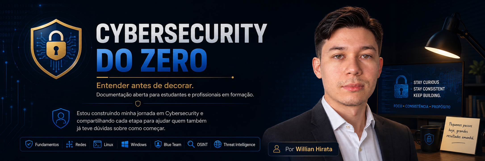

<div align="center">

<p align="center">
  
</p>

Este projeto documenta minha jornada de estudos em Cybersecurity.
>
> O objetivo é construir uma documentação aberta, gratuita e prática para quem deseja aprender os fundamentos da área, explicando não apenas **como fazer**, mas principalmente **por que as coisas funcionam**.

#  Cybersecurity do Zero

### **Entender antes de decorar.**

**Uma documentação para compartilhar meus estudos em Cybersec buscando ajudar quem está iniciando na área e não sabe por onde começar.**

<br>

[]()
[]()
[]()
[]()

<br>

📖 **Comece pelos fundamentos** • 🚀 **Aprenda no seu ritmo** • 🛡️ **Construa uma base sólida**

</div>

---

#  Bem-vindo

A maioria das pessoas começa a estudar Cybersecurity procurando ferramentas.

Nmap.

Wireshark.

Burp Suite.

Kali Linux.

Mas ferramentas são apenas meios.

Antes delas, existem conceitos que explicam **por que** essas ferramentas existem.

Este projeto foi criado justamente para isso.

O **Cybersecurity do Zero** reúne conteúdos organizados em uma sequência lógica de aprendizado, explicando desde os fundamentos até temas mais avançados, sempre utilizando exemplos práticos, diagramas e referências oficiais.

---

#  Missão

Construir uma documentação gratuita, organizada e acessível que ajude estudantes e profissionais em início de carreira a compreender os fundamentos da Segurança Cibernética antes de aprofundar-se em ferramentas e tecnologias específicas.

---

#  Roadmap

```text
                 Cybersecurity
                       │
                       ▼
              01 • Fundamentos
                       │
                       ▼
                 02 • Redes
                       │
                       ▼
                 03 • Linux
                       │
                       ▼
                04 • Windows
                       │
                       ▼
               05 • Blue Team
                       │
                       ▼
                  06 • OSINT
                       │
                       ▼
          07 • Threat Intelligence
```

---

#  Módulos

| Módulo                |     Situação    |  Progresso |
| :-------------------- | :-------------: | :--------: |
| 🟢 Fundamentos        | 🚧 Em andamento | **1 / 15** |
| ⚪ Redes               |   ⏳ Planejado   | **0 / 12** |
| ⚪ Linux               |   ⏳ Planejado   | **0 / 18** |
| ⚪ Windows             |   ⏳ Planejado   | **0 / 15** |
| ⚪ Blue Team           |   ⏳ Planejado   | **0 / 20** |
| ⚪ OSINT               |   ⏳ Planejado   | **0 / 10** |
| ⚪ Threat Intelligence |   ⏳ Planejado   | **0 / 12** |

---

#  Comece por aqui

##  Fundamentos

| Capítulo                                                                        |       Status       |
| ------------------------------------------------------------------------------- | :----------------: |
| ✅ [001 — O que é Cybersecurity?](./01-Fundamentos/001-o-que-e-cybersecurity.md) |      Publicado     |
| ⏳ 002 — Tríade CIA                                                              | Em desenvolvimento |
| ⏳ 003 — Princípio do Menor Privilégio                                           |      Planejado     |
| ⏳ 004 — Defense in Depth                                                        |      Planejado     |
| ⏳ 005 — Zero Trust                                                              |      Planejado     |

---

# 💡 Como estudar

Para aproveitar melhor esta documentação:

1. Siga a ordem dos módulos.
2. Leia cada capítulo com atenção.
3. Consulte os diagramas e exemplos.
4. Pesquise as referências oficiais.
5. Faça anotações e pratique os conceitos.

O objetivo é desenvolver uma compreensão sólida, e não apenas memorizar termos ou comandos.

---

#  Estrutura do projeto

```text
cybersecurity-do-zero/
│
├── README.md
├── 01-Fundamentos/
├── 02-Redes/
├── 03-Linux/
├── 04-Windows/
├── 05-Blue-Team/
├── 06-OSINT/
├── 07-Threat-Intelligence/
└── assets/
```

---

#  Contribuindo

Sugestões, correções e referências são sempre bem-vindas.

Se encontrar algum erro ou tiver uma ideia para melhorar esta documentação, fique à vontade para abrir uma **Issue** ou enviar um **Pull Request**.

---

<div align="center">

##  Gostou do projeto?

Se este material estiver ajudando você, considere deixar uma estrela no repositório.

Ela incentiva a continuidade do projeto e ajuda outras pessoas a encontrarem este conteúdo.

---

### **Cybersecurity do Zero**

**Entender antes de decorar.**

</div>
