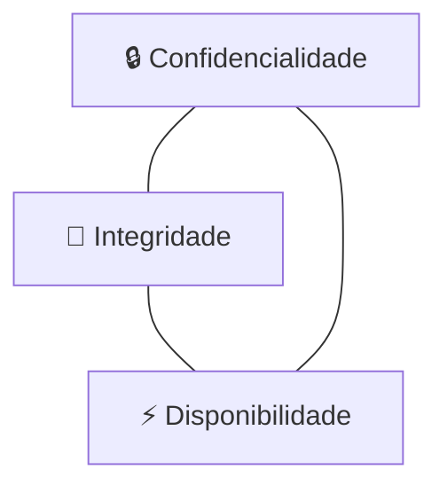
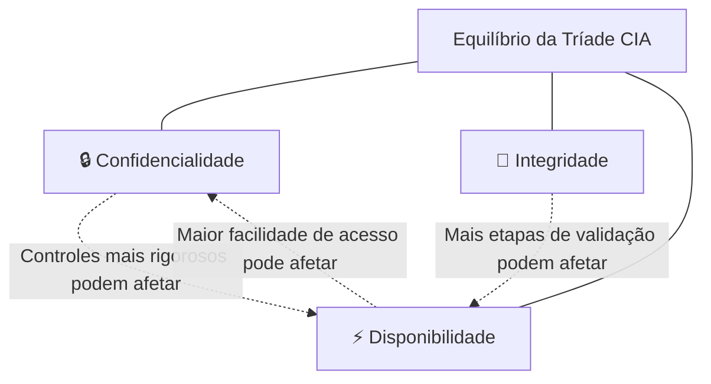

# Capítulo 002 — A Tríade CIA

> **Entender antes de decorar.**

| Informação | Detalhes |
|---|---|
| **Módulo** | 01 — Fundamentos |
| **Nível** | Iniciante |
| **Tempo estimado** | 15 a 20 minutos |
| **Pré-requisito** | [Capítulo 001 — O que é Cybersecurity?](001-o-que-e-cybersecurity.md) |

---

## Objetivo deste capítulo

Ao final deste capítulo, você será capaz de:

- explicar o que é a **Tríade CIA**;
- diferenciar **Confidencialidade, Integridade e Disponibilidade**;
- identificar qual pilar foi afetado em um incidente;
- relacionar cada pilar a controles de segurança;
- analisar situações do cotidiano com uma visão mais profissional.

---

## Antes de começar

Imagine que você mantém um diário.

Não importa se é um caderno de capa dura escondido na gaveta ou um aplicativo de notas protegido por senha no celular.

O que importa é o que você espera dele.

Primeiro, você espera que ninguém mais leia o que você escreveu. Ele é seu, particular, e deve continuar assim.

Segundo, você espera que ninguém apague uma página, troque uma data ou reescreva algo que você contou. Se um dia você reler o diário, quer encontrar exatamente o que escreveu — não uma versão alterada por outra pessoa.

Terceiro, você espera conseguir abrir o diário sempre que quiser escrever algo novo. De nada adianta ele existir se, na hora que você precisa, ele estiver trancado em algum lugar inacessível ou tiver simplesmente sumido.

Sem perceber, você acabou de descrever os três pilares mais importantes da Segurança da Informação.

Ninguém além de você deve ler → **Confidencialidade**.

Ninguém deve alterar o que foi escrito → **Integridade**.

Você deve conseguir acessar quando precisar → **Disponibilidade**.

No Capítulo 001, esses três pilares apareceram rapidamente quando estudamos os fundamentos da Cybersecurity. Chegou a hora de aprofundar cada um deles.

> **O que exatamente estamos tentando proteger?**

Na prática, a Segurança da Informação busca preservar três propriedades fundamentais das informações e dos sistemas:

1. **Confidencialidade**;
2. **Integridade**;
3. **Disponibilidade**.

Esses três pilares formam a chamada **Tríade CIA**.

O nome vem dos termos em inglês:

- **C — Confidentiality**;
- **I — Integrity**;
- **A — Availability**.

E não estamos falando da agência de inteligência Americana bele? É apenas a sigla usada para representar os três objetivos fundamentais da Segurança da Informação.

---

## O problema

Em um aplicativo bancário, somente pessoas autorizadas devem acessar a conta, o valor de uma transferência não pode ser alterado e o serviço precisa funcionar quando necessário.

| Situação | Pilar relacionado |
|---|---|
| Impedir acessos indevidos | **Confidencialidade** |
| Impedir alterações no valor transferido | **Integridade** |
| Manter o aplicativo funcionando | **Disponibilidade** |

Esse exemplo mostra que segurança não significa apenas impedir invasões. Dados incorretos e sistemas indisponíveis também representam falhas de segurança.

---

## O que é a Tríade CIA?

A Tríade CIA é um modelo utilizado para compreender os principais objetivos da Segurança da Informação.

Ela ajuda profissionais e organizações a analisar:

- quais informações precisam ser protegidas;
- quais riscos existem;
- qual impacto um incidente pode causar;
- quais controles devem ser implementados.

Podemos representar o conceito da seguinte forma:



Os três pilares são importantes, mas o nível de prioridade de cada um pode mudar de acordo com o contexto.

Em um hospital, por exemplo, a disponibilidade de um sistema pode ser crítica para o atendimento de pacientes. Em uma empresa que armazena documentos sigilosos, a confidencialidade pode receber uma atenção ainda maior.

Isso não significa ignorar os outros pilares. Significa compreender o impacto de cada um para o negócio.

---

## Confidencialidade

### O que significa?

**Confidencialidade** é a garantia de que uma informação será acessada somente por pessoas, sistemas ou processos autorizados.

Em outras palavras:

> **Quem pode acessar esta informação?**

O objetivo é evitar a exposição, o vazamento ou o acesso indevido a dados.

#### Exemplos de informações confidenciais

- senhas e credenciais;
- dados bancários;
- prontuários médicos;
- dados pessoais de clientes;
- documentos internos e estratégicos.

### Quando a confidencialidade é comprometida?

A confidencialidade é violada quando alguém acessa ou visualiza uma informação sem autorização.

#### Exemplos

- um banco de dados fica exposto na internet;
- um funcionário acessa documentos fora de sua função;
- uma senha é compartilhada em um local público;
- um e-mail confidencial é enviado ao destinatário errado.

 "Exemplo prático"
    Um colaborador do setor de vendas consegue acessar a folha salarial de todos os funcionários, mesmo sem precisar dessas informações para realizar seu trabalho.

    Nesse caso, houve uma falha de **Confidencialidade**.

### Controles que ajudam a preservar a confidencialidade

Alguns controles comuns são:

- controle de acesso;
- criptografia;
- princípio do menor privilégio;
- autenticação multifator;
- conscientização dos usuários.

### Autenticação não é a mesma coisa que autorização

Esses dois conceitos são frequentemente confundidos:

- **Autenticação:** confirma quem você é;
- **Autorização:** define o que você pode acessar.

Por exemplo, ao entrar em um sistema com usuário, senha e segundo fator, você está se autenticando. Depois disso, o sistema verifica quais arquivos, páginas e funções sua conta está autorizada a utilizar.

### Pergunta-chave da confidencialidade

> **Apenas pessoas autorizadas conseguem acessar essa informação?**

---

## Integridade

### O que significa?

**Integridade** é a garantia de que a informação permanece correta, completa e sem alterações indevidas.

Em outras palavras:

> **Podemos confiar que esse dado não foi alterado?**

A integridade não impede necessariamente que uma informação seja modificada. Ela garante que qualquer alteração seja realizada de maneira autorizada e controlada.

### Quando a integridade é comprometida?

A integridade é violada quando uma informação é alterada, excluída ou corrompida sem autorização.

#### Exemplos

- o valor de uma transferência é modificado;
- uma nota escolar é alterada indevidamente;
- um arquivo é corrompido;
- um invasor modifica registros de um banco de dados;
- uma configuração crítica é alterada sem aprovação.

 "Exemplo prático"
    Um cliente solicita uma transferência de **R$ 100,00**, mas o valor é alterado para **R$ 1.000,00** antes de a operação ser concluída.

    Mesmo que os dados não tenham sido divulgados e o sistema continue funcionando, houve uma falha de **Integridade**.

### Controles que ajudam a preservar a integridade

Alguns controles comuns são:

- hashes e assinaturas digitais;
- controle de versões;
- validação de dados;
- logs e trilhas de auditoria;
- permissões de escrita;
- revisão e aprovação de mudanças.

### Hash e integridade

Um **hash** é um valor gerado a partir do conteúdo de um arquivo ou conjunto de dados.

Quando o conteúdo é alterado, mesmo que a mudança seja pequena, o hash esperado também muda.

```text
arquivo_original.txt  →  hash: A1B2C3
arquivo_alterado.txt   →  hash: D4E5F6
```

Ao comparar os valores, podemos identificar que o arquivo foi modificado.

 "Atenção"
    O hash pode ajudar a verificar se ocorreu uma alteração, mas sozinho não informa necessariamente quem fez a mudança ou se ela foi autorizada. Para isso, outros controles podem ser necessários.

### Pergunta-chave da integridade

> **A informação continua correta e livre de alterações não autorizadas?**

---

## Disponibilidade

### O que significa?

**Disponibilidade** é a garantia de que informações, sistemas e serviços estarão acessíveis quando usuários autorizados precisarem deles.

Em outras palavras:

> **O serviço está funcionando quando precisamos utilizá-lo?**

Um sistema pode proteger muito bem os dados contra acessos indevidos e alterações, mas ainda assim falhar em segurança caso fique constantemente indisponível.

### Quando a disponibilidade é comprometida?

A disponibilidade é afetada quando um sistema, serviço ou informação não pode ser acessado no momento necessário.

#### Exemplos

- um site fica fora do ar;
- um servidor apresenta falha;
- um ransomware bloqueia o acesso aos arquivos;
- um ataque de negação de serviço sobrecarrega o ambiente;
- uma atualização mal planejada interrompe o serviço.

 "Exemplo prático"
    Durante uma emergência, os profissionais de um hospital não conseguem acessar os prontuários dos pacientes porque o sistema está fora do ar.

    Nesse caso, a **Disponibilidade** foi comprometida — e o impacto pode ser muito grave.

### Controles que ajudam a preservar a disponibilidade

Alguns controles comuns são:

- redundância;
- backups testados;
- monitoramento;
- balanceamento de carga;
- planos de continuidade e recuperação;
- manutenção e capacidade adequada da infraestrutura.

### Backup não é sinônimo de disponibilidade

Ter backup é importante, mas ele precisa estar íntegro, protegido e testado. Também é necessário saber quanto tempo a restauração levará e quanto tempo o negócio pode permanecer parado.

> Um backup que nunca foi restaurado em teste pode falhar justamente quando for necessário.

### Pergunta-chave da disponibilidade

> **A informação ou o serviço estará acessível no momento em que for necessário?**

---

## Equilíbrio entre os pilares

Confidencialidade, Integridade e Disponibilidade nem sempre aumentam juntas.

Um cofre bancário prioriza proteção e controle de acesso, mas possui horários e processos restritos. Uma loja aberta 24 horas prioriza disponibilidade, porém precisa lidar com uma exposição maior. Nenhuma abordagem é necessariamente errada: elas atendem a riscos diferentes.



Muitas etapas de autenticação podem proteger melhor o acesso, mas também dificultar o uso do sistema. Da mesma forma, replicar dados em vários servidores aumenta a disponibilidade, porém amplia a quantidade de ambientes que precisam ser protegidos.

Por isso, Segurança da Informação não significa maximizar todos os controles. O objetivo é encontrar um equilíbrio proporcional ao risco, considerando proteção, usabilidade, custos e continuidade operacional.

Essa prioridade não é exclusivamente técnica. Ela também depende do negócio, da missão e do impacto que uma falha pode causar.

Em um hospital, por exemplo, a disponibilidade pode receber prioridade durante uma emergência, pois o médico precisa consultar o prontuário rapidamente. Já um sistema que armazena informações militares pode aceitar processos de acesso mais lentos para preservar a confidencialidade. O controle adequado depende do que está sendo protegido e das consequências de uma falha.

---

## A Tríade CIA na prática

### Cenário 1 — Vazamento de dados

Uma empresa deixa um banco de dados de clientes exposto na internet. Pessoas não autorizadas conseguem visualizar nomes, endereços e documentos.

**Pilar principal afetado:** Confidencialidade.

Também podem existir impactos legais, financeiros e reputacionais.

---

### Cenário 2 — Alteração de registros

Um invasor acessa um sistema acadêmico e modifica as notas de vários alunos.

**Pilar principal afetado:** Integridade.

O sistema pode continuar disponível, mas os dados deixaram de ser confiáveis.

---

### Cenário 3 — Ransomware

Um ransomware criptografa os arquivos de uma organização e impede que os funcionários acessem os sistemas.

**Pilares possivelmente afetados:**

- **Disponibilidade:** os arquivos e sistemas ficam inacessíveis;
- **Integridade:** dados podem ser alterados ou corrompidos;
- **Confidencialidade:** o invasor pode copiar informações antes de criptografá-las.

Esse exemplo mostra que um único incidente pode comprometer mais de um pilar ao mesmo tempo.

 "Um incidente, vários impactos"
    Ao analisar um incidente, procure identificar todos os pilares afetados. Um ransomware pode causar indisponibilidade ao bloquear os arquivos, comprometer a integridade ao alterar dados e violar a confidencialidade caso informações tenham sido copiadas antes da criptografia.

---

## Nem todos os sistemas possuem a mesma prioridade

A importância de cada pilar depende do contexto.

| Ambiente | Pilar que pode receber maior prioridade | Motivo |
|---|---|---|
| Hospital | Disponibilidade | Sistemas precisam estar acessíveis durante atendimentos e emergências |
| Banco | Integridade | Valores e transações precisam permanecer corretos |
| Escritório de advocacia | Confidencialidade | Documentos e comunicações podem conter informações sigilosas |
| Comércio eletrônico | Disponibilidade e Integridade | A loja precisa funcionar e os pedidos devem permanecer corretos |
| Sistema de folha de pagamento | Confidencialidade e Integridade | Salários não devem ser expostos nem alterados indevidamente |

 "Pense no impacto"
    O trabalho de Segurança da Informação não consiste apenas em perguntar se existe uma vulnerabilidade. Também precisamos entender o que pode acontecer com o negócio caso um dos pilares seja comprometido.

---

## Como pensar como um profissional de Segurança

Ao analisar um sistema, faça perguntas como:

### Confidencialidade

- Quem pode acessar essas informações?
- Todos esses acessos são necessários?
- Os dados estão protegidos durante o armazenamento e a transmissão?
- As permissões são revisadas?

### Integridade

- Quem pode alterar os dados?
- As mudanças ficam registradas?
- É possível identificar quem realizou uma alteração?
- Existem mecanismos para detectar modificações indevidas?

### Disponibilidade

- O que acontece se o servidor falhar?
- Existe redundância?
- Os backups são testados?
- Há monitoramento e um plano de recuperação?

Essas perguntas ajudam a transformar um conceito teórico em uma forma prática de analisar riscos.

---

## Aplicação em CTI

Cyber Threat Intelligence foi uma das áreas que mais despertaram meu interesse durante os estudos. A Tríade CIA ajudou a tornar mais clara uma pergunta que aparece constantemente nesse trabalho: diante de uma ameaça, vulnerabilidade ou incidente, **o que exatamente está em risco?**

A Tríade CIA é uma das principais referências para responder a isso. Ela ajuda o analista a sair de uma descrição genérica, como “existe um risco de segurança”, e comunicar de forma objetiva qual propriedade da informação pode ser comprometida e qual impacto isso pode causar.

O **CVSS** (Common Vulnerability Scoring System), usado para avaliar a gravidade de vulnerabilidades, considera os impactos sobre Confidencialidade, Integridade e Disponibilidade. Uma falha que permite apenas visualizar dados possui um impacto diferente de outra que permite modificar ou apagar um banco de dados.

No **MITRE ATT&CK**, a tática **Impact** reúne técnicas usadas para manipular, interromper ou destruir sistemas e dados, afetando principalmente Integridade e Disponibilidade.

Na prática:

- phishing para roubo de credenciais ameaça a **Confidencialidade**;
- defacement de um site ameaça a **Integridade**;
- negação de serviço ameaça a **Disponibilidade**;
- ransomware com roubo de dados pode afetar os três pilares.

Identificar o pilar ameaçado ajuda o analista a priorizar e comunicar melhor o risco. Dizer “há uma ameaça à disponibilidade do serviço de pagamentos” é mais claro e útil do que apenas dizer “existe um risco de segurança”.

---

## Exercício de fixação

Leia cada situação e tente identificar o pilar principal afetado antes de abrir a resposta.

Questão "1. Um funcionário envia uma planilha com dados de clientes para a pessoa errada."
    **Confidencialidade**, porque as informações foram expostas a alguém sem autorização.

Questão "2. Um invasor modifica o endereço de entrega de vários pedidos."
    **Integridade**, porque os dados foram alterados indevidamente.

Questão "3. O sistema de atendimento fica fora do ar durante quatro horas."
    **Disponibilidade**, porque o serviço não pôde ser utilizado quando necessário.

Questão "4. Um ransomware copia dados e depois bloqueia o acesso aos servidores."
    **Confidencialidade e Disponibilidade**, com possível impacto também na **Integridade**.

---

## Erros comuns

### “Segurança é apenas confidencialidade”

Não. Impedir vazamentos é importante, mas dados incorretos ou sistemas indisponíveis também podem causar grandes prejuízos.

### “Se o sistema está funcionando, ele está seguro”

Não necessariamente. O serviço pode estar disponível enquanto informações são acessadas ou alteradas por pessoas não autorizadas.

### “Backup resolve qualquer problema de disponibilidade”

Não. O backup precisa estar protegido, íntegro e testado. Além disso, a restauração pode levar mais tempo do que o negócio consegue suportar.

### “Integridade significa impedir qualquer alteração”

Não. Alterações legítimas fazem parte da operação. A integridade busca garantir que elas sejam autorizadas, corretas e rastreáveis.

---

## Resumo

A **Tríade CIA** representa três objetivos fundamentais da Segurança da Informação:

| Pilar | Objetivo | Pergunta principal |
|---|---|---|
| **Confidencialidade** | Impedir acessos e divulgações não autorizadas | Quem pode acessar? |
| **Integridade** | Manter os dados corretos e livres de alterações indevidas | O dado continua confiável? |
| **Disponibilidade** | Garantir acesso aos sistemas e informações quando necessário | O serviço está acessível? |

Lembre-se:

- um incidente pode afetar apenas um pilar;
- um único incidente também pode afetar os três;
- a prioridade de cada pilar varia conforme o contexto;
- controles de segurança devem ser escolhidos com base nos riscos e nas necessidades do negócio.

> Antes de pensar em ferramentas, entenda qual informação está sendo protegida e o que aconteceria se sua confidencialidade, integridade ou disponibilidade fosse comprometida.

---

## Checkpoint

Antes de seguir para o próximo capítulo, confirme se você consegue responder:

- [ ] O que significa a sigla CIA?
- [ ] Qual é a diferença entre confidencialidade e integridade?
- [ ] Um sistema fora do ar afeta qual pilar?
- [ ] Um mesmo incidente pode afetar mais de um pilar?
- [ ] Quais controles ajudam a proteger cada pilar?
- [ ] Por que a prioridade muda conforme o contexto?

---

## Glossário

| Termo | Definição |
|---|---|
| **Autenticação** | Processo de confirmar a identidade de um usuário, sistema ou dispositivo. |
| **Autorização** | Definição das ações e recursos que uma identidade pode acessar. |
| **Backup** | Cópia de dados utilizada para recuperação em caso de perda, corrupção ou indisponibilidade. |
| **Confidencialidade** | Proteção contra acesso ou divulgação não autorizada. |
| **Controle de acesso** | Mecanismo usado para permitir ou negar acesso a recursos. |
| **Disponibilidade** | Garantia de acesso confiável e oportuno a informações e sistemas. |
| **Hash** | Valor calculado a partir de dados, frequentemente utilizado para verificar alterações. |
| **Integridade** | Garantia de que informações não foram alteradas ou destruídas indevidamente. |
| **Redundância** | Uso de recursos adicionais para reduzir o impacto de falhas. |
| **Ransomware** | Tipo de malware que restringe o acesso a dados ou sistemas, geralmente por meio de criptografia. |

---

## Referências

- [NIST CSRC — Confidentiality, Integrity and Availability](https://csrc.nist.gov/glossary/term/confidentiality_integrity_availability)
- [NIST CSRC — Information Security](https://csrc.nist.gov/glossary/term/information_security)
- [NIST FIPS 199 — Standards for Security Categorization of Federal Information and Information Systems](https://csrc.nist.gov/pubs/fips/199/final)
- [NIST SP 800-12 Rev. 1 — An Introduction to Information Security](https://csrc.nist.gov/pubs/sp/800/12/r1/final)
- [FIRST — Common Vulnerability Scoring System (CVSS)](https://www.first.org/cvss/)
- [MITRE ATT&CK — Impact (TA0040)](https://attack.mitre.org/tactics/TA0040/)

---

## Próximo capítulo

No próximo capítulo, vamos estudar o **Princípio do Menor Privilégio** e entender por que usuários, sistemas e aplicações devem possuir somente os acessos realmente necessários.

[← Capítulo anterior: O que é Cybersecurity?](001-o-que-e-cybersecurity.md){ .md-button }
[Próximo: Princípio do Menor Privilégio →](003-principio-do-menor-privilegio.md){ .md-button .md-button--primary }
