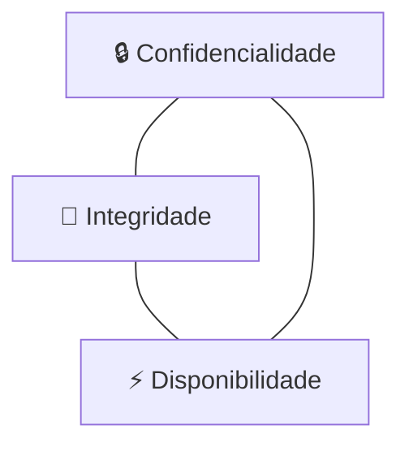
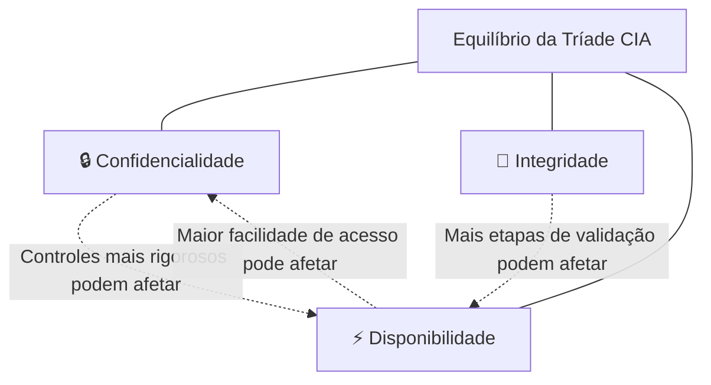

# Capítulo 002 — A Tríade CIA

> **Entender antes de decorar.**

---

| Informação | Detalhes |
|---|---|
| **Módulo** | 01 — Fundamentos |
| **Nível** | Iniciante |
| **Tempo estimado** | 20 a 30 minutos |
| **Pré-requisito** | [Capítulo 001 — O que é Cybersecurity?](001-o-que-e-cybersecurity.md) |

---

## Objetivo deste capítulo

Ao final deste capítulo, você será capaz de:

- explicar o que é a **Tríade CIA**;
- diferenciar **Confidencialidade, Integridade e Disponibilidade**;
- identificar qual pilar foi afetado em um incidente;
- relacionar cada pilar a controles de segurança;
- analisar situações do cotidiano com uma visão mais profissional.

---

## Antes de começar

Imagine que você mantém um diário.

Não importa se é um caderno de capa dura escondido na gaveta ou um aplicativo de notas protegido por senha no celular.

O que importa é o que você espera dele.

Primeiro, você espera que ninguém mais leia o que você escreveu. Ele é seu, particular, e deve continuar assim.

Segundo, você espera que ninguém apague uma página, troque uma data ou reescreva algo que você contou. Se um dia você reler o diário, quer encontrar exatamente o que escreveu — não uma versão alterada por outra pessoa.

Terceiro, você espera conseguir abrir o diário sempre que quiser escrever algo novo. De nada adianta ele existir se, na hora que você precisa, ele estiver trancado em algum lugar inacessível ou tiver simplesmente sumido.

Sem perceber, você acabou de descrever os três pilares mais importantes da Segurança da Informação.

Ninguém além de você deve ler → **Confidencialidade**.

Ninguém deve alterar o que foi escrito → **Integridade**.

Você deve conseguir acessar quando precisar → **Disponibilidade**.

No Capítulo 001, esses três pilares apareceram rapidamente quando estudamos os fundamentos da Cybersecurity. Chegou a hora de aprofundar cada um deles.

> **O que exatamente estamos tentando proteger?**

Na prática, a Segurança da Informação busca preservar três propriedades fundamentais das informações e dos sistemas:

1. **Confidencialidade**;
2. **Integridade**;
3. **Disponibilidade**.

Esses três pilares formam a chamada **Tríade CIA**.

O nome vem dos termos em inglês:

- **C — Confidentiality**;
- **I — Integrity**;
- **A — Availability**.

E não estamos falando da agência de inteligência americana bele? É apenas a sigla usada para representar os três objetivos fundamentais da Segurança da Informação.

---

## O problema

Imagine que você utiliza o aplicativo do seu banco para consultar o saldo e realizar uma transferência.

Para que essa operação seja considerada segura, algumas condições precisam ser atendidas:

- somente você e pessoas autorizadas podem acessar a sua conta;
- o valor da transferência não pode ser alterado durante o processo;
- o aplicativo precisa estar funcionando quando você precisar utilizá-lo.

Observe que estamos protegendo três coisas diferentes:

| Situação | Pilar relacionado |
|---|---|
| Impedir que terceiros acessem sua conta | **Confidencialidade** |
| Impedir a alteração do valor transferido | **Integridade** |
| Manter o aplicativo acessível | **Disponibilidade** |

Esse exemplo mostra que segurança não significa apenas impedir o acesso de uma pessoa não autorizada.

Um sistema também pode ser considerado inseguro quando seus dados são modificados indevidamente ou quando ele fica indisponível.

---

## O que é a Tríade CIA?

A Tríade CIA é um modelo utilizado para compreender os principais objetivos da Segurança da Informação.

Ela ajuda profissionais e organizações a analisar:

- quais informações precisam ser protegidas;
- quais riscos existem;
- qual impacto um incidente pode causar;
- quais controles devem ser implementados.

Podemos representar o conceito da seguinte forma:



Os três pilares são importantes, mas o nível de prioridade de cada um pode mudar de acordo com o contexto.

Em um hospital, por exemplo, a disponibilidade de um sistema pode ser crítica para o atendimento de pacientes. Em uma empresa que armazena documentos sigilosos, a confidencialidade pode receber uma atenção ainda maior.

Isso não significa ignorar os outros pilares. Significa compreender o impacto de cada um para o negócio.

---

## Confidencialidade

### O que significa?

**Confidencialidade** é a garantia de que uma informação será acessada somente por pessoas, sistemas ou processos autorizados.

Em outras palavras:

> **Quem pode acessar esta informação?**

O objetivo é evitar a exposição, o vazamento ou o acesso indevido a dados.

#### Exemplos de informações confidenciais

- senhas;
- dados bancários;
- prontuários médicos;
- documentos internos;
- dados pessoais de clientes;
- segredos comerciais;
- informações estratégicas;
- credenciais de acesso.

### Quando a confidencialidade é comprometida?

A confidencialidade é violada quando alguém acessa ou visualiza uma informação sem autorização.

#### Exemplos

- um invasor obtém a lista de clientes de uma empresa;
- um funcionário acessa documentos que não fazem parte de sua função;
- uma senha é enviada em um grupo público;
- um banco de dados fica exposto na internet;
- uma pessoa encontra um computador desbloqueado e lê informações internas;
- um e-mail confidencial é enviado para o destinatário errado.

 "Exemplo prático"
    Um colaborador do setor de vendas consegue acessar a folha salarial de todos os funcionários, mesmo sem precisar dessas informações para realizar seu trabalho.

    Nesse caso, houve uma falha de **Confidencialidade**.

### Controles que ajudam a preservar a confidencialidade

Alguns controles comuns são:

- autenticação;
- autorização;
- controle de acesso;
- criptografia;
- classificação da informação;
- princípio do menor privilégio;
- autenticação multifator;
- bloqueio automático de tela;
- políticas de senhas;
- conscientização dos usuários.

### Autenticação não é a mesma coisa que autorização

Esses dois conceitos são frequentemente confundidos:

- **Autenticação:** confirma quem você é;
- **Autorização:** define o que você pode acessar.

Por exemplo, ao entrar em um sistema com usuário, senha e segundo fator, você está se autenticando. Depois disso, o sistema verifica quais arquivos, páginas e funções sua conta está autorizada a utilizar.

### Pergunta-chave da confidencialidade

> **Apenas pessoas autorizadas conseguem acessar essa informação?**

---

## Integridade

### O que significa?

**Integridade** é a garantia de que a informação permanece correta, completa e sem alterações indevidas.

Em outras palavras:

> **Podemos confiar que esse dado não foi alterado?**

A integridade não impede necessariamente que uma informação seja modificada. Ela garante que qualquer alteração seja realizada de maneira autorizada e controlada.

### Quando a integridade é comprometida?

A integridade é violada quando uma informação é alterada, excluída ou corrompida sem autorização.

#### Exemplos

- o valor de uma transferência é modificado;
- uma nota escolar é alterada indevidamente;
- um arquivo é corrompido durante o armazenamento;
- um invasor modifica registros de um banco de dados;
- um malware altera arquivos do sistema;
- uma configuração crítica é modificada sem aprovação;
- dados são digitados de forma incorreta e não passam por validação.

 "Exemplo prático"
    Um cliente solicita uma transferência de **R$ 100,00**, mas o valor é alterado para **R$ 1.000,00** antes de a operação ser concluída.

    Mesmo que os dados não tenham sido divulgados e o sistema continue funcionando, houve uma falha de **Integridade**.

### Controles que ajudam a preservar a integridade

Alguns controles comuns são:

- hashes;
- assinaturas digitais;
- controle de versões;
- validação de dados;
- trilhas de auditoria;
- logs;
- permissões de escrita;
- revisão e aprovação de mudanças;
- backups;
- monitoramento de alterações;
- segregação de funções.

### Hash e integridade

Um **hash** é um valor gerado a partir do conteúdo de um arquivo ou conjunto de dados.

Quando o conteúdo é alterado, mesmo que a mudança seja pequena, o hash esperado também muda.

```text
arquivo_original.txt  →  hash: A1B2C3
arquivo_alterado.txt   →  hash: D4E5F6
```

Ao comparar os valores, podemos identificar que o arquivo foi modificado.

 "Atenção"
    O hash pode ajudar a verificar se ocorreu uma alteração, mas sozinho não informa necessariamente quem fez a mudança ou se ela foi autorizada. Para isso, outros controles podem ser necessários.

### Pergunta-chave da integridade

> **A informação continua correta e livre de alterações não autorizadas?**

---

## Disponibilidade

### O que significa?

**Disponibilidade** é a garantia de que informações, sistemas e serviços estarão acessíveis quando usuários autorizados precisarem deles.

Em outras palavras:

> **O serviço está funcionando quando precisamos utilizá-lo?**

Um sistema pode proteger muito bem os dados contra acessos indevidos e alterações, mas ainda assim falhar em segurança caso fique constantemente indisponível.

### Quando a disponibilidade é comprometida?

A disponibilidade é afetada quando um sistema, serviço ou informação não pode ser acessado no momento necessário.

#### Exemplos

- um site fica fora do ar;
- um servidor apresenta falha de hardware;
- um ransomware bloqueia o acesso aos arquivos;
- um ataque de negação de serviço sobrecarrega o ambiente;
- uma queda de energia interrompe a operação;
- uma atualização mal planejada causa indisponibilidade;
- um link de internet apresenta falha;
- um banco de dados deixa de responder.

 "Exemplo prático"
    Durante uma emergência, os profissionais de um hospital não conseguem acessar os prontuários dos pacientes porque o sistema está fora do ar.

    Nesse caso, a **Disponibilidade** foi comprometida — e o impacto pode ser muito grave.

### Controles que ajudam a preservar a disponibilidade

Alguns controles comuns são:

- redundância;
- backups;
- balanceamento de carga;
- monitoramento;
- alta disponibilidade;
- plano de continuidade de negócios;
- plano de recuperação de desastres;
- fontes alternativas de energia;
- atualização e manutenção dos sistemas;
- proteção contra ataques de negação de serviço;
- testes de restauração;
- capacidade adequada de infraestrutura.

### Backup não é sinônimo de disponibilidade

Ter backup é importante, mas isso não significa que o ambiente esteja automaticamente disponível.

É necessário considerar:

- quanto tempo será necessário para restaurar os dados;
- se o backup está íntegro;
- se ele está protegido;
- se o processo de restauração já foi testado;
- quanto tempo o negócio pode permanecer parado.

Um backup que nunca foi testado pode falhar justamente no momento em que for necessário.

### Pergunta-chave da disponibilidade

> **A informação ou o serviço estará acessível no momento em que for necessário?**

---

## Como funciona

Um erro comum de quem está começando é imaginar que confidencialidade, integridade e disponibilidade são metas que crescem juntas, na mesma direção, sempre em harmonia.

Na prática, elas frequentemente competem entre si.

Pense em duas formas diferentes de guardar dinheiro.

A primeira é um cofre de banco: paredes reforçadas, porta blindada, mais de um funcionário precisa confirmar a abertura, câmeras, alarmes, horário restrito de acesso. A confidencialidade e a proteção contra alterações indevidas são levadas ao extremo — mas ninguém abre esse cofre às 2 da manhã porque um cliente esqueceu a senha do cartão. A disponibilidade foi deliberadamente reduzida em troca de mais proteção.

A segunda é uma loja de conveniência aberta 24 horas: qualquer pessoa entra, pega o que precisa e sai em minutos. A disponibilidade é máxima — mas, exatamente por isso, o controle sobre quem acessa o quê é bem mais fraco.

Nenhuma das duas abordagens está errada.

Elas simplesmente foram desenhadas para proteger coisas diferentes, com níveis de risco diferentes.

O mesmo raciocínio vale para sistemas digitais.



Se uma empresa adicionar cinco camadas de autenticação para acessar um sistema, a confidencialidade sobe bastante — mas o sistema pode ficar tão lento ou complicado de usar que as próprias pessoas autorizadas terão dificuldade para acessá-lo quando precisarem, reduzindo a disponibilidade.

Se uma empresa replicar seus dados em dez servidores ao redor do mundo para garantir que o serviço nunca saia do ar, ela também aumenta a superfície que precisa ser protegida — e, com isso, o risco de que algum desses servidores seja mal configurado e exponha dados que deveriam ser confidenciais.

Por isso, Segurança da Informação não significa maximizar os três pilares ao mesmo tempo, mas sim encontrar o equilíbrio correto para cada contexto.

Um hospital, durante uma emergência, pode precisar priorizar disponibilidade — o médico precisa acessar o prontuário imediatamente, mesmo que isso exija processos de autenticação mais rápidos.

Um sistema de defesa nacional pode priorizar confidencialidade acima de tudo, mesmo que isso implique processos de acesso mais lentos e restritos.

Definir essa prioridade não é uma decisão exclusivamente técnica. Ela também depende do negócio, da missão, do contexto e dos riscos envolvidos — e é justamente por isso que, no capítulo anterior, vimos que Governar é a função que orienta todas as demais no NIST Cybersecurity Framework.

Além do equilíbrio entre os três pilares, existe outro ponto importante: um único incidente pode comprometer mais de um pilar ao mesmo tempo. Vamos ver isso com mais detalhe a seguir.

---

## Exemplo

Vamos voltar ao diário do início do capítulo — mas agora imaginando que cada um dos três pilares falhou.

**Falha de confidencialidade:** seu irmão mais novo encontra o diário guardado na gaveta e lê todas as páginas às escondidas. Nada foi apagado, nada foi alterado, o diário continua ali, intacto e acessível. Mesmo assim, algo grave aconteceu: informações que deveriam ser só suas foram expostas a alguém sem autorização.

**Falha de integridade:** alguém pega o diário emprestado sem avisar e, por brincadeira, rasura uma página e reescreve uma frase inteira. Ninguém leu nada que não devesse — o problema é outro: o conteúdo que você escreveu não é mais o mesmo. Da próxima vez que reler, você não vai saber mais o que era original.

**Falha de disponibilidade:** você quer escrever sobre algo importante que aconteceu hoje, mas o diário está trancado dentro de uma mala que só será aberta na volta de uma viagem, daqui a duas semanas. Ninguém leu, ninguém alterou — mas, na hora em que você precisava, o diário simplesmente não estava acessível.

Repare que os três cenários são falhas de segurança completamente diferentes.

Cada um exigiria uma solução diferente: uma fechadura na gaveta (confidencialidade), um combinado de família sobre não mexer nas coisas dos outros (integridade) ou simplesmente levar o diário na bagagem de mão (disponibilidade).

No ambiente digital, a lógica é a mesma — só que a escala e as consequências costumam ser muito maiores.

---

## A Tríade CIA na prática

### Cenário 1 — Vazamento de dados

Uma empresa deixa um banco de dados de clientes exposto na internet. Pessoas não autorizadas conseguem visualizar nomes, endereços e documentos.

**Pilar principal afetado:** Confidencialidade.

Também podem existir impactos legais, financeiros e reputacionais.

---

### Cenário 2 — Alteração de registros

Um invasor acessa um sistema acadêmico e modifica as notas de vários alunos.

**Pilar principal afetado:** Integridade.

O sistema pode continuar disponível, mas os dados deixaram de ser confiáveis.

---

### Cenário 3 — Site fora do ar

Uma loja virtual fica indisponível durante uma grande campanha de vendas.

**Pilar principal afetado:** Disponibilidade.

Mesmo que nenhum dado seja vazado ou alterado, a empresa pode perder vendas e prejudicar sua reputação.

---

### Cenário 4 — Ransomware

Um ransomware criptografa os arquivos de uma organização e impede que os funcionários acessem os sistemas.

**Pilares possivelmente afetados:**

- **Disponibilidade:** os arquivos e sistemas ficam inacessíveis;
- **Integridade:** dados podem ser alterados ou corrompidos;
- **Confidencialidade:** o invasor pode copiar informações antes de criptografá-las.

Esse exemplo mostra que um único incidente pode comprometer mais de um pilar ao mesmo tempo.

---

## Nem todos os sistemas possuem a mesma prioridade

A importância de cada pilar depende do contexto.

| Ambiente | Pilar que pode receber maior prioridade | Motivo |
|---|---|---|
| Hospital | Disponibilidade | Sistemas precisam estar acessíveis durante atendimentos e emergências |
| Banco | Integridade | Valores e transações precisam permanecer corretos |
| Escritório de advocacia | Confidencialidade | Documentos e comunicações podem conter informações sigilosas |
| Comércio eletrônico | Disponibilidade e Integridade | A loja precisa funcionar e os pedidos devem permanecer corretos |
| Sistema de folha de pagamento | Confidencialidade e Integridade | Salários não devem ser expostos nem alterados indevidamente |

 "Pense no impacto"
    O trabalho de Segurança da Informação não consiste apenas em perguntar se existe uma vulnerabilidade. Também precisamos entender o que pode acontecer com o negócio caso um dos pilares seja comprometido.

---

 "Segurança é equilíbrio"
    Segurança não significa maximizar a Confidencialidade, a Integridade e a Disponibilidade a qualquer custo.

    O objetivo é aplicar controles proporcionais ao risco, considerando proteção, usabilidade, custo e continuidade operacional.

---

## Como pensar como um profissional de Segurança

Ao analisar um sistema, faça perguntas como:

### Confidencialidade

- Quem pode acessar essas informações?
- Todos esses acessos são realmente necessários?
- Os dados estão protegidos durante o armazenamento e a transmissão?
- Existe autenticação multifator?
- As permissões são revisadas periodicamente?

### Integridade

- Quem pode alterar os dados?
- Existe registro das alterações realizadas?
- É possível identificar quem fez uma mudança?
- Os dados passam por validação?
- Existem mecanismos para detectar alterações indevidas?

### Disponibilidade

- O que acontece se o servidor falhar?
- Existe redundância?
- Os backups são testados?
- O ambiente é monitorado?
- Existe um plano para responder a incidentes e restaurar o serviço?

Essas perguntas ajudam a transformar um conceito teórico em uma forma prática de analisar riscos.

---

## Aplicação em CTI

No capítulo anterior, contei que Cyber Threat Intelligence foi a área da Cybersecurity com a qual mais me identifiquei. A Tríade CIA foi um dos primeiros conceitos que me ajudaram a entender por que ela é tão útil na prática.

Um analista de CTI lida o tempo todo com uma pergunta prática: diante de uma ameaça, uma vulnerabilidade ou um incidente, **o que exatamente está em risco?**

A Tríade CIA é uma das principais referências utilizadas para responder a essa pergunta.

Um exemplo concreto é o **CVSS** (Common Vulnerability Scoring System), sistema usado mundialmente para calcular a gravidade de uma vulnerabilidade. Ao pontuar uma vulnerabilidade, o analista precisa informar, especificamente, qual seria o impacto sobre a confidencialidade, qual seria o impacto sobre a integridade e qual seria o impacto sobre a disponibilidade caso ela fosse explorada. Uma vulnerabilidade que permite apenas leitura de dados não sensíveis recebe uma pontuação bem diferente de uma que permite apagar um banco de dados inteiro — mesmo que as duas explorem a mesma falha técnica original. A tríade está literalmente embutida na fórmula que define a criticidade de uma vulnerabilidade.

O MITRE ATT&CK, framework que já apareceu no Capítulo 001, também organiza uma de suas táticas em torno da tríade. A tática chamada **Impact** reúne as técnicas que um adversário usa quando o objetivo final é manipular, interromper ou destruir sistemas e dados — ou seja, comprometer diretamente a integridade ou a disponibilidade de um ambiente. Um analista de CTI que identifica técnicas dessa tática sendo empregadas por um grupo de ameaça já sabe, de partida, que o objetivo provavelmente não é apenas espionagem silenciosa: é causar um impacto visível.

Saber identificar qual pilar da tríade um adversário está mirando muda completamente a forma como um analista de CTI prioriza e comunica um risco.

Uma campanha de phishing voltada para roubo de credenciais é, antes de tudo, uma ameaça à **confidencialidade** — o objetivo é ver o que não deveria ser visto.

Um grupo de ransomware que também rouba dados antes de criptografá-los ameaça a **disponibilidade** e a **confidencialidade** ao mesmo tempo.

Uma pichação digital de um site institucional (defacement) é, sobretudo, uma ameaça à **integridade** — o conteúdo público foi alterado sem autorização.

Um ataque de negação de serviço contra um serviço bancário é uma ameaça quase pura à **disponibilidade**.

Comunicar isso com clareza para quem toma decisão é parte do trabalho de CTI. Dizer "identificamos uma ameaça à disponibilidade do nosso serviço de pagamentos, com potencial de impacto direto em vendas" costuma gerar mais ação do que simplesmente dizer "identificamos um risco de segurança".

É basicamente a mesma lição do início deste capítulo: "segurança" sozinha é vaga demais para ser útil. Confidencialidade, integridade e disponibilidade dão nome específico ao que realmente está em jogo.

---

## Exercício de fixação

Leia cada situação e tente identificar o pilar principal afetado antes de abrir a resposta.

Questão "1. Um funcionário envia uma planilha com dados de clientes para a pessoa errada."
    **Confidencialidade**, porque as informações foram expostas a alguém sem autorização.

Questão "2. Um invasor modifica o endereço de entrega de vários pedidos."
    **Integridade**, porque os dados foram alterados indevidamente.

Questãon "3. O sistema de atendimento fica fora do ar durante quatro horas."
    **Disponibilidade**, porque o serviço não pôde ser utilizado quando necessário.

Questão "4. Um ransomware copia dados e depois bloqueia o acesso aos servidores."
    **Confidencialidade e Disponibilidade**, com possível impacto também na **Integridade**.

Questão "5. Um usuário consegue visualizar apenas os documentos relacionados ao seu departamento."
    Esse é um exemplo de controle de acesso ajudando a preservar a **Confidencialidade**.

---

## Erros comuns

### “Segurança é apenas confidencialidade”

Não. Impedir vazamentos é importante, mas dados incorretos ou sistemas indisponíveis também podem causar grandes prejuízos.

### “Se o sistema está funcionando, ele está seguro”

Não necessariamente. O serviço pode estar disponível enquanto informações são acessadas ou alteradas por pessoas não autorizadas.

### “Backup resolve qualquer problema de disponibilidade”

Não. O backup precisa estar protegido, íntegro e testado. Além disso, a restauração pode levar mais tempo do que o negócio consegue suportar.

### “Integridade significa impedir qualquer alteração”

Não. Alterações legítimas fazem parte da operação. A integridade busca garantir que elas sejam autorizadas, corretas e rastreáveis.

---

## Resumo

A **Tríade CIA** representa três objetivos fundamentais da Segurança da Informação:

| Pilar | Objetivo | Pergunta principal |
|---|---|---|
| **Confidencialidade** | Impedir acessos e divulgações não autorizadas | Quem pode acessar? |
| **Integridade** | Manter os dados corretos e livres de alterações indevidas | O dado continua confiável? |
| **Disponibilidade** | Garantir acesso aos sistemas e informações quando necessário | O serviço está acessível? |

Lembre-se:

- um incidente pode afetar apenas um pilar;
- um único incidente também pode afetar os três;
- a prioridade de cada pilar varia conforme o contexto;
- controles de segurança devem ser escolhidos com base nos riscos e nas necessidades do negócio.

> Antes de pensar em ferramentas, entenda qual informação está sendo protegida e o que aconteceria se sua confidencialidade, integridade ou disponibilidade fosse comprometida.

---

## Checkpoint

Antes de seguir para o próximo capítulo, confirme se você consegue responder:

- [ ] O que significa a sigla CIA?
- [ ] Qual é a diferença entre confidencialidade e integridade?
- [ ] Um sistema fora do ar afeta qual pilar?
- [ ] Um mesmo incidente pode afetar mais de um pilar?
- [ ] Quais controles podem ajudar a proteger cada objetivo?
- [ ] Por que a prioridade dos pilares muda conforme o negócio?

---

## Glossário

| Termo | Definição |
|---|---|
| **Autenticação** | Processo de confirmar a identidade de um usuário, sistema ou dispositivo. |
| **Autorização** | Definição das ações e recursos que uma identidade pode acessar. |
| **Backup** | Cópia de dados utilizada para recuperação em caso de perda, corrupção ou indisponibilidade. |
| **Confidencialidade** | Proteção contra acesso ou divulgação não autorizada. |
| **Controle de acesso** | Mecanismo usado para permitir ou negar acesso a recursos. |
| **Disponibilidade** | Garantia de acesso confiável e oportuno a informações e sistemas. |
| **Hash** | Valor calculado a partir de dados, frequentemente utilizado para verificar alterações. |
| **Integridade** | Garantia de que informações não foram alteradas ou destruídas indevidamente. |
| **Redundância** | Uso de recursos adicionais para reduzir o impacto de falhas. |
| **Ransomware** | Tipo de malware que restringe o acesso a dados ou sistemas, geralmente por meio de criptografia. |

---

## Referências

- [NIST CSRC — Confidentiality, Integrity and Availability](https://csrc.nist.gov/glossary/term/confidentiality_integrity_availability)
- [NIST CSRC — Information Security](https://csrc.nist.gov/glossary/term/information_security)
- [NIST FIPS 199 — Standards for Security Categorization of Federal Information and Information Systems](https://csrc.nist.gov/pubs/fips/199/final)
- [NIST SP 800-12 Rev. 1 — An Introduction to Information Security](https://csrc.nist.gov/pubs/sp/800/12/r1/final)
- [FIRST — Common Vulnerability Scoring System (CVSS)](https://www.first.org/cvss/)
- [MITRE ATT&CK — Impact (TA0040)](https://attack.mitre.org/tactics/TA0040/)

---

## Próximo capítulo

No próximo capítulo, vamos estudar o **Princípio do Menor Privilégio** e entender por que usuários, sistemas e aplicações devem possuir somente os acessos realmente necessários.

[← Capítulo anterior: O que é Cybersecurity?](001-o-que-e-cybersecurity.md){ .md-button }
[Próximo: Princípio do Menor Privilégio →](003-principio-do-menor-privilegio.md){ .md-button .md-button--primary }
