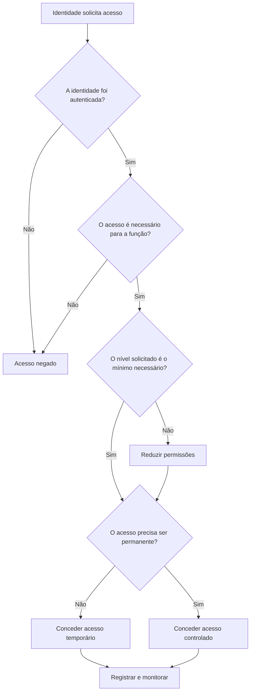
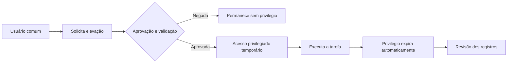

# 🗝️ Capítulo 003 — Princípio do Menor Privilégio

> **Entender antes de decorar.**

---

| Informação | Detalhes |
|---|---|
| **Módulo** | 01 — Fundamentos |
| **Nível** | Iniciante |
| **Tempo estimado** | 20 a 25 minutos |
| **Pré-requisito** | [Capítulo 002 — A Tríade CIA](002-triade-cia.md) |

---

## 🎯 Objetivo deste capítulo

Ao final deste capítulo, você será capaz de:

- explicar o que é o **Princípio do Menor Privilégio**;
- diferenciar acesso, permissão e privilégio;
- compreender por que permissões excessivas aumentam o impacto de incidentes;
- reconhecer aplicações do princípio em usuários, sistemas, aplicações e serviços;
- identificar controles como **RBAC, JIT, JEA, PAM e revisão de acessos**;
- analisar permissões com uma visão mais profissional.

---

## Antes de começar

Imagine que você vai viajar durante alguns dias e pede para uma pessoa de confiança cuidar da sua casa.

Ela precisa entrar pela porta principal, colocar comida para o seu animal de estimação e regar algumas plantas.

Para realizar essas tarefas, você entrega a chave da entrada.

Mas não entrega:

- a chave do cofre;
- a senha do aplicativo do banco;
- o acesso ao seu e-mail;
- a chave do escritório onde estão documentos pessoais;
- a senha de administração do roteador.

A pessoa recebeu acesso suficiente para cumprir a tarefa, mas não recebeu acesso a tudo o que existe na casa.

Sem perceber, você acabou de aplicar um dos princípios mais importantes da Segurança da Informação:

> **Conceder somente o acesso necessário para realizar uma atividade.**

Esse conceito é chamado de **Princípio do Menor Privilégio**, também conhecido pela sigla **PoLP**, do inglês *Principle of Least Privilege*.

No capítulo anterior, estudamos que a Segurança da Informação busca preservar a **Confidencialidade, a Integridade e a Disponibilidade**.

Agora vamos entender uma das formas mais importantes de proteger esses três pilares: controlar quem pode acessar cada recurso e o que essa pessoa, sistema ou aplicação pode fazer.

---

## O problema

Imagine uma empresa em que todos os funcionários utilizam contas com privilégios de administrador.

À primeira vista, isso pode parecer prático:

- ninguém precisa solicitar permissão para instalar um programa;
- qualquer pessoa consegue alterar configurações;
- os chamados relacionados a acesso diminuem;
- as tarefas parecem ser concluídas mais rapidamente.

Porém, essa facilidade cria um risco enorme.

Com uma conta administrativa, um usuário pode conseguir:

- instalar softwares não autorizados;
- desativar controles de segurança;
- alterar configurações críticas;
- criar ou excluir contas;
- acessar arquivos de outros usuários;
- modificar permissões;
- apagar registros e evidências;
- executar programas com alto nível de privilégio.

Agora imagine que esse usuário:

1. clique em um anexo malicioso;
2. tenha sua senha descoberta;
3. instale um programa comprometido;
4. execute um comando incorreto;
5. tente realizar uma ação para a qual não recebeu treinamento.

O problema não está apenas na intenção do usuário.

Uma pessoa pode ser confiável e ainda assim cometer um erro. Além disso, caso sua conta seja comprometida, o invasor normalmente poderá agir com as mesmas permissões que aquela conta possui.

> Quanto maior o privilégio da conta comprometida, maior tende a ser o impacto possível.

---

## O que é o Princípio do Menor Privilégio?

O **Princípio do Menor Privilégio** estabelece que um usuário, sistema, aplicação ou processo deve receber somente as permissões mínimas necessárias para executar sua função.

Em outras palavras:

> **Quem precisa acessar este recurso, o que precisa fazer e por quanto tempo esse acesso é necessário?**

O princípio não se aplica apenas a pessoas.

Ele também deve ser considerado para:

- contas de serviço;
- aplicações;
- scripts;
- APIs;
- servidores;
- bancos de dados;
- dispositivos;
- máquinas virtuais;
- containers;
- processos do sistema operacional.

Segundo o NIST, uma arquitetura baseada em menor privilégio concede a cada entidade somente os recursos e as autorizações mínimas necessárias para executar sua função.

!!! note "Ideia principal"
    O objetivo não é impedir que alguém trabalhe. O objetivo é permitir que a tarefa seja realizada sem conceder acessos desnecessários.

---

## Acesso, permissão e privilégio

Esses termos são relacionados, mas não significam exatamente a mesma coisa.

| Termo | Significado simplificado | Exemplo |
|---|---|---|
| **Acesso** | Possibilidade de utilizar ou visualizar um recurso | Conseguir abrir uma pasta |
| **Permissão** | Regra que define uma ação permitida | Poder apenas ler os arquivos |
| **Privilégio** | Autorização especial para executar ações relevantes ou administrativas | Criar usuários ou alterar configurações do sistema |

Uma pessoa pode ter acesso a uma pasta, mas possuir somente permissão de leitura.

Outra pessoa pode ter permissão para criar e editar arquivos, mas não para excluí-los.

Um administrador pode conseguir alterar as permissões de todos os demais usuários.

O menor privilégio busca controlar cada uma dessas possibilidades de acordo com a necessidade real.

---

## As quatro perguntas do menor privilégio

Ao analisar uma solicitação de acesso, podemos utilizar quatro perguntas:

| Pergunta | O que estamos avaliando? |
|---|---|
| **Quem?** | Qual usuário, aplicação, dispositivo ou processo está solicitando acesso? |
| **A quê?** | Qual sistema, arquivo, banco de dados ou função será acessado? |
| **Para fazer o quê?** | Leitura, edição, exclusão, administração ou outra ação? |
| **Por quanto tempo?** | O acesso será permanente ou necessário apenas durante uma atividade? |

Podemos representar essa avaliação da seguinte forma:



Esse processo mostra que uma decisão de acesso não deveria ser apenas **permitir ou negar**.

Também precisamos avaliar:

- o nível da permissão;
- o escopo do acesso;
- a duração;
- as condições;
- a necessidade de registro e monitoramento.

---

# Por que o menor privilégio é importante?

## 1. Reduz o impacto de credenciais comprometidas

Quando um invasor obtém as credenciais de um usuário, ele pode tentar utilizar os acessos que aquela conta já possui.

Considere duas situações:

### Conta comum comprometida

A conta consegue:

- acessar o e-mail do próprio usuário;
- abrir arquivos do seu departamento;
- utilizar aplicações básicas.

### Conta administrativa comprometida

A conta consegue:

- criar novos usuários;
- alterar políticas de segurança;
- acessar servidores;
- modificar permissões;
- desativar controles;
- alcançar sistemas críticos.

A credencial comprometida representa um risco nos dois casos, mas o possível impacto é muito diferente.

---

## 2. Limita erros humanos

Nem todo incidente é causado por um ataque.

Um usuário com permissões excessivas pode, por engano:

- excluir arquivos importantes;
- alterar uma configuração crítica;
- interromper um serviço;
- compartilhar informações sensíveis;
- instalar um software incompatível;
- modificar permissões de outros usuários.

Quando as permissões são limitadas, também limitamos o alcance de um erro.

---

## 3. Dificulta a propagação de malware

Um programa malicioso normalmente executa dentro do contexto da conta ou do processo que o iniciou.

Se o usuário possui poucos privilégios, o malware pode encontrar mais barreiras para:

- alterar arquivos do sistema;
- instalar serviços;
- desativar ferramentas de proteção;
- acessar dados de outros usuários;
- movimentar-se para outros equipamentos.

Isso não significa que o menor privilégio impeça todo malware. Ele funciona como uma camada de proteção que ajuda a limitar o alcance do comprometimento.

---

## 4. Reduz a superfície de ataque

Cada permissão desnecessária representa uma possibilidade adicional de abuso.

Quanto mais usuários e sistemas possuem acesso administrativo, maior é a quantidade de caminhos que um invasor pode tentar explorar.

Remover privilégios desnecessários reduz esses caminhos.

---

## 5. Melhora a rastreabilidade

Quando todos utilizam a mesma conta administrativa, torna-se difícil identificar quem realizou uma ação.

O ideal é que cada pessoa utilize uma identidade individual e que ações privilegiadas sejam registradas.

Isso ajuda a responder perguntas como:

- quem acessou o sistema?
- qual ação foi realizada?
- quando aconteceu?
- de qual dispositivo?
- a mudança estava autorizada?

---

# Menor privilégio e a Tríade CIA

O Princípio do Menor Privilégio ajuda a proteger os três pilares estudados no capítulo anterior.

| Pilar | Como o menor privilégio ajuda? |
|---|---|
| **Confidencialidade** | Impede que usuários sem necessidade visualizem informações sensíveis |
| **Integridade** | Limita quem pode alterar, excluir ou criar dados e configurações |
| **Disponibilidade** | Reduz a possibilidade de ações indevidas interromperem sistemas ou serviços |

### Confidencialidade

Um funcionário do setor comercial não deveria conseguir visualizar prontuários médicos ou a folha salarial de toda a empresa sem uma justificativa relacionada à sua função.

### Integridade

Um usuário que precisa consultar pedidos pode receber permissão de leitura, sem permissão para modificar valores ou excluir registros.

### Disponibilidade

Uma conta comum não deveria conseguir desligar um servidor de produção ou desativar um serviço crítico.

> O menor privilégio transforma os objetivos da Tríade CIA em decisões práticas de acesso.

---

# O menor privilégio na prática

## Estações de trabalho

Um usuário não precisa utilizar uma conta de administrador para tarefas comuns como:

- acessar o e-mail;
- editar documentos;
- navegar na internet;
- utilizar sistemas corporativos;
- participar de reuniões.

Quando uma ação administrativa for realmente necessária, pode ser utilizada uma conta separada ou um mecanismo controlado de elevação de privilégio.

!!! tip "Separe o uso comum do uso administrativo"
    Uma boa prática é não utilizar contas privilegiadas para navegar na internet, ler e-mails ou realizar atividades rotineiras. Isso reduz a exposição dessas credenciais.

---

## Windows e Active Directory

Em ambientes Windows, existem diferentes níveis de privilégio.

Um usuário pode ser:

- usuário comum da estação;
- administrador local de um equipamento;
- operador de uma função específica;
- administrador de servidor;
- administrador de domínio.

Essas funções não deveriam ser tratadas como equivalentes.

Um técnico que precisa instalar um programa em uma estação específica não necessariamente precisa ser **Domain Admin**.

Conceder privilégio de domínio para resolver uma tarefa local aumenta desnecessariamente o risco.

### Exemplo

| Necessidade | Permissão mais adequada |
|---|---|
| Utilizar o computador e aplicações corporativas | Usuário comum |
| Instalar um software aprovado em uma estação | Elevação controlada ou administração local limitada |
| Gerenciar uma aplicação em um servidor | Permissão administrativa somente nessa aplicação ou servidor |
| Administrar identidades no domínio | Função delegada e restrita às tarefas necessárias |

---

## Linux e o uso do `sudo`

Em sistemas Linux, a conta `root` possui alto nível de controle.

Em vez de utilizar `root` para todas as atividades, um administrador pode trabalhar com sua conta individual e elevar o privilégio apenas quando necessário por meio do `sudo`.

Porém, apenas utilizar `sudo` não garante automaticamente o menor privilégio.

É possível configurar quais comandos cada usuário pode executar.

Exemplo conceitual:

```text
Analista de suporte
└── pode reiniciar um serviço específico
    └── não pode criar usuários
        └── não pode alterar regras de firewall
            └── não pode acessar arquivos sem relação com sua função
```

Conceder `sudo` irrestrito para todos os comandos pode produzir um nível de acesso muito próximo ao da própria conta `root`.

---

## Arquivos e pastas

Considere uma pasta compartilhada com documentos de vários departamentos.

| Grupo | Permissão |
|---|---|
| Financeiro | Ler e editar documentos financeiros |
| Recursos Humanos | Sem acesso aos documentos financeiros |
| Diretoria | Leitura conforme necessidade definida |
| Administrador do armazenamento | Administração técnica, com acesso monitorado |

Além de decidir quem entra na pasta, precisamos avaliar o que cada grupo pode fazer:

- listar;
- ler;
- criar;
- editar;
- excluir;
- alterar permissões.

---

## Bancos de dados

Uma aplicação que precisa consultar o catálogo de produtos não deveria utilizar uma conta com permissão para excluir todas as tabelas do banco de dados.

Uma separação possível seria:

```text
Aplicação de consulta  → SELECT
Aplicação de cadastro  → SELECT + INSERT
Aplicação de edição    → SELECT + UPDATE
Rotina administrativa → permissões adicionais, controladas e monitoradas
```

O acesso deve ser concedido conforme a operação necessária.

---

## Aplicações, APIs e contas de serviço

O menor privilégio também se aplica a identidades não humanas.

Uma conta de serviço pode ser utilizada por:

- uma aplicação web;
- uma rotina de backup;
- um agente de monitoramento;
- um script de automação;
- uma integração entre sistemas.

Uma rotina de backup, por exemplo, pode precisar ler arquivos e gravar cópias em um destino específico. Ela não necessariamente precisa criar usuários, alterar políticas ou administrar toda a rede.

Contas de serviço com privilégios excessivos são perigosas porque frequentemente:

- permanecem ativas por longos períodos;
- executam de forma automática;
- possuem senhas ou chaves que nem sempre são rotacionadas;
- são utilizadas por aplicações críticas;
- recebem pouca atenção em revisões de acesso.

---

## Ambientes em nuvem

Em serviços de nuvem, permissões podem controlar ações como:

- visualizar recursos;
- criar máquinas virtuais;
- modificar regras de rede;
- acessar armazenamento;
- consultar segredos;
- excluir recursos;
- gerenciar identidades e funções.

Conceder uma função de proprietário ou administrador global para realizar uma tarefa simples é um exemplo de privilégio excessivo.

O ideal é utilizar funções específicas e limitar:

- a ação permitida;
- o recurso afetado;
- o ambiente;
- o período de acesso.

---

# Formas de implementar o menor privilégio

O menor privilégio é um princípio. Para aplicá-lo, utilizamos diferentes controles e modelos.

## Negar por padrão

Em uma abordagem de **negação por padrão**, o acesso não é concedido automaticamente.

Primeiro, a necessidade é identificada. Depois, somente as permissões aprovadas são liberadas.

```text
Regra inicial: acesso negado
        ↓
Necessidade comprovada
        ↓
Permissão específica concedida
```

Essa abordagem é mais segura do que permitir tudo e tentar remover excessos posteriormente.

---

## RBAC — Controle de Acesso Baseado em Funções

No **Role-Based Access Control**, ou **Controle de Acesso Baseado em Funções**, as permissões são associadas a papéis.

Exemplo:

| Função | Permissões |
|---|---|
| Atendente | Consultar cadastro de clientes |
| Supervisor | Consultar e aprovar determinadas alterações |
| Analista financeiro | Consultar e processar informações financeiras |
| Administrador | Gerenciar configurações específicas do sistema |

Em vez de configurar cada permissão individualmente para cada funcionário, o usuário recebe uma função compatível com seu trabalho.

!!! warning "Funções também podem acumular privilégios"
    Criar uma função não garante que ela esteja correta. Papéis mal definidos podem reunir permissões desnecessárias e ser atribuídos a usuários que não precisam delas.

---

## ABAC — Controle de Acesso Baseado em Atributos

No **Attribute-Based Access Control**, a decisão pode considerar atributos como:

- departamento;
- cargo;
- localização;
- horário;
- tipo de dispositivo;
- classificação da informação;
- nível de risco;
- estado de conformidade do equipamento.

Exemplo:

> Um funcionário do Financeiro pode acessar determinado sistema somente durante o horário de trabalho, usando um equipamento corporativo em conformidade e após autenticação multifator.

O ABAC permite decisões mais contextuais e granulares.

---

## ACL — Lista de Controle de Acesso

Uma **Access Control List** define quais identidades podem executar determinadas ações sobre um recurso.

Em um arquivo, por exemplo, uma ACL pode determinar:

```text
Grupo A → leitura
Grupo B → leitura e edição
Grupo C → sem acesso
Administrador → controle de permissões
```

ACLs são comuns em arquivos, pastas, equipamentos de rede e diversos sistemas operacionais.

---

## Segregação de funções

A **Segregação de Funções** evita que uma única pessoa controle todas as etapas de uma operação crítica.

Exemplo financeiro:

1. uma pessoa cadastra o pagamento;
2. outra pessoa revisa;
3. uma terceira pessoa aprova.

Isso reduz a possibilidade de erro, fraude ou abuso sem detecção.

O menor privilégio pergunta **qual acesso é necessário**. A segregação de funções também pergunta **quais atividades não deveriam ficar concentradas na mesma identidade**.

---

## JIT — Just-in-Time Access

No acesso **Just-in-Time**, o privilégio é concedido somente quando necessário e por um período limitado.



Em vez de manter uma conta como administradora durante todos os dias do ano, o acesso pode existir somente durante a janela necessária para uma manutenção.

---

## JEA — Just Enough Administration

O **Just Enough Administration** busca conceder apenas a capacidade administrativa suficiente para a tarefa.

Compare:

| Situação | Modelo inadequado | Modelo baseado em JEA |
|---|---|---|
| Reiniciar um serviço | Tornar o usuário administrador do servidor | Permitir somente o reinício daquele serviço |
| Desbloquear contas | Conceder controle total do diretório | Delegar apenas a função de desbloqueio |
| Consultar logs | Dar acesso administrativo completo | Permitir somente leitura dos registros necessários |

JIT limita **quando** o privilégio existe.

JEA limita **quanto** privilégio é concedido.

Os dois conceitos podem ser utilizados juntos.

---

## PAM e PIM

Soluções de **Privileged Access Management** e **Privileged Identity Management** ajudam a controlar acessos privilegiados.

Dependendo da implementação, podem oferecer recursos como:

- armazenamento protegido de credenciais;
- aprovação de solicitações;
- acesso temporário;
- rotação de senhas;
- gravação de sessões;
- alertas sobre uso privilegiado;
- revisão de funções;
- remoção automática do acesso.

Essas soluções não substituem políticas e processos bem definidos. Elas ajudam a aplicar e monitorar essas regras.

---

## Autenticação multifator

A autenticação multifator adiciona uma camada importante de proteção para contas privilegiadas.

Porém:

> **MFA protege a autenticação, mas não corrige permissões excessivas.**

Uma conta pode utilizar MFA e ainda possuir muito mais acesso do que deveria.

O ideal é combinar:

- autenticação forte;
- menor privilégio;
- acesso temporário;
- monitoramento;
- revisão periódica.

---

## Revisão periódica de acessos

As necessidades mudam com o tempo.

Um funcionário pode:

- trocar de departamento;
- assumir outra função;
- concluir um projeto temporário;
- deixar de prestar um serviço;
- sair da empresa.

Sem revisão, as permissões antigas podem se acumular. Esse fenômeno é conhecido como **privilege creep**, ou acúmulo gradual de privilégios.

Uma revisão deve verificar:

- quem possui acesso;
- por que possui;
- quando o acesso foi concedido;
- quando foi utilizado pela última vez;
- se ainda existe uma necessidade;
- quem aprovou;
- se a permissão pode ser reduzida ou removida.

---

# O ciclo de vida dos acessos

A aplicação do menor privilégio não termina quando uma permissão é concedida.

Ela deve acompanhar todo o ciclo de vida da identidade.

## Entrada

Quando uma pessoa entra na organização, recebe somente os acessos necessários para iniciar sua função.

## Mudança

Quando muda de cargo ou departamento, os acessos devem ser reavaliados.

Não basta adicionar novas permissões. As antigas também precisam ser removidas quando deixarem de ser necessárias.

## Saída

Quando a pessoa deixa a organização, suas contas e acessos devem ser desativados de forma adequada e no momento correto.

Esse processo é frequentemente resumido como:

```text
Joiner → Mover → Leaver
Entrada → Mudança → Saída
```

Uma falha em qualquer etapa pode deixar acessos desnecessários ou contas abandonadas no ambiente.

---

# Menor privilégio e Zero Trust

O menor privilégio é um dos princípios centrais de uma abordagem **Zero Trust**.

Uma arquitetura Zero Trust não considera uma solicitação segura apenas porque ela veio de dentro da rede corporativa.

A decisão pode considerar:

- identidade;
- dispositivo;
- contexto;
- risco;
- recurso solicitado;
- ação pretendida;
- duração necessária.

A ideia pode ser resumida em três princípios:

1. verificar explicitamente;
2. utilizar o menor privilégio;
3. assumir a possibilidade de comprometimento.

!!! note "Menor privilégio não significa confiança automática"
    Um usuário autorizado continua sujeito a autenticação, autorização, monitoramento e novas avaliações de acesso conforme o contexto muda.

---

# Pensando como um atacante

Um invasor nem sempre consegue acesso administrativo no primeiro momento.

Ele pode começar com:

- uma conta comum obtida por phishing;
- uma senha reutilizada;
- uma sessão autenticada roubada;
- uma aplicação vulnerável;
- uma conta de serviço exposta.

Depois, tenta aumentar suas permissões.

No MITRE ATT&CK, esse objetivo é representado pela tática **Privilege Escalation (TA0004)**.

O adversário pode procurar:

- vulnerabilidades locais;
- configurações incorretas;
- grupos com permissões excessivas;
- credenciais administrativas armazenadas;
- contas de serviço privilegiadas;
- mecanismos de elevação mal configurados;
- contas válidas com alto nível de acesso.

O menor privilégio não elimina todas essas possibilidades, mas dificulta o caminho do atacante e ajuda a limitar o chamado **blast radius**, ou raio de impacto.

---

# Aplicação em Cyber Threat Intelligence

Em **Cyber Threat Intelligence**, compreender privilégios ajuda a analisar:

- quais identidades um grupo de ameaça costuma buscar;
- quais níveis de acesso são necessários para determinada ação;
- como o adversário realiza escalação de privilégio;
- quais contas podem permitir movimentação lateral;
- quais sistemas representam maior valor para o ataque;
- quais controles podem interromper a cadeia de ações.

## Exemplo de raciocínio

Uma campanha de phishing compromete uma conta de usuário comum.

O analista pode perguntar:

1. Quais sistemas essa conta acessa?
2. Ela possui privilégios locais ou administrativos?
3. Faz parte de grupos com permissões sensíveis?
4. Consegue acessar credenciais de outras contas?
5. Pode movimentar-se para servidores?
6. Existe separação entre conta comum e conta administrativa?
7. Os acessos privilegiados são permanentes ou temporários?

Essas perguntas ajudam a transformar uma informação sobre a ameaça em uma análise de impacto para o ambiente da organização.

---

# O que monitorar?

Alguns eventos podem indicar abuso ou uso inadequado de privilégios:

- inclusão de usuários em grupos administrativos;
- criação inesperada de contas privilegiadas;
- elevação de privilégio fora do horário normal;
- uso de conta administrativa em uma estação comum;
- várias tentativas de acesso negado;
- alteração de ACLs e permissões;
- desativação de controles de segurança;
- uso de contas de serviço em atividades interativas;
- acesso privilegiado a partir de dispositivo desconhecido;
- manutenção de privilégios após o encerramento de uma atividade;
- utilização de uma conta que estava inativa.

Um evento isolado não confirma necessariamente um ataque. O contexto é fundamental.

---

# Cenários práticos

## Cenário 1 — Funcionário do RH

Um profissional de Recursos Humanos precisa acessar:

- cadastro de funcionários;
- documentos admissionais;
- informações relacionadas à folha de pagamento.

Ele não precisa, por padrão:

- administrar servidores Linux;
- alterar regras de firewall;
- acessar o código-fonte da aplicação;
- criar administradores de domínio.

O acesso deve acompanhar sua função.

---

## Cenário 2 — Técnico de suporte

Um técnico precisa desbloquear contas de usuários e redefinir senhas.

Torná-lo administrador de todo o domínio seria uma solução excessiva.

Uma abordagem melhor é delegar somente as ações de suporte necessárias sobre as unidades organizacionais adequadas.

---

## Cenário 3 — Desenvolvedor e produção

Um desenvolvedor precisa escrever e testar código, mas não necessariamente alterar diretamente o ambiente de produção.

Uma organização pode utilizar:

- ambientes separados;
- pipeline de implantação;
- revisão de código;
- aprovação de mudanças;
- acesso temporário em situações excepcionais.

Isso reduz a possibilidade de mudanças não autorizadas ou acidentais.

---

## Cenário 4 — Conta de backup

Uma rotina de backup precisa ler dados e gravar cópias em um destino protegido.

Ela não deveria utilizar uma conta de administrador de domínio apenas por conveniência.

Caso essa credencial seja comprometida, o invasor poderia obter um nível de acesso muito superior ao necessário para a rotina.

---

## Cenário 5 — Acesso temporário de fornecedor

Um fornecedor precisa realizar manutenção em um sistema durante duas horas.

Em vez de criar uma conta permanente e deixá-la ativa, a organização pode:

1. criar ou habilitar uma identidade individual;
2. exigir MFA;
3. limitar o acesso ao sistema específico;
4. definir uma janela de tempo;
5. registrar a sessão;
6. remover ou desativar o acesso ao final.

Esse é um exemplo de menor privilégio aplicado ao escopo e ao tempo.

---

# Como pensar como um profissional de Segurança

Ao analisar permissões, faça perguntas como:

## Sobre a identidade

- A conta pertence a uma pessoa, aplicação ou serviço conhecido?
- A identidade é individual ou compartilhada?
- Existe autenticação multifator?
- A conta ainda está ativa e em uso?

## Sobre a necessidade

- Qual tarefa exige esse acesso?
- Existe uma permissão mais limitada que permite realizar a mesma tarefa?
- O acesso foi aprovado pelo responsável adequado?
- A função atual da pessoa ainda justifica a permissão?

## Sobre o escopo

- O acesso precisa alcançar todo o ambiente?
- Pode ser limitado a uma pasta, sistema, servidor ou departamento?
- A conta precisa ler, editar, excluir ou administrar?

## Sobre o tempo

- O acesso precisa ser permanente?
- Pode ser concedido apenas durante a atividade?
- Existe expiração automática?

## Sobre monitoramento

- As ações privilegiadas são registradas?
- Os logs são protegidos?
- Existe alerta para comportamentos anormais?
- As permissões são revisadas periodicamente?

Essas perguntas ajudam a transformar o princípio em decisões práticas.

---

# Exercício de fixação

Leia cada situação e tente identificar a melhor aplicação do menor privilégio antes de abrir a resposta.

??? question "1. Um funcionário precisa consultar pedidos, mas não deve alterar preços. Qual permissão seria mais adequada?"
    Permissão de **leitura** sobre os pedidos, sem autorização para modificar preços. Conceder edição completa seria desnecessário para a tarefa descrita.

??? question "2. Um técnico precisa reiniciar um serviço em um servidor. Ele deve receber acesso administrativo completo?"
    Não necessariamente. O ideal é permitir somente a ação necessária, como reiniciar aquele serviço específico, utilizando delegação, JEA ou outro mecanismo controlado.

??? question "3. Um fornecedor precisa acessar um sistema durante uma manutenção de duas horas. O acesso deve permanecer ativo depois?"
    Não. O acesso pode ser concedido de forma temporária, limitado ao sistema necessário e removido ou expirado automaticamente ao final da atividade.

??? question "4. Uma aplicação consulta produtos, mas utiliza uma conta capaz de excluir todo o banco de dados. Qual é o problema?"
    A conta possui privilégios excessivos. A aplicação deveria receber somente as operações necessárias, como permissão de consulta nas tabelas adequadas.

??? question "5. Um funcionário mudou do Financeiro para o setor Comercial e manteve todos os acessos antigos. Qual controle falhou?"
    Houve falha na revisão do ciclo de vida dos acessos. As permissões antigas deveriam ter sido reavaliadas e removidas durante a mudança de função.

??? question "6. Uma conta administrativa utiliza MFA. Isso significa que ela já segue o menor privilégio?"
    Não. O MFA fortalece a autenticação, mas a conta ainda pode possuir permissões excessivas. Autenticação forte e menor privilégio são controles complementares.

??? question "7. Todos os administradores utilizam a mesma conta chamada admin. Qual é um dos principais problemas?"
    A conta compartilhada prejudica a responsabilização e a rastreabilidade, pois fica difícil determinar qual pessoa executou cada ação.

---

# Erros comuns

## “É mais fácil dar acesso total”

Pode ser mais rápido no início, mas aumenta o risco e dificulta a administração futura.

A facilidade operacional não elimina a necessidade de controlar permissões.

---

## “Depois removemos o acesso”

Acessos temporários frequentemente se tornam permanentes quando não existe expiração automática ou um processo de revisão.

O ideal é definir a duração desde o momento da concessão.

---

## “A pessoa é confiável, então pode ser administradora”

Confiança pessoal não substitui controle de acesso.

O menor privilégio protege contra:

- erros;
- credenciais comprometidas;
- malware;
- mudanças de função;
- abuso intencional.

---

## “MFA resolve o problema”

O MFA ajuda a impedir o uso indevido de credenciais, mas não reduz as permissões da conta.

Uma conta protegida por MFA ainda pode possuir privilégios excessivos.

---

## “Menor privilégio significa bloquear tudo”

Não.

O objetivo é conceder o acesso necessário de maneira segura e proporcional ao risco.

Uma política excessivamente restritiva que impede o trabalho pode levar usuários a buscar atalhos e soluções não autorizadas.

---

## “Somente usuários humanos precisam ser revisados”

Contas de serviço, aplicações, scripts, chaves de API e identidades de máquina também precisam de controle, rotação de credenciais e revisão de permissões.

---

## “Administrador local e administrador de domínio são a mesma coisa”

Não.

Os níveis de alcance são diferentes. Um privilégio local afeta um equipamento específico, enquanto privilégios de domínio podem alcançar diversos recursos do ambiente.

Conceder o nível mais alto para resolver uma necessidade limitada viola o princípio do menor privilégio.

---

# Resumo

O **Princípio do Menor Privilégio** estabelece que usuários, sistemas, aplicações e processos devem receber somente as permissões necessárias para executar suas funções.

| Elemento | Pergunta principal |
|---|---|
| **Identidade** | Quem está solicitando o acesso? |
| **Recurso** | A qual sistema ou informação precisa acessar? |
| **Ação** | O que precisa fazer? |
| **Escopo** | Até onde a permissão precisa alcançar? |
| **Tempo** | Por quanto tempo o acesso é necessário? |
| **Monitoramento** | As ações serão registradas e revisadas? |

O menor privilégio ajuda a:

- reduzir o impacto de credenciais comprometidas;
- limitar erros humanos;
- dificultar a propagação de malware;
- diminuir a superfície de ataque;
- proteger a Confidencialidade, a Integridade e a Disponibilidade;
- melhorar a rastreabilidade;
- restringir a movimentação e a escalação de privilégio de um invasor.

Controles importantes incluem:

- negação por padrão;
- RBAC;
- ABAC;
- ACLs;
- segregação de funções;
- JIT;
- JEA;
- PAM e PIM;
- MFA;
- logs e monitoramento;
- revisões periódicas de acesso.

> Não conceda todo o acesso que uma pessoa pode utilizar. Conceda somente o acesso de que ela realmente precisa para cumprir sua função.

---

# 🧠 Checkpoint

Antes de seguir para o próximo capítulo, confirme se você consegue responder:

- [ ] O que é o Princípio do Menor Privilégio?
- [ ] Por que uma conta comum e uma conta administrativa representam riscos diferentes?
- [ ] Qual é a diferença entre acesso, permissão e privilégio?
- [ ] Como o menor privilégio protege a Tríade CIA?
- [ ] Qual é a diferença entre JIT e JEA?
- [ ] Por que o MFA não substitui o menor privilégio?
- [ ] O que é acúmulo de privilégios?
- [ ] Por que contas de serviço também precisam de revisão?
- [ ] Quais eventos podem indicar abuso de privilégios?

---

# Glossário

| Termo | Definição |
|---|---|
| **ABAC** | Modelo de controle de acesso que utiliza atributos da identidade, do recurso e do contexto para tomar decisões. |
| **ACL** | Lista que define quais identidades podem executar ações sobre determinado recurso. |
| **Acesso privilegiado** | Acesso que permite executar funções administrativas ou relevantes para a segurança. |
| **Autenticação** | Processo de confirmar a identidade de um usuário, sistema ou dispositivo. |
| **Autorização** | Processo de determinar quais ações uma identidade autenticada pode executar. |
| **Blast radius** | Extensão potencial do impacto causado por uma falha ou comprometimento. |
| **Conta de serviço** | Identidade utilizada por uma aplicação, processo ou serviço para executar tarefas. |
| **JEA** | *Just Enough Administration*: concessão apenas das capacidades administrativas necessárias. |
| **JIT** | *Just-in-Time Access*: concessão de acesso somente no momento necessário e por tempo limitado. |
| **MFA** | Autenticação que exige dois ou mais fatores de verificação. |
| **PAM** | Conjunto de processos e tecnologias para controlar e monitorar acessos privilegiados. |
| **PIM** | Gerenciamento de identidades e funções privilegiadas, frequentemente com ativação temporária e revisão. |
| **PoLP** | Sigla de *Principle of Least Privilege*, ou Princípio do Menor Privilégio. |
| **Privilege creep** | Acúmulo gradual de permissões que deixaram de ser necessárias. |
| **RBAC** | Modelo em que permissões são associadas a funções ou papéis. |
| **Segregação de funções** | Separação de etapas críticas entre identidades diferentes para reduzir erros e abusos. |
| **Zero Trust** | Estratégia de segurança que evita confiança implícita e exige verificação contínua e acesso mínimo. |

---

# Referências

- [NIST CSRC — Least Privilege](https://csrc.nist.gov/glossary/term/least_privilege)
- [NIST SP 800-53 Rev. 5 — Security and Privacy Controls for Information Systems and Organizations](https://csrc.nist.gov/pubs/sp/800/53/r5/final)
- [NIST SP 800-207 — Zero Trust Architecture](https://csrc.nist.gov/pubs/sp/800/207/final)
- [NIST SP 1800-35 — Implementing a Zero Trust Architecture](https://csrc.nist.gov/pubs/sp/1800/35/final)
- [MITRE ATT&CK — Privilege Escalation (TA0004)](https://attack.mitre.org/tactics/TA0004/)
- [MITRE ATT&CK — Valid Accounts (T1078)](https://attack.mitre.org/techniques/T1078/)
- [Microsoft Learn — Noções básicas sobre privilégios mínimos](https://learn.microsoft.com/pt-br/entra/id-governance/scenarios/least-privileged)
- [Microsoft Learn — Privileged Identity Management](https://learn.microsoft.com/pt-br/entra/id-governance/privileged-identity-management/pim-configure)

---

## Próximo capítulo

No próximo capítulo, vamos estudar **Autenticação, Autorização e Accounting (AAA)** e entender como identidades são verificadas, como permissões são aplicadas e por que o registro das ações é essencial.

[← Capítulo anterior: A Tríade CIA](002-triade-cia.md){ .md-button }

<!-- Quando o Capítulo 004 for criado, remova este comentário e ative o botão abaixo.
[Próximo: Autenticação, Autorização e Accounting →](004-autenticacao-autorizacao-accounting.md){ .md-button .md-button--primary }
-->
