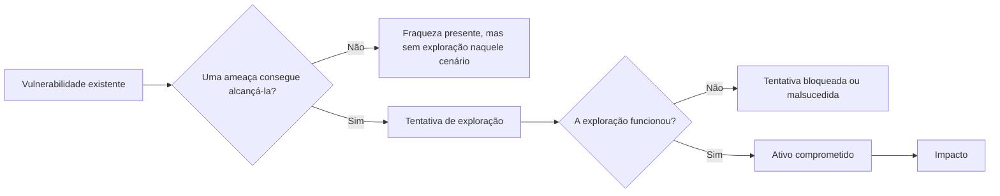
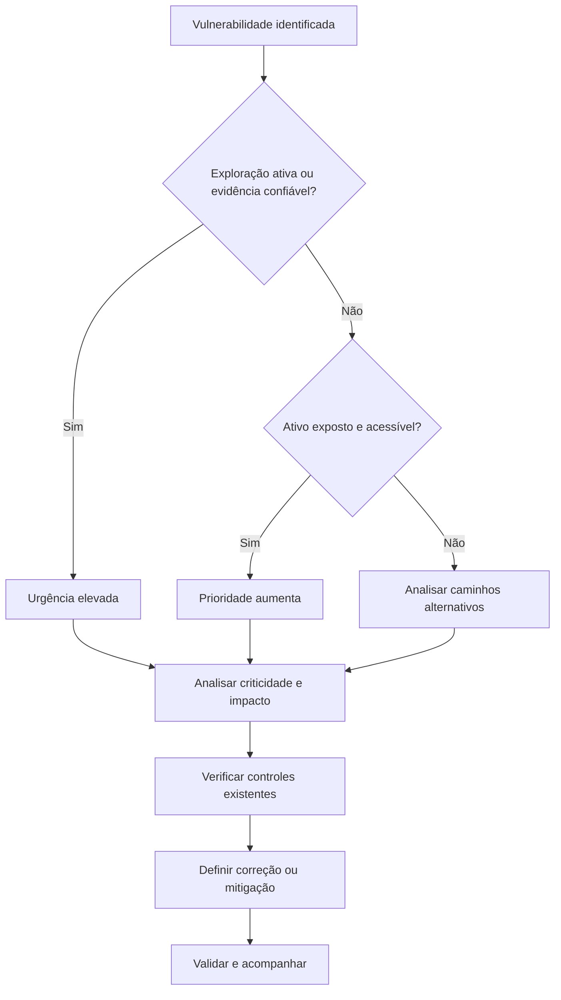
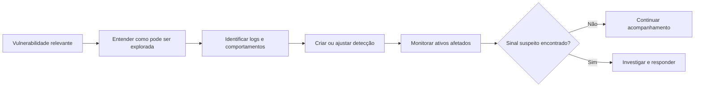

# Capítulo 005 — Vulnerabilidades

> **Entender antes de decorar.**

---

| Informação | Detalhes |
|---|---|
| **Módulo** | 01 — Fundamentos |
| **Nível** | Iniciante |
| **Tempo estimado** | 15 a 20 minutos |
| **Pré-requisito** | [Capítulo 004 — Ameaças](004-ameacas.md) |

---

## Objetivo deste capítulo

Ao final deste capítulo, você será capaz de:

- explicar o que é uma **vulnerabilidade** em Segurança da Informação;
- diferenciar vulnerabilidade, ameaça, exposição, falha, exploração e risco;
- reconhecer vulnerabilidades de software, configuração, arquitetura, processos e controles;
- compreender as diferenças entre **CVE, CWE e CVSS**;
- entender por que uma pontuação alta não define sozinha a prioridade de correção;
- descrever as principais etapas da gestão de vulnerabilidades;
- relacionar vulnerabilidades ao trabalho de SOC, Blue Team e Cyber Threat Intelligence.

---

## Como sempre, vamos começar utilizando nossa imaginação.

Imagine que você mora em uma casa com uma porta resistente, fechadura moderna e câmeras de segurança.

À primeira vista, tudo parece protegido.

Porém, uma das janelas dos fundos não fecha completamente.

A janela aberta não é um ladrão. Também não representa, sozinha, um roubo acontecendo.

Ela é uma **fraqueza** que pode ser aproveitada por alguém para entrar na casa.

Podemos organizar esse exemplo da seguinte forma:

| Elemento | Exemplo na casa |
|---|---|
| **Ativo** | A casa e tudo que existe dentro dela |
| **Vulnerabilidade** | A janela que não fecha corretamente |
| **Fonte de ameaça** | Uma pessoa interessada em invadir |
| **Exploração** | Utilizar a janela para entrar |
| **Impacto** | Furto, dano ou exposição de informações |
| **Controle** | Consertar a janela, instalar sensores e monitorar o local |

Em um ambiente de tecnologia, a lógica é semelhante.

Uma senha padrão, um sistema desatualizado, uma aplicação mal configurada ou uma permissão excessiva podem criar oportunidades para que uma ameaça cause dano.

No capítulo anterior, respondemos:

> **O que pode causar dano ao que estamos tentando proteger?**

Agora vamos responder:

> **Quais fraquezas podem permitir ou facilitar esse dano?**

---

## O que é uma vulnerabilidade?

Uma **vulnerabilidade** é uma fraqueza presente em um sistema, aplicação, dispositivo, configuração, processo ou controle de segurança que pode ser explorada por uma ameaça ou acionada por uma situação indesejada.

Essa fraqueza pode permitir:

- acesso não autorizado;
- execução de comandos;
- exposição de informações;
- alteração ou exclusão de dados;
- elevação de privilégios;
- interrupção de serviços;
- movimentação entre sistemas;
- desativação de controles;
- comprometimento de outros ativos.

Em outras palavras:

> **A vulnerabilidade é o ponto fraco que torna um cenário de dano possível ou mais fácil de acontecer.**

!!! note "Uma vulnerabilidade pode existir sem ter sido explorada"
    A presença de uma vulnerabilidade não confirma que ocorreu um ataque.

    Ela indica que existe uma condição que pode ser utilizada ou acionada e que precisa ser analisada no contexto do ambiente.

---

## Vulnerabilidade não é sinônimo de ataque

Considere um servidor com uma versão de software vulnerável.

Enquanto ninguém utiliza aquela fraqueza, existe uma **vulnerabilidade**, mas não necessariamente um ataque ou incidente.

A sequência pode ser representada assim:



A vulnerabilidade é a fraqueza.

A exploração é a utilização dessa fraqueza.

O ataque é a ação intencional realizada contra o alvo.

O incidente ocorre quando a segurança é comprometida ou ameaçada de forma relevante.

---

## Conceitos que não devem ser confundidos

| Conceito | Pergunta principal | Exemplo |
|---|---|---|
| **Ameaça** | O que pode causar dano? | Criminoso tentando obter acesso |
| **Vulnerabilidade** | Qual fraqueza pode permitir o dano? | Senha padrão em um equipamento |
| **Exposição** | O ativo pode ser alcançado ou está desnecessariamente acessível? | Interface administrativa disponível na internet |
| **Exploit** | Qual recurso ou código pode aproveitar a vulnerabilidade? | Script criado para explorar uma falha específica |
| **Exploração** | A vulnerabilidade foi utilizada? | Envio de uma requisição maliciosa ao serviço |
| **Impacto** | Qual consequência pode ocorrer? | Controle do equipamento ou interrupção do serviço |
| **Risco** | Qual é a possibilidade e a gravidade para o negócio? | Paralisação de uma operação crítica |
| **Correção** | Como eliminamos a causa da vulnerabilidade? | Aplicação de atualização ou mudança no código |
| **Mitigação** | Como reduzimos a exploração ou o impacto? | Restringir o acesso enquanto a correção não é aplicada |

!!! warning "Exposição e vulnerabilidade não são exatamente a mesma coisa"
    Um serviço publicado na internet pode estar funcionando como planejado e ainda assim aumentar a exposição do ativo.

    Quando uma exposição desnecessária se combina com uma falha, configuração insegura ou controle insuficiente, o cenário se torna mais preocupante.

---

## Como as vulnerabilidades surgem?

Vulnerabilidades podem ser introduzidas em diferentes momentos do ciclo de vida de uma tecnologia.

### Durante o projeto

Uma arquitetura pode ser criada sem considerar separação de funções, autenticação adequada, proteção de dados ou isolamento entre ambientes.

Exemplos:

- uma aplicação confia automaticamente em tudo que vem da rede interna;
- um sistema concentra funções críticas em um único componente;
- dados sensíveis são armazenados sem necessidade;
- não existe previsão de registros para investigação.

### Durante o desenvolvimento

Erros no código podem permitir comportamentos inesperados.

Exemplos:

- ausência de validação de entrada;
- consultas ao banco construídas de forma insegura;
- tratamento incorreto de memória;
- credenciais gravadas diretamente no código;
- falhas na verificação de autorização.

### Durante a configuração

Um produto seguro pode se tornar vulnerável quando instalado ou configurado de maneira inadequada.

Exemplos:

- senha padrão mantida após a instalação;
- armazenamento em nuvem acessível publicamente;
- permissões excessivas;
- recurso administrativo exposto à internet;
- logs desativados;
- protocolos inseguros habilitados.

### Durante a operação

Mudanças no ambiente podem criar novas fraquezas com o tempo.

Exemplos:

- software deixa de receber suporte;
- atualizações não são aplicadas;
- contas antigas permanecem ativas;
- regras temporárias de firewall nunca são removidas;
- novos serviços são publicados sem avaliação de segurança;
- dependências passam a possuir vulnerabilidades conhecidas.

### Em processos e controles

Nem toda vulnerabilidade está em uma linha de código.

Processos frágeis também podem permitir que ameaças causem dano.

Exemplos:

- ausência de revisão de acessos;
- restauração de backup nunca testada;
- mudanças realizadas sem validação;
- falta de inventário de ativos;
- alertas críticos sem responsável definido;
- ausência de procedimento para revogar acessos.

!!! note "O usuário não é a vulnerabilidade"
    Pessoas podem cometer erros ou ser manipuladas, mas classificá-las simplesmente como vulnerabilidades esconde as causas reais.

    O problema pode estar em treinamento insuficiente, processos confusos, permissões excessivas, ausência de validação ou controles mal projetados.

---

## Categorias de vulnerabilidades

Uma mesma vulnerabilidade pode se encaixar em mais de uma categoria. A divisão abaixo serve para facilitar o raciocínio.

| Categoria | Descrição | Exemplo |
|---|---|---|
| **Software** | Falha no código ou em uma dependência | Execução de código por entrada malformada |
| **Configuração** | Produto ou serviço configurado de forma insegura | Console administrativo aberto à internet |
| **Autenticação e acesso** | Controle inadequado de identidade ou permissão | Usuário comum consegue acessar função administrativa |
| **Arquitetura e design** | Fraqueza criada na estrutura ou nas decisões do sistema | Falta de isolamento entre ambientes |
| **Criptografia** | Proteção inadequada de dados ou chaves | Dados sensíveis transmitidos sem proteção |
| **Processo** | Procedimento inexistente, incompleto ou não executado | Contas de ex-funcionários permanecem ativas |
| **Infraestrutura física** | Fraqueza no ambiente que protege os recursos | Sala de servidores sem controle de acesso |
| **Cadeia de suprimentos** | Fraqueza em componente, biblioteca, fornecedor ou processo de entrega | Dependência comprometida incluída na aplicação |

A classificação ajuda a entender onde a correção deve ocorrer.

Uma vulnerabilidade de código pode exigir alteração no software. Uma configuração insegura pode ser corrigida sem mudar o código. Uma fragilidade de processo pode exigir novos responsáveis, verificações e procedimentos.

---

## Vulnerabilidade conhecida não significa vulnerabilidade nova

Uma vulnerabilidade pode existir por meses ou anos antes de ser descoberta.

Quando pesquisadores, fabricantes ou usuários identificam o problema, começa um processo que pode envolver:

1. validação da descoberta;
2. comunicação com o responsável pelo produto;
3. desenvolvimento de correção ou mitigação;
4. publicação de aviso de segurança;
5. criação de um registro público;
6. atualização dos ambientes afetados.

A data de publicação não representa necessariamente o momento em que a fraqueza surgiu.

Também é possível que atacantes descubram e explorem uma vulnerabilidade antes que exista correção pública. Esse tipo de situação costuma ser associado ao termo **zero-day**.

### Zero-day

Uma vulnerabilidade zero-day é uma vulnerabilidade para a qual os defensores ainda não possuem conhecimento suficiente, correção disponível ou tempo adequado de resposta no momento em que ela é explorada ou divulgada.

O termo é utilizado de formas diferentes no mercado. Por isso, é importante observar o contexto:

- a vulnerabilidade era desconhecida pelo fabricante?
- já existia correção?
- havia exploração ativa?
- quando o problema foi divulgado publicamente?

---

## CVE, CWE e CVSS

Essas três siglas aparecem frequentemente em relatórios de vulnerabilidade, mas representam coisas diferentes.

### CVE — Common Vulnerabilities and Exposures

O **CVE** fornece um identificador comum para uma vulnerabilidade de segurança divulgada publicamente.

Um identificador possui este formato:

```text
CVE-ANO-NÚMERO
```

Exemplo fictício:

```text
CVE-2026-12345
```

O CVE permite que fabricantes, ferramentas, analistas e pesquisadores saibam que estão falando sobre a mesma vulnerabilidade.

Um registro CVE normalmente apresenta uma descrição e referências, mas o identificador por si só não informa todo o contexto necessário para decidir a prioridade.

### CWE — Common Weakness Enumeration

O **CWE** descreve tipos de fraquezas que podem gerar vulnerabilidades.

Exemplos conhecidos incluem:

- validação inadequada de entrada;
- credenciais codificadas no software;
- controle de acesso incorreto;
- leitura ou escrita fora dos limites esperados;
- neutralização inadequada de comandos.

Podemos simplificar assim:

> **CWE descreve o tipo de erro. CVE identifica uma ocorrência específica desse erro em um produto.**

### CVSS — Common Vulnerability Scoring System

O **CVSS** é um padrão utilizado para comunicar características técnicas e severidade de vulnerabilidades.

No CVSS v4.0, a pontuação varia de **0,0 a 10,0** e pode considerar grupos de métricas relacionados a:

- características básicas da vulnerabilidade;
- condições atuais de ameaça;
- características do ambiente da organização;
- informações adicionais que ajudam na análise.

Uma pontuação pode ser apresentada com uma classificação qualitativa:

| Pontuação | Severidade qualitativa |
|---:|---|
| 0,0 | Nenhuma |
| 0,1 a 3,9 | Baixa |
| 4,0 a 6,9 | Média |
| 7,0 a 8,9 | Alta |
| 9,0 a 10,0 | Crítica |

!!! warning "CVSS mede severidade, não o risco completo da organização"
    Uma vulnerabilidade crítica em um sistema isolado e sem dados relevantes pode receber prioridade menor do que uma vulnerabilidade alta explorada ativamente em um serviço essencial exposto à internet.

    O número ajuda na análise, mas não substitui contexto.

---

## Como priorizar vulnerabilidades

Uma organização pode encontrar centenas ou milhares de vulnerabilidades. Corrigir apenas pela ordem da pontuação CVSS costuma gerar decisões ruins.

A prioridade deve considerar diferentes fatores.

### 1. A vulnerabilidade está sendo explorada?

Evidências de exploração ativa aumentam a urgência.

O catálogo **Known Exploited Vulnerabilities (KEV)** da CISA reúne vulnerabilidades com evidências de exploração no mundo real e pode ser utilizado como uma das fontes de priorização.

### 2. O ativo está exposto?

Pergunte:

- o serviço está acessível pela internet?
- exige autenticação?
- pode ser alcançado por usuários comuns?
- está isolado por segmentação?
- existe outro caminho até ele?

### 3. Qual é a importância do ativo?

Um sistema pode processar pagamentos, armazenar dados pessoais, controlar uma operação industrial ou sustentar um serviço essencial.

A criticidade do ativo muda a prioridade.

### 4. Qual seria o impacto?

A exploração pode resultar em:

- vazamento de dados;
- controle administrativo;
- interrupção operacional;
- fraude;
- movimentação lateral;
- perda financeira;
- impacto legal ou reputacional.

### 5. Existem controles compensatórios?

MFA, segmentação, bloqueios de rede, WAF, EDR, allowlists e monitoramento podem reduzir a possibilidade ou o impacto, mas não devem ser tratados automaticamente como correções definitivas.

### 6. Existe correção segura e viável?

É necessário verificar:

- se o fabricante publicou uma atualização;
- se a atualização é aplicável à versão utilizada;
- se exige reinicialização ou indisponibilidade;
- se pode causar incompatibilidade;
- se foi testada;
- se existe plano de reversão.

Podemos resumir o raciocínio:



> **Prioridade é o resultado da severidade técnica combinada com ameaça, exposição, criticidade, impacto e capacidade de resposta.**

---

## Gestão de vulnerabilidades

A gestão de vulnerabilidades não é apenas executar um scanner e entregar um relatório.

É um processo contínuo.

### 1. Conhecer os ativos

Não é possível proteger aquilo que a organização não sabe que existe.

O inventário deve ajudar a identificar:

- dispositivos;
- servidores;
- aplicações;
- sistemas operacionais;
- versões de software;
- dependências;
- responsáveis;
- localização;
- exposição;
- criticidade para o negócio.

### 2. Identificar vulnerabilidades

A identificação pode ocorrer por meio de:

- scanners de vulnerabilidade;
- testes de segurança;
- análise de código;
- revisão de configuração;
- avisos de fabricantes;
- monitoramento de dependências;
- programas de divulgação responsável;
- auditorias;
- pesquisas de segurança;
- informações de ameaças.

### 3. Validar os resultados

Ferramentas podem gerar:

- **falsos positivos:** apontam uma vulnerabilidade que não está presente ou não se aplica;
- **falsos negativos:** deixam de identificar uma vulnerabilidade existente;
- resultados incompletos por falta de credenciais, acesso ou visibilidade.

Por isso, um achado precisa ser relacionado ao ativo, versão, configuração e evidências observadas.

### 4. Priorizar

A equipe combina severidade, exploração ativa, exposição, criticidade e impacto para definir prazos e responsáveis.

### 5. Corrigir ou mitigar

Possíveis ações incluem:

- aplicar atualização;
- alterar configuração;
- remover serviço desnecessário;
- corrigir código;
- atualizar dependência;
- reduzir permissões;
- segmentar o ativo;
- bloquear o vetor de exploração;
- descontinuar um produto sem suporte;
- aumentar monitoramento temporariamente.

### 6. Verificar

Depois da mudança, é necessário confirmar:

- a correção foi realmente aplicada?
- o serviço continua funcionando?
- a vulnerabilidade deixou de ser detectada?
- a mitigação reduz o cenário esperado?
- surgiu algum novo problema?

### 7. Acompanhar

Vulnerabilidades podem reaparecer, novos ativos podem ser adicionados e controles podem ser alterados.

A gestão precisa de indicadores, responsáveis, prazos, exceções documentadas e revisões periódicas.

---

## Correção, mitigação e aceitação

Nem sempre será possível aplicar uma atualização imediatamente.

### Correção

Elimina ou remove a causa da vulnerabilidade.

Exemplos:

- instalar a versão corrigida;
- alterar o código vulnerável;
- substituir o componente;
- remover a configuração insegura.

### Mitigação

Reduz a possibilidade de exploração ou limita o impacto enquanto a correção definitiva não é realizada.

Exemplos:

- restringir o acesso por firewall;
- desabilitar a função vulnerável;
- remover o serviço da internet;
- adicionar regra de WAF;
- segmentar o sistema;
- aumentar a detecção e o monitoramento.

### Aceitação

A organização pode decidir aceitar temporariamente um risco quando a correção não é viável ou quando o impacto da mudança seria maior do que o benefício imediato.

Essa decisão deve possuir:

- justificativa;
- responsável autorizado;
- prazo de revisão;
- controles compensatórios;
- registro do impacto possível.

!!! warning "Ignorar não é o mesmo que aceitar"
    Aceitação de risco é uma decisão consciente, registrada e aprovada.

    Deixar um achado aberto sem responsável, análise ou prazo representa falta de tratamento.

---

## Cenário prático — Serviço de acesso remoto vulnerável

Uma empresa utiliza um equipamento de acesso remoto para que funcionários trabalhem fora do escritório.

O fabricante publica uma vulnerabilidade que permite execução de comandos antes da autenticação. O equipamento está exposto à internet, existe código de exploração disponível e a vulnerabilidade foi adicionada ao catálogo KEV.

| Elemento | Análise |
|---|---|
| **Ativo** | Equipamento de acesso remoto |
| **Exposição** | Interface acessível pela internet |
| **Vulnerabilidade** | Execução de comandos antes da autenticação |
| **Ameaça** | Grupos interessados em obter acesso inicial |
| **Exploração ativa** | Confirmada por fontes confiáveis |
| **Impacto possível** | Controle do equipamento, roubo de credenciais e entrada na rede |
| **Controles existentes** | Firewall e monitoramento, mas o serviço precisa permanecer acessível |
| **Tratamento principal** | Aplicar atualização emergencial conforme orientação do fabricante |
| **Ações complementares** | Revisar logs, procurar sinais de exploração, trocar credenciais e validar integridade |

A pontuação técnica é importante, mas não é o único fator que torna o caso urgente.

A prioridade aumenta porque:

- o ativo está exposto;
- a exploração pode ocorrer sem autenticação;
- existe atividade maliciosa conhecida;
- o equipamento fornece acesso à rede interna;
- o impacto pode ultrapassar o próprio dispositivo.

### Antes e depois da correção

Aplicar o patch reduz a vulnerabilidade conhecida, mas a organização ainda precisa perguntar:

- houve exploração antes da atualização?
- foram criadas contas ou sessões indevidas?
- credenciais foram coletadas?
- configurações foram alteradas?
- existem mecanismos de persistência?

> **Corrigir uma vulnerabilidade não desfaz automaticamente um comprometimento que já aconteceu.**

---

## Como um SOC trabalha com vulnerabilidades

O SOC não costuma ser o único responsável por corrigir vulnerabilidades, mas utiliza essas informações para melhorar a detecção e a investigação.

| Informação de vulnerabilidade | Uso pelo SOC |
|---|---|
| CVE presente em um ativo | Priorizar monitoramento daquele sistema |
| Serviço vulnerável exposto | Criar alerta para tentativas de exploração |
| Exploração ativa conhecida | Procurar comportamentos e indicadores relacionados |
| Patch emergencial | Acompanhar ativos ainda não corrigidos |
| Mitigação temporária | Validar se bloqueios e regras estão funcionando |
| Vulnerabilidade crítica corrigida | Investigar sinais anteriores à correção |

### Da vulnerabilidade ao caso de uso



Uma regra de detecção não corrige a vulnerabilidade. Porém, pode ajudar a identificar tentativas de exploração e reduzir o tempo de resposta.

---

## Aplicação em Cyber Threat Intelligence

A Cyber Threat Intelligence ajuda a responder perguntas que uma pontuação isolada não responde:

- grupos maliciosos estão explorando essa vulnerabilidade?
- quais setores e regiões estão sendo afetados?
- existe código de exploração público?
- a exploração exige autenticação ou interação do usuário?
- quais produtos e versões estão sendo atacados?
- a vulnerabilidade é utilizada para acesso inicial, persistência ou elevação de privilégios?
- quais comportamentos podem ser observados após a exploração?
- quais mitigações estão funcionando?

Informações de ameaça ajudam a transformar uma lista técnica em uma decisão contextualizada.

!!! note "Inteligência não substitui inventário"
    Saber que uma vulnerabilidade está sendo explorada é importante, mas a organização ainda precisa descobrir se utiliza o produto, quais versões possui, onde estão os ativos e quem é responsável por eles.

---

## Como analisar uma vulnerabilidade

Ao receber um novo achado, faça perguntas como:

1. **Qual ativo é afetado?**
2. **Qual produto e versão estão instalados?**
3. **A evidência confirma que a vulnerabilidade se aplica?**
4. **O ativo está exposto ou pode ser alcançado por outro caminho?**
5. **A exploração exige autenticação, privilégio ou interação do usuário?**
6. **Existe exploração ativa ou código público?**
7. **Qual seria o impacto para a Confidencialidade, Integridade e Disponibilidade?**
8. **Qual é a importância do ativo para o negócio?**
9. **Existe correção ou mitigação oficial?**
10. **Como confirmaremos que o tratamento funcionou?**

> Uma vulnerabilidade se torna realmente útil para a defesa quando é relacionada ao ativo, à exposição, à ameaça, ao impacto, aos controles e ao responsável pelo tratamento.

---

## Exercício de fixação

??? question "1. Um sistema desatualizado possui uma vulnerabilidade conhecida, mas não há evidência de ataque. Existe um incidente confirmado?"
    Não. Existe uma vulnerabilidade que precisa ser analisada e tratada, mas sua presença não confirma que ocorreu exploração ou incidente.

??? question "2. Uma interface administrativa está publicada na internet sem necessidade. Isso representa o quê?"
    Representa uma exposição desnecessária. Caso existam credenciais fracas, configuração insegura ou uma falha no serviço, essa exposição pode facilitar a exploração.

??? question "3. Qual é a diferença entre CVE e CWE?"
    O CVE identifica uma vulnerabilidade específica divulgada publicamente. O CWE descreve um tipo de fraqueza que pode gerar diferentes vulnerabilidades.

??? question "4. Uma vulnerabilidade com CVSS 9,8 deve sempre ser corrigida antes de todas as outras?"
    Não necessariamente. A prioridade também depende de exploração ativa, exposição, criticidade do ativo, impacto e controles existentes.

??? question "5. Aplicar um patch confirma que o sistema nunca foi comprometido?"
    Não. A correção remove ou reduz a vulnerabilidade, mas ainda pode ser necessário investigar atividades ocorridas antes da atualização.

??? question "6. Um scanner informou uma vulnerabilidade. O resultado deve ser aceito automaticamente?"
    Não. O achado precisa ser validado com versão, configuração, evidências e contexto do ativo, pois ferramentas podem gerar falsos positivos e resultados incompletos.

??? question "7. Bloquear temporariamente o acesso a um serviço vulnerável é correção ou mitigação?"
    Normalmente é uma mitigação, pois reduz a possibilidade de exploração sem necessariamente remover a causa da vulnerabilidade.

??? question "8. Por que o inventário é importante para a gestão de vulnerabilidades?"
    Porque a organização precisa saber quais ativos, produtos e versões possui para identificar o que está afetado, definir responsáveis e acompanhar a correção.

---

## Erros comuns

### “Toda vulnerabilidade possui um CVE”

Não. Muitos problemas de configuração, arquitetura, processo ou código interno não recebem um identificador CVE.

### “CVSS é uma nota de risco”

Não exatamente. O CVSS comunica severidade e características da vulnerabilidade. O risco depende também do ambiente, do ativo, da ameaça, da exposição e do impacto para a organização.

### “Executar um scanner é fazer gestão de vulnerabilidades”

O scanner é apenas uma fonte de identificação. Gestão envolve inventário, validação, priorização, tratamento, verificação e acompanhamento.

### “Patch crítico deve ser instalado imediatamente sem testes”

Urgência não elimina a necessidade de planejamento. A organização deve equilibrar rapidez, testes, continuidade, plano de reversão e possíveis mitigações temporárias.

### “Se o firewall bloqueia, não precisamos corrigir”

O firewall pode reduzir a exposição, mas mudanças de regra, novos caminhos ou acessos internos podem tornar a vulnerabilidade alcançável novamente.

### “Se não houve alerta, ninguém explorou”

Ausência de alerta pode significar ausência de exploração, mas também falta de visibilidade, regra inadequada, logs incompletos ou ação não detectada.

### “Usuários são o elo fraco”

Essa frase simplifica um problema sistêmico. Segurança deve considerar treinamento, processos, design, permissões, validações e controles que evitem que um único erro cause impacto excessivo.

---

## Resumo

Uma **vulnerabilidade** é uma fraqueza que pode ser explorada por uma ameaça ou acionada por uma situação indesejada.

Ela pode existir em:

- software;
- configurações;
- autenticação e permissões;
- arquitetura;
- criptografia;
- processos;
- infraestrutura física;
- fornecedores e dependências.

Lembre-se:

- **ameaça:** aquilo que pode causar dano;
- **vulnerabilidade:** fraqueza que pode permitir ou facilitar o dano;
- **exposição:** condição que torna o ativo acessível ou alcançável;
- **exploração:** utilização da vulnerabilidade;
- **CVE:** identificador de uma vulnerabilidade específica;
- **CWE:** categoria de fraqueza que pode originar vulnerabilidades;
- **CVSS:** padrão para comunicar severidade e características técnicas;
- **correção:** elimina a causa;
- **mitigação:** reduz a possibilidade ou o impacto;
- **risco:** depende do contexto da organização.

> **Encontrar vulnerabilidades é importante. Saber quais realmente importam, tratá-las e verificar o resultado é o que transforma informação em defesa.**

---

## Checkpoint

Antes de seguir para o próximo capítulo, confirme se você consegue responder:

- [ ] O que é uma vulnerabilidade?
- [ ] Qual é a diferença entre vulnerabilidade, ameaça e exploração?
- [ ] Exposição e vulnerabilidade significam a mesma coisa?
- [ ] Como vulnerabilidades podem surgir durante o ciclo de vida de uma tecnologia?
- [ ] Qual é a diferença entre CVE, CWE e CVSS?
- [ ] Por que o CVSS não deve ser utilizado sozinho para priorização?
- [ ] Qual é a importância do catálogo KEV?
- [ ] Qual é a diferença entre correção e mitigação?
- [ ] Quais são as etapas básicas da gestão de vulnerabilidades?
- [ ] Por que corrigir uma vulnerabilidade não elimina a necessidade de investigar possível exploração anterior?

---

## Glossário

| Termo | Definição |
|---|---|
| **Aceitação de risco** | Decisão autorizada de manter temporariamente um risco, com justificativa e acompanhamento. |
| **CVE** | Identificador comum para uma vulnerabilidade de segurança divulgada publicamente. |
| **CVSS** | Padrão utilizado para comunicar características e severidade de vulnerabilidades. |
| **CWE** | Classificação de tipos de fraquezas em software e hardware. |
| **Exploit** | Código, técnica ou recurso criado para aproveitar uma vulnerabilidade. |
| **Exploração** | Ação de utilizar uma vulnerabilidade para produzir um comportamento ou resultado. |
| **Exposição** | Condição que torna um ativo ou serviço acessível a determinada origem ou caminho. |
| **Falso negativo** | Vulnerabilidade existente que não foi identificada pela avaliação. |
| **Falso positivo** | Achado informado como vulnerabilidade, mas que não se aplica ou não está presente. |
| **KEV** | Catálogo da CISA com vulnerabilidades conhecidas por serem exploradas no mundo real. |
| **Mitigação** | Medida que reduz a possibilidade de exploração ou limita o impacto sem necessariamente remover a causa. |
| **Patch** | Atualização destinada a corrigir problemas de segurança ou funcionamento. |
| **Remediação** | Ação para corrigir ou tratar uma vulnerabilidade. |
| **Severidade** | Medida das características técnicas e do impacto potencial de uma vulnerabilidade. |
| **Vulnerabilidade** | Fraqueza que pode ser explorada ou acionada, comprometendo a segurança. |
| **Zero-day** | Vulnerabilidade associada à ausência de conhecimento, correção ou tempo adequado de resposta no momento relevante. |

---

## Referências

- [NIST CSRC — Vulnerability](https://csrc.nist.gov/glossary/term/vulnerability)
- [NIST CSRC — Software Vulnerability](https://csrc.nist.gov/glossary/term/software_vulnerability)
- [NIST SP 800-40 Rev. 4 — Guide to Enterprise Patch Management Planning](https://csrc.nist.gov/pubs/sp/800/40/r4/final)
- [CVE Program — Overview](https://www.cve.org/about/overview)
- [MITRE CWE — About CWE](https://cwe.mitre.org/about/)
- [FIRST — CVSS v4.0 Specification](https://www.first.org/cvss/v4.0/specification-document)
- [FIRST — CVSS v4.0 Consumer Implementation Guide](https://www.first.org/cvss/v4.0/implementation-guide)
- [CISA — Known Exploited Vulnerabilities Catalog](https://www.cisa.gov/known-exploited-vulnerabilities-catalog)
- [OWASP Top 10:2025](https://owasp.org/Top10/)
- [OWASP Application Security Verification Standard 5.0](https://owasp.org/www-project-application-security-verification-standard/)

---

## Próximo capítulo

No próximo capítulo, vamos estudar **Riscos** e entender como ameaças, vulnerabilidades, impacto, possibilidade e contexto do negócio se combinam para orientar decisões de Segurança da Informação.

[← Capítulo anterior: Ameaças](004-ameacas.md){ .md-button }

<!-- Quando o Capítulo 006 for criado, remova este comentário e ative o botão abaixo.
[Próximo: Riscos →](006-riscos.md){ .md-button .md-button--primary }
-->
