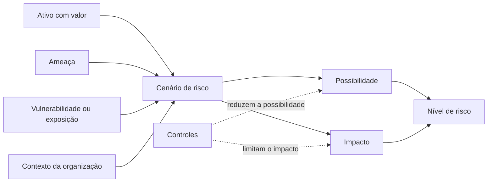
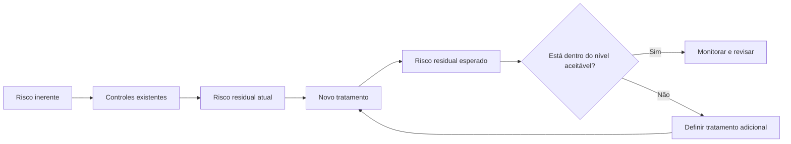
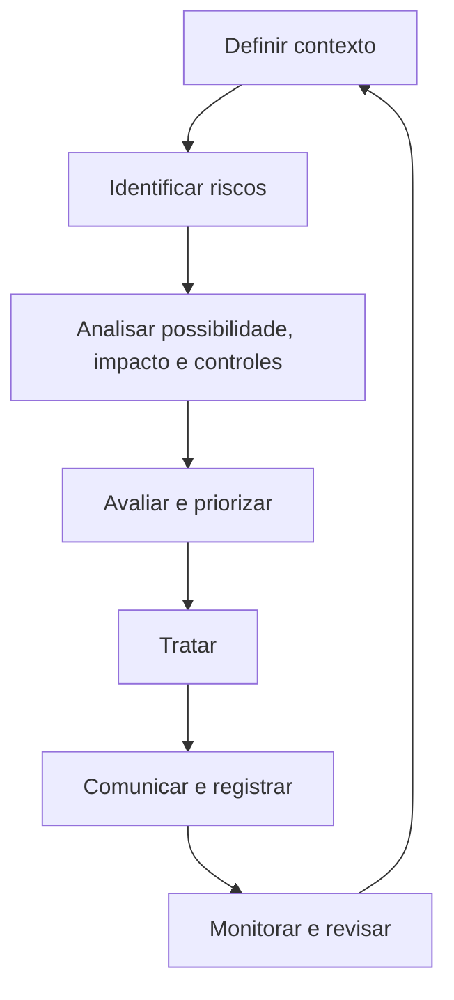
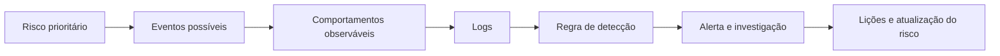

# Capítulo 006 — Riscos

> **Entender antes de decorar.**

---

| Informação | Detalhes |
|---|---|
| **Módulo** | 01 — Fundamentos |
| **Nível** | Iniciante |
| **Tempo estimado** | 15 a 20 minutos |
| **Pré-requisito** | [Capítulo 005 — Vulnerabilidades](005-vulnerabilidades.md) |

---

## Objetivo deste capítulo

Ao final deste capítulo, você será capaz de:

- explicar o que é **risco** em Segurança da Informação;
- diferenciar risco, ameaça, vulnerabilidade, impacto e incidente;
- compreender como possibilidade e impacto influenciam a avaliação de um risco;
- reconhecer as diferenças entre risco inerente, residual e alvo;
- entender apetite, tolerância e capacidade de risco;
- descrever as etapas básicas de uma avaliação de riscos;
- conhecer as principais opções de tratamento de risco;
- compreender como SOC, Blue Team e Cyber Threat Intelligence apoiam decisões baseadas em risco.

---

## Como sempre, vamos começar utilizando nossa imaginação.

No capítulo anterior, imaginamos uma casa com uma janela que não fechava corretamente. A janela era uma **vulnerabilidade**: uma fraqueza que poderia ser aproveitada.

Agora imagine duas casas com o mesmo problema.

A primeira está vazia, dentro de um condomínio monitorado e possui câmeras e alarme. A segunda guarda computadores, documentos e objetos de valor. Sua janela é facilmente acessível pela rua e ocorreram furtos recentes na região.

A vulnerabilidade é a mesma, mas o risco é diferente.

| Elemento | Exemplo na casa |
|---|---|
| **Ativo** | Pessoas, documentos e equipamentos |
| **Ameaça** | Pessoa interessada em invadir |
| **Vulnerabilidade** | Janela que não fecha |
| **Exposição** | Janela acessível pela rua |
| **Impacto** | Furto, dano ou exposição de informações |
| **Controles** | Conserto, sensores e monitoramento |
| **Risco** | Possibilidade de invasão e suas consequências |

Em tecnologia, uma vulnerabilidade só ganha significado quando é relacionada ao ativo, à ameaça, à exposição, aos controles e às consequências.

Nos capítulos anteriores, respondemos:

> **O que pode causar dano?**

> **Quais fraquezas podem facilitar esse dano?**

Agora precisamos responder:

> **Qual é a possibilidade de o cenário acontecer e o que ele representaria para a organização?**

---

## O que é risco?

Em Segurança da Informação, **risco** representa a possibilidade de uma circunstância ou evento afetar negativamente os objetivos, os ativos, as operações ou as pessoas de uma organização.

A análise considera principalmente:

- o que pode acontecer;
- quais ativos podem ser afetados;
- quais ameaças estão envolvidas;
- quais vulnerabilidades ou exposições podem facilitar o cenário;
- qual é a possibilidade de ocorrência;
- quais seriam as consequências;
- quais controles já existem;
- quanto risco permanece depois desses controles.

Em outras palavras:

> **Risco é a incerteza sobre um cenário de dano e suas possíveis consequências para a organização.**

!!! note "Risco não significa certeza"
    Um risco pode existir mesmo que o evento nunca aconteça.

    A função da análise não é prever o futuro com perfeição, mas apoiar decisões melhores diante da incerteza.

---

## Risco não é sinônimo de ameaça ou vulnerabilidade

Esses conceitos se relacionam, mas representam partes diferentes do problema.

| Conceito | Pergunta principal | Exemplo |
|---|---|---|
| **Ativo** | O que possui valor? | Banco de dados de clientes |
| **Ameaça** | O que pode causar dano? | Grupo criminoso |
| **Vulnerabilidade** | Qual fraqueza facilita o dano? | Aplicação desatualizada |
| **Exposição** | O ativo pode ser alcançado? | Aplicação na internet |
| **Evento** | O que pode acontecer? | Exploração e acesso ao banco |
| **Possibilidade** | Quão plausível é o cenário? | Alta diante de exploração ativa |
| **Impacto** | Quais seriam as consequências? | Vazamento e interrupção |
| **Controle** | O que reduz o cenário? | Patch, WAF e segmentação |
| **Risco** | O que isso representa para a organização? | Possível comprometimento com impacto relevante |
| **Incidente** | O cenário ocorreu? | Exploração confirmada |

Uma ameaça pode existir sem encontrar uma vulnerabilidade utilizável. Uma vulnerabilidade pode existir sem estar exposta ou sem possuir uma ameaça relevante naquele momento.

O risco aparece quando essas informações são conectadas a um cenário e ao contexto da organização.

---

## Como um cenário de risco é formado

Uma avaliação de risco precisa contar uma história compreensível.

Não basta registrar frases genéricas como:

```text
Risco de ataque cibernético.
```

Essa descrição não informa o alvo, o caminho, a consequência nem o contexto.

Um cenário mais útil seria:

```text
Um grupo criminoso pode explorar uma vulnerabilidade conhecida
no serviço de acesso remoto exposto à internet, obter acesso inicial
à rede corporativa e interromper a operação por meio de ransomware.
```

Esse cenário conecta:

- uma fonte de ameaça;
- um evento possível;
- uma vulnerabilidade;
- um ativo exposto;
- uma consequência para o negócio.



!!! warning "Não existe uma fórmula universal"
    Expressões como `Risco = Ameaça × Vulnerabilidade × Impacto` podem ajudar a memorizar os componentes do raciocínio, mas não representam uma fórmula universal aplicável a todas as organizações.

    Métodos de avaliação utilizam critérios, escalas e modelos diferentes. O importante é que a organização defina seu método e o aplique de forma consistente.

---

## Possibilidade e impacto

A avaliação de risco costuma observar dois elementos centrais: **possibilidade** e **impacto**.

### Possibilidade

Indica o quanto um cenário é plausível dentro de determinado período e contexto. Não deve ser definida apenas pela sensação do analista.

Alguns fatores relevantes:

- ameaças interessadas no ativo;
- incidentes semelhantes;
- exploração ativa ou código público;
- exposição do ativo;
- facilidade, privilégios e interação exigidos;
- eficácia dos controles;
- tempo de exposição.

| Classificação | Exemplo de interpretação |
|---|---|
| **Baixa** | Exige condições raras ou acesso difícil |
| **Média** | É plausível, mas depende de algumas condições |
| **Alta** | É frequente, simples, exposta ou já explorada |

Cada organização deve documentar o significado de suas escalas.

### Impacto

Representa as consequências caso o cenário aconteça. Pode afetar:

- **Confidencialidade:** exposição de informações;
- **Integridade:** alteração, fraude ou destruição;
- **Disponibilidade:** interrupção de serviços;
- **Operação e finanças:** paralisação, recuperação e perda de receita;
- **Reputação e conformidade:** perda de confiança e descumprimento de obrigações;
- **Pessoas e terceiros:** privacidade, segurança e cadeia de suprimentos.

| Classificação | Exemplo de interpretação |
|---|---|
| **Baixo** | Consequência limitada e reversível |
| **Médio** | Interrupção relevante ou custo moderado |
| **Alto** | Paralisação crítica, perda significativa ou impacto amplo |

!!! note "Impacto técnico e impacto para o negócio não são a mesma coisa"
    O comprometimento de um servidor de testes isolado e o de um servidor de faturamento podem ser tecnicamente semelhantes, mas produzir consequências muito diferentes.

---

## Avaliação qualitativa e quantitativa

### Avaliação qualitativa

Utiliza classificações como baixa, média, alta ou crítica. Também pode usar escalas numéricas, desde que cada valor possua critérios definidos.

| Possibilidade | Impacto | Resultado ilustrativo |
|---|---|---|
| Baixa | Baixo | Baixo |
| Baixa | Alto | Médio |
| Média | Médio | Médio |
| Alta | Médio | Alto |
| Alta | Alto | Crítico |

Ela facilita a comunicação, mas depende de escalas claras e aplicação consistente.

### Avaliação quantitativa

Busca representar o risco por valores como frequência, horas de indisponibilidade, registros afetados e perdas financeiras.

Exemplo simplificado: um incidente com chance anual estimada em **20%** e impacto de **R$ 100.000** teria perda esperada de:

```text
0,20 × R$ 100.000 = R$ 20.000
```

Isso não significa que a perda real será exatamente R$ 20.000. O valor apenas apoia comparações e decisões.

!!! warning "Número não elimina incerteza"
    O resultado depende da qualidade dos dados, das premissas e do modelo. Muitas casas decimais não tornam uma estimativa frágil mais precisa.

---

## Matriz de risco

A matriz de risco combina possibilidade e impacto para facilitar a classificação e a priorização.

Exemplo de matriz simplificada:

| Impacto \ Possibilidade | Baixa | Média | Alta |
|---|:---:|:---:|:---:|
| **Alto** | Médio | Alto | Crítico |
| **Médio** | Baixo | Médio | Alto |
| **Baixo** | Baixo | Baixo | Médio |

A matriz pode ser útil para:

- padronizar discussões;
- comparar cenários;
- definir prioridades;
- estabelecer níveis de aprovação;
- comunicar riscos à liderança.

Porém, ela possui limitações.

Duas pessoas podem interpretar “alto” de maneiras diferentes. Riscos muito distintos podem terminar na mesma célula. Pequenas mudanças de classificação também podem alterar bastante o resultado.

Por isso, a matriz não deve substituir a descrição do cenário, as evidências e o contexto.

> **A cor da célula resume a análise. Ela não é a análise.**

---

## Risco inerente, residual e alvo

Esses termos mostram como o risco muda quando controles são considerados.

### Risco inerente

É o nível de risco existente antes de considerar a atuação dos controles relacionados ao cenário.

Ele ajuda a compreender a exposição original e a importância do processo protegido.

Exemplo:

Uma aplicação financeira acessível pela internet, sem considerar autenticação, monitoramento ou proteção de rede, pode possuir risco inerente alto.

### Risco residual

É o risco que permanece depois que os controles existentes são considerados.

Mesmo com MFA, WAF, monitoramento, backups e resposta a incidentes, algum risco continua existindo.

Nenhum controle oferece garantia absoluta.

### Risco alvo

É o nível de risco que a organização pretende alcançar após aplicar novos tratamentos.



!!! note "Controle reduz risco, mas também pode falhar"
    A análise deve considerar se o controle está realmente implementado, funcionando, monitorado e adequado ao cenário.

    Um backup que nunca foi testado não deve receber a mesma confiança de um processo de restauração validado periodicamente.

---

## Apetite, tolerância e capacidade de risco

Esses conceitos ajudam a organização a decidir quanto risco está disposta ou consegue suportar.

### Apetite de risco

Representa a quantidade e o tipo de risco que a organização está disposta a assumir para alcançar seus objetivos.

Uma empresa digital pode aceitar maior risco de experimentação em um ambiente de testes, mas possuir apetite muito baixo para exposição de dados pessoais.

### Tolerância ao risco

Define limites ou variações aceitáveis dentro de um contexto específico.

Exemplos:

- indisponibilidade máxima de duas horas para determinado serviço;
- nenhuma conta administrativa sem MFA;
- prazo de sete dias para tratar vulnerabilidades críticas expostas;
- limite financeiro para perdas operacionais.

### Capacidade de risco

Representa o nível máximo de risco que a organização consegue suportar sem comprometer sua continuidade, suas obrigações ou seus objetivos.

Uma organização pode ter apetite para crescer rapidamente, mas não possuir capacidade financeira ou operacional para absorver uma interrupção prolongada.

| Conceito | Pergunta simplificada |
|---|---|
| **Apetite** | Quanto risco estamos dispostos a assumir? |
| **Tolerância** | Até qual limite aceitamos variações? |
| **Capacidade** | Quanto risco conseguimos suportar sem comprometer a organização? |

---

## Processo de avaliação de riscos

A avaliação de riscos não deve ser produzida uma única vez e esquecida. Ela é contínua.

### 1. Definir o contexto

Compreender objetivos, processos, ativos, dependências, requisitos e critérios de possibilidade e impacto.

### 2. Identificar os riscos

Descrever cenários a partir de inventários, ameaças, vulnerabilidades, incidentes, auditorias, fornecedores e entrevistas com o negócio.

### 3. Analisar

Considerar possibilidade, impacto, controles, confiança nas informações e riscos inerente e residual.

### 4. Avaliar e priorizar

Comparar os resultados aos critérios da organização e decidir o que exige tratamento, análise adicional, monitoramento ou aceitação.

### 5. Tratar

Selecionar ações para modificar ou lidar com o risco.

### 6. Comunicar e registrar

Definir responsáveis, prazos, decisões e linguagem compreensível.

### 7. Monitorar e revisar

Reavaliar quando ameaças, vulnerabilidades, controles, ativos, fornecedores ou objetivos mudarem.



---

## Registro de riscos

O **registro de riscos**, ou *risk register*, organiza os cenários e acompanha as decisões.

| Campo | Finalidade |
|---|---|
| **Identificador** | Diferenciar o risco |
| **Descrição** | Explicar o cenário |
| **Ativos e processos** | Indicar o que pode ser afetado |
| **Ameaças e vulnerabilidades** | Mostrar como o cenário pode ocorrer |
| **Possibilidade e impacto** | Registrar a análise |
| **Controles existentes** | Informar o que já reduz o risco |
| **Risco residual** | Classificar o que permanece |
| **Tratamento** | Registrar a decisão e as ações |
| **Responsável e prazo** | Definir acompanhamento |
| **Status e revisão** | Controlar andamento e reavaliação |

!!! warning "O risco precisa de um responsável"
    O responsável não precisa executar todas as ações, mas deve possuir autoridade e visão do impacto para acompanhar e decidir sobre o risco.

---

## Opções de tratamento de risco

### Evitar

Elimina a atividade ou condição que gera o risco, como descontinuar um sistema sem suporte ou deixar de armazenar dados desnecessários.

### Reduzir ou mitigar

Aplica controles para diminuir a possibilidade ou o impacto, como MFA, correção de vulnerabilidades, segmentação, backups e detecções.

### Compartilhar ou transferir

Distribui parte das consequências ou responsabilidades por meio de seguro, contrato ou serviço especializado.

!!! note "Transferir não significa eliminar"
    A organização ainda pode enfrentar indisponibilidade, perda de confiança, obrigações legais e danos aos clientes.

### Aceitar

Mantém o risco dentro de condições conhecidas. A aceitação precisa de justificativa, autoridade, prazo de revisão, controles e nível residual registrado.

> **Ignorar um risco não é o mesmo que aceitá-lo.**

---

## Cenário prático — Portal administrativo exposto

Uma empresa de comércio eletrônico possui um portal para gerenciar pedidos, preços, estoque e dados de clientes.

O portal está na internet, usa apenas senha, possui contas com privilégios excessivos e proteção insuficiente contra tentativas de login. Campanhas recentes de roubo de credenciais atingiram empresas do mesmo setor.

```text
Criminosos podem obter credenciais do portal, acessar funções
administrativas e alterar dados, consultar informações de clientes
ou interromper a operação da loja.
```

| Elemento | Análise |
|---|---|
| **Ativo** | Portal, pedidos, estoque e dados de clientes |
| **Ameaça** | Cibercriminosos interessados em fraude |
| **Vulnerabilidades** | Ausência de MFA e privilégios excessivos |
| **Exposição** | Portal disponível na internet |
| **Possibilidade** | Elevada pela exposição e campanhas no setor |
| **Impacto** | Fraude, vazamento e indisponibilidade |
| **Risco residual atual** | Alto |

### Tratamento proposto

- implementar MFA;
- reduzir privilégios;
- limitar tentativas de autenticação;
- monitorar logins anômalos;
- revisar contas antigas;
- criar procedimento de resposta.

Os controles reduzem a possibilidade e melhoram a detecção, mas o risco não desaparece. Ainda podem ocorrer phishing, roubo de sessão, abuso interno ou falhas no provedor de identidade.

A organização deve reavaliar o risco residual e decidir se ele está dentro de seus critérios.

---

## Como um SOC apoia a gestão de riscos

O SOC não decide sozinho quanto risco a organização deve aceitar, mas fornece evidências para atualizar avaliações.

| Informação do SOC | Contribuição |
|---|---|
| Mais tentativas de exploração | Pode elevar a possibilidade |
| Login anômalo em sistema crítico | Pode indicar materialização do risco |
| Ausência de logs | Reduz a confiança nos controles |
| Tempo elevado de resposta | Pode aumentar o impacto |
| Controle bloqueando ataques | Demonstra eficácia |
| Incidente confirmado | Permite revisar a avaliação |

### Do risco ao caso de uso de detecção



Uma detecção não elimina o risco, mas pode reduzir o tempo de resposta e limitar o impacto.

---

## Aplicação em Cyber Threat Intelligence

A Cyber Threat Intelligence ajuda a melhorar as estimativas de possibilidade e a relevância dos cenários.

Ela pode responder:

- quais grupos atacam nosso setor;
- quais objetivos esses grupos possuem;
- quais técnicas utilizam;
- quais vulnerabilidades estão explorando;
- quais tipos de ativos procuram;
- quais regiões estão sendo afetadas;
- quais controles podem dificultar sua atuação;
- quais sinais aparecem antes e depois do comprometimento.

Exemplo:

Uma organização pode ter classificado como médio o risco de exploração de determinado serviço.

Se novas informações mostrarem que:

- o serviço está sendo explorado ativamente;
- grupos de ransomware passaram a utilizá-lo para acesso inicial;
- empresas do mesmo setor foram comprometidas;
- existe código público de exploração;

então a possibilidade pode precisar ser reavaliada.

!!! note "Inteligência reduz incerteza, mas não toma a decisão"
    A CTI fornece contexto sobre ameaças. A decisão de risco ainda depende dos ativos, do impacto, dos controles e dos objetivos da organização.

---

## Como analisar um risco

Ao estudar um cenário, faça perguntas como:

1. **Qual objetivo, processo ou ativo pode ser afetado?**
2. **O que pode acontecer?**
3. **Qual ameaça ou evento pode iniciar o cenário?**
4. **Quais vulnerabilidades ou exposições facilitam o dano?**
5. **Quais evidências ajudam a estimar a possibilidade?**
6. **Quais seriam as consequências para a Tríade CIA e para o negócio?**
7. **Quais controles existem e há evidência de que funcionam?**
8. **Qual é o risco inerente e qual risco permanece?**
9. **O risco residual está dentro dos critérios da organização?**
10. **Quem possui autoridade para decidir sobre ele?**
11. **Qual tratamento será adotado?**
12. **Quando o cenário deverá ser revisado?**

> Um risco bem descrito conecta um evento possível a um ativo, uma ameaça, uma vulnerabilidade, uma consequência e uma decisão.

---

## Exercício de fixação

??? question "1. Uma vulnerabilidade crítica representa automaticamente um risco crítico?"
    Não. O risco depende também do ativo, da exposição, das ameaças, do impacto e dos controles.

??? question "2. Qual é a diferença entre risco e incidente?"
    O risco representa um cenário incerto. O incidente é um evento que compromete ou ameaça comprometer a segurança.

??? question "3. Dois sistemas com a mesma vulnerabilidade possuem o mesmo risco?"
    Não. Eles podem ter exposição, criticidade, impacto e controles diferentes.

??? question "4. O que é risco residual?"
    É o risco que permanece depois que os controles são considerados.

??? question "5. Seguro cibernético elimina o risco?"
    Não. Pode compartilhar parte do impacto financeiro, mas não elimina as demais consequências.

??? question "6. Aceitar significa ignorar?"
    Não. A aceitação deve ser consciente, autorizada, registrada e revisada.

??? question "7. A matriz substitui a descrição do cenário?"
    Não. Ela resume a classificação, mas não explica o contexto.

??? question "8. Como o SOC influencia a avaliação?"
    Fornecendo evidências sobre tentativas, incidentes, controles, visibilidade e tempo de resposta.

---

## Erros comuns

### “Risco é a mesma coisa que vulnerabilidade”

Não. Vulnerabilidade é uma fraqueza; risco é o que um cenário pode representar para a organização.

### “Todo risco pode ser eliminado”

Não. Controles reduzem riscos, mas algum nível de incerteza permanece.

### “Risco alto significa certeza de incidente”

Não. A classificação representa possibilidade e impacto, não uma previsão garantida.

### “Basta multiplicar possibilidade por impacto”

A conta pode fazer parte de um método, mas não substitui critérios, evidências e contexto.

### “A matriz decide o tratamento”

Ela apoia a decisão. Objetivos, recursos, dependências e autoridade também importam.

### “A equipe técnica pode aceitar o risco”

A equipe fornece análise. A aceitação cabe a quem possui autoridade sobre o processo afetado.

### “Transferir para um fornecedor resolve o problema”

Terceirizar não elimina responsabilidades sobre dados, clientes e continuidade.

### “Uma avaliação antiga continua válida”

Mudanças em ativos, ameaças, vulnerabilidades e controles podem alterar rapidamente o risco.

---

## Resumo

Um **risco** representa a possibilidade de um cenário afetar negativamente os objetivos, os ativos, as operações ou as pessoas de uma organização.

Ele deve ser analisado relacionando:

- ativos;
- ameaças;
- vulnerabilidades;
- exposições;
- possibilidade;
- impacto;
- controles;
- contexto do negócio.

Lembre-se:

- **ameaça:** aquilo que pode causar dano;
- **vulnerabilidade:** fraqueza que pode facilitar o dano;
- **exposição:** condição que torna o ativo alcançável;
- **possibilidade:** o quanto o cenário é plausível;
- **impacto:** as consequências caso o cenário aconteça;
- **risco inerente:** risco antes dos controles;
- **risco residual:** risco que permanece após os controles;
- **risco alvo:** nível que se pretende alcançar;
- **apetite:** quanto risco a organização está disposta a assumir;
- **tolerância:** limite aceitável para determinado contexto;
- **tratamento:** decisão para evitar, reduzir, compartilhar ou aceitar o risco.

> **Segurança não é proteger tudo da mesma forma. É compreender o que realmente importa, quais cenários podem afetá-lo e onde os recursos geram maior redução de risco.**

---

## Checkpoint

Antes de seguir para o próximo capítulo, confirme se você consegue responder:

- [ ] O que é risco em Segurança da Informação?
- [ ] Qual é a diferença entre ameaça, vulnerabilidade, risco e incidente?
- [ ] Por que dois ativos com a mesma vulnerabilidade podem possuir riscos diferentes?
- [ ] Como possibilidade e impacto influenciam a avaliação?
- [ ] Qual é a diferença entre avaliação qualitativa e quantitativa?
- [ ] Quais são as limitações de uma matriz de risco?
- [ ] Qual é a diferença entre risco inerente, residual e alvo?
- [ ] O que significam apetite, tolerância e capacidade de risco?
- [ ] Quais são as opções de tratamento de risco?
- [ ] Por que aceitação não significa ignorar?
- [ ] Qual é a função de um registro de riscos?
- [ ] Como SOC e CTI apoiam decisões baseadas em risco?

---

## Glossário

| Termo | Definição |
|---|---|
| **Aceitação** | Decisão autorizada de manter um risco sob condições definidas. |
| **Apetite** | Quantidade e tipo de risco que a organização aceita assumir. |
| **Avaliação de risco** | Processo de identificar, analisar e avaliar riscos. |
| **Capacidade** | Máximo de risco que a organização consegue suportar. |
| **Controle** | Medida que modifica possibilidade ou impacto. |
| **Impacto** | Consequência sobre ativos, pessoas ou objetivos. |
| **Possibilidade** | Estimativa de quão plausível é um cenário. |
| **Proprietário do risco** | Pessoa ou função com autoridade para acompanhá-lo. |
| **Registro de riscos** | Documento que reúne cenários, avaliações e tratamentos. |
| **Risco inerente** | Risco antes de considerar controles. |
| **Risco residual** | Risco que permanece após os controles. |
| **Risco alvo** | Nível que se pretende alcançar após o tratamento. |
| **Tolerância** | Limite aceitável em um contexto específico. |
| **Tratamento** | Decisão de evitar, reduzir, compartilhar ou aceitar. |

---

## Referências

- [NIST CSRC — Risk](https://csrc.nist.gov/glossary/term/risk)
- [NIST CSRC — Risk Assessment](https://csrc.nist.gov/glossary/term/risk_assessment)
- [NIST SP 800-30 Rev. 1 — Guide for Conducting Risk Assessments](https://csrc.nist.gov/pubs/sp/800/30/r1/final)
- [NIST IR 8286 Rev. 1 — Integrating Cybersecurity and Enterprise Risk Management](https://csrc.nist.gov/pubs/ir/8286/r1/final)
- [NIST Cybersecurity Framework 2.0](https://www.nist.gov/cyberframework)
- [NIST SP 800-53 Rev. 5 — Security and Privacy Controls](https://csrc.nist.gov/pubs/sp/800/53/r5/upd1/final)

---

## Próximo capítulo

No próximo capítulo, vamos estudar **Controles de Segurança** e entender como medidas administrativas, técnicas e físicas ajudam a prevenir, detectar, responder e recuperar diante dos riscos.

[← Capítulo anterior: Vulnerabilidades](005-vulnerabilidades.md){ .md-button }

<!-- Quando o Capítulo 007 for criado, remova este comentário e ative o botão abaixo.
[Próximo: Controles →](007-controles.md){ .md-button .md-button--primary }
-->
