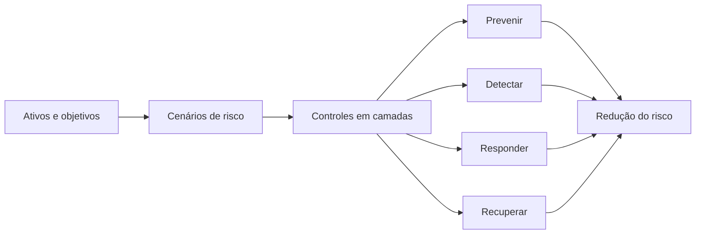
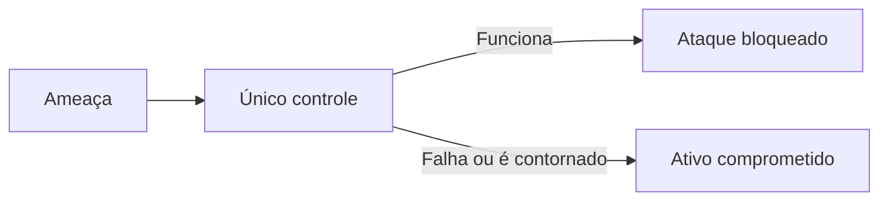
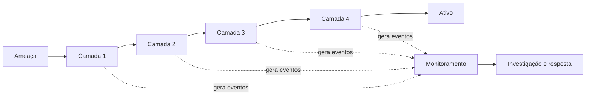
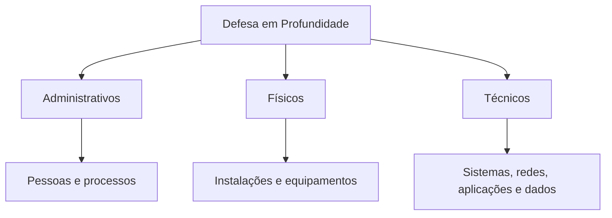
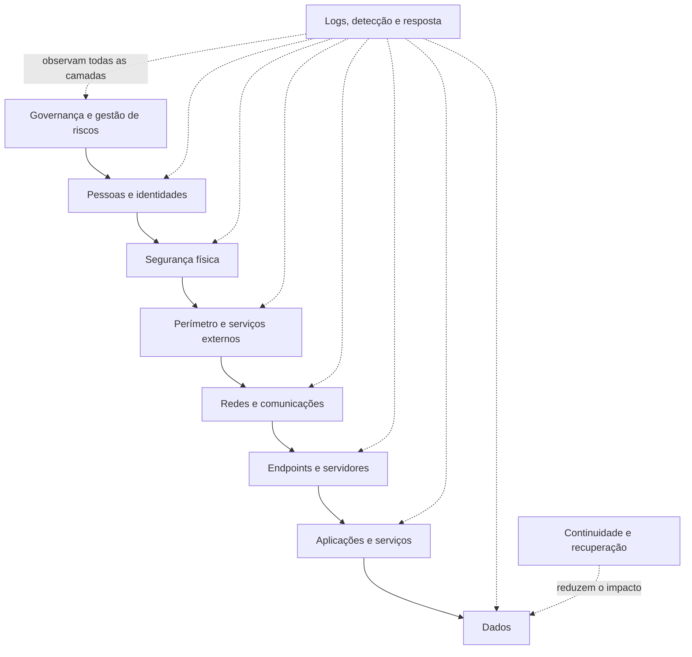
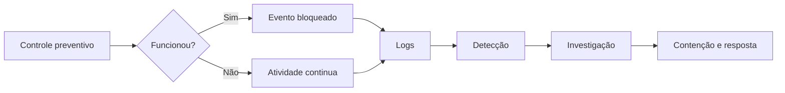

# Capítulo 007 — Defesa em Profundidade

> **Entender antes de decorar.**

---

| Informação | Detalhes |
|---|---|
| **Módulo** | 01 — Fundamentos |
| **Nível** | Iniciante |
| **Tempo estimado** | 20 a 25 minutos |
| **Pré-requisito** | [Capítulo 006 — Riscos](006-riscos.md) |

---

## Objetivo deste capítulo

Ao final deste capítulo, você será capaz de:

- explicar o que é **Defesa em Profundidade**;
- compreender por que nenhum controle de segurança é infalível;
- diferenciar camada, controle, redundância e diversidade de proteção;
- reconhecer controles administrativos, físicos e técnicos;
- relacionar controles preventivos, detectivos, responsivos e de recuperação;
- identificar camadas de proteção em identidades, dispositivos, redes, aplicações e dados;
- compreender a importância de logs, monitoramento e resposta a incidentes;
- analisar se uma arquitetura depende de um único ponto de falha;
- aplicar Defesa em Profundidade a um cenário de risco;
- entender como SOC, Blue Team e Cyber Threat Intelligence apoiam essa estratégia.

---

## Como sempre, vamos começar utilizando nossa imaginação.

Imagine uma casa que guarda documentos importantes, equipamentos e objetos de valor.

Para protegê-la, o proprietário instala uma fechadura resistente na porta principal.

Essa fechadura é um controle de segurança. Ela dificulta a entrada de pessoas não autorizadas.

Mas algumas perguntas continuam abertas:

- O que acontece se a chave for roubada?
- E se alguém entrar por uma janela?
- E se a fechadura apresentar uma falha?
- E se uma pessoa autorizada abusar do acesso?
- Como o proprietário saberá que alguém entrou?
- O que poderá ser feito depois da invasão?

Percebendo que uma única fechadura não resolve todos os problemas, o proprietário adiciona outras medidas:

- muros e portões;
- iluminação externa;
- fechaduras nas janelas;
- câmeras;
- sensores de movimento;
- alarme;
- cofre para os objetos mais importantes;
- cópias dos documentos guardadas em outro local;
- um plano para acionar a polícia e registrar o ocorrido.

Agora, mesmo que uma barreira seja vencida, outras continuam protegendo a casa, detectando a movimentação, limitando o acesso ou ajudando na recuperação.

Essa é a ideia central da **Defesa em Profundidade**:

> **Não depender de uma única proteção, mas combinar diferentes controles em camadas para reduzir a possibilidade e o impacto de um incidente.**

---

## Do risco à proteção

No capítulo anterior, aprendemos que risco envolve um cenário, um ativo, uma ameaça, vulnerabilidades, possibilidade, impacto e controles.

A avaliação de riscos ajuda a responder:

> **Quais cenários realmente importam e precisam ser priorizados?**

A Defesa em Profundidade ajuda a responder outra pergunta:

> **Como proteger esses ativos sem depender de um único controle?**



A estratégia não consiste em adicionar ferramentas aleatoriamente.

Ela começa pela compreensão do risco e utiliza controles complementares para:

- dificultar a ação da ameaça;
- reduzir a superfície de ataque;
- limitar privilégios e movimentação;
- detectar comportamentos anormais;
- interromper atividades maliciosas;
- preservar evidências;
- restaurar serviços e dados;
- aprender com o incidente.

---

## O que é Defesa em Profundidade?

**Defesa em Profundidade**, ou *Defense in Depth*, é uma estratégia de segurança que utiliza múltiplos controles, distribuídos em diferentes camadas, para proteger pessoas, processos, tecnologias e informações.

A lógica é simples:

> **Se um controle falhar, for contornado ou não detectar a atividade, outros controles ainda poderão impedir, limitar, identificar ou responder ao incidente.**

Ela reconhece uma realidade importante:

- pessoas cometem erros;
- senhas podem ser roubadas;
- sistemas podem possuir vulnerabilidades;
- configurações podem estar incorretas;
- ferramentas podem falhar;
- regras de detecção podem não reconhecer uma técnica nova;
- fornecedores podem ser comprometidos;
- usuários autorizados podem abusar de seus acessos;
- ataques podem explorar caminhos inesperados.

Por isso, uma arquitetura segura não deveria depender exclusivamente de:

- um firewall;
- um antivírus;
- uma senha;
- um sistema de backup;
- uma ferramenta de SIEM;
- uma política escrita;
- uma pessoa específica;
- um único fornecedor.

!!! note "A Defesa em Profundidade não promete segurança absoluta"
    A existência de várias camadas não elimina todos os riscos.

    O objetivo é aumentar a dificuldade para o atacante, reduzir oportunidades, melhorar a visibilidade e limitar as consequências caso uma falha aconteça.

---

## O problema do controle único

Imagine uma empresa que acredita estar protegida porque possui um firewall na borda da rede.

Esse controle pode bloquear portas, endereços e conexões indesejadas. Porém, ele não resolve sozinho situações como:

- um funcionário que entrega sua senha em uma página de phishing;
- um notebook infectado fora da rede corporativa;
- uma aplicação vulnerável publicada na internet;
- um usuário interno copiando dados indevidamente;
- uma conta administrativa sem autenticação multifator;
- um malware usando uma conexão HTTPS permitida;
- uma configuração incorreta em um serviço de nuvem;
- um fornecedor autorizado que foi comprometido.

O firewall continua sendo importante, mas ele observa apenas uma parte do problema.

Quando uma organização depende de um único mecanismo, esse controle pode se tornar um **ponto único de falha**.



Com Defesa em Profundidade, o caminho muda:



O atacante pode até vencer uma camada, mas ainda precisará enfrentar as demais sem ser detectado.

---

## Camadas não significam apenas ferramentas

É comum imaginar a Defesa em Profundidade como uma pilha de produtos:

```text
Firewall + antivírus + EDR + SIEM + backup
```

Essas tecnologias podem fazer parte da estratégia, mas a proteção também depende de:

- governança;
- gestão de riscos;
- políticas e procedimentos;
- treinamento;
- definição de responsabilidades;
- gestão de identidades;
- configuração segura;
- atualização de sistemas;
- monitoramento;
- resposta a incidentes;
- testes de recuperação;
- segurança física;
- gestão de fornecedores.

> **Uma ferramenta sem processo, responsável, configuração, monitoramento e revisão pode criar apenas uma falsa sensação de segurança.**

Uma política de backup, por exemplo, não protege a organização se:

- os backups não estiverem sendo executados;
- as cópias puderem ser apagadas pelo mesmo administrador comprometido;
- os dados estiverem corrompidos;
- ninguém souber realizar a restauração;
- os testes nunca tiverem sido feitos.

A Defesa em Profundidade combina **pessoas, processos e tecnologia**.

---

## Três ideias fundamentais

### 1. Sobreposição

Mais de um controle pode atuar sobre o mesmo cenário.

Exemplo: para reduzir o risco de uma conta ser comprometida, a organização pode utilizar:

- treinamento contra phishing;
- filtro de e-mail;
- autenticação multifator;
- bloqueio de autenticações anômalas;
- limitação de privilégios;
- monitoramento de login;
- revogação rápida de sessões.

Se o usuário entregar a senha, o MFA ainda poderá impedir o acesso. Se o MFA for contornado, a análise de risco de login poderá bloquear a tentativa. Se a autenticação acontecer, o menor privilégio poderá limitar o impacto.

### 2. Diversidade

Controles diferentes não deveriam falhar exatamente pelo mesmo motivo.

Dois produtos idênticos, com a mesma configuração incorreta e administrados pela mesma conta, podem possuir a mesma fraqueza.

Diversidade pode envolver:

- controles técnicos e administrativos;
- prevenção e detecção;
- mecanismos locais e centralizados;
- tecnologias diferentes;
- responsáveis distintos;
- cópias de dados em ambientes separados;
- formas independentes de validação.

!!! warning "Diversidade não significa comprar muitas ferramentas"
    Adicionar produtos sem integração, manutenção ou objetivo claro aumenta custo e complexidade.

    O importante é reduzir dependências e cobrir caminhos diferentes do cenário de risco.

### 3. Independência

Uma camada deve continuar oferecendo valor mesmo quando outra for comprometida.

Exemplos:

- o backup não deve depender das mesmas credenciais usadas no ambiente de produção;
- os logs devem ser enviados para um repositório que o invasor do endpoint não consiga apagar facilmente;
- a aprovação de uma mudança crítica pode exigir uma segunda pessoa;
- a conta usada para administrar o servidor não deve ser a mesma utilizada para navegar na internet;
- a rede de gerenciamento pode ser separada da rede de usuários.

Quanto maior a dependência entre os controles, maior a chance de uma única falha afetar várias camadas ao mesmo tempo.

---

## Defesa em Profundidade, redundância e resiliência

Os conceitos se relacionam, mas não são idênticos.

| Conceito | Ideia principal | Exemplo |
|---|---|---|
| **Defesa em Profundidade** | Controles complementares em várias camadas | MFA, menor privilégio, segmentação, EDR e monitoramento |
| **Redundância** | Recursos adicionais para manter uma função | Dois links de internet ou servidores em alta disponibilidade |
| **Resiliência** | Capacidade de continuar, adaptar-se e recuperar-se | Operação alternativa, backups testados e plano de continuidade |

Ter dois firewalls pode aumentar a disponibilidade, mas não necessariamente cria uma defesa completa contra phishing, abuso de privilégios ou vazamento de dados.

Da mesma forma, possuir backups não impede o comprometimento inicial. Eles ajudam principalmente na recuperação e na redução do impacto.

> **Prevenção tenta evitar o incidente. Resiliência ajuda a organização a continuar e se recuperar quando a prevenção não é suficiente.**

---

## Defesa em Profundidade e Zero Trust

Defesa em Profundidade e **Zero Trust** não são conceitos concorrentes.

A Defesa em Profundidade organiza controles em camadas. Zero Trust reforça princípios como:

- não confiar automaticamente por causa da localização na rede;
- verificar explicitamente identidades, dispositivos e contexto;
- aplicar menor privilégio;
- assumir que um comprometimento pode acontecer;
- limitar movimentação e impacto.

Uma organização pode utilizar princípios de Zero Trust dentro de sua estratégia de Defesa em Profundidade.

Exemplo:

```text
Usuário autenticado
        ↓
MFA validado
        ↓
Dispositivo verificado
        ↓
Risco da sessão analisado
        ↓
Acesso mínimo autorizado
        ↓
Atividade monitorada
```

Estar dentro da rede corporativa não deveria significar acesso irrestrito.

---

## Classificando controles de segurança

Os controles podem ser analisados por diferentes perspectivas.

Não existe uma única classificação universal para todos os contextos, mas duas formas são especialmente úteis:

1. pela natureza do controle;
2. pela função desempenhada.

---

## Controles administrativos, físicos e técnicos

### Controles administrativos

São medidas relacionadas à governança, às pessoas e aos processos.

Exemplos:

- políticas de segurança;
- gestão de riscos;
- segregação de funções;
- processo de admissão e desligamento;
- treinamento e conscientização;
- gestão de fornecedores;
- revisão periódica de acessos;
- plano de resposta a incidentes;
- plano de continuidade;
- classificação da informação;
- procedimentos de mudança.

Eles definem como a organização espera que a segurança seja aplicada e quem possui responsabilidade por cada atividade.

### Controles físicos

Protegem pessoas, instalações, equipamentos e meios de armazenamento contra acesso ou dano físico.

Exemplos:

- portas e fechaduras;
- crachás;
- catracas;
- vigilância;
- câmeras;
- alarmes;
- proteção contra incêndio;
- controle de temperatura;
- nobreaks e geradores;
- descarte seguro de mídias;
- áreas restritas.

Uma arquitetura lógica sofisticada não impede que alguém não autorizado retire fisicamente um equipamento desprotegido.

### Controles técnicos

São implementados em sistemas, dispositivos, aplicações e redes.

Exemplos:

- autenticação multifator;
- criptografia;
- firewall;
- segmentação de rede;
- EDR;
- antimalware;
- controle de aplicações;
- filtros de e-mail;
- proteção de APIs;
- gestão de vulnerabilidades;
- logs e SIEM;
- DLP;
- backups protegidos;
- gestão de chaves.

Os três grupos se complementam.



---

## Funções dos controles

Um controle também pode ser classificado de acordo com a função que exerce.

### Dissuasório

Procura desencorajar uma ação.

Exemplos:

- aviso de monitoramento;
- política de uso aceitável;
- presença de vigilância;
- sinalização de área restrita.

### Preventivo

Tenta impedir que o evento aconteça.

Exemplos:

- MFA;
- firewall;
- bloqueio de macros;
- menor privilégio;
- correção de vulnerabilidades;
- criptografia de dispositivo;
- controle de aplicações.

### Detectivo

Identifica que algo aconteceu ou está acontecendo.

Exemplos:

- logs;
- EDR;
- SIEM;
- alertas de autenticação;
- IDS;
- câmera;
- verificação de integridade.

### Responsivo

Ajuda a conter ou interromper uma atividade.

Exemplos:

- isolamento de endpoint;
- bloqueio de conta;
- revogação de sessão;
- bloqueio de indicador;
- remoção de artefato malicioso;
- acionamento do plano de resposta.

### Corretivo

Corrige a condição que permitiu ou agravou o evento.

Exemplos:

- aplicação de patch;
- alteração de configuração;
- redefinição de credenciais;
- remoção de permissões excessivas;
- correção de regra de firewall.

### Recuperativo

Restaura dados, serviços ou capacidades.

Exemplos:

- restauração de backup;
- reconstrução de servidor;
- ativação de ambiente alternativo;
- recuperação de desastre;
- retorno controlado à operação.

!!! note "Um controle pode exercer mais de uma função"
    Um EDR pode detectar uma execução suspeita, bloquear o processo e fornecer dados para investigação.

    Uma classificação ajuda a organizar o raciocínio, mas não limita o controle a uma única função.

---

## Um modelo didático de camadas

Não existe um número obrigatório ou uma divisão universal de camadas.

Cada organização deve construir sua arquitetura de acordo com seus ativos, riscos, tecnologias, obrigações e recursos.

Para fins didáticos, podemos visualizar as seguintes áreas:



Essas camadas não funcionam como paredes completamente separadas. Elas se cruzam e compartilham dependências.

---

## 1. Governança e gestão de riscos

Essa camada orienta todas as outras.

Ela inclui:

- objetivos de segurança;
- papéis e responsabilidades;
- políticas;
- gestão de riscos;
- inventário de ativos;
- classificação da informação;
- requisitos legais e contratuais;
- orçamento e prioridades;
- métricas;
- auditoria;
- gestão de terceiros.

Sem governança, a organização pode investir muito em controles que não protegem seus riscos mais importantes.

Exemplo:

Uma empresa pode possuir diversas ferramentas de segurança, mas não saber:

- quais sistemas são críticos;
- quem é responsável por eles;
- quais dados armazenam;
- quais logs deveriam gerar;
- quanto tempo de indisponibilidade é aceitável;
- qual incidente precisa ser comunicado.

A Defesa em Profundidade começa com contexto, e não com a compra de produtos.

---

## 2. Pessoas e identidades

Identidades conectam pessoas, dispositivos, serviços e aplicações aos recursos da organização.

Controles importantes incluem:

- autenticação multifator;
- senhas resistentes e gestão segura de credenciais;
- menor privilégio;
- RBAC;
- segregação de funções;
- contas administrativas separadas;
- gestão de contas de serviço;
- revisão de acessos;
- processo de entrada, mudança e desligamento;
- acesso temporário e sob demanda;
- análise de risco de autenticação;
- conscientização contra engenharia social.

Pergunta importante:

> **Se uma senha for roubada, quais controles ainda impedem ou limitam o acesso?**

Uma estratégia fraca pode possuir apenas senha. Uma estratégia em profundidade pode exigir MFA, dispositivo confiável, localização compatível, acesso mínimo e monitoramento contínuo.

---

## 3. Segurança física

A segurança cibernética também depende do mundo físico.

Essa camada protege:

- escritórios;
- datacenters;
- salas técnicas;
- estações de trabalho;
- dispositivos móveis;
- mídias de armazenamento;
- energia;
- climatização;
- cabeamento;
- pessoas.

Controles possíveis:

- acesso por crachá;
- registro de visitantes;
- áreas restritas;
- vigilância;
- racks trancados;
- proteção contra incêndio;
- sensores ambientais;
- descarte seguro;
- criptografia de disco;
- bloqueio automático de tela.

A criptografia de disco, por exemplo, reduz o risco de exposição de dados quando um notebook é perdido ou roubado.

---

## 4. Perímetro e serviços externos

Essa camada trata os pontos expostos a redes externas e à internet.

Exemplos:

- firewalls;
- proxies;
- gateways de e-mail;
- WAF;
- proteção contra DDoS;
- filtros de DNS;
- gateways de acesso remoto;
- segurança de APIs;
- proteção de serviços em nuvem;
- redução de serviços publicados;
- gestão de certificados.

O conceito moderno de perímetro é mais amplo do que a borda física da empresa.

Uma organização pode possuir:

- usuários remotos;
- aplicações SaaS;
- infraestrutura em várias nuvens;
- dispositivos móveis;
- fornecedores conectados;
- APIs públicas.

Por isso, o perímetro não deve ser tratado como a única camada de confiança.

---

## 5. Redes e comunicações

Essa camada controla como sistemas e usuários se comunicam.

Controles incluem:

- segmentação;
- microsegmentação;
- VLANs;
- regras de firewall interno;
- controle de acesso à rede;
- VPN ou acesso baseado em identidade;
- criptografia em trânsito;
- IDS e IPS;
- monitoramento de tráfego;
- filtragem de saída;
- redes administrativas separadas;
- limitação da comunicação entre ambientes.

A segmentação procura impedir que o comprometimento de um dispositivo permita acesso direto a toda a organização.

Exemplo:

```text
Notebook de usuário comprometido
        ↓
Não possui acesso direto ao banco de dados
        ↓
Precisa passar pela aplicação autorizada
        ↓
A comunicação é registrada e controlada
```

> **Uma rede plana transforma um comprometimento local em uma oportunidade de movimentação ampla.**

---

## 6. Endpoints e servidores

Endpoints e servidores executam processos, armazenam credenciais e acessam dados.

Controles comuns:

- configuração segura;
- correção de vulnerabilidades;
- EDR;
- antimalware;
- firewall local;
- criptografia de disco;
- controle de aplicações;
- remoção de serviços desnecessários;
- bloqueio de macros e scripts não autorizados;
- gestão de dispositivos;
- proteção de credenciais;
- logs de segurança;
- inventário de software;
- restrição de dispositivos removíveis.

No laboratório que construímos, por exemplo:

- o **Sysmon** aumenta a visibilidade sobre eventos do Windows;
- o **Elastic Defend** coleta telemetria e pode apoiar detecção e resposta;
- o **Elastic Agent** envia dados para análise centralizada;
- o **Elastic Security** permite pesquisar, correlacionar e investigar eventos.

Esses componentes não substituem atualização, menor privilégio, segmentação ou backups. Eles fazem parte de uma camada maior.

---

## 7. Aplicações e serviços

Aplicações precisam ser protegidas durante desenvolvimento, implantação e operação.

Controles possíveis:

- desenvolvimento seguro;
- revisão de código;
- testes de segurança;
- gestão de dependências;
- autenticação e autorização adequadas;
- validação de entradas;
- gestão segura de sessões;
- proteção de segredos;
- rate limiting;
- logs de aplicação;
- correção de vulnerabilidades;
- segregação entre desenvolvimento, teste e produção;
- revisão de APIs;
- configuração segura de serviços.

Um WAF pode bloquear algumas tentativas, mas não corrige uma falha de autorização dentro da aplicação.

Por isso, a aplicação precisa possuir controles próprios, mesmo quando está atrás de outras camadas.

---

## 8. Dados

Os dados são frequentemente o ativo que todas as outras camadas procuram proteger.

Controles incluem:

- classificação da informação;
- controle de acesso;
- criptografia em trânsito e em repouso;
- gestão de chaves;
- mascaramento;
- tokenização;
- prevenção contra perda de dados;
- retenção e descarte;
- integridade;
- trilhas de auditoria;
- cópias de segurança;
- separação de ambientes;
- minimização da coleta.

Perguntas importantes:

- Quem pode acessar os dados?
- Qual justificativa existe para esse acesso?
- O acesso é registrado?
- Os dados precisam realmente ser armazenados?
- Por quanto tempo devem ser mantidos?
- Uma conta comprometida consegue acessar tudo?
- Existe cópia segura e testada?

> **Quanto menos dados desnecessários forem armazenados, menor será o impacto potencial de uma exposição.**

---

## 9. Logs, detecção e resposta

As camadas preventivas são importantes, mas não conseguem bloquear tudo.

A organização precisa observar o ambiente e reconhecer sinais de falha ou comprometimento.

Essa capacidade depende de:

- fontes de logs adequadas;
- sincronização de horário;
- coleta centralizada;
- retenção;
- normalização;
- regras de detecção;
- contexto sobre ativos e identidades;
- investigação;
- procedimentos de resposta;
- analistas capacitados;
- exercícios e melhoria contínua.

Um controle sem visibilidade pode falhar silenciosamente.

Exemplos de perguntas que o monitoramento deve ajudar a responder:

- Quem executou o processo?
- Em qual dispositivo?
- Qual era a linha de comando?
- Qual foi o processo pai?
- Houve conexão de rede?
- Qual conta foi utilizada?
- O comportamento ocorreu em outros hosts?
- O controle bloqueou ou apenas registrou?
- Quais ativos foram afetados?



---

## 10. Continuidade e recuperação

A Defesa em Profundidade também considera o que acontece depois de uma falha.

Controles incluem:

- backups;
- cópias offline ou imutáveis;
- testes de restauração;
- redundância de serviços;
- alta disponibilidade;
- plano de continuidade;
- recuperação de desastre;
- comunicação de crise;
- procedimentos manuais alternativos;
- priorização de serviços críticos;
- definição de RTO e RPO;
- exercícios periódicos.

!!! warning "Backup não é sinônimo de recuperação"
    Uma cópia somente possui valor quando pode ser localizada, acessada e restaurada dentro da necessidade da organização.

    O processo precisa ser testado antes do incidente.

---

## Pense como um atacante

Uma forma de avaliar as camadas é imaginar o caminho que uma ameaça precisaria percorrer.

Exemplo de ataque por phishing:


Agora associe controles a cada etapa:

| Etapa | Possíveis controles |
|---|---|
| **Entrega do e-mail** | Filtro de e-mail, reputação, sandbox, bloqueio de anexos |
| **Interação do usuário** | Treinamento, avisos, proteção do navegador, filtro DNS |
| **Roubo da senha** | Gerenciador de senhas, autenticação resistente a phishing |
| **Tentativa de login** | MFA, acesso condicional, análise de risco, bloqueio geográfico contextual |
| **Uso da conta** | Menor privilégio, revisão de permissões, sessão limitada |
| **Acesso ao recurso** | Segmentação, autorização, dispositivo confiável |
| **Coleta de dados** | DLP, limitação de consultas, monitoramento de comportamento |
| **Exfiltração** | Filtro de saída, proxy, alertas de volume, resposta automática |

A estratégia não pressupõe que o filtro de e-mail bloqueará todas as mensagens.

Ela pergunta:

> **Quais controles ainda existem se a mensagem chegar, o usuário clicar e a credencial for roubada?**

---

## O modelo do queijo suíço

Uma forma conhecida de visualizar falhas em camadas é imaginar várias fatias de queijo suíço.

Cada fatia representa uma barreira. Os buracos representam fraquezas, limitações ou falhas.

Em condições normais, os buracos não ficam completamente alinhados. Uma camada compensa a deficiência da outra.

Um incidente grave pode ocorrer quando várias falhas se alinham:

```text
Phishing não bloqueado
        +
Usuário sem treinamento
        +
Ausência de MFA
        +
Privilégios excessivos
        +
Rede sem segmentação
        +
Logs não monitorados
        =
Comprometimento com grande impacto
```

O objetivo não é encontrar uma camada perfeita, mas impedir que todas as falhas se alinhem sem resistência ou detecção.

---

## Cenário prático — Portal administrativo

Vamos retomar o portal administrativo estudado no capítulo de riscos.

A empresa possui uma plataforma na internet para gerenciar:

- pedidos;
- preços;
- estoque;
- dados de clientes;
- usuários internos.

O risco identificado foi o comprometimento de uma conta administrativa e o uso indevido do portal.

### Proteção baseada em um único controle

A empresa decide apenas exigir uma senha complexa.

Problemas possíveis:

- a senha pode ser roubada por phishing;
- pode ser reutilizada em outro serviço;
- pode ser registrada por malware;
- pode ser compartilhada;
- pode permanecer ativa após o desligamento do usuário;
- pode conceder privilégios excessivos.

### Proteção em profundidade

| Camada | Controle | Função principal |
|---|---|---|
| **Governança** | Responsável definido e revisão periódica | Administrativa |
| **Identidade** | MFA e acesso condicional | Preventiva |
| **Privilégios** | Perfis separados e menor privilégio | Preventiva |
| **Aplicação** | Autorização por função e validações | Preventiva |
| **Rede** | Acesso administrativo restrito | Preventiva |
| **Dados** | Limitação de exportação e mascaramento | Preventiva |
| **Monitoramento** | Alertas de login e alterações críticas | Detectiva |
| **Resposta** | Revogação de sessão e bloqueio de conta | Responsiva |
| **Recuperação** | Histórico de alterações e restauração | Recuperativa |

### Simulação do incidente

1. O usuário entrega sua senha em uma página falsa.
2. O atacante tenta autenticar-se.
3. O MFA dificulta o acesso.
4. O sistema identifica localização e dispositivo incomuns.
5. A tentativa gera um alerta.
6. O SOC investiga o evento.
7. A sessão é bloqueada e a senha é redefinida.
8. Os registros são preservados para análise.

Se o atacante conseguir contornar o MFA, o menor privilégio, as validações da aplicação, o monitoramento e a resposta ainda podem limitar o impacto.

> **A eficácia está na combinação das camadas, e não na confiança absoluta em uma delas.**

---

## Como construir uma estratégia de Defesa em Profundidade

### 1. Identifique o que precisa ser protegido

Comece pelos ativos, processos e informações importantes.

Pergunte:

- O que é essencial para a operação?
- Quais dados possuem maior sensibilidade?
- Quais sistemas sustentam receita, atendimento ou obrigações?
- Quais dependências externas existem?

### 2. Descreva os cenários de risco

Evite pensar apenas em ferramentas.

Descreva:

- quem ou o que pode causar dano;
- qual caminho pode ser utilizado;
- quais vulnerabilidades ou exposições existem;
- quais consequências são possíveis.

### 3. Mapeie os controles existentes

Registre:

- onde o controle está aplicado;
- qual risco procura reduzir;
- quem é responsável;
- como sua eficácia é verificada;
- quais logs produz;
- o que acontece quando falha.

### 4. Procure pontos únicos de falha

Perguntas úteis:

- Uma única conta administra todas as camadas?
- Um único servidor armazena produção e backup?
- A mesma credencial protege sistemas diferentes?
- O invasor do endpoint consegue apagar os logs centrais?
- A falha de um fornecedor interrompe todo o processo?
- Existe apenas uma pessoa capaz de restaurar o ambiente?

### 5. Combine prevenção, detecção, resposta e recuperação

Não concentre todo o investimento em prevenção.

Um cenário deve possuir, quando aplicável:

- barreiras para dificultar a ocorrência;
- sinais para reconhecer a atividade;
- procedimentos para interrompê-la;
- meios para restaurar a operação.

### 6. Valide a independência das camadas

Verifique se uma falha compromete várias proteções ao mesmo tempo.

Exemplo:

Se a conta administrativa do domínio também gerencia o backup, um invasor com essa credencial pode comprometer produção e recuperação.

### 7. Teste

Controles precisam ser testados.

Exemplos:

- simulações de phishing;
- testes de restauração;
- exercícios de resposta;
- revisão de regras de firewall;
- validação de alertas;
- testes de segmentação;
- purple teaming;
- auditorias de permissões;
- análise de caminhos de ataque.

### 8. Revise continuamente

A arquitetura muda quando surgem:

- novos sistemas;
- novos fornecedores;
- novas ameaças;
- novas vulnerabilidades;
- mudanças de negócio;
- fusões e aquisições;
- trabalho remoto;
- serviços em nuvem;
- alterações regulatórias;
- incidentes e lições aprendidas.

---

## Como avaliar a eficácia das camadas

Ter um controle registrado não significa que ele funciona.

A avaliação pode observar:

### Cobertura

O controle está aplicado a todos os ativos necessários?

Exemplo: o EDR protege 100% dos servidores críticos ou apenas parte deles?

### Configuração

As políticas estão ajustadas ao risco ou utilizam apenas o padrão?

### Operação

O controle está ativo, atualizado e saudável?

### Visibilidade

Ele gera logs suficientes para investigação?

### Detecção

As atividades relevantes produzem alertas úteis?

### Resposta

Existe um procedimento claro quando o controle identifica um problema?

### Tempo

Quanto tempo a equipe leva para detectar, investigar, conter e recuperar?

### Independência

O comprometimento de uma camada afeta as demais?

### Testes

Existe evidência recente de que o controle foi validado?

| Pergunta | Evidência possível |
|---|---|
| O MFA está aplicado? | Relatório de cobertura |
| O backup funciona? | Teste de restauração |
| A segmentação bloqueia o caminho? | Teste de conectividade |
| O EDR detecta a técnica? | Simulação controlada |
| O alerta é investigado? | Caso registrado no SOC |
| A conta desligada perdeu acesso? | Auditoria do processo de offboarding |

> **Controle eficaz é aquele que está implementado, funcionando, monitorado e adequado ao risco.**

---

## Como um SOC participa da Defesa em Profundidade

O SOC é uma camada importante, mas não deve ser a única responsável pela segurança.

Ele apoia a estratégia por meio de:

- coleta de telemetria;
- monitoramento;
- detecção;
- triagem de alertas;
- investigação;
- contenção;
- coordenação de resposta;
- preservação de evidências;
- produção de métricas;
- identificação de falhas de cobertura;
- melhoria de regras e processos.

### Exemplo no laboratório

Em nosso laboratório:

```text
Windows 10 VM
      ↓
Sysmon + Elastic Defend
      ↓
Elastic Agent
      ↓
Elastic Cloud / Fleet
      ↓
Elasticsearch + Kibana + Elastic Security
      ↓
Pesquisa, detecção e investigação
```

O Sysmon e o Elastic Defend aumentam a visibilidade sobre atividades no endpoint.

Porém, eles não substituem:

- patching;
- configuração segura;
- menor privilégio;
- segmentação;
- controle de acesso;
- backups;
- treinamento;
- resposta a incidentes.

O laboratório representa principalmente as camadas de **endpoint, telemetria, detecção e investigação**.

Essa percepção é importante: um SOC observa e responde, mas depende de controles implementados em toda a organização.

---

## Aplicação em Cyber Threat Intelligence

A Cyber Threat Intelligence ajuda a adaptar as camadas às ameaças relevantes para a organização.

Ela pode responder:

- quais grupos atacam o setor;
- quais objetivos possuem;
- quais técnicas utilizam;
- quais identidades e ativos procuram;
- quais controles costumam contornar;
- quais vulnerabilidades exploram;
- quais sinais podem ser observados;
- quais medidas dificultam sua atuação.

Exemplo:

Se a inteligência indica que grupos de ransomware estão:

- explorando serviços de acesso remoto;
- roubando credenciais;
- desativando ferramentas de segurança;
- apagando backups acessíveis pelo domínio;
- movimentando-se por protocolos administrativos;

então a organização pode revisar suas camadas:

| Comportamento observado | Revisão de defesa |
|---|---|
| Exploração de acesso remoto | Correção, redução de exposição, MFA e monitoramento |
| Roubo de credenciais | Proteção de identidade, credenciais administrativas separadas |
| Desativação de segurança | Proteção contra adulteração e alertas de integridade |
| Exclusão de backups | Cópias imutáveis e credenciais independentes |
| Movimentação lateral | Segmentação, restrição de protocolos e detecção |

!!! note "Inteligência orienta prioridades"
    CTI não substitui a gestão de riscos.

    Ela adiciona contexto sobre ameaças reais para que a organização fortaleça as camadas mais relevantes.

---

## Perguntas para analisar uma arquitetura

Ao observar um ambiente, pergunte:

1. **Qual ativo ou processo está sendo protegido?**
2. **Quais cenários de risco são prioritários?**
3. **Quais controles tentam prevenir o cenário?**
4. **O que acontece se a prevenção falhar?**
5. **Quais eventos permitem detectar a atividade?**
6. **Quem monitora esses eventos?**
7. **Como a atividade pode ser contida?**
8. **Como o serviço e os dados serão recuperados?**
9. **As camadas dependem da mesma conta, sistema ou fornecedor?**
10. **Existe menor privilégio e segmentação?**
11. **Os controles estão implementados em todos os ativos necessários?**
12. **Existe evidência de que funcionam?**
13. **Quando foram testados pela última vez?**
14. **Quais riscos permanecem depois dos controles?**
15. **Quem é responsável por aceitar ou tratar esse risco residual?**

---

## Exercício prático

Imagine uma pequena empresa que utiliza:

- e-mail em nuvem;
- notebooks Windows;
- sistema de vendas acessível pela internet;
- armazenamento de arquivos compartilhados;
- uma conta administrativa usada por toda a equipe de TI;
- backup conectado permanentemente à rede;
- antivírus padrão;
- nenhum monitoramento centralizado.

Analise o cenário e responda:

??? question "1. Quais pontos únicos de falha podem ser identificados?"
    A conta administrativa compartilhada, o backup conectado ao mesmo ambiente, a dependência exclusiva do antivírus e a ausência de monitoramento centralizado são exemplos importantes.

??? question "2. Quais controles poderiam fortalecer a camada de identidade?"
    Contas individuais, MFA, menor privilégio, contas administrativas separadas, revisão de acessos e remoção rápida de contas antigas.

??? question "3. Como proteger melhor o backup?"
    Utilizar credenciais independentes, cópias offline ou imutáveis, separação do ambiente, retenção adequada e testes periódicos de restauração.

??? question "4. O antivírus sozinho representa Defesa em Profundidade?"
    Não. Ele cobre apenas parte do risco de endpoint e precisa ser combinado com configuração segura, atualizações, controle de aplicações, logs, EDR, segmentação e resposta.

??? question "5. Qual seria o papel de um SIEM?"
    Centralizar e correlacionar eventos, apoiar detecções e facilitar investigações. Ele não substitui os controles preventivos nem a resposta humana.

??? question "6. Quais controles ajudariam caso uma senha fosse roubada?"
    MFA, acesso condicional, dispositivo confiável, menor privilégio, alertas de login, limitação de sessão e revogação rápida.

??? question "7. Qual camada reduz o impacto de ransomware depois do comprometimento?"
    Segmentação, menor privilégio, controle de aplicações, EDR, resposta rápida e backups protegidos e testados podem limitar o impacto.

??? question "8. Como validar se a estratégia funciona?"
    Por meio de testes de restauração, simulações controladas, auditoria de acessos, validação de alertas, testes de segmentação e exercícios de resposta.

---

## Erros comuns

### “Tenho firewall e antivírus, então possuo Defesa em Profundidade”

Não necessariamente. Esses controles cobrem apenas partes do ambiente e podem compartilhar lacunas.

### “Quanto mais ferramentas, maior a segurança”

Ferramentas sem integração, configuração, responsáveis e manutenção podem aumentar complexidade sem reduzir o risco.

### “Duas ferramentas iguais resolvem o problema”

Elas podem oferecer redundância, mas também podem falhar pela mesma causa.

### “A rede interna é confiável”

Dispositivos, identidades e fornecedores internos também podem ser comprometidos ou abusados.

### “MFA impede qualquer invasão de conta”

MFA reduz muito o risco, mas ainda pode ser afetado por engenharia social, roubo de sessão, configurações fracas ou métodos inadequados.

### “Backup impede ransomware”

Backup não impede a infecção. Ele ajuda a reduzir o impacto e recuperar a operação, desde que esteja protegido e testado.

### “O SIEM protege o ambiente”

O SIEM centraliza e analisa dados. Sua eficácia depende de fontes adequadas, regras úteis, contexto e capacidade de resposta.

### “O EDR substitui atualização e configuração segura”

O EDR adiciona prevenção, detecção e resposta, mas não elimina a necessidade de reduzir vulnerabilidades e superfície de ataque.

### “Todas as camadas precisam ser perfeitas”

Nenhuma camada é perfeita. A estratégia existe justamente porque falhas são possíveis.

### “Defesa em Profundidade é aplicar todos os controles em todos os lugares”

Não. Os controles devem ser proporcionais ao risco, ao valor do ativo e ao contexto da organização.

### “Se não houve incidente, os controles funcionam”

A ausência de incidentes conhecidos não comprova eficácia. Pode haver falha de detecção ou simplesmente ausência de tentativa.

---

## Resumo

A **Defesa em Profundidade** é uma estratégia que combina diferentes controles em camadas para reduzir a possibilidade e o impacto de incidentes.

Ela parte do princípio de que:

- nenhum controle é infalível;
- pessoas, processos e tecnologias podem falhar;
- um ataque pode contornar uma barreira;
- prevenção sozinha não é suficiente;
- detecção, resposta e recuperação também são necessárias;
- controles precisam ser testados e revisados;
- as camadas devem reduzir pontos únicos de falha;
- a proteção deve ser proporcional aos riscos.

Lembre-se:

- **sobreposição:** mais de um controle atua sobre o cenário;
- **diversidade:** controles diferentes reduzem falhas comuns;
- **independência:** uma camada continua útil quando outra é comprometida;
- **prevenção:** dificulta ou impede o evento;
- **detecção:** identifica a atividade;
- **resposta:** contém e interrompe;
- **recuperação:** restaura serviços e dados;
- **resiliência:** permite continuar e adaptar-se diante da falha.

> **Uma boa defesa não pergunta apenas como impedir um ataque. Ela também pergunta como detectá-lo, limitá-lo e recuperar-se quando alguma barreira falhar.**

---

## Checkpoint

Antes de seguir para o próximo capítulo, confirme se você consegue responder:

- [ ] O que é Defesa em Profundidade?
- [ ] Por que um único controle pode se tornar um ponto de falha?
- [ ] Qual é a diferença entre sobreposição, diversidade e independência?
- [ ] Por que Defesa em Profundidade não significa apenas adicionar ferramentas?
- [ ] Qual é a diferença entre controles administrativos, físicos e técnicos?
- [ ] Quais funções podem ser exercidas pelos controles?
- [ ] Por que prevenção, detecção, resposta e recuperação precisam trabalhar juntas?
- [ ] Como a segmentação limita o impacto de um comprometimento?
- [ ] Por que logs centralizados representam uma camada importante?
- [ ] Como backups devem ser protegidos de forma independente?
- [ ] Qual é o papel do SOC nessa estratégia?
- [ ] Como CTI ajuda a priorizar as camadas?
- [ ] Como verificar se um controle realmente funciona?
- [ ] Qual é a relação entre Defesa em Profundidade e risco residual?

---

## Glossário

| Termo | Definição |
|---|---|
| **Camada** | Área de proteção que reúne um ou mais controles relacionados. |
| **Controle administrativo** | Medida baseada em governança, pessoas, políticas ou processos. |
| **Controle corretivo** | Medida que corrige uma condição que permitiu ou agravou o evento. |
| **Controle detectivo** | Medida que identifica uma atividade ou condição relevante. |
| **Controle dissuasório** | Medida que procura desencorajar determinada ação. |
| **Controle físico** | Medida que protege instalações, pessoas, equipamentos e mídias. |
| **Controle preventivo** | Medida que tenta impedir que um evento aconteça. |
| **Controle recuperativo** | Medida que restaura dados, serviços ou capacidades. |
| **Controle responsivo** | Medida utilizada para conter ou interromper uma atividade. |
| **Controle técnico** | Medida implementada em sistemas, redes, aplicações ou dispositivos. |
| **Defesa em Profundidade** | Estratégia que combina controles complementares em várias camadas. |
| **Diversidade** | Uso de controles diferentes para reduzir falhas comuns. |
| **Independência** | Capacidade de uma camada continuar útil quando outra falha. |
| **Ponto único de falha** | Componente cuja falha compromete uma função essencial. |
| **Redundância** | Existência de recursos adicionais para manter uma função. |
| **Resiliência** | Capacidade de resistir, continuar, adaptar-se e recuperar-se. |
| **Sobreposição** | Aplicação de mais de um controle sobre o mesmo cenário. |
| **Zero Trust** | Abordagem que evita confiança implícita e exige verificação contínua e acesso mínimo. |

---

## Referências

- [NIST Cybersecurity Framework 2.0](https://www.nist.gov/cyberframework)
- [NIST SP 800-53 Rev. 5 — Security and Privacy Controls](https://csrc.nist.gov/pubs/sp/800/53/r5/upd1/final)
- [NIST SP 800-160 Vol. 1 Rev. 1 — Engineering Trustworthy Secure Systems](https://csrc.nist.gov/pubs/sp/800/160/v1/r1/final)
- [CISA — Zero Trust Maturity Model](https://www.cisa.gov/resources-tools/resources/zero-trust-maturity-model)
- [CIS Critical Security Controls v8](https://www.cisecurity.org/controls/v8)
- [Microsoft Learn — What is defense in depth?](https://learn.microsoft.com/en-us/azure/security/fundamentals/defense-in-depth)

---

## Próximo capítulo

No próximo capítulo, vamos estudar **Controles de Segurança** com mais profundidade e entender como eles podem ser selecionados, classificados, implementados, testados e acompanhados de acordo com os riscos da organização.

[← Capítulo anterior: Riscos](006-riscos.md){ .md-button }

<!-- Quando o Capítulo 008 for criado, remova este comentário e ative o botão abaixo.
[Próximo: Controles de Segurança →](008-controles-de-seguranca.md){ .md-button .md-button--primary }
-->
