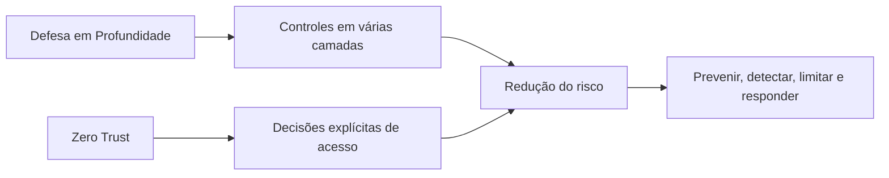
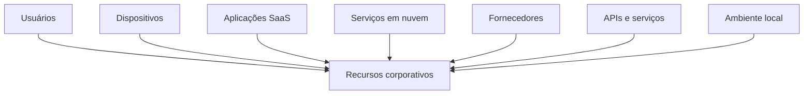
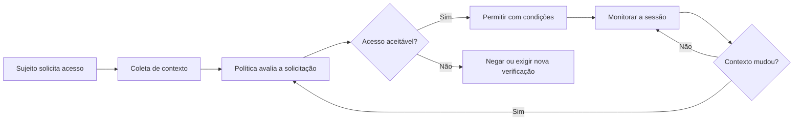
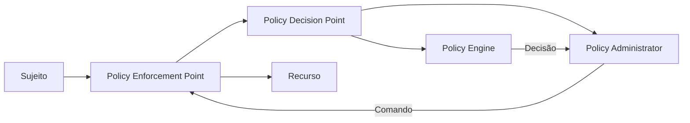
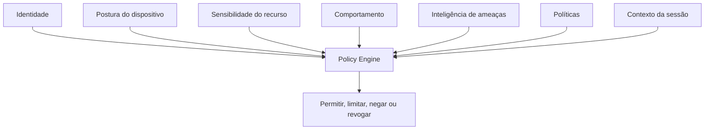
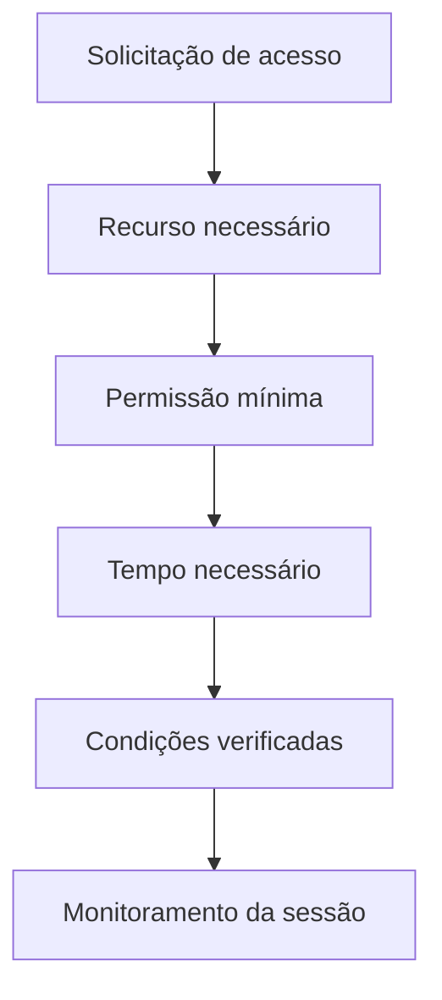
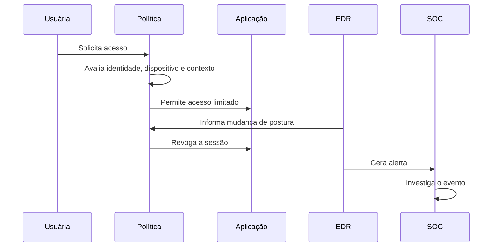
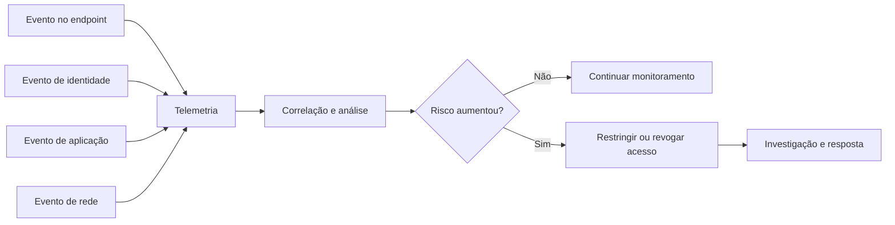

# Capítulo 008 — Zero Trust

> **Entender antes de decorar.**

---

| Informação | Detalhes |
|---|---|
| **Módulo** | 01 — Fundamentos |
| **Nível** | Iniciante |
| **Tempo estimado** | 25 a 30 minutos |
| **Pré-requisito** | [Capítulo 007 — Defesa em Profundidade](007-defesa-em-profundidade.md) |

---

## Objetivo deste capítulo

Ao final deste capítulo, você será capaz de:

- explicar o que é **Zero Trust**;
- compreender por que a localização na rede não deve gerar confiança automática;
- diferenciar Zero Trust de produto, ferramenta, VPN ou simples uso de MFA;
- entender os princípios de verificação explícita, menor privilégio e limitação de impacto;
- reconhecer a importância de identidades, dispositivos, aplicações, redes e dados;
- compreender como decisões de acesso podem considerar contexto e risco;
- identificar as funções de **Policy Engine, Policy Administrator e Policy Enforcement Point**;
- relacionar Zero Trust à Defesa em Profundidade;
- compreender o papel de logs, telemetria, SOC e Cyber Threat Intelligence;
- analisar um cenário de acesso utilizando princípios de Zero Trust;
- reconhecer que a adoção de Zero Trust é uma jornada gradual, e não uma mudança instantânea.

---

## Bora imaginar?

Imagine uma empresa instalada em um grande prédio.

Na entrada existe uma recepção. Para entrar, uma pessoa precisa apresentar seu crachá.

Depois que o crachá é validado, ela consegue acessar o edifício.

Em um modelo baseado principalmente na confiança do perímetro, a lógica poderia ser:

```text
Passou pela entrada
        ↓
Está dentro do prédio
        ↓
É considerado confiável
        ↓
Pode circular por várias áreas
```

Mas o fato de alguém ter entrado no prédio não responde a perguntas importantes:

- O crachá pertence realmente àquela pessoa?
- O crachá foi roubado?
- A pessoa ainda trabalha na empresa?
- Ela precisa entrar na sala financeira?
- O acesso está acontecendo em um horário normal?
- Existe uma justificativa para abrir o cofre?
- A pessoa pode retirar documentos?
- O acesso está sendo registrado?
- O comportamento continua compatível com sua função?

Agora imagine outro modelo.

A entrada no prédio continua sendo controlada, mas cada área sensível possui suas próprias regras.

Para acessar a sala financeira, por exemplo, o sistema verifica:

- a identidade da pessoa;
- a validade do crachá;
- sua função;
- o horário;
- a necessidade daquele acesso;
- a área que está sendo solicitada;
- o histórico recente;
- a existência de alguma condição de risco.

Mesmo depois da entrada, o acesso pode ser limitado, monitorado ou encerrado se o contexto mudar.

Essa é a ideia central de **Zero Trust**:

> **Nenhuma identidade, dispositivo ou conexão recebe confiança automática apenas porque está dentro da rede, pertence à empresa ou já foi autenticada anteriormente.**

---

## Da Defesa em Profundidade ao Zero Trust

No capítulo anterior, aprendemos que a Segurança da Informação não deve depender de uma única barreira.

A Defesa em Profundidade combina controles em diferentes camadas para:

- prevenir;
- detectar;
- responder;
- recuperar;
- reduzir pontos únicos de falha.

Zero Trust não substitui essa estratégia.

Ele adiciona uma pergunta importante a cada tentativa de acesso:

> **Com base nas evidências disponíveis neste momento, este sujeito deveria acessar este recurso, desta forma e durante esta sessão?**

A Defesa em Profundidade ajuda a organizar diferentes camadas de proteção.

Zero Trust orienta como a confiança e o acesso devem ser avaliados entre:

- pessoas;
- dispositivos;
- aplicações;
- serviços;
- redes;
- dados;
- cargas de trabalho.



---

## O que é Zero Trust?

**Zero Trust** é um conjunto de princípios de segurança utilizado para planejar arquiteturas e fluxos de acesso sem conceder confiança implícita com base apenas na localização da rede, na propriedade do dispositivo ou na existência de uma autenticação anterior.

Em uma arquitetura tradicional, era comum existir uma separação simplificada:

```text
Fora da rede = não confiável
Dentro da rede = confiável
```

Zero Trust questiona essa divisão.

Uma identidade dentro da rede pode estar comprometida.

Um notebook corporativo pode estar infectado.

Um servidor pode ter sido explorado.

Uma conta administrativa legítima pode estar sendo utilizada por um atacante.

Um fornecedor autorizado pode ter sofrido um incidente.

Por isso, o foco deixa de ser apenas proteger a borda e passa a ser proteger **cada recurso e cada acesso**.

> **A rede informa parte do contexto, mas não deve ser utilizada como prova suficiente de confiança.**

 "Zero Trust não significa confiança igual a zero"
    O objetivo não é impedir todas as pessoas de trabalhar nem tratar qualquer ação como maliciosa.

    O objetivo é remover a confiança automática e substituí-la por decisões de acesso baseadas em políticas, evidências e contexto.

---

## “Nunca confie, sempre verifique”

A frase **“never trust, always verify”** é frequentemente utilizada para resumir Zero Trust.

Ela é útil, mas pode gerar interpretações erradas.

“Verificar” não significa apenas solicitar uma senha.

Uma decisão pode considerar:

- identidade;
- método de autenticação;
- dispositivo;
- integridade do endpoint;
- localização;
- horário;
- comportamento;
- sensibilidade do recurso;
- privilégio solicitado;
- risco da sessão;
- informações sobre ameaças;
- políticas da organização.

Também não significa necessariamente pedir MFA a cada clique.

A política pode permitir uma sessão sob determinadas condições e reavaliá-la quando:

- o dispositivo muda de postura;
- o comportamento se torna anômalo;
- uma credencial é revogada;
- o risco aumenta;
- o usuário tenta acessar um recurso mais sensível;
- a sessão ultrapassa o tempo permitido.

Em outras palavras:

> **A verificação precisa ser proporcional ao risco e adequada ao recurso solicitado.**

---

## Por que o modelo baseado apenas no perímetro se tornou insuficiente?

Ambientes modernos raramente permanecem dentro de uma única rede corporativa.

Uma organização pode possuir:

- pessoas trabalhando remotamente;
- dispositivos móveis;
- notebooks pessoais autorizados;
- aplicações SaaS;
- servidores em nuvem;
- ambientes em múltiplas nuvens;
- APIs públicas;
- fornecedores conectados;
- serviços terceirizados;
- aplicações distribuídas;
- dados acessados de diferentes locais.

Nesse cenário, a pergunta “está dentro ou fora da rede?” não é suficiente.



Zero Trust procura proteger os recursos independentemente de estarem:

- no datacenter;
- na nuvem;
- em uma aplicação externa;
- em uma estação remota;
- em uma rede corporativa;
- em um ambiente híbrido.

---

## O recurso está no centro da decisão

Em Zero Trust, o objetivo principal não é conceder entrada ampla a uma rede.

O objetivo é permitir acesso autorizado a um **recurso específico**.

Um recurso pode ser:

- um arquivo;
- um banco de dados;
- uma aplicação;
- uma API;
- um servidor;
- uma conta;
- um serviço;
- uma fila de mensagens;
- um painel administrativo;
- uma carga de trabalho;
- um processo de negócio.

Exemplo:

```text
Solicitação:
Usuário do Financeiro quer acessar o módulo de pagamentos

A decisão não deveria ser:
“Ele está conectado à VPN, então pode entrar.”

A decisão deveria considerar:
“Esta identidade, usando este dispositivo, neste contexto,
pode acessar este módulo com estas permissões agora?”
```

---

## Princípios fundamentais de Zero Trust

### 1. Não existe confiança implícita

Nenhuma identidade ou dispositivo deve ser considerado confiável apenas porque:

- está dentro da rede;
- utiliza um endereço IP corporativo;
- pertence ao domínio;
- foi comprado pela empresa;
- já se autenticou anteriormente;
- utiliza VPN;
- está em uma filial;
- pertence a um fornecedor autorizado.

Esses elementos podem participar da análise, mas não devem determinar sozinhos a decisão.

### 2. Verificação explícita

A decisão precisa utilizar evidências suficientes para confirmar:

- quem solicita;
- qual dispositivo está sendo utilizado;
- qual recurso está sendo solicitado;
- qual ação será realizada;
- se o contexto é compatível;
- se o risco é aceitável.

### 3. Menor privilégio

O acesso deve ser limitado ao necessário:

- para o recurso necessário;
- com a permissão necessária;
- pelo tempo necessário;
- dentro do contexto aprovado.

Uma pessoa que pode visualizar pedidos não precisa necessariamente:

- alterar preços;
- exportar toda a base;
- criar administradores;
- apagar registros;
- modificar configurações.

### 4. Acesso por sessão e por recurso

A autorização não deve representar confiança permanente.

Uma sessão aprovada para consultar um relatório não autoriza automaticamente o acesso ao painel administrativo.

```text
Acesso ao relatório
        ≠
Acesso ao banco de dados
        ≠
Acesso à administração
```

### 5. Políticas dinâmicas

A decisão pode mudar conforme o contexto.

| Condição | Possível decisão |
|---|---|
| Usuário correto, dispositivo saudável e atividade normal | Permitir |
| Dispositivo não gerenciado | Limitar ou negar |
| Recurso mais sensível | Exigir autenticação adicional |
| Localização incomum | Avaliar risco ou bloquear |
| Comportamento anômalo | Encerrar ou restringir a sessão |
| Conta recém-redefinida | Aplicar controles adicionais |
| Dispositivo com proteção desativada | Negar acesso |

### 6. Monitoramento e reavaliação

Uma sessão autorizada pode deixar de ser aceitável.

A organização deve possuir visibilidade para reconhecer mudanças e, quando necessário:

- solicitar nova autenticação;
- reduzir permissões;
- bloquear uma ação;
- revogar a sessão;
- isolar o dispositivo;
- iniciar uma investigação.

### 7. Presumir que o comprometimento é possível

Zero Trust não parte da ideia de que todos estão comprometidos.

Ele considera que:

- credenciais podem ser roubadas;
- dispositivos podem ser infectados;
- sessões podem ser sequestradas;
- aplicações podem possuir vulnerabilidades;
- usuários internos podem abusar do acesso;
- controles podem falhar.

Por isso, a arquitetura procura limitar o alcance de um comprometimento.

---

## Os princípios técnicos apresentados pelo NIST

O NIST SP 800-207 apresenta princípios que ajudam a caracterizar uma arquitetura Zero Trust.

Em linguagem simplificada:

| Princípio | Significado prático |
|---|---|
| **Dados e serviços são recursos** | Aplicações, arquivos, APIs, dispositivos e serviços precisam ser protegidos individualmente. |
| **Toda comunicação deve ser protegida** | Estar em uma rede interna não elimina a necessidade de segurança na comunicação. |
| **Acesso é concedido por sessão** | Uma autorização não representa acesso permanente ou irrestrito. |
| **A política é dinâmica** | Identidade, dispositivo, recurso, contexto e comportamento podem influenciar a decisão. |
| **A postura dos ativos é observada** | Dispositivos e sistemas precisam ser inventariados e avaliados. |
| **Autenticação e autorização são aplicadas antes do acesso** | O sujeito e o dispositivo devem ser avaliados antes da sessão com o recurso. |
| **Telemetria melhora as decisões** | Informações sobre ativos, comunicações e atividades ajudam a ajustar políticas e reduzir risco. |

Esses princípios não obrigam todas as organizações a utilizar exatamente as mesmas ferramentas.

> **Zero Trust define uma forma de pensar e arquitetar o acesso. A implementação depende do contexto, dos riscos e das tecnologias disponíveis.**

---

## Como uma decisão de acesso acontece

Uma decisão simplificada pode seguir este fluxo:



O sujeito pode ser:

- uma pessoa;
- um dispositivo;
- uma aplicação;
- um serviço;
- uma carga de trabalho;
- uma identidade de máquina.

O acesso também pode ser:

- permitido;
- negado;
- limitado;
- temporário;
- somente leitura;
- condicionado a MFA;
- condicionado a dispositivo gerenciado;
- encerrado posteriormente.

---

## Componentes lógicos de uma arquitetura Zero Trust

O NIST descreve componentes lógicos que ajudam a entender como a decisão é tomada e aplicada.

### Policy Engine — PE

O **Policy Engine**, ou mecanismo de política, toma a decisão final de:

- permitir;
- negar;
- revogar;
- manter o acesso.

Ele utiliza:

- políticas da organização;
- informações sobre a identidade;
- postura do dispositivo;
- contexto;
- sensibilidade do recurso;
- telemetria;
- indicadores de risco.

### Policy Administrator — PA

O **Policy Administrator** executa a decisão do Policy Engine.

Ele pode:

- criar o caminho de comunicação;
- emitir credenciais ou tokens de sessão;
- enviar comandos ao ponto de aplicação;
- encerrar a conexão quando necessário.

### Policy Enforcement Point — PEP

O **Policy Enforcement Point**, ou ponto de aplicação da política, fica entre o sujeito e o recurso.

Ele aplica a decisão:

- permite a conexão;
- bloqueia;
- limita;
- monitora;
- encerra.

Exemplos de locais que podem exercer funções de aplicação:

- gateway;
- proxy;
- agente no endpoint;
- firewall;
- serviço de identidade;
- controlador de aplicação;
- API gateway;
- componente de service mesh;
- mecanismo nativo da aplicação.

### Policy Decision Point — PDP

A combinação das funções de **Policy Engine** e **Policy Administrator** forma o **Policy Decision Point**.



### Policy Information Points — PIPs

Os **Policy Information Points** fornecem informações que ajudam a decisão.

Podem incluir:

- diretório de identidades;
- inventário de ativos;
- EDR;
- gestão de dispositivos;
- SIEM;
- inteligência de ameaças;
- classificação dos dados;
- informações sobre vulnerabilidades;
- localização;
- risco de autenticação;
- comportamento recente.



 "Componentes lógicos não significam obrigatoriamente produtos separados"
    Uma única plataforma pode exercer várias funções.

    Da mesma forma, uma função pode depender de diversos sistemas integrados.

---

## O chamado “algoritmo de confiança”

Algumas arquiteturas utilizam o termo **trust algorithm** para representar a lógica que avalia uma solicitação.

Isso não significa que existe uma fórmula universal como:

```text
Usuário + notebook + localização = confiança 87%
```

A organização precisa definir critérios compatíveis com seus riscos.

Uma política pode avaliar:

```text
SE
    identidade = válida
E
    MFA = resistente
E
    dispositivo = gerenciado
E
    postura = saudável
E
    recurso = autorizado para a função
E
    comportamento = compatível
ENTÃO
    permitir acesso limitado durante a sessão
SENÃO
    negar, restringir ou exigir verificação adicional
```

A decisão precisa ser:

- compreensível;
- consistente;
- auditável;
- proporcional;
- testável;
- revisada periodicamente.

---

## Quais informações podem influenciar uma política?

### Identidade

- Quem está solicitando?
- A conta está ativa?
- Qual é sua função?
- Quais grupos e privilégios possui?
- A autenticação foi forte?
- Houve alteração recente de credenciais?
- Existe risco associado à identidade?

### Dispositivo

- É gerenciado?
- Está inventariado?
- Possui criptografia?
- O EDR está ativo?
- Está atualizado?
- Existem vulnerabilidades críticas?
- A configuração está em conformidade?
- Há indícios de comprometimento?

### Recurso

- Qual aplicação, dado ou serviço está sendo solicitado?
- Qual é sua criticidade?
- Quais informações armazena?
- O usuário precisa desse acesso?
- Qual ação será realizada?
- O acesso permite exportação ou alteração?

### Contexto

- Qual é o horário?
- De onde parte a solicitação?
- O caminho é esperado?
- A sessão apresenta risco?
- O comportamento é compatível com o histórico?
- Existe campanha ativa contra a organização?
- O volume de ações é normal?

### Histórico e comportamento

- O usuário acessa esse recurso normalmente?
- Houve várias falhas de autenticação?
- A conta passou a acessar muitos sistemas?
- O dispositivo iniciou processos incomuns?
- A quantidade de dados consultada aumentou?
- O acesso ocorreu logo após uma redefinição de senha?

---

## Os pilares do modelo de maturidade da CISA

A CISA organiza a evolução de Zero Trust em cinco pilares.

### 1. Identidade

A identidade precisa ser autenticada e autorizada de forma consistente.

Controles importantes:

- MFA;
- identidade centralizada;
- autenticação resistente a phishing;
- menor privilégio;
- revisão de acessos;
- contas administrativas separadas;
- acesso temporário;
- gestão de contas de serviço;
- análise de risco de autenticação;
- desligamento rápido de contas.

Pergunta central:

> **Quem está solicitando acesso e quais evidências confirmam essa identidade?**

### 2. Dispositivos

O dispositivo também participa da decisão.

Controles possíveis:

- inventário;
- gestão centralizada;
- EDR;
- criptografia;
- configuração segura;
- patching;
- verificação de conformidade;
- proteção contra adulteração;
- certificados;
- restrição de dispositivos desconhecidos;
- isolamento de endpoints comprometidos.

Pergunta central:

> **Este dispositivo está conhecido, gerenciado e em condições aceitáveis para acessar o recurso?**

### 3. Redes e ambientes

A comunicação precisa ser protegida e limitada.

Controles:

- segmentação;
- microsegmentação;
- criptografia em trânsito;
- filtragem de entrada e saída;
- controle de fluxos;
- restrição de protocolos administrativos;
- inspeção;
- DNS seguro;
- separação de ambientes;
- acesso baseado em identidade;
- monitoramento de tráfego.

Pergunta central:

> **Quais comunicações são realmente necessárias entre este sujeito e este recurso?**

### 4. Aplicações e cargas de trabalho

Aplicações, serviços e cargas de trabalho precisam possuir identidades e políticas próprias.

Controles:

- autenticação e autorização na aplicação;
- identidade de serviços;
- gestão de segredos;
- validação de tokens;
- segurança de APIs;
- revisão de código;
- gestão de dependências;
- proteção de sessões;
- segregação entre ambientes;
- telemetria de aplicação;
- políticas entre serviços.

Pergunta central:

> **Esta aplicação ou serviço pode executar esta ação sobre este recurso?**

### 5. Dados

Os dados são protegidos de acordo com valor, sensibilidade e uso.

Controles:

- classificação;
- criptografia;
- gestão de chaves;
- mascaramento;
- DLP;
- controle granular;
- minimização;
- retenção;
- trilhas de auditoria;
- proteção de integridade;
- cópias de segurança;
- limitação de exportação.

Pergunta central:

> **Quais dados podem ser acessados, para qual finalidade e com qual nível de proteção?**

---

## Capacidades que atravessam todos os pilares

O modelo da CISA também destaca capacidades transversais.

### Visibilidade e análise

A organização precisa coletar e analisar informações para compreender:

- identidades;
- dispositivos;
- acessos;
- sessões;
- comunicações;
- aplicações;
- dados;
- mudanças de risco.

Sem visibilidade, políticas podem continuar permitindo acessos mesmo quando o contexto já não é aceitável.

### Automação e orquestração

Algumas respostas podem ser automatizadas:

- bloquear conta;
- exigir autenticação adicional;
- revogar sessão;
- isolar dispositivo;
- remover acesso temporário;
- atualizar uma política;
- abrir um caso para investigação.

Automação deve ser controlada, testada e proporcional ao risco.

### Governança

A adoção depende de:

- responsáveis;
- políticas;
- critérios;
- gestão de riscos;
- arquitetura;
- métricas;
- auditoria;
- privacidade;
- gestão de terceiros;
- melhoria contínua.

> **Zero Trust sem governança pode se transformar em um conjunto de bloqueios desconectados e difíceis de manter.**

---

## Zero Trust não é um produto

Uma das confusões mais comuns é acreditar que Zero Trust pode ser comprado como uma única solução.

Produtos podem apoiar:

- identidade;
- MFA;
- gestão de dispositivos;
- segmentação;
- controle de acesso;
- análise de risco;
- proteção de dados;
- monitoramento;
- resposta.

Porém, nenhuma ferramenta isolada representa toda a arquitetura.

```text
Comprar MFA
    ≠
Implementar Zero Trust

Comprar EDR
    ≠
Implementar Zero Trust

Trocar VPN por outro gateway
    ≠
Implementar Zero Trust
```

Zero Trust exige integração entre:

- pessoas;
- processos;
- políticas;
- identidades;
- dispositivos;
- aplicações;
- dados;
- redes;
- telemetria;
- resposta.

---

## Zero Trust e autenticação multifator

MFA é um controle muito importante, mas não resolve sozinho:

- privilégios excessivos;
- roubo de sessão;
- dispositivo comprometido;
- autorização incorreta;
- abuso interno;
- acesso excessivo a dados;
- aplicação vulnerável;
- comportamento anômalo;
- comunicação desnecessária entre sistemas.

Uma conta pode passar pelo MFA e ainda tentar acessar um recurso que não deveria.

Portanto:

> **MFA ajuda a confirmar a identidade, mas Zero Trust também precisa decidir o que aquela identidade pode fazer, em qual dispositivo, sobre qual recurso e em qual contexto.**

---

## Zero Trust e VPN

A VPN cria um canal protegido entre o dispositivo e a rede.

Ela pode continuar fazendo parte de uma arquitetura moderna.

O problema aparece quando a conexão VPN concede acesso amplo apenas porque o usuário:

- forneceu credenciais;
- recebeu um endereço interno;
- entrou na rede corporativa.

Em Zero Trust, o acesso pode ser concedido diretamente a recursos específicos, com políticas próprias.

```text
Modelo amplo:
Usuário → VPN → Rede inteira

Modelo mais granular:
Usuário → Política → Aplicação autorizada
```

A VPN pode proteger o transporte, mas não deve representar confiança irrestrita.

---

## Zero Trust e microsegmentação

A microsegmentação divide o ambiente em zonas menores e controla os fluxos entre elas.

Ela pode:

- reduzir a superfície de ataque;
- limitar movimentação lateral;
- proteger cargas de trabalho;
- impedir comunicação desnecessária;
- aumentar a visibilidade;
- facilitar políticas específicas por recurso.

Exemplo:

```text
Notebook do usuário
        ↓
Aplicação de vendas
        ↓
API autorizada
        ↓
Banco de dados

O notebook não acessa diretamente o banco.
```

Microsegmentação é uma capacidade importante, mas ainda depende de:

- identidades;
- políticas;
- inventário;
- telemetria;
- manutenção;
- testes.

---

## Zero Trust e menor privilégio

O Princípio do Menor Privilégio é um dos fundamentos mais importantes de Zero Trust.

O acesso pode ser limitado por:

### Recurso

A pessoa acessa apenas os sistemas necessários.

### Função

A pessoa recebe somente as ações compatíveis com sua responsabilidade.

### Tempo

O privilégio pode existir apenas durante uma atividade.

### Sessão

A autorização pode terminar quando a sessão é encerrada ou o risco muda.

### Contexto

O acesso pode exigir dispositivo gerenciado, MFA ou aprovação.

### Dados

A pessoa visualiza apenas as informações necessárias.



---

## Zero Trust e Defesa em Profundidade

Os conceitos são complementares.

| Defesa em Profundidade | Zero Trust |
|---|---|
| Combina controles em diferentes camadas | Remove confiança implícita nas decisões de acesso |
| Considera prevenção, detecção, resposta e recuperação | Verifica sujeito, dispositivo, recurso e contexto |
| Reduz dependência de uma única barreira | Aplica acesso mínimo e granular |
| Limita o impacto quando uma camada falha | Procura limitar movimentação e alcance da sessão |
| Pode incluir controles físicos, administrativos e técnicos | Concentra-se especialmente no acesso aos recursos |

Exemplo de combinação:

```text
Filtro de e-mail
        ↓
MFA
        ↓
Verificação do dispositivo
        ↓
Acesso mínimo à aplicação
        ↓
Microsegmentação
        ↓
Logs e detecção
        ↓
Resposta e recuperação
```

---

## Cenário prático — Acesso ao sistema financeiro

Uma funcionária do setor financeiro precisa acessar o sistema de pagamentos.

Ela está trabalhando remotamente.

### Modelo baseado principalmente em perímetro

1. A funcionária conecta-se à VPN.
2. Informa usuário e senha.
3. Recebe um endereço interno.
4. Consegue alcançar vários serviços da rede.
5. O sistema considera a conexão interna como suficiente.

Problemas possíveis:

- a senha pode ter sido roubada;
- o notebook pode estar comprometido;
- a VPN pode conceder acesso excessivo;
- o usuário pode alcançar serviços desnecessários;
- a sessão pode continuar ativa mesmo após mudança de risco.

### Modelo utilizando princípios de Zero Trust

A solicitação é avaliada considerando:

| Elemento | Evidência |
|---|---|
| **Identidade** | Conta ativa do setor financeiro |
| **Autenticação** | MFA resistente e sessão recente |
| **Dispositivo** | Notebook gerenciado, criptografado e com EDR saudável |
| **Recurso** | Módulo específico de pagamentos |
| **Privilégio** | Criar pagamento, sem alterar administradores |
| **Contexto** | Horário compatível e localização esperada |
| **Risco** | Nenhuma anomalia relevante identificada |
| **Monitoramento** | Sessão e ações registradas |

A política pode decidir:

```text
Permitir acesso ao módulo de pagamentos
+
Bloquear acesso administrativo
+
Limitar exportações
+
Registrar ações críticas
+
Reavaliar a sessão diante de mudança de risco
```

### Mudança de contexto

Durante a sessão:

1. O EDR identifica comportamento suspeito no notebook.
2. A postura do dispositivo deixa de ser aceitável.
3. A informação chega ao mecanismo de decisão.
4. A sessão é revogada.
5. O dispositivo é isolado.
6. O SOC recebe um alerta.
7. A atividade é investigada.



A autorização inicial não representou confiança permanente.

---

## Como começar uma adoção de Zero Trust

Zero Trust não precisa ser implementado de uma só vez.

Uma abordagem gradual reduz riscos e permite aprender com cada etapa.

### 1. Conheça os recursos

Identifique:

- aplicações;
- dados;
- APIs;
- servidores;
- serviços;
- cargas de trabalho;
- processos críticos;
- dependências.

Sem inventário, não é possível proteger acessos de forma granular.

### 2. Conheça as identidades

Mapeie:

- usuários;
- administradores;
- contas de serviço;
- aplicações;
- dispositivos;
- fornecedores;
- identidades de máquinas.

### 3. Mapeie os fluxos

Entenda:

- quem acessa;
- qual recurso;
- por qual caminho;
- com qual permissão;
- em qual horário;
- a partir de quais dispositivos;
- quais dados são utilizados.

### 4. Classifique recursos e dados

Nem todos os acessos possuem o mesmo risco.

Um portal público e um sistema de pagamentos exigem políticas diferentes.

### 5. Escolha um caso de uso prioritário

Exemplos:

- acesso administrativo;
- trabalho remoto;
- sistema financeiro;
- ambiente de desenvolvimento;
- portal de fornecedores;
- dados pessoais;
- aplicações em nuvem.

### 6. Defina políticas claras

A política deve indicar:

- quem pode acessar;
- o que pode acessar;
- quais condições são exigidas;
- quais privilégios serão concedidos;
- quanto tempo a sessão pode durar;
- o que gera bloqueio ou reavaliação.

### 7. Fortaleça identidade e dispositivo

Controles iniciais podem incluir:

- MFA;
- contas administrativas separadas;
- gestão de dispositivos;
- EDR;
- patching;
- criptografia;
- avaliação de conformidade.

### 8. Aplique o acesso no ponto adequado

Defina onde a decisão será aplicada:

- identidade;
- endpoint;
- gateway;
- aplicação;
- API;
- carga de trabalho;
- banco de dados;
- serviço em nuvem.

### 9. Colete telemetria

Registre:

- autenticações;
- decisões de acesso;
- mudanças de política;
- postura de dispositivos;
- ações administrativas;
- atividade da aplicação;
- acesso aos dados;
- revogações;
- falhas.

### 10. Teste e evolua

Valide:

- se o acesso legítimo funciona;
- se o acesso indevido é bloqueado;
- se as exceções estão controladas;
- se as decisões geram logs;
- se sessões podem ser revogadas;
- se o SOC consegue investigar;
- se as políticas causam impacto operacional indevido.

> **Zero Trust é uma jornada de melhoria contínua. Não existe um botão que transforme toda a organização instantaneamente.**

---

## Maturidade não significa perfeição

Organizações podem evoluir gradualmente.

Um ambiente inicial pode possuir:

- senhas;
- VPN;
- rede ampla;
- dispositivos pouco inventariados;
- políticas manuais;
- baixa visibilidade.

Com o tempo, pode avançar para:

- MFA;
- identidades centralizadas;
- dispositivos gerenciados;
- segmentação;
- políticas por recurso;
- telemetria integrada;
- automação;
- decisões mais dinâmicas.

O objetivo não é aplicar a maior quantidade possível de controles.

É reduzir riscos prioritários de maneira sustentável.

---

## Como um SOC participa de Zero Trust

O SOC não decide sozinho toda a arquitetura de acesso, mas fornece informações essenciais.

Ele pode:

- monitorar autenticações;
- analisar comportamento;
- identificar sessões anômalas;
- investigar dispositivos comprometidos;
- correlacionar identidade, endpoint, rede e aplicação;
- recomendar revogação de sessão;
- isolar endpoints;
- identificar falhas de política;
- medir cobertura de telemetria;
- acompanhar tentativas bloqueadas;
- preservar evidências;
- produzir lições aprendidas.

### Do evento à decisão



### Exemplo

Um usuário autenticado acessa um sistema sensível.

Ao mesmo tempo, o endpoint:

- executa um PowerShell incomum;
- inicia uma conexão suspeita;
- tenta acessar credenciais;
- desativa uma proteção.

O evento de autenticação isolado pode parecer legítimo.

A correlação com a telemetria do endpoint muda o contexto e pode justificar:

- revogar a sessão;
- bloquear a conta;
- isolar a máquina;
- abrir um incidente.

---

## Aplicação em nosso laboratório

Nosso laboratório possui:

```text
Windows 10 VM
      ↓
Sysmon + Elastic Defend
      ↓
Elastic Agent
      ↓
Elastic Cloud
      ↓
Elasticsearch + Kibana + Elastic Security
```

Esse ambiente não representa uma arquitetura Zero Trust completa.

Ele apoia principalmente:

- visibilidade do endpoint;
- coleta de telemetria;
- investigação;
- detecção;
- análise de comportamento;
- resposta no endpoint.

Podemos utilizar os eventos para responder:

- Qual usuário executou a atividade?
- Qual dispositivo estava envolvido?
- Qual processo foi iniciado?
- Qual foi a linha de comando?
- Houve comunicação de rede?
- O comportamento é compatível com o acesso?
- A postura do endpoint mudou?
- A sessão deveria continuar confiável?

 "Telemetria não é decisão de acesso"
    Sysmon e Elastic ajudam a observar e investigar.

    Para uma arquitetura completa, essas informações precisam participar de políticas e pontos capazes de permitir, negar, limitar ou revogar acessos.

---

## Aplicação em Cyber Threat Intelligence

A Cyber Threat Intelligence pode fornecer contexto para melhorar políticas.

Exemplos:

- grupos atacando o setor;
- técnicas de roubo de credenciais;
- métodos utilizados para contornar MFA;
- infraestrutura maliciosa;
- vulnerabilidades exploradas;
- aplicações mais visadas;
- padrões de movimentação lateral;
- comportamentos depois do acesso inicial.

Exemplo:

Se uma campanha recente está utilizando:

- phishing;
- roubo de sessão;
- acesso a e-mail em nuvem;
- criação de regras de encaminhamento;
- exfiltração de documentos;

a organização pode revisar:

| Informação de ameaça | Possível melhoria |
|---|---|
| Roubo de sessão | Reduzir duração, monitorar tokens e revogar sessões |
| MFA fatigue | Utilizar métodos mais resistentes e alertar aprovações anômalas |
| Regras de encaminhamento | Detectar criação e alteração suspeitas |
| Dispositivo não gerenciado | Restringir acesso a dados sensíveis |
| Exfiltração | Limitar download, aplicar DLP e monitorar volume |

CTI não toma a decisão automaticamente.

Ela ajuda a melhorar a compreensão do risco.

---

## Perguntas para analisar um acesso

Ao investigar ou desenhar uma política, pergunte:

1. **Quem está solicitando o acesso?**
2. **Como a identidade foi autenticada?**
3. **Qual dispositivo está sendo utilizado?**
4. **O dispositivo está gerenciado e saudável?**
5. **Qual recurso está sendo solicitado?**
6. **Qual é a sensibilidade desse recurso?**
7. **Qual ação será realizada?**
8. **A identidade realmente precisa dessa permissão?**
9. **O acesso deveria ser temporário?**
10. **O horário e a localização são compatíveis?**
11. **O comportamento é esperado?**
12. **Quais informações de risco estão disponíveis?**
13. **Onde a política será aplicada?**
14. **Quais logs serão gerados?**
15. **Como a sessão poderá ser revogada?**
16. **O que acontece se a identidade estiver comprometida?**
17. **Qual é o alcance máximo desse acesso?**
18. **Existe evidência de que a política funciona?**

---

## Exercício prático

Imagine uma empresa com as seguintes características:

- todos os funcionários utilizam a mesma VPN;
- depois da conexão, a rede interna fica amplamente acessível;
- o acesso exige apenas senha;
- notebooks pessoais são permitidos;
- não existe inventário completo;
- administradores utilizam a mesma conta para e-mail e servidores;
- aplicações confiam no endereço IP interno;
- logs de autenticação não são centralizados;
- sessões permanecem ativas por vários dias.

Analise o cenário.

Questão "1. Por que a VPN não é suficiente para estabelecer confiança?"
    Porque ela protege o canal e conecta o usuário à rede, mas não confirma sozinha a postura do dispositivo, a necessidade do acesso, o privilégio adequado nem o comportamento da sessão.

Questão "2. Qual é o risco de permitir acesso amplo à rede depois da conexão?"
    Uma credencial ou dispositivo comprometido pode alcançar recursos desnecessários e facilitar movimentação lateral.

Questão "3. Quais melhorias podem ser aplicadas à identidade?"
    MFA, contas administrativas separadas, menor privilégio, revisão de acessos, sessões limitadas e autenticação baseada em risco.

Questão "4. Como os dispositivos pessoais deveriam ser tratados?"
    Devem ser identificados e avaliados. Dependendo do risco, podem receber acesso limitado, utilizar ambiente isolado ou ser impedidos de acessar dados sensíveis.

Questão "5. Por que confiar apenas no IP interno é inadequado?"
    Porque endereços e dispositivos internos também podem estar comprometidos. A localização deve ser apenas um dos elementos da decisão.

Questão "6. Qual seria o papel da segmentação?"
    Restringir os caminhos disponíveis e impedir que uma sessão autorizada para um recurso alcance sistemas desnecessários.

Questão "7. Por que centralizar logs é importante?"
    Para correlacionar identidades, dispositivos e recursos, reconhecer comportamentos anômalos, investigar e ajustar políticas.

Questão "8. O que deveria acontecer quando o risco aumenta durante a sessão?"
    A sessão pode ser reavaliada, limitada, submetida a nova autenticação ou revogada, dependendo da política.

Questão "9. Zero Trust exige substituir todo o ambiente de uma vez?"
    Não. A evolução pode começar por casos prioritários e ser expandida gradualmente.

Questão "10. Qual seria um bom primeiro caso de uso?"
    O acesso administrativo ou o acesso remoto a um sistema crítico, pois possuem risco elevado e permitem aplicar políticas mais claras.

---

## Erros comuns

### “Zero Trust significa não confiar em ninguém”

Não exatamente.

Significa não conceder confiança **implícita** ou permanente sem verificação adequada.

### “Zero Trust é uma ferramenta”

Não.

Ferramentas implementam partes da estratégia, mas Zero Trust envolve arquitetura, políticas, processos e integração.

### “Já tenho MFA, então implementei Zero Trust”

MFA é uma parte importante, mas não resolve autorização, postura do dispositivo, segmentação, dados, aplicações e monitoramento.

### “Estar conectado à VPN significa estar confiável”

Não.

A VPN protege a comunicação, mas não justifica acesso irrestrito aos recursos.

### “Zero Trust elimina a necessidade de segmentação”

Não.

Segmentação e microsegmentação ajudam a limitar comunicação e movimentação lateral.

### “Zero Trust significa pedir senha e MFA o tempo todo”

Não.

A verificação deve ser contextual e proporcional. Reautenticações desnecessárias também podem prejudicar segurança e usabilidade.

### “Um dispositivo corporativo é sempre confiável”

Não.

Dispositivos gerenciados também podem estar vulneráveis, mal configurados ou comprometidos.

### “A rede interna deixa de ter importância”

Não.

A rede continua importante para comunicação, visibilidade, segmentação e aplicação de políticas. Ela apenas deixa de ser prova suficiente de confiança.

### “Zero Trust acaba com todos os incidentes”

Não.

A estratégia reduz oportunidades e impacto, mas não elimina risco.

### “O SOC não é necessário porque o acesso já foi verificado”

Incorreto.

O contexto pode mudar durante a sessão, e eventos precisam ser monitorados, investigados e respondidos.

### “Precisamos reconstruir tudo de uma vez”

Não.

Uma migração gradual e orientada por riscos costuma ser mais viável.

### “Bloquear mais significa ter mais maturidade”

Não necessariamente.

Boas políticas equilibram proteção, contexto, necessidade do negócio e experiência do usuário.

---

## Resumo

**Zero Trust** é uma abordagem que remove a confiança automática das decisões de acesso.

Ela considera que:

- a localização na rede não comprova legitimidade;
- identidades podem ser comprometidas;
- dispositivos podem mudar de postura;
- aplicações e serviços também precisam de identidade;
- acessos devem ser mínimos e específicos;
- autorizações podem ser temporárias;
- decisões precisam considerar contexto;
- sessões devem ser observadas;
- políticas precisam ser aplicadas e testadas;
- o comprometimento de um elemento não deveria liberar acesso amplo.

Lembre-se:

- **verificar explicitamente:** utilizar evidências suficientes;
- **menor privilégio:** conceder apenas o necessário;
- **acesso por recurso:** proteger o que realmente possui valor;
- **política dinâmica:** adaptar a decisão ao contexto;
- **monitoramento:** reconhecer mudanças e anomalias;
- **aplicação:** permitir, negar, limitar ou revogar;
- **segmentação:** reduzir o alcance;
- **governança:** definir critérios e responsabilidades;
- **telemetria:** melhorar decisões e investigações.

> **Zero Trust não pergunta apenas se alguém conseguiu entrar. Ele pergunta continuamente quem está acessando, o que está sendo acessado, em qual contexto e até onde esse acesso deveria chegar.**

---

## Checkpoint

Antes de seguir para o próximo capítulo, confirme se você consegue responder:

- [ ] O que é Zero Trust?
- [ ] Por que a localização na rede não deve gerar confiança automática?
- [ ] Por que Zero Trust não significa “não confiar em ninguém”?
- [ ] Qual é a diferença entre autenticação e decisão de acesso?
- [ ] Por que MFA sozinho não representa uma arquitetura Zero Trust?
- [ ] Qual é a relação entre Zero Trust e menor privilégio?
- [ ] O que significa conceder acesso por sessão e por recurso?
- [ ] Quais elementos podem influenciar uma política dinâmica?
- [ ] Qual é a função do Policy Engine?
- [ ] Qual é a função do Policy Administrator?
- [ ] Qual é a função do Policy Enforcement Point?
- [ ] O que são Policy Information Points?
- [ ] Quais são os cinco pilares apresentados pela CISA?
- [ ] Qual é a importância de visibilidade, automação e governança?
- [ ] Como Zero Trust se relaciona à Defesa em Profundidade?
- [ ] Qual é o papel da segmentação?
- [ ] Como o SOC apoia essa estratégia?
- [ ] Por que Zero Trust deve ser tratado como uma jornada?
- [ ] Como nosso laboratório contribui para a visibilidade necessária?
- [ ] Quais riscos permanecem mesmo depois da adoção?

---

## Glossário

| Termo | Definição |
|---|---|
| **Acesso condicional** | Decisão de acesso baseada em condições como identidade, dispositivo, recurso e contexto. |
| **Autenticação** | Processo de verificar a identidade de um sujeito. |
| **Autorização** | Processo de decidir quais ações um sujeito autenticado pode realizar. |
| **Contexto** | Conjunto de informações utilizado para avaliar uma solicitação ou sessão. |
| **Dispositivo gerenciado** | Dispositivo conhecido e administrado segundo políticas da organização. |
| **Identidade de máquina** | Identidade utilizada por dispositivos, aplicações, serviços ou cargas de trabalho. |
| **Menor privilégio** | Concessão somente dos acessos necessários para uma finalidade. |
| **Microsegmentação** | Divisão granular do ambiente para controlar comunicações entre recursos. |
| **Policy Administrator — PA** | Componente que executa a decisão do mecanismo de política. |
| **Policy Decision Point — PDP** | Função que reúne decisão e administração da política. |
| **Policy Enforcement Point — PEP** | Componente que aplica a decisão de permitir, negar, limitar ou encerrar o acesso. |
| **Policy Engine — PE** | Componente que decide se o acesso deve ser concedido, negado ou revogado. |
| **Policy Information Point — PIP** | Fonte que fornece informações e telemetria para apoiar a decisão. |
| **Postura do dispositivo** | Estado de segurança e conformidade de um dispositivo. |
| **Recurso** | Dado, aplicação, serviço, dispositivo ou ativo protegido. |
| **Sessão** | Período de interação autorizado entre um sujeito e um recurso. |
| **Sujeito** | Pessoa, dispositivo, aplicação ou serviço que solicita acesso. |
| **Telemetria** | Dados coletados sobre identidades, dispositivos, redes, aplicações e atividades. |
| **Trust algorithm** | Lógica que avalia políticas e informações para apoiar a decisão de acesso. |
| **Zero Trust** | Abordagem que remove confiança implícita e aplica decisões explícitas e granulares de acesso. |
| **Zero Trust Architecture — ZTA** | Arquitetura que aplica princípios de Zero Trust aos recursos e fluxos da organização. |

---

## Referências

- [NIST SP 800-207 — Zero Trust Architecture](https://csrc.nist.gov/pubs/sp/800/207/final)
- [NIST SP 800-207A — Zero Trust para aplicações nativas em nuvem e ambientes multicloud](https://csrc.nist.gov/pubs/sp/800/207/a/final)
- [NIST SP 1800-35 — Implementing a Zero Trust Architecture](https://csrc.nist.gov/pubs/sp/1800/35/final)
- [NIST — Planning a Zero Trust Architecture](https://www.nist.gov/publications/planning-zero-trust-architecture-starting-guide-federal-administrators)
- [CISA — Zero Trust Maturity Model Version 2.0](https://www.cisa.gov/topics/cybersecurity-best-practices/executive-order-improving-nations-cybersecurity)
- [CISA — Microsegmentation in Zero Trust](https://www.cisa.gov/news-events/alerts/2025/07/29/cisa-releases-part-one-zero-trust-microsegmentation-guidance)

---

## Próximo capítulo

No próximo capítulo, vamos estudar **Autenticação, Autorização e Accounting — AAA** e compreender como identidades são verificadas, permissões são concedidas e atividades são registradas.

[← Capítulo anterior: Defesa em Profundidade](007-defesa-em-profundidade.md){ .md-button }

<!-- Quando o Capítulo 009 for criado, remova este comentário e ative o botão abaixo.
[Próximo: Autenticação, Autorização e Accounting →](009-aaa.md){ .md-button .md-button--primary }
-->
