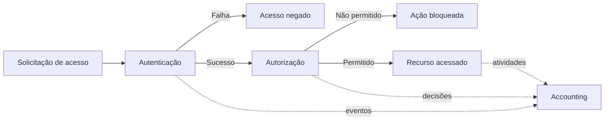
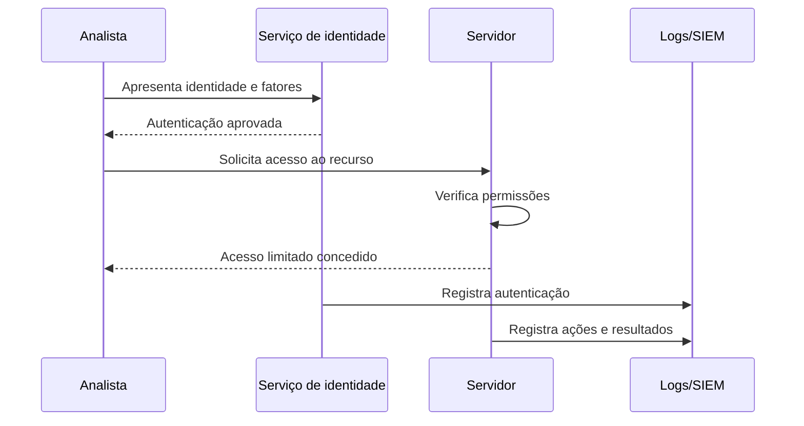

# Capítulo 009 — Autenticação, Autorização e Accounting — AAA

> **Entender antes de decorar.**

---

| Informação | Detalhes |
|---|---|
| **Módulo** | 01 — Fundamentos |
| **Nível** | Iniciante |
| **Tempo estimado** | 10 a 15 minutos |
| **Pré-requisito** | [Capítulo 008 — Zero Trust](008-zero-trust.md) |

---

## Objetivo deste capítulo

Ao final deste capítulo, você será capaz de:

- explicar o que significa **AAA**;
- diferenciar identificação, autenticação e autorização;
- compreender o objetivo do **Accounting**;
- reconhecer fatores de autenticação;
- relacionar permissões ao Princípio do Menor Privilégio;
- entender por que contas compartilhadas prejudicam a rastreabilidade;
- identificar informações importantes em registros de acesso;
- compreender, em nível introdutório, o papel de RADIUS e TACACS+;
- relacionar AAA a Zero Trust, SOC e resposta a incidentes.

---

## Como sempre, vamos começar utilizando nossa imaginação.

Imagine que você mora em um condomínio e pediu uma pizza.

O entregador chega à portaria e diz:

> “Boa noite! Tenho uma entrega para o apartamento 42.”

O porteiro ainda não deveria abrir o portão apenas porque alguém afirmou ser entregador.

Primeiro, ele verifica algumas informações:

- nome do entregador;
- empresa;
- apartamento de destino;
- confirmação do morador;
- documento ou identificação apresentada.

Depois da confirmação, o entregador recebe permissão para entrar.

Mas essa permissão não significa que ele pode:

- abrir qualquer apartamento;
- utilizar a piscina;
- entrar na sala de câmeras;
- pegar a chave-mestra;
- aproveitar e morar no condomínio. 😅

Ele foi autorizado somente a realizar uma entrega em um local específico.

A portaria também registra:

- quem entrou;
- quando entrou;
- qual apartamento visitou;
- quando saiu.

Esse exemplo representa os três componentes do modelo **AAA**:

```text
Autenticação
“Você é realmente quem afirma ser?”
        ↓
Autorização
“O que você pode fazer?”
        ↓
Accounting
“O que aconteceu durante o acesso?”
```

---

## O que é AAA?

**AAA** representa:

- **Authentication — Autenticação**
- **Authorization — Autorização**
- **Accounting — Registro, contabilização ou auditoria de atividades**

O modelo organiza três perguntas fundamentais:

| Componente | Pergunta principal |
|---|---|
| **Autenticação** | Quem é você e como comprova isso? |
| **Autorização** | Quais recursos e ações você pode utilizar? |
| **Accounting** | O que foi feito, quando, onde e com qual resultado? |

Os três componentes se complementam.

Uma autenticação bem-sucedida não deveria conceder acesso irrestrito.

Da mesma forma, uma permissão correta perde parte de seu valor se não houver registros suficientes para auditoria e investigação.



---

## Antes do primeiro A: identificação

Identificação e autenticação são conceitos relacionados, mas diferentes.

### Identificação

A identificação responde:

> **Quem você afirma ser?**

Exemplos:

- nome de usuário;
- endereço de e-mail;
- número de matrícula;
- crachá;
- identificador de uma aplicação;
- certificado associado a um dispositivo.

Ao informar o usuário `willian`, você está apresentando uma identidade.

Isso ainda não prova que você realmente é o Willian.

### Autenticação

A autenticação responde:

> **Como você comprova que é essa identidade?**

Exemplos:

- senha;
- código temporário;
- chave de segurança;
- certificado digital;
- biometria;
- aprovação em um aplicativo autenticador.

```text
Usuário informado
        =
Identificação

Senha, chave ou biometria validada
        =
Autenticação
```

!!! warning "Conhecer um nome de usuário não comprova identidade"
    Identificadores normalmente não são segredos.

    A segurança depende da forma como a identidade é autenticada e de como suas credenciais são protegidas.

---

# 1. Authentication — Autenticação

Autenticação é o processo de verificar se uma pessoa, dispositivo, aplicação ou serviço é realmente quem afirma ser.

Ela pode ocorrer quando alguém:

- entra em um sistema;
- conecta-se a uma VPN;
- acessa uma rede Wi-Fi corporativa;
- utiliza um painel administrativo;
- chama uma API;
- inicia uma sessão em um servidor;
- executa uma ação que exige nova confirmação.

## Fatores de autenticação

Os fatores mais conhecidos são:

### Algo que você sabe

Exemplos:

- senha;
- PIN;
- frase secreta.

### Algo que você possui

Exemplos:

- celular;
- token;
- cartão inteligente;
- chave física de segurança;
- certificado armazenado em dispositivo.

### Algo que você é

Exemplos:

- impressão digital;
- reconhecimento facial;
- íris.

A autenticação multifator utiliza fatores de categorias diferentes.

```text
Senha + outra senha
        =
Duas informações que você sabe

Senha + chave física
        =
Dois fatores diferentes
```

> **Dois passos não significam necessariamente dois fatores.**

## Autenticação bem-sucedida não encerra a análise

Uma credencial válida também pode ser utilizada por:

- um atacante;
- um malware;
- uma pessoa que encontrou uma sessão aberta;
- um funcionário após mudança de função;
- alguém utilizando uma conta compartilhada.

Por isso, o contexto continua importante:

- dispositivo utilizado;
- localização;
- horário;
- risco da sessão;
- recurso solicitado;
- comportamento observado.

Essa ideia se conecta diretamente ao **Zero Trust**: autenticar não significa confiar de forma permanente.

---

# 2. Authorization — Autorização

Depois de confirmar a identidade, o sistema precisa decidir o que ela pode fazer.

Autorização é o processo de conceder ou negar acesso a recursos e ações.

Exemplos:

- visualizar um arquivo;
- editar um cadastro;
- excluir um usuário;
- executar um comando;
- aprovar um pagamento;
- alterar uma regra de firewall;
- exportar dados;
- acessar determinado servidor.

```text
Autenticação:
“Esta conta pertence à Ana.”

Autorização:
“Ana pode consultar pedidos,
mas não pode criar administradores.”
```

## Autenticação e autorização não são a mesma coisa

Uma pessoa pode estar corretamente autenticada e ainda assim não possuir permissão para uma ação.

Exemplo:

1. um funcionário entra no sistema com senha e MFA;
2. sua identidade é confirmada;
3. ele tenta acessar a folha salarial;
4. o sistema verifica suas permissões;
5. o acesso é negado porque sua função não exige aquele recurso.

A autenticação foi bem-sucedida.

A autorização foi negada.

## Menor privilégio

A autorização deve seguir o **Princípio do Menor Privilégio**:

> **Conceder somente os acessos necessários para a atividade, pelo tempo necessário.**

Uma conta de atendimento talvez precise:

- consultar pedidos;
- atualizar dados de entrega;
- registrar contatos.

Ela não deveria automaticamente:

- criar contas administrativas;
- alterar preços;
- acessar todos os dados financeiros;
- desabilitar registros;
- modificar configurações de segurança.

## Formas comuns de organizar permissões

### RBAC — controle baseado em funções

Permissões são associadas a papéis.

Exemplos:

- Atendimento;
- Financeiro;
- Analista SOC;
- Administrador de redes.

O usuário recebe permissões por meio da função atribuída.

### ABAC — controle baseado em atributos

A decisão utiliza características como:

- departamento;
- tipo de dispositivo;
- horário;
- localização;
- sensibilidade do recurso;
- risco da sessão.

Exemplo:

> Permitir acesso ao relatório financeiro somente para membros do Financeiro, em dispositivo gerenciado e durante o horário aprovado.

!!! note "Permissão concedida não deve ser eterna"
    Acessos precisam ser revisados quando pessoas mudam de função, deixam a empresa ou não precisam mais do recurso.

---

# 3. Accounting — Registro e auditoria

No contexto de AAA, **Accounting** não significa apenas contabilidade financeira.

Ele representa o registro das atividades relacionadas ao acesso.

O objetivo é responder perguntas como:

- Quem realizou a ação?
- Em qual sistema?
- Quando aconteceu?
- De qual dispositivo ou endereço?
- Qual recurso foi acessado?
- Qual comando foi executado?
- A tentativa foi permitida ou negada?
- Quando a sessão começou e terminou?
- Houve alteração de privilégio?
- Qual foi o resultado?

Exemplo de registro simplificado:

```text
Data: 2026-08-03 14:32:18
Usuário: ana.financeiro
Origem: notebook-023
Ação: exportar_relatorio
Recurso: pagamentos-julho
Resultado: negado
Motivo: permissão insuficiente
```

## Por que o Accounting é importante?

Os registros ajudam em:

- auditorias;
- investigações;
- detecção de comportamentos suspeitos;
- resposta a incidentes;
- conformidade;
- identificação de falhas;
- revisão de acessos;
- produção de métricas;
- responsabilização.

Imagine que uma conta administrativa excluiu uma regra de firewall.

Sem registros, a equipe pode não saber:

- qual conta fez a alteração;
- quando ocorreu;
- de onde partiu a ação;
- qual regra foi removida;
- se houve outras mudanças;
- se a conta estava comprometida.

> **Sem visibilidade, uma ação permitida pode acontecer de forma silenciosa.**

## Accounting não é apenas “guardar qualquer log”

Registros úteis precisam possuir qualidade.

Quando aplicável, devem conter:

- horário sincronizado;
- identidade;
- origem;
- destino;
- ação;
- recurso;
- resultado;
- identificador da sessão;
- detalhes suficientes para correlação.

Também precisam ser:

- protegidos contra alteração;
- armazenados pelo período necessário;
- acessíveis às pessoas autorizadas;
- monitorados;
- testados;
- tratados de acordo com privacidade e requisitos legais.

!!! warning "Logs não garantem autoria absoluta"
    Uma ação registrada em nome de uma conta não prova, sozinha, qual pessoa estava usando a conta.

    Credenciais roubadas, sessões sequestradas e contas compartilhadas podem reduzir a confiança da atribuição.

---

## O problema das contas compartilhadas

Imagine que cinco administradores utilizam a conta:

```text
admin-rede
```

Um comando perigoso é executado às 03:00.

O log mostra:

```text
Usuário: admin-rede
```

Mas qual dos cinco administradores realizou a ação?

Contas compartilhadas dificultam:

- responsabilização;
- investigação;
- revogação individual;
- aplicação de menor privilégio;
- identificação de abuso;
- revisão de acessos.

Uma abordagem mais segura utiliza:

- contas individuais;
- contas administrativas separadas;
- privilégios temporários;
- registros centralizados;
- processos de aprovação;
- revisão periódica.

---

## Exemplo completo de AAA

Considere um analista acessando um servidor.

### Etapa 1 — Identificação

```text
Usuário informado: analista.soc
```

### Etapa 2 — Autenticação

O sistema valida:

- senha;
- chave de segurança;
- certificado do dispositivo.

### Etapa 3 — Autorização

A política permite:

- consultar logs;
- executar ferramentas aprovadas;
- coletar evidências.

Mas bloqueia:

- excluir registros;
- criar administradores;
- desativar o EDR.

### Etapa 4 — Accounting

O ambiente registra:

- início e fim da sessão;
- origem do acesso;
- comandos executados;
- recursos consultados;
- tentativas negadas;
- alterações realizadas.



---

## AAA centralizado

Em ambientes pequenos, cada sistema pode manter usuários e permissões localmente.

Com o crescimento da organização, isso pode gerar:

- contas duplicadas;
- senhas diferentes;
- permissões inconsistentes;
- desligamentos incompletos;
- dificuldade de auditoria;
- ausência de uma visão central.

Serviços centralizados de AAA ajudam dispositivos e aplicações a consultar uma fonte comum para autenticar, autorizar e registrar atividades.

Isso pode facilitar:

- aplicação consistente de políticas;
- remoção central de acesso;
- administração de equipamentos;
- controle de rede;
- auditoria;
- correlação de eventos.

A centralização, porém, também cria uma dependência importante.

Por isso, o serviço precisa de:

- alta disponibilidade;
- proteção de comunicação;
- controle administrativo;
- monitoramento;
- backups;
- procedimentos para indisponibilidade.

---

## RADIUS e TACACS+

Dois protocolos frequentemente associados a AAA são **RADIUS** e **TACACS+**.

Este capítulo não pretende ensinar sua configuração, mas é importante reconhecer seus usos gerais.

### RADIUS

RADIUS é amplamente utilizado em cenários de acesso à rede, como:

- Wi-Fi corporativo;
- VPN;
- acesso remoto;
- controle de acesso à rede;
- autenticação por 802.1X.

Um equipamento de acesso pode enviar uma solicitação ao servidor RADIUS, que participa da decisão de permitir ou negar a conexão.

O protocolo possui mecanismos relacionados a:

- autenticação;
- autorização;
- accounting de sessões.

### TACACS+

TACACS+ é utilizado principalmente na administração centralizada de equipamentos de rede, como:

- roteadores;
- switches;
- firewalls;
- outros dispositivos de infraestrutura.

Ele permite tratar separadamente:

- autenticação;
- autorização;
- accounting.

Isso pode possibilitar controle mais granular sobre comandos administrativos.

Exemplo:

```text
Administrador autenticado
        ↓
Pode consultar configuração
        ↓
Não pode apagar configuração
        ↓
Comandos ficam registrados
```

| Característica geral | RADIUS | TACACS+ |
|---|---|---|
| Uso comum | Acesso de usuários e dispositivos à rede | Administração de equipamentos |
| Exemplo | Wi-Fi, VPN e 802.1X | Roteadores, switches e firewalls |
| Foco | Sessão e acesso à rede | Controle administrativo e comandos |
| Accounting | Registros de sessões e atividades | Auditoria de operações administrativas |

!!! warning "Protocolos precisam de implantação segura"
    Utilizar um protocolo de AAA não garante automaticamente proteção adequada.

    Comunicação, credenciais, disponibilidade, configuração e administração do serviço também precisam ser protegidas.

---

## AAA e Zero Trust

No capítulo anterior, aprendemos que Zero Trust evita confiança implícita.

AAA fornece capacidades fundamentais para essa estratégia:

| Zero Trust pergunta | AAA contribui com |
|---|---|
| Quem está solicitando? | Autenticação |
| O acesso é permitido? | Autorização |
| O que ocorreu na sessão? | Accounting |
| O contexto mudou? | Registros e telemetria |
| O acesso deve continuar? | Nova decisão de autorização |

Zero Trust amplia a análise ao considerar:

- dispositivo;
- contexto;
- comportamento;
- risco;
- sensibilidade do recurso;
- verificação durante a sessão.

Portanto:

> **AAA organiza identidade, permissão e registro. Zero Trust utiliza essas capacidades dentro de decisões de acesso mais contínuas e contextuais.**

---

## Como o SOC utiliza AAA

O SOC investiga eventos produzidos pelos três componentes.

### Eventos de autenticação

- login bem-sucedido;
- login malsucedido;
- falhas repetidas;
- MFA negado;
- acesso de localização incomum;
- autenticação de conta desativada.

### Eventos de autorização

- acesso negado;
- tentativa de utilizar privilégio;
- alteração de função;
- inclusão em grupo administrativo;
- acesso a recurso sensível;
- elevação de privilégio.

### Eventos de Accounting

- início e encerramento de sessão;
- comandos executados;
- mudanças em configurações;
- arquivos acessados;
- ações administrativas;
- resultado de cada operação.

Uma investigação pode perguntar:

```text
A conta autenticou?
        ↓
Qual método foi utilizado?
        ↓
Quais permissões possuía?
        ↓
Quais recursos acessou?
        ↓
Quais ações realizou?
        ↓
O comportamento era esperado?
```

---

## Aplicação em nosso laboratório com Elastic

Em um endpoint Windows, podemos procurar eventos de autenticação com consultas como:

```kql
event.category: "authentication"
```

Para separar resultados:

```kql
event.category: "authentication"
and event.outcome: "failure"
```

Em logs de segurança do Windows, eventos comuns incluem:

```kql
event.code: ("4624" or "4625")
```

- `4624`: logon bem-sucedido;
- `4625`: falha de logon.

Para analisar um evento, observe campos como:

```text
@timestamp
host.name
user.name
source.ip
event.code
event.outcome
winlog.event_data.LogonType
```

!!! note "Os campos dependem da fonte de dados"
    Nem todos os ambientes registram os mesmos detalhes.

    Antes de criar uma detecção, verifique quais campos realmente existem nos eventos coletados pelo seu Elastic Agent.

### Exemplo de hipótese investigativa

> Uma conta apresentou várias falhas e, logo depois, uma autenticação bem-sucedida em horário incomum.

O analista deve verificar:

- se a conta pertence àquele usuário;
- qual foi a origem;
- qual tipo de logon ocorreu;
- se houve MFA;
- quais ações vieram depois;
- se privilégios foram utilizados;
- se o padrão aparece em outros hosts.

---

## Exercício prático

Imagine o seguinte cenário:

1. Carlos trabalha no atendimento.
2. Ele entra no sistema com senha e MFA.
3. Tenta acessar o painel de administração.
4. O acesso é negado.
5. Minutos depois, sua conta exporta uma lista de clientes.
6. Os registros mostram origem em um dispositivo desconhecido.

Analise o caso.

??? question "1. Qual etapa confirma a identidade de Carlos?"
    A autenticação, realizada com a validação da senha e do segundo fator.

??? question "2. A autenticação garante que foi realmente Carlos quem utilizou a conta?"
    Não de forma absoluta. Credenciais, sessões ou fatores podem ser comprometidos. O contexto e os eventos posteriores também precisam ser analisados.

??? question "3. Qual etapa bloqueia o painel administrativo?"
    A autorização, porque a função de Carlos não deveria possuir essa permissão.

??? question "4. Qual componente registra a tentativa negada e a exportação?"
    O Accounting, por meio de logs e trilhas de auditoria.

??? question "5. Por que o dispositivo desconhecido aumenta o risco?"
    Porque representa uma mudança de contexto e pode indicar uso indevido da conta.

??? question "6. O que o SOC deveria investigar?"
    Origem da sessão, dispositivo, método de autenticação, ações realizadas, volume exportado, permissões da conta e outros eventos relacionados.

---

## Erros comuns

### “Informar o usuário já é autenticação”

Não.

O usuário identifica a conta. A autenticação verifica a identidade apresentada.

### “A pessoa autenticou, então pode acessar tudo”

Não.

Depois da autenticação, a autorização ainda precisa decidir o que é permitido.

### “MFA substitui autorização”

Não.

MFA fortalece a autenticação, mas não define quais recursos a conta pode acessar.

### “Accounting significa apenas cobrança”

Não.

Em segurança, também representa registro de sessões, decisões e atividades.

### “Guardar logs é suficiente”

Não.

Os registros precisam possuir informações úteis, integridade, retenção, monitoramento e acesso controlado.

### “O log mostra a conta, então sabemos exatamente quem agiu”

Nem sempre.

Contas compartilhadas, credenciais roubadas e sessões sequestradas podem prejudicar a atribuição.

### “Administrador não precisa ter ações registradas”

Incorreto.

Quanto maior o privilégio, maior a importância da rastreabilidade.

### “Permissões concedidas podem permanecer para sempre”

Não.

Acessos devem ser revisados e removidos quando deixam de ser necessários.

---

## Resumo

O modelo **AAA** organiza três funções essenciais:

- **Autenticação:** verifica a identidade;
- **Autorização:** decide quais ações e recursos são permitidos;
- **Accounting:** registra o que aconteceu.

Lembre-se:

```text
Identificação:
“Eu sou esta conta.”

Autenticação:
“Consigo comprovar.”

Autorização:
“Posso realizar esta ação.”

Accounting:
“A atividade foi registrada.”
```

AAA ajuda a aplicar:

- menor privilégio;
- controle de acesso;
- rastreabilidade;
- auditoria;
- investigação;
- resposta a incidentes.

> **Saber quem entrou é importante. Saber o que podia fazer e o que realmente fez completa a história.**

---

## Checkpoint

Antes de seguir para o próximo capítulo, confirme se você consegue responder:

- [ ] O que significa AAA?
- [ ] Qual é a diferença entre identificação e autenticação?
- [ ] Quais são os três fatores de autenticação mais conhecidos?
- [ ] Por que dois passos não significam necessariamente dois fatores?
- [ ] Qual é a diferença entre autenticação e autorização?
- [ ] Como o menor privilégio se relaciona à autorização?
- [ ] O que significa Accounting em segurança?
- [ ] Quais informações tornam um registro útil?
- [ ] Por que contas compartilhadas prejudicam investigações?
- [ ] Qual é o uso geral do RADIUS?
- [ ] Qual é o uso geral do TACACS+?
- [ ] Como AAA apoia Zero Trust?
- [ ] Quais eventos de AAA interessam a um SOC?
- [ ] Por que um login bem-sucedido ainda pode ser suspeito?

---

## Glossário

| Termo | Definição |
|---|---|
| **AAA** | Modelo formado por autenticação, autorização e Accounting. |
| **Accounting** | Registro de sessões, decisões, ações e resultados para auditoria e investigação. |
| **ABAC** | Modelo de autorização baseado em atributos do sujeito, recurso e contexto. |
| **Autenticação** | Processo de verificar uma identidade apresentada. |
| **Autenticação multifator — MFA** | Uso de fatores de categorias diferentes para autenticação. |
| **Autorização** | Decisão sobre quais recursos e ações são permitidos. |
| **Conta compartilhada** | Conta utilizada por mais de uma pessoa, reduzindo a rastreabilidade individual. |
| **Credencial** | Elemento associado a uma identidade e utilizado na autenticação. |
| **Identificação** | Apresentação da identidade que o sujeito afirma possuir. |
| **Log** | Registro produzido por sistema, aplicação ou dispositivo. |
| **Menor privilégio** | Concessão somente dos acessos necessários. |
| **RADIUS** | Protocolo de AAA frequentemente utilizado em acesso à rede. |
| **RBAC** | Modelo de autorização baseado em funções ou papéis. |
| **Sessão** | Período de interação autenticada com um recurso. |
| **TACACS+** | Protocolo utilizado principalmente para AAA na administração de equipamentos de rede. |
| **Trilha de auditoria** | Conjunto de registros que ajuda a reconstruir atividades e mudanças. |

---

## Referências

- [NIST CSRC — Authentication, Authorization, and Accounting](https://csrc.nist.gov/glossary/term/Authentication_Authorization_and_Accounting)
- [NIST SP 800-63-4 — Digital Identity Guidelines](https://csrc.nist.gov/pubs/sp/800/63/4/final)
- [NIST SP 800-63B-4 — Authentication and Authenticator Management](https://csrc.nist.gov/pubs/sp/800/63/b/4/final)
- [NIST SP 800-92 — Guide to Computer Security Log Management](https://csrc.nist.gov/pubs/sp/800/92/final)
- [RFC 2865 — Remote Authentication Dial In User Service — RADIUS](https://www.rfc-editor.org/rfc/rfc2865)
- [RFC 2866 — RADIUS Accounting](https://www.rfc-editor.org/rfc/rfc2866)
- [RFC 8907 — The TACACS+ Protocol](https://www.rfc-editor.org/rfc/rfc8907)
- [RFC 9887 — TACACS+ over TLS 1.3](https://www.rfc-editor.org/rfc/rfc9887)

---

## Próximo capítulo

No próximo capítulo, vamos estudar **Identidade, credenciais e controle de acesso** e entender como contas, credenciais, grupos, funções e políticas organizam o acesso aos recursos.

[← Capítulo anterior: Zero Trust](008-zero-trust.md){ .md-button }

<!-- Quando o Capítulo 010 for criado, remova este comentário e ative o botão abaixo.
[Próximo: Identidade, credenciais e controle de acesso →](010-identidade-credenciais-controle-de-acesso.md){ .md-button .md-button--primary }
-->
