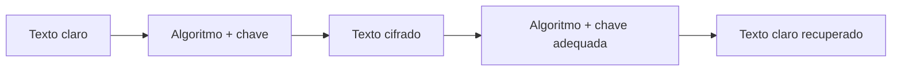
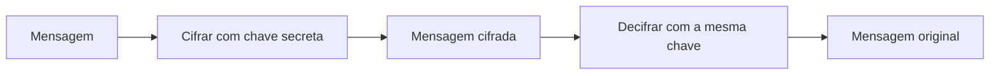
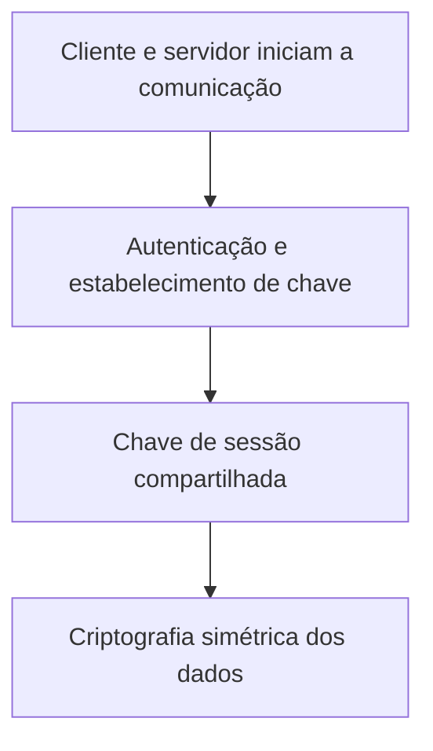
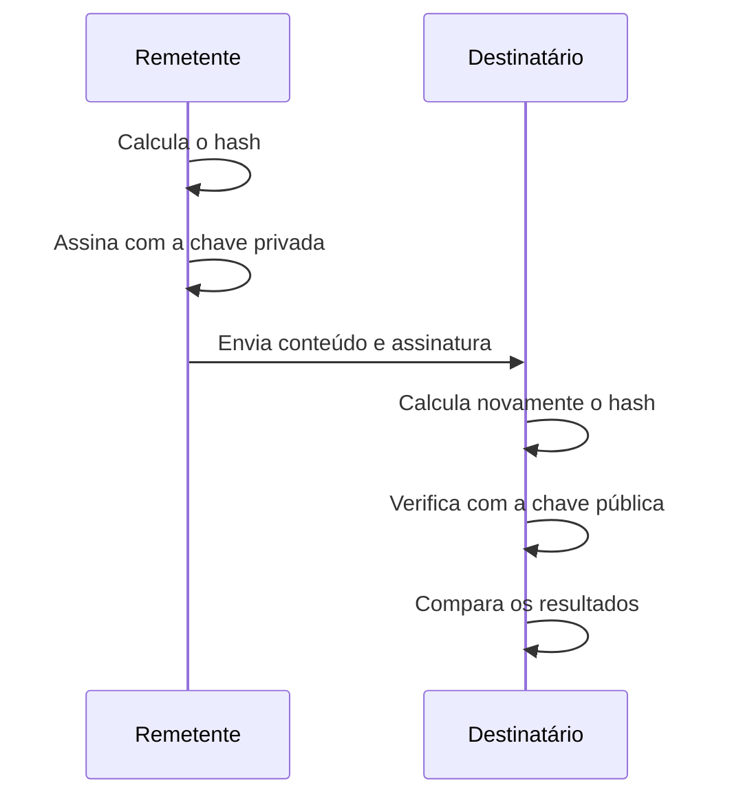
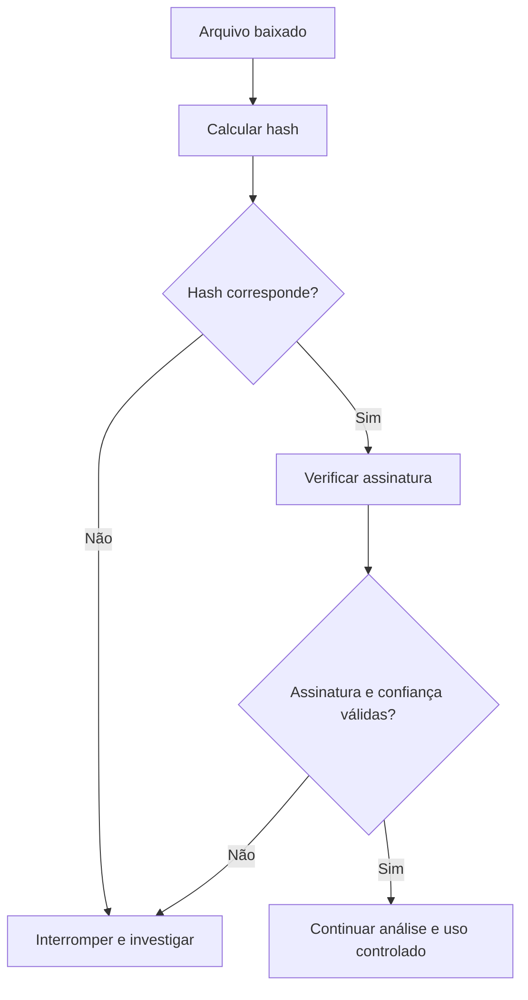

# Capítulo 010 — Criptografia, hash e assinatura digital

> **Entender antes de decorar.**

---

| Informação | Detalhes |
|---|---|
| **Módulo** | 01 — Fundamentos |
| **Nível** | Iniciante |
| **Tempo estimado** | 10 a 15 minutos |
| **Pré-requisito** | [Capítulo 009 — Autenticação, Autorização e Accounting — AAA](009-aaa.md) |

---

## Objetivo deste capítulo

Ao final deste capítulo, você será capaz de:

- explicar o que é **criptografia**;
- diferenciar criptografia simétrica e assimétrica;
- compreender por que sistemas modernos combinam os dois modelos;
- explicar o que é uma função **hash**;
- diferenciar hash de criptografia;
- entender como senhas devem ser protegidas;
- explicar como funciona uma **assinatura digital**;
- diferenciar assinatura digital, hash, HMAC e certificado digital;
- reconhecer a importância da gestão de chaves;
- aplicar esses conceitos em uma investigação básica no Windows e no Elastic.

---

## Como sempre, vamos começar utilizando nossa imaginação.

Imagine que você precisa enviar a receita secreta do pudim da família.

E não estamos falando de qualquer receita.

É aquela que todo mundo elogia no almoço de domingo, mas ninguém sabe exatamente como foi feita. 😅

Você possui três preocupações:

1. ninguém deve conseguir ler a receita durante o envio;
2. a outra pessoa precisa saber se o conteúdo foi alterado;
3. ela também precisa confirmar que a receita realmente foi enviada por você.

Para impedir a leitura, você coloca a receita dentro de uma caixa trancada.

Essa é a ideia da **criptografia**.

Para perceber alterações, você cria uma espécie de impressão digital da receita.

Essa é a ideia de uma função **hash**.

Para comprovar a origem, você aplica um selo que somente você consegue produzir, mas que outras pessoas conseguem verificar.

Essa é a ideia da **assinatura digital**.

```text
Criptografia
Protege o conteúdo contra leitura

Hash
Ajuda a detectar alterações

Assinatura digital
Ajuda a verificar origem e integridade
```

Esses mecanismos se relacionam, mas não fazem a mesma coisa.

---

## O que é criptografia?

**Criptografia** é o conjunto de técnicas utilizado para proteger informações por meio de algoritmos e chaves.

Quando uma informação legível passa por um processo de criptografia, ela é transformada em um conteúdo que não deveria ser compreendido sem a chave adequada.

| Termo | Significado |
|---|---|
| **Texto claro** | Informação antes da criptografia |
| **Texto cifrado** | Resultado ilegível produzido pelo algoritmo |
| **Algoritmo** | Conjunto de operações utilizado para cifrar ou decifrar |
| **Chave** | Valor utilizado pelo algoritmo |
| **Cifrar** | Transformar texto claro em texto cifrado |
| **Decifrar** | Recuperar o texto claro com a chave adequada |



A segurança de um sistema moderno não deveria depender de esconder o funcionamento do algoritmo.

O segredo deve estar principalmente na **chave**.

> **Um algoritmo público com uma chave protegida é mais confiável do que um algoritmo secreto que nunca foi analisado adequadamente.**

---

## Criptografia não é codificação

É comum confundir criptografia com codificação.

### Codificação

A codificação modifica a representação dos dados para facilitar armazenamento, transmissão ou compatibilidade.

Exemplos:

- Base64;
- hexadecimal;
- URL encoding.

Base64 não protege um segredo. Qualquer pessoa pode reverter a codificação sem precisar de uma chave.

### Criptografia

A criptografia procura impedir a leitura por quem não possui a chave adequada.

```text
Base64:
transforma a representação

Criptografia:
protege a confidencialidade
```

### Ofuscação

A ofuscação dificulta a compreensão de um conteúdo, mas não oferece necessariamente a mesma segurança de um mecanismo criptográfico.

!!! warning "Parecer ilegível não significa estar protegido"
    Dados codificados, comprimidos ou ofuscados podem parecer confusos sem estarem criptografados.

---

# Criptografia simétrica

Na **criptografia simétrica**, a mesma chave secreta é utilizada para cifrar e decifrar os dados.



Um exemplo conhecido é o **AES — Advanced Encryption Standard**.

## Vantagens

- boa velocidade;
- adequada para grandes volumes de dados;
- utilizada em arquivos, discos, bancos de dados e comunicações.

## Desafio principal

As duas partes precisam ter acesso à chave secreta.

Isso cria uma pergunta:

> **Como entregar a chave com segurança antes de iniciar a comunicação?**

Se a chave for interceptada, a confidencialidade pode ser comprometida.

---

# Criptografia assimétrica

Na **criptografia assimétrica**, são utilizadas duas chaves relacionadas:

- **chave pública**;
- **chave privada**.

A chave pública pode ser distribuída.

A chave privada deve permanecer protegida.

Em uma explicação simplificada:

```text
Algo protegido com a chave pública
pode ser recuperado pela chave privada correspondente.
```

Esse modelo também é utilizado em assinaturas digitais, mas com finalidade diferente da confidencialidade.

## Vantagens

- facilita o estabelecimento de confiança;
- permite assinaturas digitais;
- apoia troca e estabelecimento de chaves;
- participa de certificados digitais.

## Limitação

Operações assimétricas costumam ser mais pesadas do que operações simétricas.

Por isso, sistemas modernos normalmente combinam os dois modelos.

---

## O modelo híbrido

Um fluxo simplificado pode ser:

1. utilizar criptografia assimétrica ou acordo de chaves;
2. estabelecer uma chave de sessão;
3. utilizar criptografia simétrica durante a comunicação.



O HTTPS, por meio do TLS, utiliza diferentes mecanismos criptográficos para autenticar, estabelecer segredos de sessão e proteger a comunicação.

> **A criptografia assimétrica ajuda a iniciar a relação. A simétrica protege o grande volume de dados com eficiência.**

---

# O que é uma função hash?

Uma função **hash** recebe uma entrada de tamanho variável e produz uma saída de tamanho definido, também chamada de:

- hash;
- resumo;
- digest;
- impressão digital.

Exemplo conceitual:

```text
Entrada:
Cybersecurity do Zero

Hash:
9f3a...resultado...71c2
```

Se alterarmos apenas um caractere, o resultado deverá ser completamente diferente.

Esse comportamento é conhecido como **efeito avalanche**.

## Propriedades esperadas

Uma função hash criptográfica deve:

- produzir o mesmo resultado para a mesma entrada;
- dificultar a recuperação da entrada original;
- dificultar encontrar duas entradas com o mesmo resultado;
- mudar amplamente quando a entrada sofre pequena alteração.

Algoritmos conhecidos incluem:

- SHA-256;
- SHA-384;
- SHA-512;
- SHA-3.

!!! warning "MD5 e SHA-1 não devem ser escolhidos para novas aplicações de segurança"
    Esses algoritmos possuem fraquezas conhecidas, principalmente relacionadas a colisões.

    Eles ainda podem aparecer em sistemas antigos ou indicadores, mas isso não os torna adequados para novos projetos.

---

## Hash não é criptografia

| Criptografia | Hash |
|---|---|
| Procura proteger confidencialidade | Procura representar os dados |
| Utiliza chave | Uma função hash simples não precisa de chave |
| Possui processo de decifragem | Não foi projetado para ser revertido |
| Permite recuperar a informação | É utilizado para comparação e integridade |

```text
Criptografia:
cifrar → decifrar

Hash:
calcular → comparar
```

Não existe um processo normal de “descriptografar SHA-256”.

Ataques contra hashes normalmente tentam adivinhar a entrada, calcular o hash e comparar o resultado.

---

## Hash e integridade de arquivos

Imagine que uma empresa publica um arquivo e também seu hash SHA-256.

Depois do download, você calcula o hash localmente.

### Valores iguais

```text
Hash publicado = Hash calculado
```

Os conteúdos comparados são iguais.

### Valores diferentes

```text
Hash publicado ≠ Hash calculado
```

O arquivo pode ter sido corrompido, modificado, substituído ou baixado incorretamente.

Existe uma limitação:

> **Se um atacante puder trocar o arquivo e também o hash publicado, a comparação isolada não comprova a origem.**

Por isso, integridade e autenticidade precisam ser tratadas juntas.

---

## Hash e armazenamento de senhas

Sistemas não deveriam armazenar senhas em texto claro.

Também não deveriam utilizar apenas um hash rápido e sem outros cuidados.

Uma abordagem adequada utiliza:

- valor aleatório chamado **salt**;
- função apropriada para senhas;
- custo computacional ajustado;
- parâmetros armazenados com o resultado.

```text
Senha + salt exclusivo
        ↓
Função apropriada para senhas
        ↓
Resultado armazenado
```

Exemplos de mecanismos projetados para esse cenário incluem:

- Argon2;
- scrypt;
- bcrypt;
- PBKDF2.

O salt ajuda a impedir que senhas iguais produzam exatamente o mesmo valor armazenado.

!!! note "Criptografar senhas não costuma ser a solução correta"
    Em uma autenticação normal, o sistema precisa verificar a senha, e não recuperá-la.

---

## HMAC: hash com uma chave secreta

Um **HMAC** combina uma função hash com uma chave secreta.

Ele pode ajudar a verificar integridade e autenticidade entre partes que compartilham a chave.

```text
Mensagem + chave secreta
        ↓
HMAC
```

Diferentemente de uma assinatura digital, o HMAC não utiliza um par de chaves pública e privada.

---

# O que é assinatura digital?

Uma **assinatura digital** é um mecanismo criptográfico utilizado para apoiar:

- integridade;
- autenticidade;
- verificação da origem;
- evidência sobre o uso de uma chave privada.

Em um fluxo simplificado:

1. calcula-se o hash do conteúdo;
2. o processo de assinatura utiliza a chave privada;
3. o destinatário recebe o conteúdo e a assinatura;
4. a verificação utiliza a chave pública;
5. o resultado é comparado com o hash calculado.



## Resultado válido

Uma assinatura válida indica que:

- o conteúdo não foi alterado depois da assinatura;
- a assinatura corresponde à chave privada associada;
- a chave pública utilizada é compatível.

## Resultado inválido

Pode indicar:

- alteração do documento;
- assinatura incorreta;
- chave pública errada;
- corrupção;
- problema na cadeia de confiança;
- certificado expirado ou revogado, dependendo do cenário.

---

## Assinatura digital não criptografa o conteúdo

Um documento assinado pode continuar legível por qualquer pessoa.

A assinatura procura verificar origem e integridade.

A criptografia procura impedir leitura não autorizada.

```text
Documento criptografado:
conteúdo protegido contra leitura

Documento assinado:
conteúdo acompanhado de prova verificável

Documento criptografado e assinado:
confidencialidade + integridade + autenticidade
```

---

## Assinatura digital e não repúdio

O termo **não repúdio** é frequentemente associado à assinatura digital.

Porém, a análise real depende de:

- proteção da chave privada;
- identidade vinculada à chave;
- validade do certificado;
- processo de emissão;
- registro de tempo;
- possibilidade de comprometimento;
- políticas e aspectos jurídicos.

> **Uma assinatura válida prova o uso de uma chave privada. A atribuição a uma pessoa depende de como essa chave foi emitida, protegida e utilizada.**

---

## Certificado digital não é assinatura digital

Um **certificado digital** associa uma chave pública a uma identidade ou entidade.

Ele pode conter:

- nome ou domínio;
- chave pública;
- emissor;
- período de validade;
- usos permitidos;
- assinatura da autoridade emissora.

```text
Certificado digital:
“Esta chave pública está associada a esta identidade.”

Assinatura digital:
“Este conteúdo foi assinado pela chave privada correspondente.”
```

---

## A chave é tão importante quanto o algoritmo

Um algoritmo forte não protege a organização quando as chaves são:

- expostas em código-fonte;
- enviadas por e-mail;
- compartilhadas sem controle;
- armazenadas em texto claro;
- reutilizadas por tempo excessivo;
- acessíveis a muitas pessoas;
- mantidas depois de um comprometimento.

A gestão de chaves envolve:

- geração segura;
- armazenamento;
- distribuição;
- controle de acesso;
- rotação;
- revogação;
- destruição;
- inventário;
- monitoramento.

> **Criptografia forte com gestão de chaves fraca continua sendo uma proteção fraca.**

---

## Algoritmo seguro não significa implementação segura

Falhas também podem surgir em:

- geração de números aleatórios;
- modos de operação incorretos;
- reutilização de nonces;
- bibliotecas desatualizadas;
- certificados não validados;
- segredos expostos em logs;
- configurações inseguras;
- criação própria de algoritmos.

!!! danger "Não invente sua própria criptografia"
    Em projetos reais, utilize bibliotecas mantidas, padrões reconhecidos e configurações recomendadas.

---

## Um olhar para a criptografia pós-quântica

Computadores quânticos de grande escala representam uma preocupação futura para alguns mecanismos assimétricos atuais.

Em 2024, o NIST publicou os primeiros padrões pós-quânticos, incluindo:

- **ML-KEM**, para estabelecimento de chaves;
- **ML-DSA**, para assinaturas digitais;
- **SLH-DSA**, também voltado a assinaturas.

A principal lição para quem está começando é:

> **Algoritmos e recomendações mudam. Inventário criptográfico e planejamento de migração fazem parte da segurança.**

---

## Aplicação em um SOC

Um analista pode encontrar esses conceitos em diferentes investigações.

### Hashes de arquivos

Hashes ajudam a:

- identificar arquivos;
- comparar evidências;
- consultar reputação;
- verificar se o mesmo artefato apareceu em vários hosts;
- documentar integridade durante uma coleta.

Um hash não prova sozinho que o arquivo é malicioso.

### Assinaturas de código

Sistemas podem registrar:

- arquivo assinado ou não;
- nome do assinante;
- validade;
- cadeia de confiança;
- status da verificação.

Um arquivo assinado também não é automaticamente seguro.

Certificados podem ser roubados, utilizados indevidamente ou revogados.

### Comunicações criptografadas

Em HTTPS, o conteúdo normalmente não aparece em texto claro na captura.

Mesmo assim, o SOC pode observar:

- IPs;
- portas;
- duração;
- volume;
- certificado;
- processo responsável;
- domínio, quando disponível.

---

## Aplicação em nosso laboratório Windows e Elastic

No Windows, calcule o SHA-256 de um arquivo:

```powershell
Get-FileHash `
    -Path "C:\Windows\System32\notepad.exe" `
    -Algorithm SHA256
```

Consulte a assinatura Authenticode:

```powershell
Get-AuthenticodeSignature `
    -FilePath "C:\Windows\System32\notepad.exe" |
Format-List
```

Dependendo da versão e da telemetria coletada, o Elastic pode apresentar campos como:

```text
file.hash.sha256
process.hash.sha256
process.code_signature.subject_name
process.code_signature.trusted
process.code_signature.exists
```

Antes de criar consultas, confirme quais campos existem em seus eventos.

Exemplo conceitual:

```kql
process.code_signature.exists: false
and process.executable: "C:\\Users\\Public\\*"
```

Esse filtro não significa atividade maliciosa. Ele apenas localiza processos sem assinatura em um caminho que merece análise.

---

## Laboratório rápido — Detectando alteração com hash

Crie um arquivo:

```powershell
"Entender antes de decorar." |
Set-Content "C:\Users\Public\mensagem.txt"
```

Calcule o hash:

```powershell
Get-FileHash `
    "C:\Users\Public\mensagem.txt" `
    -Algorithm SHA256
```

Anote o resultado.

Agora altere apenas um caractere:

```powershell
"Entender antes de decoraR." |
Set-Content "C:\Users\Public\mensagem.txt"
```

Calcule novamente:

```powershell
Get-FileHash `
    "C:\Users\Public\mensagem.txt" `
    -Algorithm SHA256
```

Compare os valores.

Mesmo com uma mudança pequena, o resultado será muito diferente.

---

## Cenário prático — Download de uma ferramenta

Imagine que um analista precisa baixar uma ferramenta de um site oficial.

A página publica:

- arquivo;
- hash SHA-256;
- assinatura digital.

O analista deveria verificar:

### Integridade

O hash local corresponde ao valor publicado?

### Autenticidade

A assinatura é válida?

### Confiança

A chave ou certificado pertence ao fornecedor esperado?

### Contexto

O download veio do domínio correto e por uma conexão protegida?



---

## Exercício prático

Analise o cenário:

1. uma empresa recebe por e-mail um instalador;
2. o arquivo possui assinatura digital válida;
3. o hash não corresponde ao valor publicado no site oficial;
4. o certificado pertence a uma empresa desconhecida;
5. o e-mail pede execução imediata.

??? question "1. A assinatura válida é suficiente para confiar no arquivo?"
    Não. É necessário verificar quem assinou, a cadeia de confiança, a validade e o contexto.

??? question "2. O que o hash diferente indica?"
    Indica que o conteúdo não é idêntico ao arquivo correspondente ao hash publicado.

??? question "3. O hash diferente prova que existe malware?"
    Não. Pode haver versão diferente, corrupção ou substituição. O evento exige investigação.

??? question "4. A assinatura protege a confidencialidade?"
    Não. Ela apoia integridade e autenticidade, mas não esconde o conteúdo.

??? question "5. Qual é a decisão mais segura?"
    Não executar o arquivo até validar origem, versão, hash, certificado e contexto.

---

## Erros comuns

### “Base64 é criptografia”

Não. Base64 é codificação e pode ser revertida sem chave.

### “Hash pode ser descriptografado”

Não. Funções hash não foram projetadas como mecanismos reversíveis.

### “Se o arquivo tem SHA-256, ele é seguro”

Não. O hash identifica o conteúdo, mas não classifica sua intenção.

### “Arquivo assinado nunca é malicioso”

Não. Assinatura, reputação, cadeia de confiança e contexto precisam ser analisados juntos.

### “A chave pode ficar dentro do código porque o algoritmo é forte”

Não. Segredos expostos comprometem a proteção.

### “Criptografia protege contra qualquer ameaça”

Não. Ela não corrige vulnerabilidades, não impede exclusão de dados e não garante disponibilidade.

### “Duas senhas iguais devem gerar sempre o mesmo valor”

Não. O uso de salt exclusivo ajuda a evitar isso.

### “Quanto mais complicado o algoritmo criado pela empresa, melhor”

Não. Criptografia própria e não revisada costuma aumentar o risco.

---

## Resumo

Neste capítulo, aprendemos que:

- **criptografia** protege principalmente a confidencialidade;
- criptografia simétrica utiliza uma chave secreta compartilhada;
- criptografia assimétrica utiliza chaves pública e privada;
- sistemas modernos frequentemente combinam os dois modelos;
- **hash** produz uma impressão digital dos dados;
- hash ajuda a verificar integridade, mas não esconde o conteúdo;
- senhas exigem mecanismos próprios, salt e custo computacional;
- **HMAC** combina hash e chave secreta;
- **assinatura digital** apoia integridade e autenticidade;
- certificado digital associa uma chave pública a uma identidade;
- chaves precisam ser gerenciadas durante todo o ciclo de vida;
- algoritmo forte não compensa implementação insegura.

```text
Criptografia:
quem não possui a chave não deveria ler

Hash:
qualquer alteração deve produzir outro resultado

Assinatura digital:
a origem e a integridade podem ser verificadas
```

> **Criptografia não é mágica. Ela resolve problemas específicos quando algoritmos, chaves, implementação e processos trabalham juntos.**

---

## Checkpoint

Antes de seguir para o próximo capítulo, confirme se você consegue responder:

- [ ] O que é criptografia?
- [ ] Qual é a diferença entre texto claro e texto cifrado?
- [ ] Por que Base64 não é criptografia?
- [ ] Como funciona a criptografia simétrica?
- [ ] Como funciona a criptografia assimétrica?
- [ ] Por que sistemas modernos utilizam um modelo híbrido?
- [ ] O que é uma função hash?
- [ ] O que significa efeito avalanche?
- [ ] Qual é a diferença entre hash e criptografia?
- [ ] Por que senhas precisam de salt?
- [ ] O que é HMAC?
- [ ] O que uma assinatura digital ajuda a verificar?
- [ ] Por que assinatura digital não garante confidencialidade?
- [ ] Qual é a diferença entre certificado e assinatura digital?
- [ ] Por que gestão de chaves é essencial?
- [ ] Um arquivo assinado pode ser malicioso?
- [ ] Como hashes e assinaturas aparecem em investigações de SOC?
- [ ] O que são algoritmos pós-quânticos?

---

## Glossário

| Termo | Definição |
|---|---|
| **AES** | Padrão de criptografia simétrica em blocos. |
| **Assinatura digital** | Mecanismo que utiliza criptografia assimétrica para apoiar integridade e autenticidade. |
| **Certificado digital** | Estrutura que associa uma chave pública a uma identidade. |
| **Chave privada** | Chave que deve permanecer protegida pelo responsável. |
| **Chave pública** | Chave que pode ser distribuída para verificação ou estabelecimento de confiança. |
| **Cifra** | Algoritmo utilizado para cifrar e decifrar dados. |
| **Colisão** | Situação em que entradas diferentes produzem o mesmo hash. |
| **Criptografia assimétrica** | Modelo que utiliza um par de chaves relacionadas. |
| **Criptografia simétrica** | Modelo que utiliza a mesma chave secreta para cifrar e decifrar. |
| **Digest** | Saída produzida por uma função hash. |
| **Efeito avalanche** | Mudança ampla no resultado causada por pequena alteração na entrada. |
| **HMAC** | Código de autenticação que combina função hash e chave secreta. |
| **Hash** | Resultado de tamanho definido produzido por uma função hash. |
| **Não repúdio** | Capacidade de produzir evidências que dificultam negar uma ação. |
| **Salt** | Valor aleatório combinado a uma senha antes de seu processamento. |
| **Texto cifrado** | Informação transformada pela criptografia. |
| **Texto claro** | Informação legível antes da criptografia ou após a decifragem. |
| **TLS** | Protocolo utilizado para proteger comunicações de rede. |

---

## Referências

- [NIST FIPS 197 — Advanced Encryption Standard — AES](https://csrc.nist.gov/pubs/fips/197/final)
- [NIST FIPS 180-4 — Secure Hash Standard — SHS](https://csrc.nist.gov/pubs/fips/180-4/upd1/final)
- [NIST FIPS 202 — SHA-3 Standard](https://csrc.nist.gov/pubs/fips/202/final)
- [NIST FIPS 186-5 — Digital Signature Standard — DSS](https://csrc.nist.gov/pubs/fips/186-5/final)
- [NIST SP 800-57 Part 1 Rev. 5 — Recommendation for Key Management](https://csrc.nist.gov/pubs/sp/800/57/pt1/r5/final)
- [NIST SP 800-63B-4 — Authentication and Authenticator Management](https://csrc.nist.gov/pubs/sp/800/63/b/4/final)
- [NIST FIPS 203 — Module-Lattice-Based Key-Encapsulation Mechanism Standard](https://csrc.nist.gov/pubs/fips/203/final)
- [NIST FIPS 204 — Module-Lattice-Based Digital Signature Standard](https://csrc.nist.gov/pubs/fips/204/final)
- [NIST FIPS 205 — Stateless Hash-Based Digital Signature Standard](https://csrc.nist.gov/pubs/fips/205/final)

---

## Próximo capítulo

No próximo capítulo, vamos estudar **Malware e seus principais tipos** e entender como códigos maliciosos podem executar, persistir, coletar informações e causar impacto em sistemas.

[← Capítulo anterior: AAA](009-aaa.md){ .md-button }

<!-- Quando o Capítulo 011 for criado, remova este comentário e ative o botão abaixo.
[Próximo: Malware e seus principais tipos →](011-malware-e-seus-principais-tipos.md){ .md-button .md-button--primary }
-->
