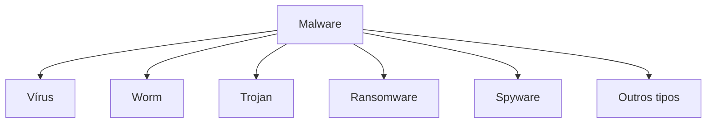
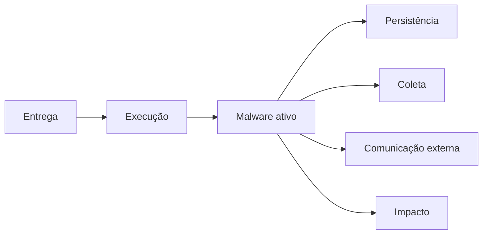
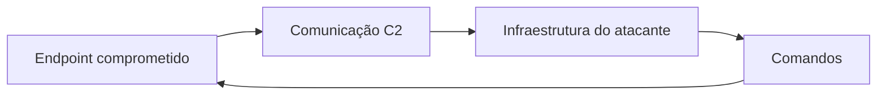
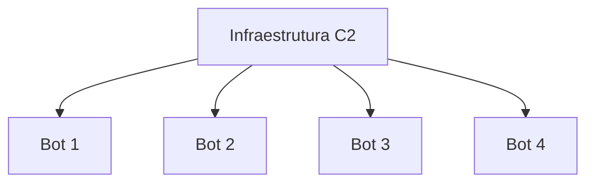
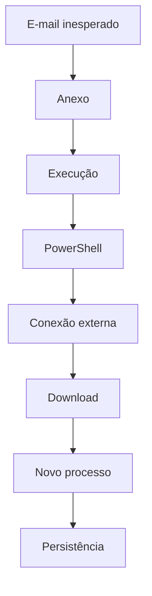

# Capítulo 011 — Malware e seus principais tipos

> **Entender antes de decorar.**

---

| Informação | Detalhes |
|---|---|
| **Módulo** | 01 — Fundamentos |
| **Nível** | Iniciante |
| **Tempo estimado** | 10 a 15 minutos |
| **Pré-requisito** | [Capítulo 010 — Criptografia, hash e assinatura digital](010-criptografia-hash-assinatura-digital.md) |

---

## Objetivo deste capítulo

Ao final deste capítulo, você será capaz de:

- explicar o que é **malware**;
- diferenciar malware de vírus;
- reconhecer os principais tipos de códigos maliciosos;
- entender como um malware pode chegar e executar em um sistema;
- identificar sinais úteis para uma investigação de **SOC / Blue Team**;
- compreender por que comportamento e contexto são tão importantes quanto IOCs.

---

## Como sempre, vamos começar utilizando nossa imaginação.

Imagine que uma empresa percebeu que alguma coisa está errada.

Um computador ficou lento. Outro começou a realizar conexões estranhas para a internet. Em uma terceira máquina, arquivos não abrem mais. Enquanto isso, existe a suspeita de que credenciais foram roubadas.

A primeira reação poderia ser:

> **“Pegamos um vírus!”**

Mas será que tudo isso é realmente um vírus?

Não necessariamente.

**Vírus é apenas um dos tipos de malware.**

Pense em malware como uma categoria maior:

```text
Malware
│
├── Vírus
├── Worm
├── Trojan
├── Ransomware
├── Spyware
├── RAT
├── Rootkit
├── Bot
├── Wiper
└── outros...
```

Alguns procuram se espalhar. Outros espionam. Alguns permitem acesso remoto. Outros destroem ou tornam dados indisponíveis.

E um mesmo código pode apresentar várias dessas características ao mesmo tempo.

> **O tipo de malware descreve principalmente seu comportamento ou finalidade.**

---

# O que é malware?

A palavra **malware** vem de:

```text
malicious + software
```

Ou seja: **software malicioso**.

De forma geral, malware é um software ou código criado ou utilizado com intenção maliciosa para comprometer sistemas, dispositivos, dados ou usuários.

Entre seus possíveis objetivos estão:

- obter acesso não autorizado;
- roubar informações ou credenciais;
- espionar atividades;
- executar comandos;
- estabelecer persistência;
- utilizar recursos computacionais;
- interromper operações;
- destruir ou criptografar dados;
- transformar um dispositivo em parte de uma botnet.

Por isso, dizer apenas:

> “O arquivo contém malware.”

é apenas o começo da investigação.

O analista ainda precisa responder:

```text
Como chegou?
Como executou?
O que fez?
O que alterou?
Com quem se comunicou?
Criou persistência?
Existem outros hosts afetados?
```

---

# Malware não é sinônimo de vírus

Essa confusão é muito comum.

Todo **vírus** é malware, mas nem todo **malware** é vírus.



De forma simplificada, um vírus infecta outro arquivo ou conteúdo e pode se replicar quando esse hospedeiro é executado.

Um ransomware, por exemplo, pode criptografar arquivos sem possuir esse comportamento.

```text
Vírus = um tipo específico de malware
Malware = categoria ampla de software malicioso
```

---

# Como um malware chega até a vítima?

Alguns vetores comuns incluem:

- phishing e anexos maliciosos;
- links para páginas falsas;
- softwares piratas, cracks e keygens;
- documentos maliciosos;
- downloads em sites comprometidos;
- dispositivos USB;
- exploração de vulnerabilidades;
- serviços expostos ou mal configurados;
- credenciais comprometidas;
- comprometimento de fornecedores.

Um fluxo didático poderia ser:



!!! info "Nem todo ataque segue essa sequência"
    O fluxo acima serve apenas para visualizar possibilidades. Um malware pode não criar persistência, não utilizar C2 ou executar várias ações simultaneamente.

---

# Principais tipos de malware

## 1. Vírus

O **vírus** infecta outro arquivo ou conteúdo e utiliza esse hospedeiro para executar seu código.

```text
Arquivo legítimo
      ↓
Arquivo infectado
      ↓
Execução
      ↓
Código malicioso
      ↓
Possível infecção de outros arquivos
```

Pode modificar arquivos, inserir código, corromper informações e tentar se replicar.

---

## 2. Worm

Um **worm** possui capacidade de se replicar e se espalhar entre sistemas, muitas vezes utilizando redes ou vulnerabilidades.

A diferença didática é:

```text
Vírus → normalmente depende de um hospedeiro
Worm  → possui capacidade própria de propagação
```

Em uma investigação, um worm pode gerar sinais como conexões repetidas, comportamento semelhante em vários hosts e propagação rápida do mesmo artefato.

---

## 3. Trojan — Cavalo de Troia

Um **trojan** se apresenta ou é entregue como algo aparentemente legítimo para induzir sua execução.

Imagine baixar:

```text
Atualizador_PDF.exe
```

O programa parece ser um atualizador, mas também instala um componente malicioso.

Trojan não precisa possuir capacidade própria de replicação. Seu sucesso frequentemente depende de enganar o usuário.

!!! warning "Aparência legítima não significa arquivo seguro"
    Nome, ícone e extensão podem ser manipulados. Origem, assinatura, hash, comportamento e contexto precisam ser analisados juntos.

---

## 4. RAT — Remote Access Trojan

Um **RAT** é um trojan voltado ao controle remoto do dispositivo comprometido.

Pode permitir ações como:

- executar comandos;
- transferir arquivos;
- coletar informações;
- capturar tela;
- controlar processos;
- manter acesso ao sistema.



A infraestrutura utilizada para controlar sistemas comprometidos é frequentemente chamada de **Command and Control — C2 ou C&C**.

---

## 5. Ransomware

**Ransomware** é malware utilizado em operações de extorsão.

O comportamento mais conhecido é criptografar arquivos e exigir pagamento, mas uma operação pode envolver também:

- roubo de dados;
- comprometimento de credenciais;
- movimentação lateral;
- exclusão de backups;
- interrupção de serviços;
- ameaça de vazamento de informações.

 "Ransomware não é apenas 'um computador com vírus'"
    Em um ambiente corporativo, o incidente pode envolver identidade, endpoints, rede, servidores, backups, dados e continuidade do negócio.

---

## 6. Spyware

**Spyware** é voltado à coleta de informações sobre a vítima ou o dispositivo.

Pode tentar obter:

- histórico de navegação;
- credenciais;
- cookies;
- arquivos;
- informações financeiras;
- dados sobre atividades do usuário.

Durante uma investigação, podem aparecer processos desconhecidos, acesso incomum a dados e conexões de saída relacionadas à coleta.

---

## 7. Keylogger

Um **keylogger** registra teclas digitadas pelo usuário.

Quando utilizado de forma maliciosa, pode capturar usuários, senhas, mensagens e outras informações digitadas.

```text
Usuário digita
      ↓
Keylogger registra
      ↓
Dados podem ser enviados ao atacante
```

 "Keylogger é uma capacidade"
    O registro de teclas também pode existir em soluções legítimas. Contexto e autorização são essenciais para a classificação.

---

## 8. Rootkit

Um **rootkit** possui mecanismos destinados a esconder presença ou atividade no sistema, frequentemente tentando operar com privilégios elevados.

Pode buscar ocultar arquivos, processos, conexões ou outros componentes.

> **A principal ideia é: tornar a presença maliciosa mais difícil de perceber.**

---

## 9. Backdoor

Uma **backdoor** fornece uma forma de acesso ao sistema contornando o fluxo normal esperado de autenticação ou controle.

Ela pode ser inserida por malware, criada após uma invasão ou adicionada por meio de uma configuração maliciosa.

Seu objetivo é permitir que o atacante mantenha ou recupere acesso ao ambiente.

---

## 10. Bot e Botnet

Um dispositivo comprometido pode ser transformado em um **bot**.

Quando vários bots são controlados de forma coordenada, temos uma **botnet**.



Botnets podem ser utilizadas para DDoS, envio de spam, distribuição de malware, fraude e outras atividades coordenadas.

---

## 11. Downloader e Dropper

Esses dois termos aparecem bastante em análises de malware.

### Downloader

Sua função inclui buscar outro payload em um local externo.

```text
Downloader → conexão externa → download → novo payload
```

### Dropper

É utilizado para extrair ou instalar outro payload que já está contido em seu próprio conteúdo.

```text
Dropper → extrai payload → instala ou executa
```

Na prática, uma amostra pode combinar os dois comportamentos.

---

## 12. Wiper

Um **wiper** possui finalidade destrutiva.

Pode apagar ou sobrescrever dados e tornar sistemas indisponíveis.

```text
Ransomware → normalmente busca extorsão
Wiper      → prioriza destruição ou indisponibilidade
```

Um ataque destrutivo também pode tentar se passar por ransomware para dificultar a análise inicial.

---

## 13. Cryptominer

Um **cryptominer malicioso** utiliza recursos computacionais da vítima para mineração sem autorização.

Possíveis sinais incluem:

- CPU ou GPU constantemente elevadas;
- queda de desempenho;
- processos desconhecidos;
- conexões com infraestrutura de mineração.

Basicamente, o atacante utiliza **seu computador e sua conta de energia** para trabalhar para ele. 😅

---

## 14. Adware e PUA

**Adware** é software voltado à exibição de publicidade e nem sempre é classificado como malware.

Também existe o termo **PUA — Potentially Unwanted Application**, ou Aplicativo Potencialmente Indesejado.

Esses programas podem apresentar publicidade excessiva, alterar configurações, instalar extensões ou coletar informações de forma indesejada.

A classificação depende do comportamento e dos critérios da solução de segurança utilizada.

---

# E o chamado “fileless malware”?

**Fileless** não significa necessariamente que nenhum arquivo seja utilizado.

O termo está relacionado a ataques que reduzem a dependência de executáveis maliciosos tradicionais gravados em disco e podem executar partes importantes da atividade em memória, por scripts ou utilizando ferramentas legítimas do próprio sistema.

No Windows, ferramentas que podem ser abusadas incluem:

```text
PowerShell
WMI
rundll32.exe
mshta.exe
regsvr32.exe
```

Essas ferramentas **não são malware**.

!!! warning "Processo legítimo ≠ atividade legítima"
    O problema está no comportamento e no contexto. Detectar uma ameaça apenas pelo nome de um processo pode gerar conclusões erradas.

---

# Um malware pode pertencer a várias categorias?

Sim.

Imagine um arquivo que:

1. se apresenta como programa legítimo;
2. registra teclas;
3. coleta informações;
4. envia dados para um servidor;
5. baixa outro payload.

Ele pode apresentar características de:

```text
Trojan + Keylogger + Spyware + Downloader
```

> **O comportamento real é mais importante do que tentar encaixar uma amostra em uma única categoria.**

---

# Malware e MITRE ATT&CK

O **MITRE ATT&CK** ajuda a descrever comportamentos observados durante uma intrusão.

Em vez de perguntar apenas:

> “Qual é o nome desse malware?”

podemos perguntar:

```text
Como executa?
Como cria persistência?
Como coleta informações?
Como se comunica?
Como tenta evitar detecção?
```

Isso é importante porque nomes e hashes podem mudar, enquanto determinados comportamentos podem continuar aparecendo.

---

# IOC não conta a história inteira

Durante uma investigação podemos encontrar **Indicadores de Comprometimento — IOCs**, como:

- hashes;
- endereços IP;
- domínios;
- URLs;
- nomes e caminhos de arquivos;
- chaves de Registro.

IOCs são muito úteis, mas não contam a história inteira.

Uma pequena alteração em um arquivo pode produzir um novo hash. Por isso, também precisamos observar sequências de comportamento.

```text
Word
 ↓
PowerShell
 ↓
Conexão externa
 ↓
Download
 ↓
Persistência
```

Mesmo que o hash seja desconhecido, a sequência pode justificar uma investigação.

---

# O que um analista de SOC procura?

O analista tenta construir uma **linha do tempo**.

### Arquivo

- nome e caminho;
- hash;
- assinatura digital;
- origem.

### Processo

- processo executado;
- processo pai;
- linha de comando;
- usuário;
- processos filhos.

### Rede

- IP e domínio;
- porta;
- consulta DNS;
- processo responsável pela conexão.

### Persistência

- tarefa agendada;
- serviço;
- chave de inicialização;
- item de startup.

### Escopo

- outros hosts com o mesmo artefato;
- outros dispositivos acessando o mesmo domínio;
- contas relacionadas;
- momento em que a atividade começou.

---

# O processo pai pode contar muita coisa

Imagine observar:

```text
explorer.exe
    ↓
winword.exe
    ↓
powershell.exe
    ↓
arquivo_desconhecido.exe
```

Isso não prova automaticamente a existência de malware.

Mas gera perguntas importantes:

> Por que o Word iniciou o PowerShell?

> Qual comando foi executado?

> Houve conexão externa?

> De onde surgiu o executável?

Essa é a lógica de uma investigação: **correlacionar eventos antes de concluir**.

---

# Cenário prático — A “nota fiscal”

Imagine que um usuário recebe por e-mail uma suposta nota fiscal em um arquivo compactado.

Depois que ele abre o conteúdo, a equipe encontra:

```text
E-mail
  ↓
ZIP
  ↓
Arquivo executado
  ↓
PowerShell
  ↓
Conexão externa
  ↓
Download
  ↓
Novo processo
  ↓
Tarefa agendada
```

ZIP não é malware.

PowerShell não é malware.

Tarefa agendada também não é malware.

Então onde está o problema?

No **contexto e na sequência dos eventos**.



Cada evento isoladamente pode possuir explicação legítima. Juntos, formam uma cadeia que merece investigação.

??? question "1. Qual informação devemos coletar sobre o arquivo baixado?"
    Nome, caminho, hash, origem, assinatura digital e processo responsável pela criação são bons pontos iniciais.

??? question "2. O hash sozinho prova que existe malware?"
    Não. Ele identifica o conteúdo e pode auxiliar em consultas e correlações, mas precisa ser analisado junto ao contexto.

??? question "3. O que a tarefa agendada pode representar?"
    Pode representar persistência, caso tenha sido criada para executar novamente um componente suspeito.

---

# O que fazer ao encontrar um arquivo suspeito?

Em um ambiente profissional, evite simplesmente abrir o arquivo “para ver o que acontece”.

Uma triagem inicial pode incluir:

1. preservar evidências;
2. registrar nome, caminho e hash;
3. verificar assinatura digital;
4. identificar processo pai e linha de comando;
5. verificar conexões de rede;
6. procurar o mesmo indicador em outros hosts;
7. analisar mecanismos de persistência;
8. avaliar o escopo e seguir o processo de resposta a incidentes.

 "Não execute malware real no computador pessoal"
    Análise dinâmica de malware exige ambiente isolado e procedimentos específicos. Os laboratórios deste projeto devem utilizar atividades controladas e seguras.

---

# Erros comuns

### “Malware e vírus são a mesma coisa”

Não. Vírus é um tipo de malware.

### “Se o antivírus não detectou, o arquivo é seguro”

Não. Ausência de detecção não comprova legitimidade.

### “PowerShell executando significa ataque”

Não. PowerShell é legítimo e precisa ser analisado dentro do contexto.

### “Hash desconhecido significa arquivo seguro”

Não. O arquivo pode ser novo, modificado ou ainda não catalogado.

### “Ransomware só criptografa arquivos”

Não. Operações de ransomware podem envolver roubo de dados, credenciais, movimentação lateral e extorsão.

### “Um malware pertence sempre a uma única categoria”

Não. Uma mesma amostra pode apresentar várias capacidades.

---

# Resumo

Neste capítulo, aprendemos que:

- **malware** é uma categoria ampla de código malicioso;
- vírus é apenas um dos tipos de malware;
- **worm** possui capacidade de propagação própria;
- **trojan** utiliza aparência ou finalidade aparentemente legítima;
- **RAT** permite controle remoto;
- **ransomware** é associado a extorsão;
- **spyware** coleta informações;
- **keylogger** registra teclas;
- **rootkit** procura ocultar presença ou atividade;
- **botnets** coordenam dispositivos comprometidos;
- **downloaders** e **droppers** entregam outros payloads;
- **wipers** possuem finalidade destrutiva;
- um malware pode apresentar várias capacidades simultaneamente;
- IOCs são importantes, mas comportamento e contexto também precisam ser analisados;
- em um SOC, arquivos, processos, rede, persistência, usuários e linha do tempo devem ser correlacionados.

```text
Não pergunte apenas:

“Qual é o nome do malware?”

Pergunte também:

“O que ele fez?”
“Como chegou?”
“Como executou?”
“Com quem se comunicou?”
“Até onde o incidente chegou?”
```

> **O objetivo não é decorar uma lista de malwares. É aprender a reconhecer comportamentos e construir uma investigação.**

---

# Checkpoint

Antes de seguir para o próximo capítulo, confirme se você consegue responder:

- [ ] O que é malware?
- [ ] Qual é a diferença entre malware e vírus?
- [ ] Qual é a diferença entre vírus e worm?
- [ ] O que caracteriza um trojan?
- [ ] O que é um RAT?
- [ ] Qual é o objetivo de um ransomware?
- [ ] O que fazem spyware e keylogger?
- [ ] Qual é o objetivo de um rootkit?
- [ ] O que é uma botnet?
- [ ] Qual é a diferença entre downloader e dropper?
- [ ] O que faz um wiper?
- [ ] O que significa fileless?
- [ ] Por que PowerShell não deve ser classificado automaticamente como malware?
- [ ] Por que comportamento e contexto são importantes durante uma investigação?

---

# Glossário

| Termo | Definição |
|---|---|
| **Backdoor** | Mecanismo que fornece uma forma alternativa de acesso ao sistema. |
| **Botnet** | Conjunto de dispositivos comprometidos controlados de maneira coordenada. |
| **C2 / C&C** | Command and Control; comunicação utilizada para controlar sistemas comprometidos. |
| **Downloader** | Código utilizado para baixar outros componentes ou payloads. |
| **Dropper** | Código utilizado para extrair ou instalar outro payload. |
| **IOC** | Indicator of Compromise; indicador que pode ajudar a identificar comprometimento. |
| **Malware** | Software ou código utilizado com finalidade maliciosa. |
| **Payload** | Componente responsável por determinada ação ou funcionalidade. |
| **Ransomware** | Malware utilizado em operações de extorsão. |
| **RAT** | Remote Access Trojan; trojan que permite controle remoto do dispositivo. |
| **Rootkit** | Mecanismos destinados a ocultar presença ou atividade no sistema. |
| **Spyware** | Software utilizado para coletar informações sobre usuário ou dispositivo. |
| **Trojan** | Malware apresentado ou entregue de forma aparentemente legítima. |
| **Vírus** | Malware que infecta outro conteúdo ou arquivo e pode se replicar. |
| **Wiper** | Malware com finalidade destrutiva. |
| **Worm** | Malware com capacidade de autorreplicação e propagação. |

---

# Referências

- [NIST SP 800-83 Rev. 1 — Guide to Malware Incident Prevention and Handling for Desktops and Laptops](https://csrc.nist.gov/pubs/sp/800/83/r1/final)
- [MITRE ATT&CK — Software](https://attack.mitre.org/software/)
- [CISA — StopRansomware Guide](https://www.cisa.gov/resources-tools/resources/stopransomware-guide)
- [Microsoft Security — O que é malware?](https://www.microsoft.com/pt-br/security/business/security-101/what-is-malware)
- [Microsoft Learn — Compreender malware e outras ameaças](https://learn.microsoft.com/pt-br/defender-endpoint/malware/understanding-malware)

---

# Próximo capítulo

No próximo capítulo, vamos estudar **Engenharia Social e Phishing** e entender como atacantes exploram confiança, urgência e comportamento humano para induzir uma vítima a executar determinada ação.

[← Capítulo anterior: Criptografia, hash e assinatura digital](010-criptografia-hash-assinatura-digital.md){ .md-button }

[Próximo: Engenharia Social e Phishing →](012-engenharia-social-e-phishing.md){ .md-button .md-button--primary }

---

> **Entender antes de decorar.**
