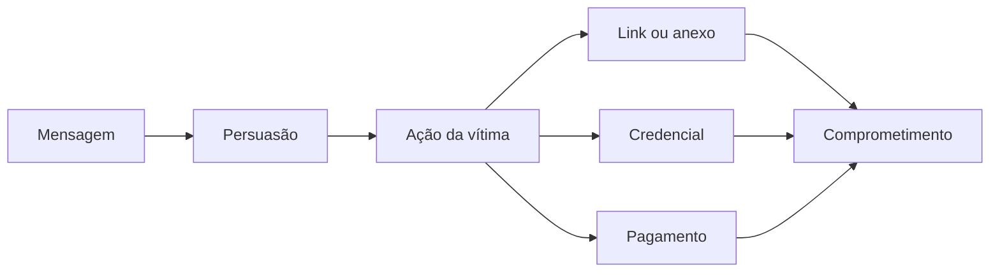
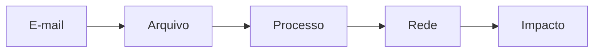

# Capítulo 012 — Engenharia Social e Phishing

> **Entender antes de decorar.**

---

| Informação | Detalhes |
|---|---|
| **Módulo** | 01 — Fundamentos |
| **Nível** | Iniciante |
| **Tempo estimado** | 10 a 15 minutos |
| **Pré-requisito** | [Capítulo 011 — Malware e seus principais tipos](011-malware-e-seus-principais-tipos.md) |

---

## Objetivo deste capítulo

Ao final deste capítulo, você será capaz de:

- explicar o que é **engenharia social**;
- entender por que ataques não dependem apenas de vulnerabilidades técnicas;
- explicar o que é **phishing**;
- diferenciar phishing, spear phishing, whaling, smishing e vishing;
- reconhecer técnicas de persuasão utilizadas em mensagens maliciosas;
- identificar sinais suspeitos em remetentes, links, domínios e anexos;
- compreender o papel de **SPF, DKIM e DMARC** durante uma análise;
- relacionar phishing ao **MITRE ATT&CK**;
- estruturar uma triagem inicial de um e-mail suspeito;
- compreender como IA pode tornar campanhas mais convincentes e personalizadas.

---

## Como sempre, vamos começar utilizando nossa imaginação.

Imagine que você trabalha no setor financeiro de uma empresa.

São 16h47 de uma sexta-feira.

Você recebe a seguinte mensagem:

> **Assunto: URGENTE — pagamento pendente**
>
> Boa tarde,
>
> preciso que este pagamento seja realizado ainda hoje.
>
> Estou entrando em uma reunião e não conseguirei atender.
>
> Seguem os dados atualizados no link abaixo.
>
> Obrigado.
>
> **Diretor Financeiro**

O nome exibido é realmente o do diretor.

A foto parece correta.

A assinatura do e-mail também.

E ainda existe aquela palavra mágica:

**URGENTE.**

Você tem duas opções:

```text
Opção A
"É o diretor. Melhor fazer logo."

Opção B
"Espera aí... por que ele mudou o processo justamente hoje?"
```

É exatamente nesse espaço entre **reagir** e **verificar** que a engenharia social costuma trabalhar.

> **O atacante nem sempre precisa invadir a máquina primeiro. Às vezes, ele tenta convencer você a abrir a porta.**

---

# O que é Engenharia Social?

**Engenharia Social** é o uso de manipulação, persuasão ou engano para induzir uma pessoa a realizar uma ação que favoreça o atacante.

Essa ação pode ser:

- fornecer uma senha;
- informar um código de MFA;
- clicar em um link;
- abrir um anexo;
- instalar um programa;
- realizar uma transferência;
- alterar dados bancários;
- compartilhar uma informação interna;
- liberar acesso físico;
- aprovar uma solicitação.

Em outras palavras:

```text
Ataque técnico:
explora uma fraqueza em tecnologia

Engenharia social:
explora uma decisão humana
```

Isso não significa que pessoas sejam “o elo fraco”.

O problema é que seres humanos precisam tomar decisões constantemente, muitas vezes sob pressão, distração, excesso de tarefas e informações incompletas.

O atacante tenta explorar justamente esse contexto.

---

# O atacante procura um gatilho

Uma mensagem maliciosa costuma tentar provocar uma reação antes que a vítima tenha tempo de analisar.

Alguns gatilhos comuns são:

| Gatilho | Exemplo |
|---|---|
| **Urgência** | “Sua conta será bloqueada em 30 minutos.” |
| **Medo** | “Detectamos uma tentativa de acesso.” |
| **Autoridade** | “Sou o diretor. Preciso disso agora.” |
| **Curiosidade** | “Veja as fotos que encontramos de você.” |
| **Recompensa** | “Você recebeu um benefício exclusivo.” |
| **Escassez** | “Últimas vagas disponíveis.” |
| **Confiança** | “Sou do suporte de TI.” |

A lógica é parecida: **reduzir a análise e acelerar a ação**.

---

# Engenharia social não acontece apenas por e-mail

A abordagem pode acontecer por diferentes canais:

```text
E-mail
WhatsApp
SMS
Ligação
Redes sociais
Aplicativos de mensagem
Sites falsos
QR Codes
Contato presencial
```

O canal muda.

A lógica permanece parecida:

> **criar uma história suficientemente convincente para provocar uma ação.**

---

# Então o que é Phishing?

**Phishing** é uma forma de engenharia social entregue por meios eletrônicos, utilizada para induzir a vítima a executar uma ação.

Essa ação pode levar a:

- roubo de credenciais;
- instalação de malware;
- fraude financeira;
- coleta de informações;
- comprometimento de contas;
- autorização indevida;
- acesso inicial a uma organização.



 "Phishing não precisa entregar malware"
    Uma página falsa criada apenas para capturar credenciais já pode cumprir o objetivo do atacante sem instalar qualquer código malicioso no dispositivo.

---

# Principais tipos de Phishing

| Tipo | Ideia principal |
|---|---|
| **Phishing em massa** | Mesma mensagem enviada para muitas pessoas, com pouca personalização. |
| **Spear phishing** | Ataque direcionado a uma pessoa, empresa ou grupo específico. |
| **Whaling** | Spear phishing voltado a executivos ou outros alvos de alto valor. |
| **Smishing** | Phishing por SMS ou mensagens de texto. |
| **Vishing** | Engenharia social realizada por voz ou ligação. |
| **Phishing via serviço** | Uso de redes sociais, aplicativos de mensagem ou plataformas de colaboração. |
| **Quishing** | Uso de QR Code para direcionar a vítima a um destino malicioso. |

## Spear phishing merece atenção especial

Quanto mais contexto o atacante possui, mais convincente a mensagem pode parecer.

Ele pode pesquisar:

- nome e cargo;
- empresa e colegas;
- fornecedores;
- projetos;
- eventos;
- tecnologias utilizadas.

```text
Phishing genérico:
"Atualize sua conta."

Spear phishing:
"Willian, revise o relatório do projeto antes da reunião."
```

É aqui que **OSINT** pode ser utilizado ofensivamente para construir uma história mais personalizada.

 "MFA melhora a segurança, mas não elimina engenharia social"
    Uma vítima ainda pode ser induzida a fornecer códigos, aprovar solicitações ou participar de um fluxo fraudulento.

---

# Phishing e MITRE ATT&CK

No MITRE ATT&CK, **Phishing** é a técnica:

**T1566 — Phishing**

relacionada à tática de **Initial Access**.

Atualmente, ela possui sub-técnicas como:

| ID | Técnica |
|---|---|
| **T1566.001** | Spearphishing Attachment |
| **T1566.002** | Spearphishing Link |
| **T1566.003** | Spearphishing via Service |
| **T1566.004** | Spearphishing Voice |

Isso ajuda a sair de:

> “Recebemos um e-mail estranho.”

para uma descrição mais estruturada:

```text
Initial Access
        ↓
Phishing
        ↓
Spearphishing Attachment
```

O MITRE ATT&CK não determina sozinho se o incidente ocorreu.

Ele ajuda a descrever **comportamentos e técnicas observadas**.

---

# Como analisar um e-mail suspeito?

Agora vamos pensar como um analista.

Não começamos clicando no link nem abrindo o anexo. Começamos **coletando evidências**.

## Remetente e domínio

Observe o nome exibido e o endereço real:

```text
Nome exibido:
Microsoft Support

Endereço real:
security@microsoft-suporte-login.example
```

> **Display Name ≠ identidade comprovada**

Compare o domínio com o endereço esperado e procure domínios parecidos:

```text
empresa.com
ernpresa.com
empresa-suporte.com
```

Também verifique o **Reply-To**. Um e-mail pode aparentar vir de um endereço e direcionar as respostas para outro.

## Linguagem e contexto

Procure:

- urgência;
- ameaça;
- autoridade;
- alteração inesperada de processo;
- solicitação de segredo;
- pedido incomum de pagamento ou autenticação.

Mas não dependa de erros ortográficos. Uma mensagem maliciosa pode ser muito bem escrita.

## Links

O texto exibido pode esconder outro destino.

```text
https://login.empresa.com
```

é diferente de:

```text
https://empresa.com.login-seguro.example
```

No segundo exemplo, o domínio real é `login-seguro.example`.

Analise domínio, subdomínio, redirecionamentos e discrepâncias entre o texto visível e o endereço real.

## Anexos

ZIP, PDF, DOCX, HTML, LNK ou EXE não são automaticamente maliciosos. O contexto precisa ser analisado.

Informações úteis incluem:

- nome e extensão real;
- tamanho;
- hash;
- assinatura digital;
- origem;
- comportamento em ambiente controlado.

## SPF, DKIM e DMARC

| Mecanismo | Pergunta simplificada |
|---|---|
| **SPF** | O servidor estava autorizado a enviar pelo domínio? |
| **DKIM** | A assinatura da mensagem é válida? |
| **DMARC** | O domínio está alinhado com os resultados e a política definida? |

 "PASS não significa automaticamente e-mail seguro"
    Uma conta legítima pode estar comprometida, e um domínio controlado pelo atacante também pode possuir autenticação corretamente configurada.

Autenticação de e-mail é **evidência**, não a conclusão inteira.

---

# O phishing moderno está ficando mais convincente

Durante muito tempo, uma recomendação comum era:

> “Procure erros de português.”

Ainda é válido observar linguagem estranha.

Mas depender disso como principal defesa ficou menos confiável.

Ferramentas de IA podem ajudar criminosos a produzir:

- textos mais naturais;
- traduções melhores;
- mensagens personalizadas;
- variações de uma campanha;
- conteúdos adaptados ao contexto da vítima.

Também existe a possibilidade de combinar engenharia social com voz sintetizada, imagens, informações obtidas por OSINT e contas comprometidas.

```text
Antes:
"Está mal escrito, deve ser phishing."

Hoje:
"Está bem escrito... e ainda pode ser phishing."
```

A análise precisa se apoiar em **contexto, identidade, comportamento e validação**, não apenas em aparência.

---

# BEC e o papel do OSINT

Em **Business Email Compromise — BEC**, o objetivo pode ser fraude financeira sem malware, anexo ou link.

Exemplo:

> “Mudamos nossa conta bancária. Favor utilizar os novos dados a partir da próxima fatura.”

O atacante pode utilizar um domínio parecido, uma conta comprometida ou inserir-se em uma conversa existente.

Informações públicas obtidas por OSINT também podem tornar o contato mais convincente:

```text
LinkedIn → cargos e colegas
Site corporativo → fornecedores
Redes sociais → eventos
Vagas → tecnologias utilizadas
Notícias → projetos e aquisições
```

> **Phishing e engenharia social não dependem de malware para causar dano.**

---

# Aplicação em um SOC

Quando um usuário reporta um possível phishing, o analista precisa responder algumas perguntas.

### Sobre a mensagem

- quem enviou?
- quem recebeu?
- qual era o assunto?
- qual o horário?
- existe Message-ID?
- qual endereço aparece em Reply-To?
- SPF, DKIM e DMARC passaram?
- existem discrepâncias nos cabeçalhos?

### Sobre links

- quais URLs aparecem?
- qual é o domínio real?
- existe redirecionamento?
- outros usuários acessaram o mesmo endereço?

### Sobre anexos

- existe arquivo?
- qual nome?
- qual hash?
- qual tipo real?
- outros usuários receberam o mesmo arquivo?

### Sobre interação

A vítima:

- abriu a mensagem?
- clicou no link?
- baixou algo?
- executou algum arquivo?
- forneceu credenciais?
- aprovou MFA?

### Sobre escopo

- quantos usuários receberam?
- alguém respondeu?
- algum endpoint apresentou atividade relacionada?
- o mesmo domínio apareceu em outros eventos?

---

# E-mail + endpoint + rede

Uma investigação fica muito mais forte quando correlacionamos diferentes fontes.

Imagine:

```text
05:03
Usuário recebe e-mail

05:05
ZIP é salvo em Downloads

05:06
Arquivo é executado

05:06
PowerShell inicia

05:07
Conexão com domínio externo

05:08
Novo arquivo é criado
```

Separadamente, cada fonte mostra uma parte.

Juntas, elas constroem a história.



Essa correlação é muito mais importante do que simplesmente concluir:

> “O e-mail parecia estranho.”

---

# Cenário prático — O “documento urgente”

Um usuário recebe:

> **Assunto: Documento pendente para assinatura**
>
> Olá,
>
> precisamos da assinatura antes das 18h.
>
> Acesse o documento abaixo:
>
> `https://empresa-documentos.example/login`

O remetente aparece como:

```text
RH Corporativo <rh@empresa-rh.example>
```

O usuário informa que clicou no link e digitou suas credenciais.

## Primeira análise

Temos alguns pontos de atenção:

```text
urgência
+
domínio diferente
+
pedido de autenticação
+
credenciais fornecidas
```

O problema agora não é mais apenas:

> “Este e-mail é phishing?”

Precisamos perguntar:

> **O que aconteceu depois do clique?**

---

## Perguntas de investigação

??? question "1. Qual é uma das primeiras ações do analista?"
    Preservar a mensagem e coletar remetente, destinatário, assunto, horário, cabeçalhos, URLs e demais artefatos disponíveis.

??? question "2. O usuário digitou credenciais. Isso muda a prioridade?"
    Sim. Existe possibilidade de comprometimento da conta, e o processo de resposta a incidentes da organização deve ser acionado.

??? question "3. Devemos apenas bloquear o domínio e encerrar?"
    Não. Também é necessário avaliar quem recebeu a mensagem, quem acessou o domínio, possíveis autenticações posteriores e o escopo do incidente.

??? question "4. SPF/DKIM/DMARC com PASS provariam que a mensagem é legítima?"
    Não. Eles fornecem evidências sobre autenticação e alinhamento de e-mail, mas não garantem que o conteúdo ou o remetente sejam benignos.

??? question "5. A ausência de malware significa que não houve incidente?"
    Não. O objetivo pode ter sido exclusivamente roubar credenciais.

---

# Uma triagem simples de phishing

Podemos organizar o raciocínio em cinco etapas:

```text
1. PRESERVAR
   ↓
2. EXTRAIR
   ↓
3. VALIDAR
   ↓
4. CORRELACIONAR
   ↓
5. DEFINIR ESCOPO
```

## 1. Preservar

Não destrua ou altere desnecessariamente a evidência.

## 2. Extrair

Colete:

- remetente;
- destinatário;
- assunto;
- Message-ID;
- URLs;
- domínios;
- anexos;
- hashes;
- informações de autenticação.

## 3. Validar

Verifique:

- domínio esperado;
- relação com o contexto;
- reputação dos indicadores;
- assinatura do arquivo;
- SPF/DKIM/DMARC;
- comportamento conhecido.

## 4. Correlacionar

Procure os mesmos indicadores em:

- outros e-mails;
- proxy;
- DNS;
- EDR;
- SIEM;
- autenticação;
- endpoints.

## 5. Definir escopo

Descubra:

- quem recebeu;
- quem clicou;
- quem executou;
- quem forneceu credenciais;
- quais contas ou hosts podem estar comprometidos.

---

# O que não fazer

Durante uma análise:

- não clique em links apenas por curiosidade;
- não execute anexos suspeitos no computador pessoal;
- não encaminhe livremente mensagens potencialmente maliciosas;
- não conclua apenas pela aparência;
- não pare no primeiro IOC encontrado.

> “Vou abrir rapidinho só para ver.” não é metodologia de análise. 😅

---

# Erros comuns

### “Phishing sempre tem link”

Não.

Pode utilizar anexos, ligações, QR Codes, serviços de terceiros ou até instruções para realizar uma transferência.

### “Se não tem malware, não é perigoso”

Não.

Roubo de credenciais e fraude financeira podem acontecer sem malware.

### “Se SPF, DKIM e DMARC passaram, o e-mail é seguro”

Não.

Conta comprometida ou domínio controlado pelo atacante podem produzir resultados válidos.

### “Phishing sempre tem erro de português”

Não.

Essa característica não é confiável como método principal de detecção.

### “MFA resolve phishing”

MFA reduz bastante o risco de comprometimento por credenciais, mas não elimina engenharia social, aprovação fraudulenta ou roubo de sessão.

### “O usuário clicou, então a culpa é dele”

Esse pensamento não ajuda a investigação.

O objetivo do SOC é entender:

```text
o que aconteceu
+
qual foi o impacto
+
como conter
+
como evitar repetição
```

---

# Resumo

Neste capítulo, aprendemos que:

- **engenharia social** explora contexto, confiança e tomada de decisão;
- phishing é uma forma eletrônica de engenharia social;
- ataques podem explorar urgência, medo, autoridade, curiosidade e recompensa;
- phishing pode chegar por e-mail, SMS, voz, redes sociais, aplicativos ou QR Codes;
- **spear phishing** é direcionado;
- **whaling** foca alvos de alto valor;
- **smishing** utiliza mensagens;
- **vishing** utiliza voz;
- phishing pode roubar credenciais sem instalar malware;
- nomes exibidos e domínios precisam ser analisados com atenção;
- SPF, DKIM e DMARC ajudam na investigação, mas não provam que a mensagem é benigna;
- IA pode tornar mensagens mais naturais, personalizadas e convincentes;
- OSINT pode fornecer contexto para campanhas direcionadas;
- o MITRE ATT&CK mapeia Phishing como **T1566**;
- uma investigação deve correlacionar **e-mail, endpoint, rede, identidade e comportamento**;
- o objetivo não é apenas classificar a mensagem, mas descobrir **se alguém interagiu e qual foi o impacto**.

```text
Não pergunte apenas:

"Esse e-mail é falso?"

Pergunte também:

"Quem recebeu?"
"Quem clicou?"
"Alguém forneceu credenciais?"
"O que aconteceu depois?"
"Existem outros usuários afetados?"
```

> **Phishing explora velocidade. Defesa exige alguns segundos de análise antes da próxima ação.**

---

# Checkpoint

Antes de seguir para o próximo capítulo, confirme se você consegue responder:

- [ ] O que é engenharia social?
- [ ] Quais gatilhos psicológicos podem ser explorados?
- [ ] O que é phishing?
- [ ] Qual é a diferença entre phishing e spear phishing?
- [ ] O que é whaling?
- [ ] O que são smishing e vishing?
- [ ] O que é QR phishing?
- [ ] Um phishing precisa entregar malware?
- [ ] O que significa display name?
- [ ] Por que Reply-To pode ser relevante?
- [ ] O que é um lookalike domain?
- [ ] Para que servem SPF, DKIM e DMARC?
- [ ] Resultado PASS significa que o conteúdo é seguro?
- [ ] Como IA pode tornar uma campanha mais convincente?
- [ ] Como OSINT pode apoiar a construção de spear phishing?
- [ ] Qual técnica do MITRE ATT&CK representa phishing?
- [ ] Quais informações devem ser coletadas de um e-mail suspeito?
- [ ] Por que correlacionar e-mail, endpoint e rede?
- [ ] O que fazer quando a vítima forneceu credenciais?
- [ ] Por que definir o escopo é tão importante?

---

# Glossário

| Termo | Definição |
|---|---|
| **BEC** | Business Email Compromise; fraude que explora comunicações empresariais e identidade. |
| **DKIM** | Mecanismo de assinatura de e-mail que ajuda a verificar autenticidade do domínio assinante e integridade de partes da mensagem. |
| **DMARC** | Política e mecanismo de alinhamento que trabalha com SPF e DKIM. |
| **Display Name** | Nome apresentado visualmente pelo cliente de e-mail para identificar o remetente. |
| **Engenharia Social** | Manipulação ou persuasão utilizada para induzir uma pessoa a realizar determinada ação. |
| **Homoglyph** | Caractere visualmente semelhante a outro, potencialmente utilizado para imitar nomes e domínios. |
| **IOC** | Indicator of Compromise; indicador que pode apoiar a identificação de atividade suspeita ou maliciosa. |
| **Lookalike Domain** | Domínio criado para se parecer com um domínio legítimo. |
| **Phishing** | Engenharia social eletronicamente entregue para induzir uma vítima a realizar determinada ação. |
| **Quishing** | Termo informal utilizado para phishing por QR Code. |
| **Reply-To** | Campo que define para qual endereço uma resposta será direcionada. |
| **Smishing** | Phishing por SMS ou mensagens de texto. |
| **Spear Phishing** | Phishing direcionado a um indivíduo, organização ou grupo específico. |
| **SPF** | Mecanismo que ajuda a identificar servidores autorizados a enviar e-mail em nome de um domínio. |
| **Vishing** | Engenharia social ou phishing realizado por voz. |
| **Whaling** | Phishing direcionado a executivos ou outros alvos de alto valor. |

---

# Referências

- [MITRE ATT&CK — T1566 Phishing](https://attack.mitre.org/techniques/T1566/)
- [MITRE ATT&CK — Detection Strategy for Phishing](https://attack.mitre.org/detectionstrategies/DET0070/)
- [CISA — Avoiding Social Engineering and Phishing Attacks](https://www.cisa.gov/news-events/news/avoiding-social-engineering-and-phishing-attacks)
- [CISA — Recognize and Report Phishing](https://www.cisa.gov/secure-our-world/recognize-and-report-phishing)
- [Microsoft Learn — Anti-phishing protection](https://learn.microsoft.com/en-us/defender-office-365/anti-phishing-protection-about)
- [Microsoft Learn — Email authentication](https://learn.microsoft.com/en-us/defender-office-365/email-authentication-about)

---

# Próximo capítulo

No próximo capítulo, vamos estudar **Ciclo de Vida de um Ataque Cibernético** e entender como diferentes ações podem ser organizadas desde o acesso inicial até os objetivos do atacante.

[← Capítulo anterior: Malware e seus principais tipos](011-malware-e-seus-principais-tipos.md){ .md-button }

[Próximo: Ciclo de Vida de um Ataque Cibernético →](013-ciclo-de-vida-de-um-ataque-cibernetico.md){ .md-button .md-button--primary }

---

> **Entender antes de decorar.**
