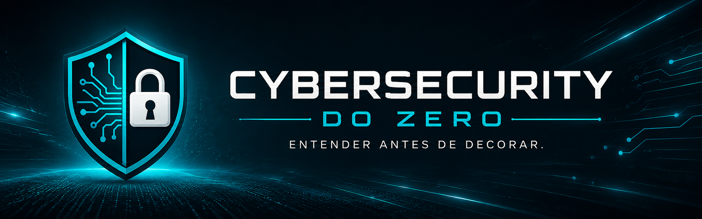

<div class="hero-banner">
  
</div>

<div class="hero-content" markdown>

# Cybersecurity do Zero

## Entender antes de decorar.

Uma documentação criada para registrar minha jornada de aprendizado em cybersecurity e ajudar outras pessoas que também estão começando na área.

[Começar pelos fundamentos](fundamentos/){ .md-button .md-button--primary }
[Ver projeto no GitHub](https://github.com/willianhirata/cybersecurity-do-zero){ .md-button }

</div>

---

## Sobre o projeto

O **Cybersecurity do Zero** é um projeto público de estudo, documentação e prática.

A proposta é construir uma base sólida antes de avançar para ferramentas, certificações e áreas mais específicas da segurança da informação.

Aqui você encontrará:

- explicações simples e organizadas;
- conceitos fundamentais de cybersecurity;
- redes e sistemas operacionais;
- segurança defensiva;
- OSINT e Threat Intelligence;
- laboratórios e exercícios práticos;
- referências para aprofundamento.

!!! tip "A ideia principal"

    Ferramentas mudam. Os fundamentos permanecem.

---

## Comece por aqui

<div class="grid cards" markdown>

-   :material-shield-lock-outline:{ .lg .middle } **Fundamentos**

    ---

    Conceitos essenciais de segurança da informação, riscos, ameaças, vulnerabilidades e controles.

    [:octicons-arrow-right-24: Começar](fundamentos/)

-   :material-lan:{ .lg .middle } **Redes**

    ---

    Protocolos, modelos de comunicação, endereçamento, serviços e análise de tráfego.

    [:octicons-arrow-right-24: Explorar](redes/)

-   :material-linux:{ .lg .middle } **Linux**

    ---

    Terminal, sistema de arquivos, permissões, processos e administração básica.

    [:octicons-arrow-right-24: Explorar](linux/)

-   :material-microsoft-windows:{ .lg .middle } **Windows**

    ---

    Estrutura do sistema, usuários, serviços, logs e recursos de segurança.

    [:octicons-arrow-right-24: Explorar](windows/)

-   :material-radar:{ .lg .middle } **Blue Team**

    ---

    Monitoramento, análise de eventos, detecção de ameaças e resposta a incidentes.

    [:octicons-arrow-right-24: Explorar](blue-team/)

-   :material-magnify:{ .lg .middle } **OSINT**

    ---

    Coleta e análise de informações disponíveis publicamente.

    [:octicons-arrow-right-24: Explorar](osint/)

-   :material-earth:{ .lg .middle } **Threat Intelligence**

    ---

    Inteligência de ameaças, indicadores de comprometimento e contextualização de ataques.

    [:octicons-arrow-right-24: Explorar](threat-intelligence/)

-   :material-flask-outline:{ .lg .middle } **Laboratórios**

    ---

    Exercícios práticos para transformar conhecimento teórico em experiência.

    [:octicons-arrow-right-24: Praticar](laboratorios/)

</div>

---

## Trilha recomendada

Para quem está começando, esta é a sequência sugerida:

```text
Fundamentos
    ↓
Redes
    ↓
Linux e Windows
    ↓
Blue Team
    ↓
OSINT e Threat Intelligence
    ↓
Laboratórios