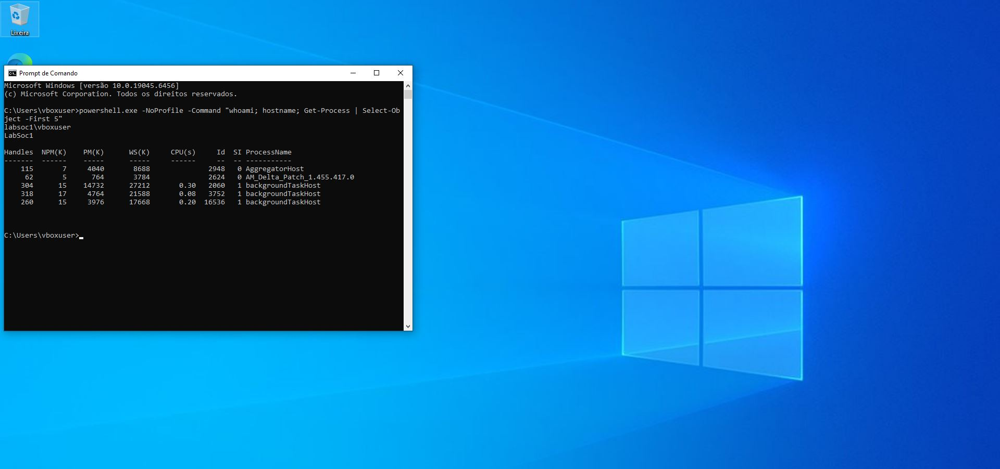
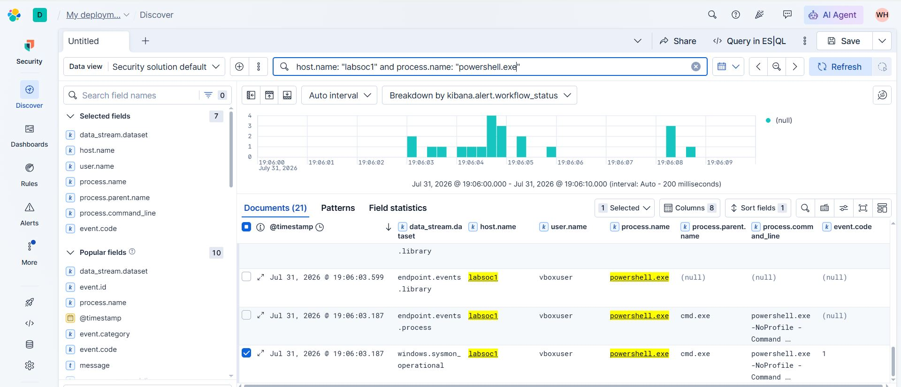
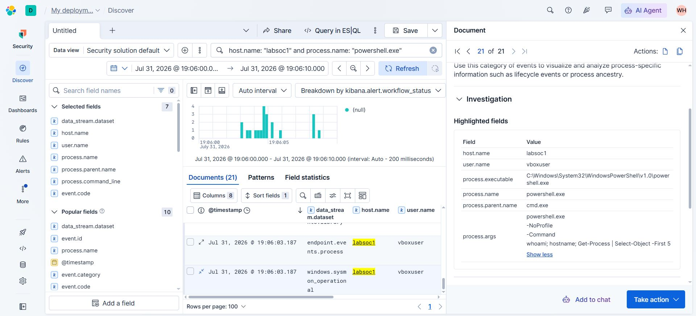
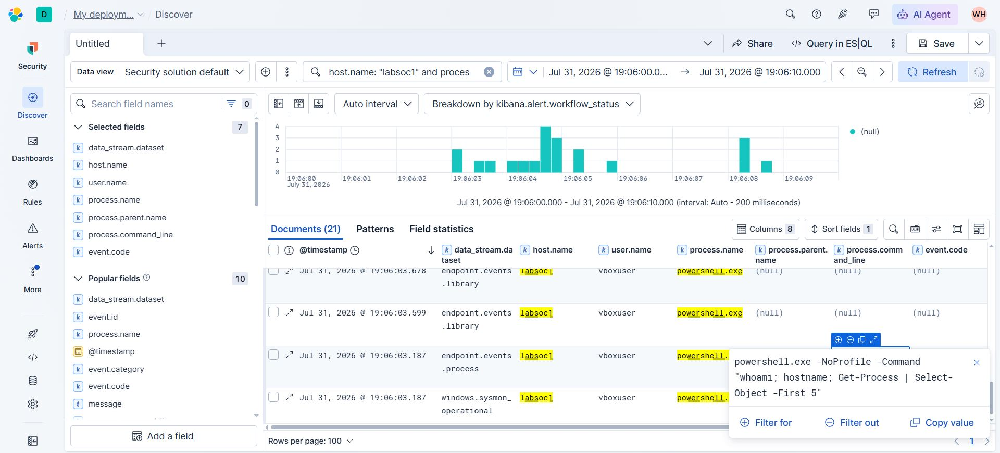

title: Caso SOC #001 — Investigação de execução do PowerShell
description: Análise prática de logs do Windows utilizando Sysmon, Elastic Defend e Elastic Security para investigar uma execução do PowerShell.
---

# Caso SOC #001 — Investigação de execução do PowerShell

> **Entender antes de decorar.**

---

| Informação | Detalhes |
|---|---|
| **Projeto** | Cybersecurity do Zero |
| **Categoria** | Laboratório SOC |
| **Nível** | Iniciante |
| **Ambiente** | Windows 10, Sysmon, Elastic Agent, Elastic Defend e Elastic Cloud |
| **Objetivo** | Investigar uma execução do PowerShell e determinar se a atividade é legítima ou suspeita |

---

## Introdução

Depois de preparar a máquina virtual, instalar o Elastic Agent, configurar o Elastic Defend e integrar os eventos do Sysmon ao Elastic, chegou o momento de botar a mão na massa e começar a praticar.

Neste primeiro caso, vamos investigar uma execução do **PowerShell** identificada em uma estação Windows.

O PowerShell é uma ferramenta legítima e muito utilizada por administradores. Ao mesmo tempo, também pode ser empregado por atacantes para executar comandos, coletar informações, baixar arquivos e realizar outras ações.

Por isso, encontrar `powershell.exe` nos logs não significa automaticamente que ocorreu um ataque.

> **O processo é apenas o ponto de partida. O contexto é o que permite entender o evento.**

---

## Estrutura do laboratório

O laboratório utilizado nesta análise possui a seguinte estrutura:

```text
Windows 10 — Máquina Virtual
        │
        ├── Sysmon
        │     └── Geração de eventos detalhados do Windows
        │
        ├── Elastic Defend
        │     └── Telemetria e proteção do endpoint
        │
        └── Elastic Agent
              └── Envio dos eventos para o Elastic Cloud
                         │
                         ├── Fleet
                         ├── Elasticsearch
                         ├── Kibana
                         └── Elastic Security
```

O **Sysmon** e o **Elastic Defend** podem registrar informações relacionadas à mesma atividade. Isso não representa necessariamente um erro ou uma duplicação indevida.

Cada fonte possui sua própria forma de observar e estruturar o evento.

---

## Cenário da investigação

## 1 — Execução do comando na máquina virtual



---

## 2 — Triagem Inicial

Durante o monitoramento do endpoint, foi identificada a execução do PowerShell na máquina do laboratório.



> **Comentário da análise:**
> “Comecei delimitando o período, host e os processos envolvidos. Esse filtro reduz o ruído e ajuda a construir a sequência dos acontecimentos.”

---

## 3 — Processo pai e linha de comando



Ao expandir a linha de comando, podemos identificar as seguintes informações:

```text
host.name: labsoc1
user.name: vboxuser
process.executable: C:\Windows\System32\WindowsPowerShell\v1.0\powershell.exe
process.name: powershell.exe
process.parent.name: cmd.exe
process.args: powershell.exe-NoProfile-Commandwhoami; hostname; Get-Process | Select-Object -First 5Show less
```

> **Comentário da análise:**  
> "A atividade foi gerada de forma controlada. Como sabemos exatamente qual comando foi executado, podemos verificar se a telemetria coletada representa corretamente o comportamento observado na máquina."



> **Comentário da análise:**
> “O PowerShell foi iniciado pelo cmd.exe. A linha de comando mostra que foram executados comandos de identificação do usuário, da máquina e dos processos ativos.”

---

## Imagem 4 — Processos filhos


> **Comentário da análise:**
> “Os eventos seguintes confirmam que o PowerShell iniciou ferramentas nativas de descoberta. Esse comportamento também pode ser utilizado por atacantes, mas precisa ser analisado dentro do contexto.”

---

## Construindo uma linha do tempo

Então nossa timeline ficou assim:

| Ordem | Horário | Processo | Processo pai | Ação observada |
|---:|---|---|---|---|
| 1 | `Jul 31, 2026 @ 19:06:03.187` | `powershell.exe` | `cmd.exe` | PowerShell iniciado |
| 2 | `Jul 31, 2026 @ 19:06:07.325` | `whoami.exe` | `powershell.exe` | Identificação do usuário |
| 3 | `Jul 31, 2026 @ 19:06:07.432` | `hostname.exe` | `powershell.exe` | Identificação da máquina |

# Conclusão

### Evidências observadas

| Evidência | Valor encontrado |
|---|---|
| **Horário** | `Jul 31, 2026 @ 19:06:03.187` |
| **Host** | `labsoc1` |
| **Usuário** | `vboxuser` |
| **Processo** | `powershell.exe` |
| **Processo pai** | `cmd.exe` |
| **Linha de comando** | `powershell.exe -NoProfile -Command "whoami; hostname; Get-Process | Select-Object -First 5"` |
| **Event ID** | `1` |
| **Evidência de comprometimento** | `Não identificada` |
| **Classificação** | `Atividade legítima de laboratório` |

### Parecer

```text
Foi identificada a execução do powershell.exe na estação do laboratório.

A análise da linha de comando, do usuário, do processo pai e dos processos
relacionados demonstrou que a atividade foi iniciada manualmente durante
um teste controlado.

Os comandos executados realizaram consultas básicas de identificação do
usuário, da máquina e dos processos ativos.

Não foram encontradas, neste exercício, evidências adicionais que indiquem
algo malicioso ou comprometimento do endpoint.

Classificação final: Falso Positivo.
```


