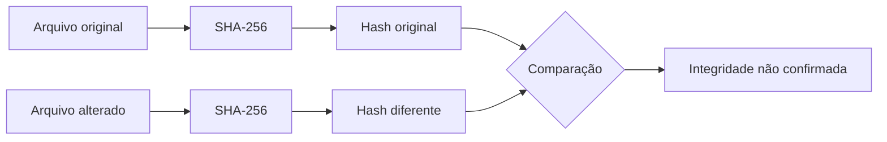

# Laboratório #002 — Detectando alterações com SHA-256 no Kali Linux

> **Entender antes de decorar.**

---

| Informação | Detalhes |
|---|---|
| **Projeto** | Cybersecurity do Zero |
| **Categoria** | Laboratório de Fundamentos |
| **Nível** | Iniciante |
| **Tempo estimado** | 10 a 15 minutos |
| **Ambiente** | Kali Linux |
| **Ferramentas** | Terminal, `printf`, `sha256sum`, `diff` e `xxd` |
| **Objetivo** | Verificar como uma alteração mínima no conteúdo produz um hash SHA-256 completamente diferente |
| **Conteúdo relacionado** | [Criptografia, hash e assinatura digital](../fundamentos/010-criptografia-hash-assinatura-digital.md) |

---

## Objetivo do laboratório

Neste exercício, criaremos dois arquivos de texto quase idênticos.

A única diferença será uma letra:

```text
Entender antes de decorar.
Entender antes de decoraR.
```

Depois, calcularemos o hash SHA-256 de cada arquivo e compararemos os resultados.

Ao final, você será capaz de:

- criar arquivos pelo terminal do Kali Linux;
- calcular hashes SHA-256 com `sha256sum`;
- comparar a integridade de dois arquivos;
- entender o efeito avalanche;
- confirmar que o hash detecta alterações, mas não mostra diretamente o que mudou;
- documentar evidências de um laboratório simples.

---

## Cenário

Imagine que você recebeu um arquivo chamado `mensagem.txt`.

Junto com ele, o remetente informou o hash SHA-256 original.

Antes de confiar no conteúdo, você precisa responder:

> **O arquivo recebido ainda é exatamente igual ao arquivo original?**

Visualmente, uma alteração pode passar despercebida.

```text
Original:  Entender antes de decorar.
Alterado:  Entender antes de decoraR.
```

Porém, para uma função hash criptográfica, os conteúdos não são iguais.



---

## O que é SHA-256?

O **SHA-256** é uma função hash criptográfica que produz uma saída de 256 bits.

Essa saída costuma ser representada por 64 caracteres hexadecimais.

Exemplo:

```text
2cf24dba5fb0a30e26e83b2ac5b9e29e...
```

Para a mesma entrada, o resultado será o mesmo.

Quando o conteúdo muda, mesmo que apenas um caractere seja alterado, o hash também muda.

Esse comportamento ajuda a verificar a integridade de:

- arquivos baixados;
- evidências digitais;
- backups;
- ferramentas;
- documentos;
- artefatos encontrados em uma investigação.

!!! note "O hash não protege o conteúdo contra leitura"
    O objetivo deste exercício é verificar integridade.

    O arquivo continuará legível normalmente.

---

## Preparação do ambiente

Abra o terminal do Kali Linux.

Crie a pasta do laboratório:

```bash
mkdir -p ~/laboratorio-hash
```

Entre na pasta:

```bash
cd ~/laboratorio-hash
```

Confirme o diretório atual:

```bash
pwd
```

Resultado esperado:

```text
/home/kali/laboratorio-hash
```

O nome do usuário pode ser diferente em sua instalação.

---

## Imagem 1 — Preparação do laboratório

<!--
Sugestão de arquivo:
assets/lab-002-hash-kali/01-preparacao-do-laboratorio.png

Inclua um print do terminal mostrando:
- a criação da pasta;
- o comando cd;
- o resultado de pwd;
- o prompt do usuário do Kali.

Evite mostrar informações pessoais ou outros diretórios não relacionados.
-->


> **Comentário da análise:**  
> O laboratório foi isolado em um diretório próprio. Isso facilita a organização dos arquivos, reduz erros e permite remover todo o conteúdo ao final do exercício.

---

## Etapa 1 — Criar o arquivo original

Utilize `printf` para gravar o conteúdo:

```bash
printf 'Entender antes de decorar.\n' > mensagem-original.txt
```

O símbolo `>` envia a saída do comando para o arquivo.

O trecho `\n` adiciona uma quebra de linha ao final.

Confira o conteúdo:

```bash
cat mensagem-original.txt
```

Resultado esperado:

```text
Entender antes de decorar.
```

Verifique também os detalhes do arquivo:

```bash
ls -lh mensagem-original.txt
```

---

## Etapa 2 — Calcular o primeiro hash

Execute:

```bash
sha256sum mensagem-original.txt
```

Você verá uma saída semelhante a:

```text
HASH_DE_64_CARACTERES  mensagem-original.txt
```

O valor exato depende dos bytes gravados no arquivo.

Salve o hash em uma variável:

```bash
hash_original=$(sha256sum mensagem-original.txt | awk '{print $1}')
```

Exiba o valor:

```bash
echo "$hash_original"
```

!!! warning "Copie os comandos exatamente"
    Espaços, acentos, pontuação e quebras de linha fazem parte do conteúdo.

    Qualquer diferença nesses bytes produz outro hash.

---

## Imagem 2 — Arquivo original e primeiro hash

<!--
Sugestão de arquivo:
assets/lab-002-hash-kali/02-hash-original.png

Inclua um print mostrando:
- o comando printf;
- o conteúdo exibido com cat;
- o comando sha256sum;
- o hash original completo;
- o nome mensagem-original.txt.
-->


> **Comentário da análise:**  
> O hash calculado representa exatamente o conteúdo atual do arquivo. Ele será utilizado como referência para verificar se uma alteração ocorreu.

---

## Etapa 3 — Criar a versão alterada

Faça uma cópia do arquivo original:

```bash
cp mensagem-original.txt mensagem-alterada.txt
```

Agora substitua apenas o último `r` minúsculo por `R` maiúsculo:

```bash
sed -i 's/decorar\./decoraR./' mensagem-alterada.txt
```

Confira os dois conteúdos:

```bash
echo "Arquivo original:"
cat mensagem-original.txt

echo
echo "Arquivo alterado:"
cat mensagem-alterada.txt
```

Resultado esperado:

```text
Arquivo original:
Entender antes de decorar.

Arquivo alterado:
Entender antes de decoraR.
```

---

## Imagem 3 — Alteração de um único caractere

<!--
Sugestão de arquivo:
assets/lab-002-hash-kali/03-alteracao-do-conteudo.png

Inclua um print mostrando:
- o comando cp;
- o comando sed;
- o conteúdo dos dois arquivos;
- a diferença entre decorar e decoraR.

Deixe a letra alterada visível na captura.
-->


> **Comentário da análise:**  
> Visualmente, a mudança parece pequena. Apenas uma letra foi alterada. Para o SHA-256, entretanto, os dois conjuntos de bytes representam entradas diferentes.

---

## Etapa 4 — Calcular o segundo hash

Calcule o hash da versão alterada:

```bash
sha256sum mensagem-alterada.txt
```

Armazene o resultado:

```bash
hash_alterado=$(sha256sum mensagem-alterada.txt | awk '{print $1}')
```

Mostre os dois valores:

```bash
echo "Hash original:"
echo "$hash_original"

echo
echo "Hash alterado:"
echo "$hash_alterado"
```

Os resultados deverão ser completamente diferentes.

```text
Pequena alteração no conteúdo
              ↓
Grande alteração no resultado
              ↓
Efeito avalanche
```

---

## Etapa 5 — Comparar automaticamente

Execute:

```bash
if [ "$hash_original" = "$hash_alterado" ]; then
    echo "[OK] Os hashes são iguais. A integridade foi confirmada."
else
    echo "[ALERTA] Os hashes são diferentes. O conteúdo foi alterado."
fi
```

Resultado esperado:

```text
[ALERTA] Os hashes são diferentes. O conteúdo foi alterado.
```

Essa comparação não informa qual caractere mudou.

Ela responde apenas se os conteúdos utilizados nos cálculos são iguais ou diferentes.

---

## Imagem 4 — Comparação dos hashes

<!--
Sugestão de arquivo:
assets/lab-002-hash-kali/04-comparacao-dos-hashes.png

Inclua um print mostrando:
- o hash original;
- o hash alterado;
- o resultado da comparação automática;
- a mensagem de que o conteúdo foi alterado.

Este é o principal print do laboratório.
-->


> **Comentário da análise:**  
> A comparação confirmou que os arquivos não possuem o mesmo conteúdo. O hash permite detectar a mudança mesmo quando a diferença é pequena e difícil de perceber visualmente.

---

## Etapa 6 — Descobrir o que mudou

O hash informa que existe uma diferença, mas não mostra qual é.

Para visualizar a alteração, utilize:

```bash
diff -u mensagem-original.txt mensagem-alterada.txt
```

A saída deverá destacar:

```diff
-Entender antes de decorar.
+Entender antes de decoraR.
```

Também podemos observar a representação hexadecimal:

```bash
xxd mensagem-original.txt
```

```bash
xxd mensagem-alterada.txt
```

A letra `r` minúscula possui valor hexadecimal:

```text
72
```

A letra `R` maiúscula possui valor hexadecimal:

```text
52
```

Portanto, uma mudança em apenas um byte foi suficiente para alterar completamente o SHA-256.

---

## Imagem 5 — Identificação da diferença

<!--
Sugestão de arquivo:
assets/lab-002-hash-kali/05-diferenca-dos-arquivos.png

Inclua um print mostrando:
- a saída do diff -u;
- a linha removida;
- a linha adicionada;
- opcionalmente a saída do xxd;
- a diferença entre os bytes 72 e 52.
-->


> **Comentário da análise:**  
> O `sha256sum` detectou que os conteúdos eram diferentes. Já o `diff` e o `xxd` ajudaram a localizar a alteração. Ferramentas diferentes respondem perguntas diferentes durante uma análise.

---

## Perguntas do laboratório

Tente responder antes de abrir as explicações.

??? question "1. Os arquivos possuem conteúdos visualmente muito diferentes?"
    Não. Apenas um caractere foi alterado.

??? question "2. Os hashes ficaram parecidos?"
    Não. A pequena alteração produziu resultados completamente diferentes.

??? question "3. O hash informa qual caractere mudou?"
    Não. Ele ajuda a identificar que o conteúdo não é o mesmo, mas não localiza a alteração.

??? question "4. O hash impede que alguém leia o arquivo?"
    Não. O arquivo permanece em texto claro.

??? question "5. Hashes iguais confirmam que o arquivo veio de uma fonte confiável?"
    Não necessariamente. Eles confirmam que os conteúdos comparados são iguais. A origem do hash também precisa ser confiável.

??? question "6. Um hash diferente prova que o arquivo contém malware?"
    Não. Ele prova apenas que o conteúdo é diferente daquele utilizado no cálculo de referência.

---

## Aplicação em uma investigação

Imagine que uma empresa publique um instalador acompanhado deste valor:

```text
SHA-256 oficial: ABC123...
```

Depois do download, o analista calcula:

```text
SHA-256 local: XYZ789...
```

A decisão segura é:

1. interromper a execução;
2. confirmar se a versão baixada é a correta;
3. verificar a origem do download;
4. calcular o hash novamente;
5. consultar a assinatura digital;
6. investigar uma possível corrupção ou substituição.

> **Hash diferente não significa automaticamente malware, mas significa que a integridade esperada não foi confirmada.**

---

## Conclusão do analista

Preencha a tabela com os resultados do seu laboratório:

| Pergunta | Resposta |
|---|---|
| **Arquivo original** | `mensagem-original.txt` |
| **Arquivo alterado** | `mensagem-alterada.txt` |
| **Algoritmo utilizado** | SHA-256 |
| **Hash original** | `PREENCHER` |
| **Hash alterado** | `PREENCHER` |
| **Os hashes são iguais?** | Não |
| **Qual alteração foi realizada?** | `r` minúsculo para `R` maiúsculo |
| **A integridade foi confirmada?** | Não |
| **O exercício representa malware?** | Não |
| **Classificação** | Atividade legítima de laboratório |

### Parecer

```text
Foram analisados dois arquivos de texto utilizando o algoritmo SHA-256.

Os arquivos apresentavam apenas uma diferença visual: a substituição
da letra “r” minúscula pela letra “R” maiúscula.

Os hashes calculados foram completamente diferentes, confirmando que
os conteúdos não eram idênticos.

A atividade demonstrou o efeito avalanche e a utilização de hashes
para verificação de integridade.
```

---

## Limpeza do ambiente

Volte ao diretório inicial:

```bash
cd ~
```

Remova a pasta do laboratório:

```bash
rm -rf ~/laboratorio-hash
```

!!! danger "Confira o caminho antes de executar rm -rf"
    O comando remove arquivos de forma recursiva.

    Neste exercício, execute-o somente com o caminho exato `~/laboratorio-hash`.

---

## Evidências utilizadas

Ao final, você deverá possuir cinco imagens:

```text
assets/
└── lab-002-hash-kali/
    ├── 01-preparacao-do-laboratorio.png
    ├── 02-hash-original.png
    ├── 03-alteracao-do-conteudo.png
    ├── 04-comparacao-dos-hashes.png
    └── 05-diferenca-dos-arquivos.png
```

As imagens devem mostrar uma sequência lógica:

```text
Preparação
    ↓
Hash original
    ↓
Alteração
    ↓
Comparação dos hashes
    ↓
Identificação da diferença
```

---

## Checklist de conclusão

- [ ] Criei a pasta do laboratório.
- [ ] Criei o arquivo original.
- [ ] Calculei o primeiro SHA-256.
- [ ] Criei uma cópia alterada.
- [ ] Modifiquei apenas um caractere.
- [ ] Calculei o segundo SHA-256.
- [ ] Comparei os dois hashes.
- [ ] Confirmei que os resultados eram diferentes.
- [ ] Localizei a alteração com `diff`.
- [ ] Registrei as cinco evidências.
- [ ] Preenchi a conclusão do analista.
- [ ] Removi os arquivos ao final.

---

## Resumo

Neste laboratório, aprendemos que:

- o comando `sha256sum` calcula o SHA-256 de um arquivo;
- o mesmo conteúdo produz o mesmo hash;
- uma pequena mudança produz um resultado muito diferente;
- esse comportamento é chamado de efeito avalanche;
- o hash ajuda a verificar integridade;
- o hash não protege confidencialidade;
- o hash não informa diretamente o que mudou;
- um resultado diferente exige análise, mas não prova atividade maliciosa.

> **O hash não conta toda a história, mas avisa quando a história foi alterada.**

---

## Navegação

[← Voltar ao capítulo de Criptografia](../fundamentos/010-criptografia-hash-assinatura-digital.md){ .md-button }

<!--
[Próximo laboratório →](lab-003-nome-do-proximo-laboratorio.md){ .md-button .md-button--primary }
-->

---

**Entender antes de decorar.**
