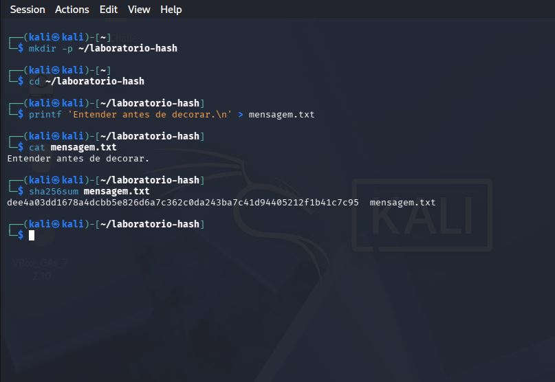
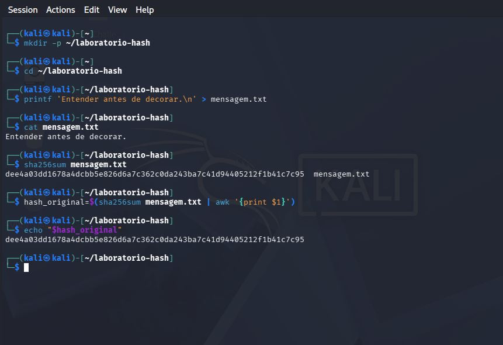
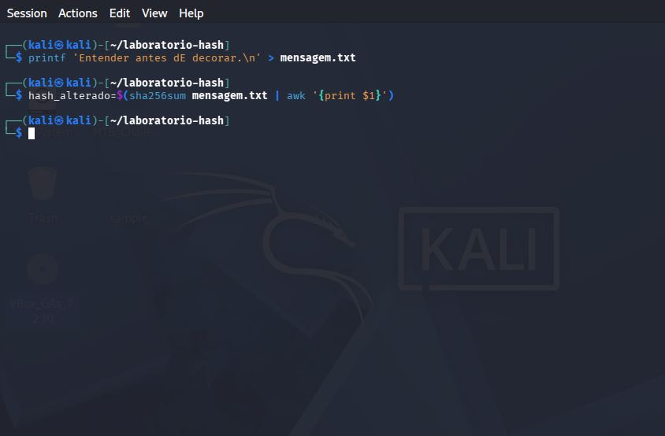
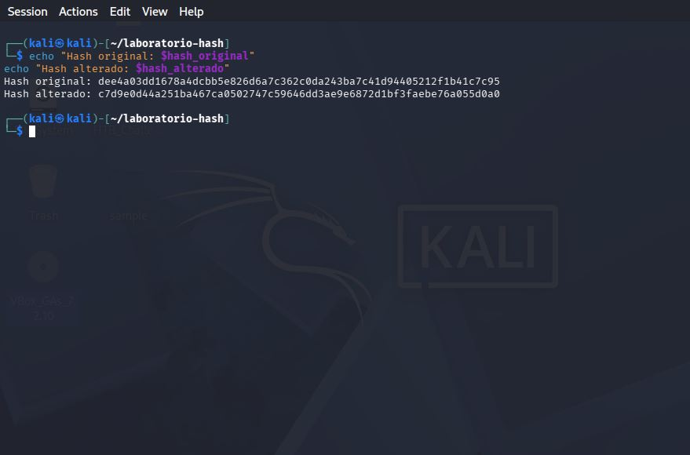

# Laboratório 002 — Verificando a Integridade de Arquivos com SHA-256

> Neste laboratório vamos comprovar, na prática, como uma pequena alteração em um arquivo gera um hash completamente diferente.

**Tempo estimado:** 5 a 10 minutos

**Ambiente:** Kali Linux

---

## Objetivo

Neste exercício você irá:

- criar um arquivo;
- calcular seu hash SHA-256;
- alterar apenas um caractere;
- comparar os resultados.

Se ainda não estudou o conceito de hash, recomendo ler primeiro o capítulo:

👉 **Capítulo 010 — Criptografia, Hash e Assinatura Digital**

---

# Etapa 1 — Criando o arquivo

```bash
mkdir -p ~/laboratorio-hash
cd ~/laboratorio-hash

printf 'Entender antes de decorar.\n' > mensagem-original.txt
```

### 📷 Evidência 1


---

# Etapa 2 — Calculando o hash

```bash
sha256sum mensagem-original.txt
```

Anote o valor retornado.

### 📷 Evidência 2



---

# Etapa 3 — Vamos guardar o primeiro Hash em uma variável

```bash
hash_original=$(sha256sum mensagem.txt | awk '{print $1}')
```

Confira o conteúdo:

```bash
echo "$hash_original"
```

### 📷 Evidência 3



---

# Etapa 4 — Agora vamos alterar apenas um caractere.

```bash
printf 'Entender antes dE decorar.\n' > mensagem.txt
```

Salve em uma variável

```bash
hash_alterado=$(sha256sum mensagem.txt | awk '{print $1}')
```

### 📷 Evidência 4



---

# Etapa 5 — Descobrindo a diferença

```bash
echo "Hash original: $hash_original"
echo "Hash alterado: $hash_alterado"
```

### 📷 Evidência 5



---

## Resultado esperado

Ao final do laboratório você deverá concluir que:

- apenas **um caractere** foi alterado;
- os hashes ficaram **completamente diferentes**;
- o SHA-256 detectou a alteração do conteúdo;
- o hash **não informa** qual caractere mudou, apenas que os arquivos não são idênticos.

---

## Próximo passo

Agora volte ao capítulo **Criptografia, Hash e Assinatura Digital** e continue seus estudos.

[← Voltar ao capítulo](../fundamentos/010-criptografia-hash-assinatura-digital.md){ .md-button }
