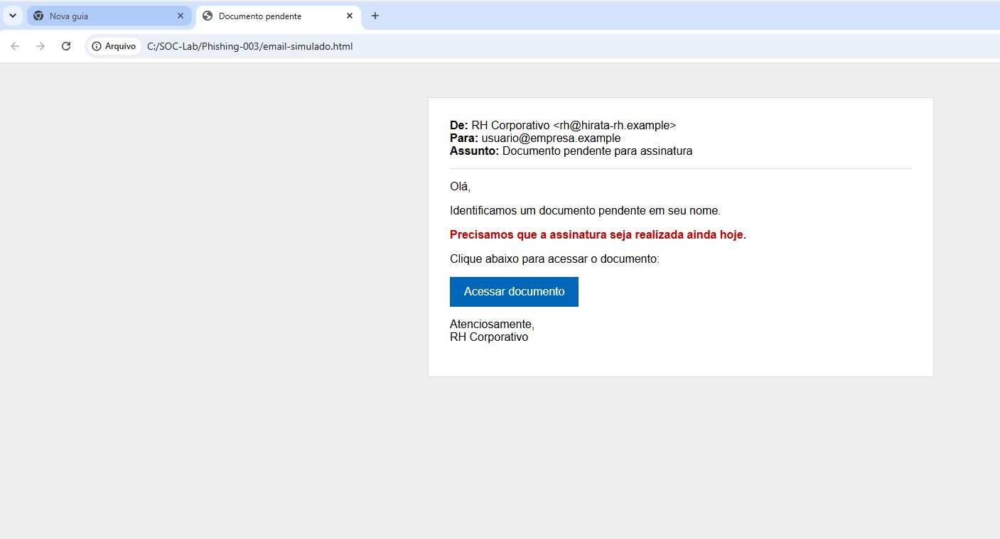
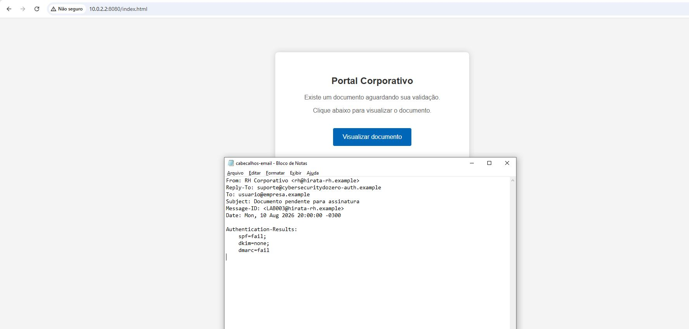
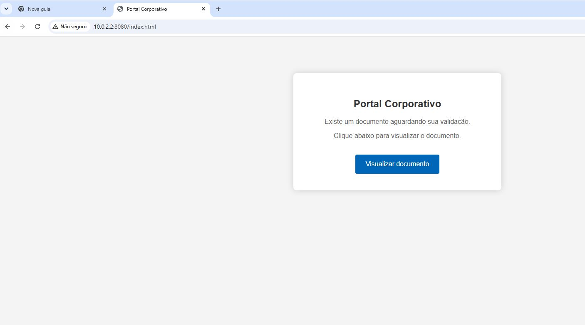
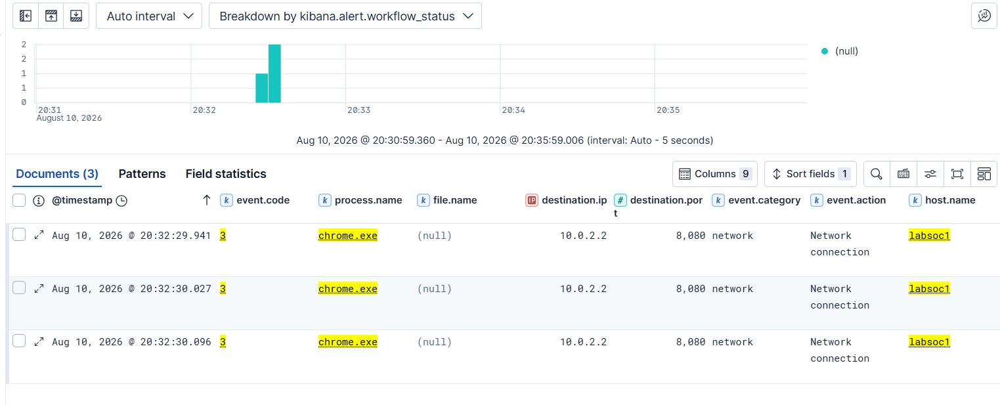
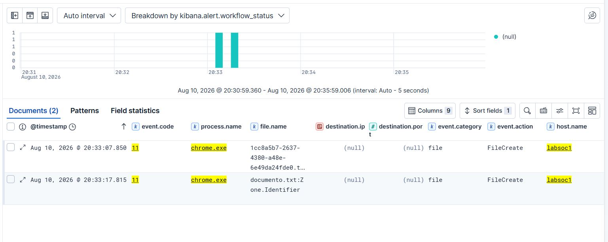
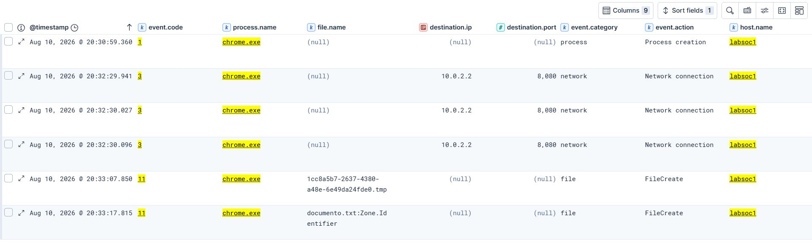

# LAB 003 — Simulação e Investigação de Phishing

> **Entender antes de decorar.**

| Informação | Detalhes |
|---|---|
| **Categoria** | Laboratório |
| **Nível** | Iniciante |
| **Tempo estimado** | 10 a 15 minutos |
| **Ambiente** | Windows 10 + Sysmon + Elastic |
| **Capítulo relacionado** | [Capítulo 012 — Engenharia Social e Phishing](../fundamentos/012-engenharia-social-e-phishing.md) |

## Objetivo

Simular um phishing de forma controlada e depois comprovar a interação do usuário por meio da telemetria coletada no Elastic.

```text
Phishing
   ↓
Clique no link
   ↓
Página falsa
   ↓
Download
   ↓
Sysmon
   ↓
Elastic
```

Caalma que nenhum malware real será utilizado.

# Parte 1 — Simulação do phishing

## 1. Abrir o e-mail simulado

Primeiro de tudo, em nossa VM Windows, executei um HTML utilizado para representar o e-mail.

A mensagem contém um falso aviso do RH solicitando acesso urgente a um documento.

### Evidência 1 — E-mail de phishing



## 2. Análise inicial do email

Antes de iniciar vamos fazer uma triagem básica da mensagem analisando o arquivo com os cabeçalhos simulados.

E aqui encontramos informações como: 

```text
Display Name: RH Corporativo
From: rh@empresa-rh.example
Reply-To: suporte@empresa-auth.example
Subject: Documento pendente para assinatura

SPF: fail
DKIM: none
DMARC: fail
```

Ao analisar o conteúdo da mensagem, encontramos algo como:

- uso de urgência;
- solicitação inesperada;
- domínio diferente do ambiente esperado;
- diferença entre `From` e `Reply-To`;
- link apontando para `http://10.0.2.2:8080/index.html`.

Neste ponto, já existem indicadores suficientes para classificar a mensagem como suspeita e continuar a investigação sem confiar apenas na aparência do e-mail.



## 2. Acessar a página falsa

Aqui simulamos a vítima clicando no  botão e o navegador acessando:

```text
http://10.0.2.2:8080/index.html
```

A página apresenta o botão:

```text
Visualizar documento
```

### Evidência 2 — Página falsa



## 3. Realizar o download

Agora, nesse momento a vítima clica em:

```text
Visualizar documento
```

E o navegador faz o download de um arquivo que parece inofensivo:

```text
documento.txt
```

### Evidência 3 — Download no navegador


# Parte 2 — Análise no Elastic

Agora assumimos o papel do analista SOC.

O objetivo é verificar se a telemetria confirma que o usuário acessou a infraestrutura do phishing e realizou o download do arquivo.

## 4. Procurar a conexão de rede

No Elastic utilizei a ajuda de alguns filtros para facilitar a busca:

```kql
host.name: "labsoc1"
and event.code: "3"
and process.name: "chrome.exe"
and destination.ip: "10.0.2.2"
and destination.port: 8080
```

Campos importantes:

```text
@timestamp
event.code
process.name
destination.ip
destination.port
host.name
```

### Evidência 4 — Conexão com a infraestrutura do phishing



## 5. Procurar a criação do arquivo

Agora nesse momento, filtramos para ver se houve criação de arquivo:

```kql
host.name: "labsoc1"
and event.code: "11"
and process.name: "chrome.exe"
```

Durante o download, o Sysmon registrou arquivos temporários e o seguinte artefato:

```text
documento.txt:Zone.Identifier
```

Esse evento ajuda a comprovar que o arquivo foi criado no endpoint durante a atividade do navegador.

### Evidência 5 — Evento de criação do arquivo



## 6. Montar a timeline

E agora vem o momento crucial, onde detalhamos a timeline completa que ficou assim:

```text
chrome.exe iniciado
      ↓
conexão com 10.0.2.2:8080
      ↓
download iniciado
      ↓
arquivo criado
```

### Evidência 6 — Timeline completa



# Conclusão

A simulação permitiu comprovar tecnicamente a interação com o phishing.

```text
E-mail
   ↓
Clique
   ↓
Chrome
   ↓
10.0.2.2:8080
   ↓
Download
   ↓
documento.txt
```

Durante a investigação identificamos:

- processo responsável;
- endereço IP e porta de destino;
- eventos de rede;
- eventos de criação de arquivo;
- sequência temporal da atividade.

O cenário pode ser relacionado a:

```text
T1566.002 — Spearphishing Link
T1204.001 — Malicious Link
```

O principal aprendizado é que não basta dizer que uma mensagem “parece phishing”.

Precisamos buscar evidências que mostrem **o que aconteceu depois da interação do usuário**.

[← Voltar ao Capítulo 012 — Engenharia Social e Phishing](../fundamentos/012-engenharia-social-e-phishing.md){ .md-button }

> **Entender antes de decorar.**
