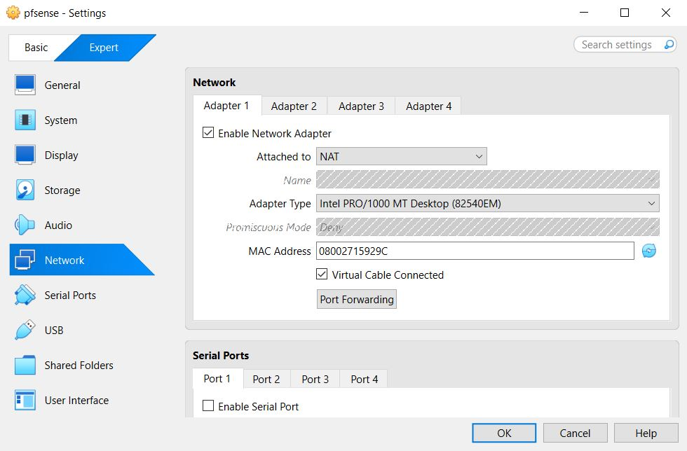
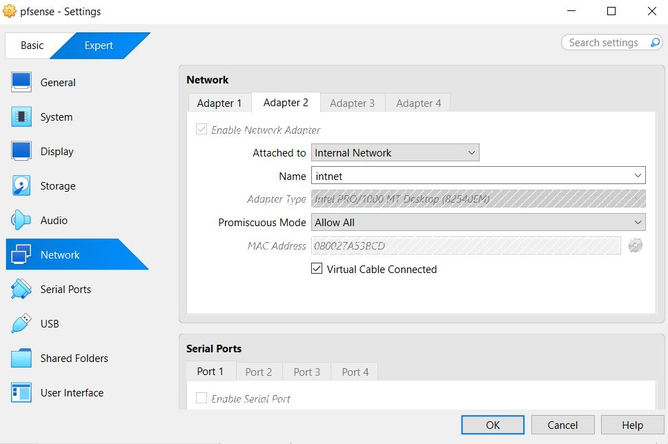
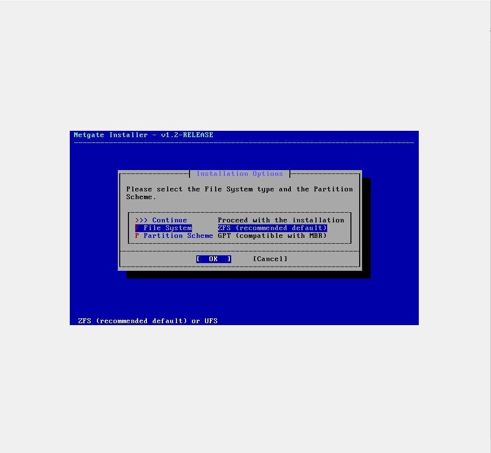
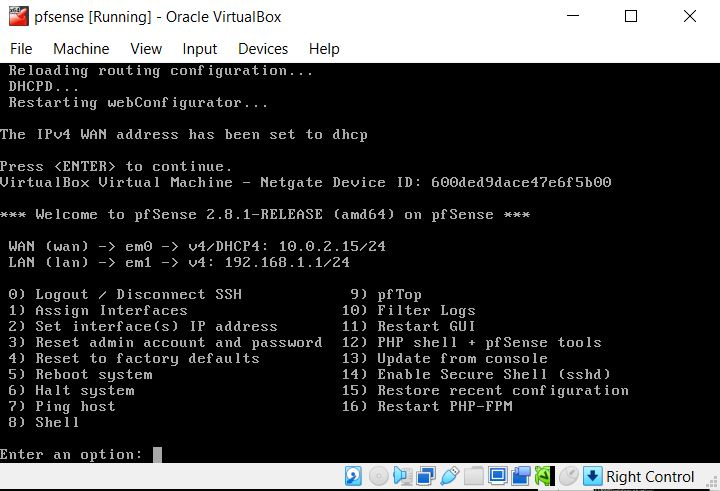
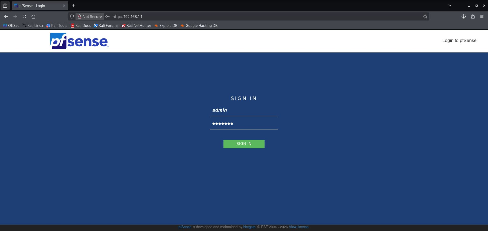
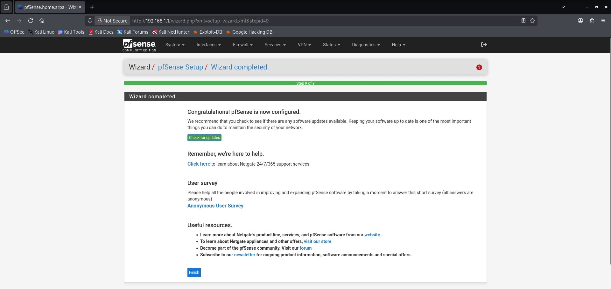
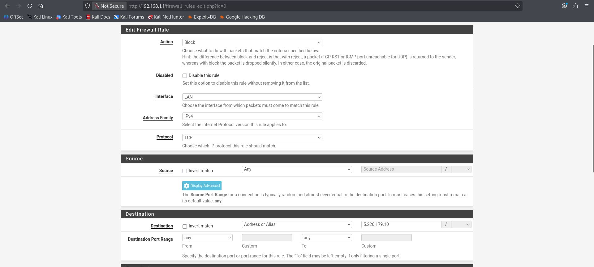
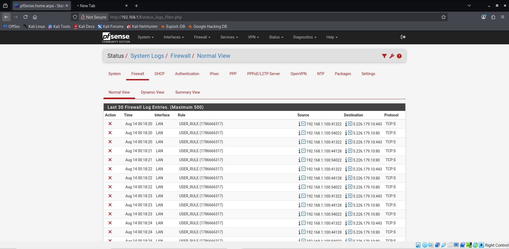
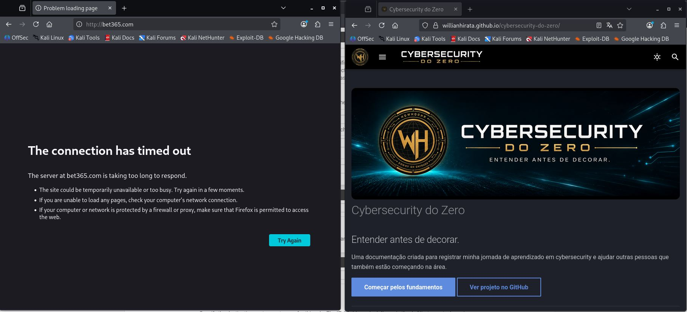

# Lab-004 — Configuração Básica de Firewall com pfSense

## Objetivo

Instalar, configurar e operar um firewall pfSense em ambiente virtualizado, aplicando uma regra de bloqueio de tráfego e validando seu funcionamento através dos logs do sistema.

## Ambiente e ferramentas

- **VirtualBox:** Oracle Virtual Box
- **Firewall:** pfSense CE (Community Edition)
- **Rede WAN:** NAT (acesso à internet)
- **Rede LAN:** Rede Interna (rede interna)
- **Cliente de teste:** VM auxiliar conectada à rede LAN

## Habilidades demonstradas

`Virtualização de rede` `Instalação de firewall` `Configuração de interfaces WAN/LAN` `Criação de regras de firewall` `Análise de logs` 

## Etapas executadas

### 1. Preparação do ambiente

Criação da VM no VirtualBox com duas interfaces de rede — uma para WAN (NAT) e outra para LAN (Internal Network) — simulando a topologia de um firewall separando a rede interna da internet.

 

### 2. Instalação do pfSense

Instalação do sistema a partir da ISO oficial, com particionamento automático (ZFS).

### 3. Atribuição de interfaces

No console, associação das interfaces de rede detectadas às funções WAN e LAN.

### 4. Acesso à interface web e wizard inicial

Acesso via navegador a partir da VM cliente, autenticação com credenciais padrão e conclusão do assistente de configuração inicial, incluindo a troca da senha padrão de administrador.

 

### 5. Criação de regra de firewall

Criação de uma regra de bloqueio na interface LAN, restringindo o acesso a um destino específico a partir da rede interna.

### 6. Validação do bloqueio

Teste de acesso ao destino bloqueado a partir da VM cliente (falha esperada) e confirmação da ação via logs do sistema.

 

## Resultados

A regra de firewall aplicada bloqueou corretamente o tráfego direcionado ao destino definido, com o evento registrado nos logs do sistema. O acesso a demais destinos permaneceu funcional, confirmando que a regra não afetou o restante do tráfego da rede.

## Conclusão

Este laboratório cobriu o ciclo completo de um firewall perimetral: instalação, atribuição de interfaces, definição de regras e validação via logs — base essencial para atuação em ambientes de Blue Team, onde o entendimento de controles de rede é pré-requisito para análise de tráfego e detecção de anomalias.
