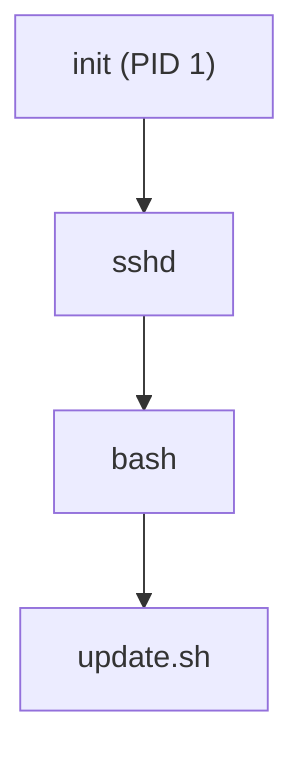

# Capítulo 005 — Processos: o que está rodando no sistema

> **Entender antes de decorar.**

---

| Informação | Detalhes |
|---|---|
| **Módulo** | 03 — Linux |
| **Nível** | Iniciante |
| **Tempo estimado** | 15 a 20 minutos |
| **Pré-requisito** | [Capítulo 004 — Permissões de Arquivos no Linux](004-permissoes-de-arquivos-no-linux.md) |

---

## Objetivo deste capítulo

Ao final deste capítulo, você será capaz de:

- explicar o que é um processo e como ele se diferencia de um programa parado no disco;
- usar `ps` e `top`/`htop` para listar processos em execução;
- interpretar colunas essenciais como PID, PPID, uso de CPU e memória;
- reconhecer por que relações pai-filho incomuns são um forte indício de comprometimento;
- usar `kill` corretamente, entendendo a diferença entre um sinal padrão e `kill -9`;
- entender por que encerrar um processo sem preservar evidências pode prejudicar uma investigação.

---

## Como sempre, vamos começar utilizando nossa imaginação.

Você já sabe, do capítulo anterior, que o `update.sh` em `/tmp` tem permissões extremamente abertas — `-rwxrwxrwx`. Mas uma pergunta ainda está em aberto: **ele já foi executado? Está rodando agora, neste exato momento?**

```text
Opção A
"Vou abrir o arquivo e ler o código, isso já resolve minha dúvida."

Opção B
"Preciso primeiro verificar se ele está ativo como processo agora, no sistema."
```

Ler o conteúdo de um script é útil, mas não te diz se ele já foi disparado, quem o disparou, ou o que ele gerou depois de rodar. Para isso, você precisa olhar não para arquivos parados, mas para o que está **vivo** no sistema neste momento.

> **Um arquivo malicioso parado no disco é uma ameaça em potencial. Um processo malicioso em execução é uma ameaça acontecendo agora.**

---

# O que é um processo?

Um **processo** é uma instância em execução de um programa. O arquivo `update.sh` parado em `/tmp` é só um programa; no momento em que alguém (ou algo) o executa, o sistema cria um processo para ele, com um identificador único: o **PID** (Process ID).

```text
Programa no disco  → arquivo parado, sem atividade
Processo em memória → programa em execução, com PID, consumindo CPU e memória
```

---

# ps — a fotografia dos processos em execução

O comando `ps` mostra os processos ativos no momento em que você o executa — uma "fotografia", não uma visão contínua.

```bash
ps aux
```

| Coluna | O que representa |
|---|---|
| **USER** | Usuário que iniciou o processo |
| **PID** | Identificador único do processo |
| **%CPU** | Percentual de CPU sendo consumido |
| **%MEM** | Percentual de memória sendo consumido |
| **COMMAND** | Comando/programa que gerou o processo |

Para ver a relação entre processos, uma variação diferente ajuda mais:

```bash
ps -ef
```

Essa versão inclui a coluna **PPID** (Parent Process ID) — de onde vem a próxima seção deste capítulo.

---

# Processos pai e filho — a árvore de processos

Todo processo no Linux (com exceção do primeiro, o `init`/`systemd`, sempre PID 1) tem um **processo pai** — aquele que o originou. Essa relação forma uma árvore, visualizável com:

```bash
pstree
```



Essa árvore, aparentemente só organizacional, é uma das ferramentas de detecção mais poderosas em segurança. Considere este exemplo real e amplamente conhecido em investigações:

```text
Esperado:    nginx (servidor web) → processo filho de rede, sem gerar shell
Suspeito:    nginx (servidor web) → gerando um processo bash
```

Um servidor web **não deveria**, em circunstância normal, gerar um processo de shell como filho. Quando isso acontece, é um dos sinais mais clássicos de que uma vulnerabilidade na aplicação web permitiu execução remota de comando — o atacante explorou a aplicação, e o servidor "gerou" um shell para ele controlar.

!!! tip "O nome do processo não é prova de nada, sozinho"
    Atacantes frequentemente nomeiam processos maliciosos de forma parecida com processos legítimos do sistema — como `cronn` em vez de `cron`, ou `sshdd` em vez de `sshd`. Olhar só o nome, sem checar o PPID e o caminho completo do executável, é fácil de enganar.

---

# top / htop — observando em tempo real

Diferente do `ps` (uma fotografia), `top` mostra os processos **em tempo real**, atualizando a cada poucos segundos:

```bash
top
```

O `htop`, quando disponível, oferece a mesma informação em formato mais legível, com cores e navegação mais fácil — mas geralmente precisa ser instalado separadamente, já que não vem por padrão em todas as distribuições.

Essa visão contínua é especialmente útil para identificar processos consumindo recursos de forma anômala — um cenário clássico sendo mineração de criptomoeda não autorizada, que costuma aparecer como um processo consumindo CPU de forma constante e incomum, muitas vezes com nome disfarçado.

---

# Encerrando processos com kill

```bash
kill 4521          # envia SIGTERM (pedido educado de encerramento)
kill -9 4521       # envia SIGKILL (encerramento forçado, imediato)
```

A diferença é importante: `SIGTERM` (o sinal padrão) pede ao processo para se encerrar de forma organizada, e o processo pode até ignorar esse pedido. `SIGKILL` (`-9`) encerra imediatamente, sem chance do processo reagir ou salvar qualquer estado.

!!! tip "Nem sempre matar o processo é o primeiro passo certo"
    Durante uma resposta a incidente real, encerrar um processo malicioso imediatamente pode destruir evidências valiosas — informações de memória, conexões de rede ativas, arquivos abertos por aquele processo. Sempre que possível, **capturar essas evidências antes de encerrar** (usando o próprio `/proc/PID`, que vimos no capítulo 002) é a prática mais criteriosa.

---

# Aplicação em um SOC

### Ao investigar processos suspeitos

- verificar o PPID de qualquer processo incomum — uma relação pai-filho inesperada (como um servidor web gerando um shell) costuma ser mais confiável do que o nome do processo;
- comparar o caminho completo do executável, não só o nome exibido.

### Ao usar ferramentas de monitoramento contínuo

- usar `top`/`htop` para identificar picos de CPU ou memória fora do padrão esperado para aquele servidor.

### Ao conter um incidente

- preservar evidências (informações de `/proc/PID`, conexões de rede associadas) antes de encerrar um processo suspeito com `kill`, sempre que a situação permitir esse cuidado extra.

---

# Cenário prático — Verificando o update.sh

Voltando à pergunta do início do capítulo:

```bash
$ ps -ef | grep update
root   4521  1382  0  03:14 ?  00:00:02 /tmp/update.sh
```

> O script **está rodando**, com PID `4521`.

> Seu **PPID é 1382** — vale a pena investigar o que esse processo pai é.

```bash
$ ps -ef | grep 1382
root   1382     1  0  03:10 ?  00:00:00 /usr/sbin/nginx
```

> O processo pai é o **nginx**, o servidor web. Um servidor web gerando um script em `/tmp` como processo filho é exatamente o padrão suspeito que discutimos neste capítulo — forte indício de que uma vulnerabilidade na aplicação web permitiu a execução desse script.

Antes de simplesmente rodar `kill -9 4521`, o passo criterioso seria capturar informações desse processo (conexões abertas, arquivos referenciados) para preservar evidências — e só então conter a ameaça.

---

## Perguntas de investigação

??? question "1. O que diferencia um programa de um processo?"
    Um programa é um arquivo parado no disco. Um processo é uma instância em execução desse programa, com um PID único, consumindo recursos do sistema enquanto ativo.

??? question "2. O que o PPID de um processo representa?"
    O PID do processo que o originou (seu processo pai) — permitindo reconstruir a árvore de execução e identificar relações inesperadas.

??? question "3. Por que um servidor web gerando um processo de shell é considerado um forte indício de comprometimento?"
    Porque, em operação normal, um servidor web não deveria gerar processos de shell como filhos — esse padrão costuma indicar que uma vulnerabilidade na aplicação permitiu execução remota de comando.

??? question "4. Qual a diferença entre `kill` padrão e `kill -9`?"
    `kill` padrão envia SIGTERM, um pedido de encerramento que o processo pode tratar ou até ignorar. `kill -9` envia SIGKILL, forçando o encerramento imediato, sem chance de reação do processo.

??? question "5. Por que encerrar um processo suspeito sem antes coletar evidências pode ser um erro durante resposta a incidente?"
    Porque informações valiosas — como conexões de rede ativas, arquivos abertos e o estado do processo em `/proc/PID` — podem se perder permanentemente no momento em que o processo é encerrado.

---

# O que não fazer

- não confie apenas no nome exibido de um processo — nomes podem imitar processos legítimos;
- não ignore o PPID ao investigar um processo suspeito;
- não use `kill -9` como primeira reação automática, sem considerar a preservação de evidências;
- não assuma que uma "fotografia" única do `ps` é suficiente — processos que aparecem e desaparecem rapidamente podem passar despercebidos sem uma visão contínua como `top`.

---

# Erros comuns

### "Todo processo com nome familiar é legítimo"

Não.

Processos maliciosos frequentemente recebem nomes parecidos com processos do sistema, exatamente para passar despercebidos numa checagem superficial.

### "kill -9 é sempre a forma certa de parar um processo suspeito"

Não.

Em muitos casos, sim, mas encerrar de forma abrupta sem preservar evidências pode custar informações valiosas para a investigação.

### "Processos pai e filho não importam, só o nome do processo importa"

Não.

A relação pai-filho frequentemente denuncia comprometimentos que o nome do processo, isoladamente, jamais revelaria.

---

# Resumo

Neste capítulo, aprendemos que:

- um **processo** é a instância em execução de um programa, identificado por um **PID**;
- **ps** mostra uma fotografia dos processos ativos; **top**/**htop** mostram isso em tempo real;
- todo processo tem um **PPID**, e relações pai-filho incomuns (como um servidor web gerando um shell) são fortes indícios de comprometimento;
- **kill** envia SIGTERM (pedido de encerramento); **kill -9** envia SIGKILL (encerramento forçado e imediato);
- preservar evidências antes de encerrar um processo suspeito é uma prática criteriosa em resposta a incidentes.

```text
Não pergunte apenas:

"Esse processo parece suspeito pelo nome?"

Pergunte também:

"Qual é o PPID desse processo, e isso faz sentido?"
"Eu preservei evidências antes de decidir encerrar esse processo?"
"O caminho completo do executável confere com o que o nome sugere?"
```

> **O nome de um processo é a primeira coisa que um atacante aprende a disfarçar. O PPID é bem mais difícil de mascarar.**

---

# Checkpoint

Antes de seguir para o próximo capítulo, confirme se você consegue responder:

- [ ] O que diferencia um programa de um processo?
- [ ] O que `ps aux` e `ps -ef` mostram, e quando usar cada um?
- [ ] O que é o PPID, e por que ele é útil na investigação?
- [ ] Por que um servidor web gerando um shell é um sinal de alerta?
- [ ] Qual a diferença entre `kill` e `kill -9`?
- [ ] Por que preservar evidências antes de encerrar um processo importa?

---

# Glossário

| Termo | Definição |
|---|---|
| **Processo** | Instância em execução de um programa, identificada por um PID. |
| **PID** | Process ID; identificador único de um processo em execução. |
| **PPID** | Parent Process ID; identificador do processo que originou outro processo. |
| **ps** | Comando que exibe uma fotografia dos processos em execução no momento. |
| **top / htop** | Comandos que exibem processos em execução de forma contínua, atualizada em tempo real. |
| **SIGTERM** | Sinal padrão enviado por `kill`, solicitando encerramento organizado de um processo. |
| **SIGKILL** | Sinal enviado por `kill -9`, forçando encerramento imediato de um processo. |

---

# Referências

- [man7.org — Página de manual do ps](https://man7.org/linux/man-pages/man1/ps.1.html)
- [man7.org — Página de manual do kill](https://man7.org/linux/man-pages/man1/kill.1.html)
- [man7.org — Página de manual de signal](https://man7.org/linux/man-pages/man7/signal.7.html)

---

# Próximo capítulo

No próximo capítulo, vamos entender como processos de longa duração são gerenciados no Linux através de **serviços e do systemd** — a diferença entre um processo pontual e um serviço que deveria estar sempre rodando.

[← Capítulo anterior: Permissões de Arquivos](004-permissoes-de-arquivos-no-linux.md){ .md-button }

---

> **Entender antes de decorar.**
