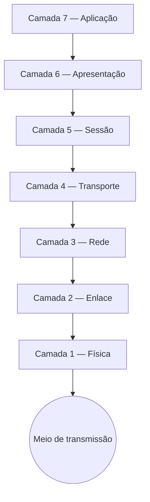

# Capítulo 002 — Modelo OSI

> **Entender antes de decorar.**

---

| Informação | Detalhes |
|---|---|
| **Módulo** | 02 — Redes |
| **Nível** | Iniciante |
| **Tempo estimado** | 10 a 15 minutos |
| **Pré-requisito** | [Capítulo 001 — Introdução às Redes e por que importam para Segurança](001-introducao-as-redes-e-por-que-importam-para-seguranca.md) |

---

## Objetivo deste capítulo

Ao final deste capítulo, você será capaz de:

- explicar o que é o Modelo OSI e por que ele foi criado;
- descrever a função de cada uma das 7 camadas;
- relacionar cada camada a ferramentas e tipos de ataque comuns em segurança;
- entender por que o modelo funciona como uma linguagem comum entre times de rede, infraestrutura e segurança;
- identificar em qual camada diferentes comportamentos suspeitos costumam ocorrer;
- reconhecer que o OSI é um modelo conceitual, não o que é literalmente implementado na prática.

---

## Como sempre, vamos começar utilizando nossa imaginação.

Imagine que você está em uma sala de guerra — um incidente em andamento.

O analista de rede está compartilhando a tela e diz:

> "Isso aqui parece um ataque de ARP spoofing. É coisa de camada 2."

Todo mundo na chamada balança a cabeça, como se tivesse entendido perfeitamente.

Você também balança a cabeça.

Mas por dentro:

```text
Opção A
"Camada 2... deixa eu fingir que sei do que ele tá falando."

Opção B
"Não sei o que é 'camada 2'. Preciso entender isso pra acompanhar a investigação de verdade."
```

"Camada 2" não é jargão aleatório. É uma referência direta ao **Modelo OSI** — e sem conhecer esse modelo, boa parte da comunicação entre times técnicos em um incidente vira ruído.

> **O Modelo OSI não é decoreba de entrevista. É o vocabulário usado por quem investiga rede todos os dias.**

---

# O que é o Modelo OSI?

**OSI** significa **Open Systems Interconnection** — um modelo conceitual criado pela ISO na década de 1980 para organizar como sistemas se comunicam em uma rede.

Ele divide a comunicação em **7 camadas**, cada uma responsável por uma função específica.

| Camada | Nome | Exemplo do que resolve |
|---|---|---|
| 7 | Aplicação | Como o programa apresenta a informação (HTTP, DNS, e-mail) |
| 6 | Apresentação | Como os dados são formatados e criptografados |
| 5 | Sessão | Como a comunicação é iniciada, mantida e encerrada |
| 4 | Transporte | Como os dados chegam de forma confiável (TCP/UDP, portas) |
| 3 | Rede | Como os dados são endereçados e roteados (IP) |
| 2 | Enlace | Como os dispositivos se comunicam na mesma rede local (MAC, switches) |
| 1 | Física | Como os bits realmente trafegam (cabo, sinal, rádio) |

!!! tip "O OSI é um modelo, não uma implementação exata"
    Na prática, a internet funciona sobre o **Modelo TCP/IP**, que é mais enxuto. Veremos isso no próximo capítulo. Mesmo assim, o OSI continua sendo a referência mais usada para explicar e organizar conceitos de rede.

---

# Por que dividir a comunicação em camadas?

Pense em uma carta enviada pelo correio.

Você escreve o conteúdo, coloca em um envelope, escreve o endereço, e entrega para o carteiro. Cada etapa tem uma responsabilidade diferente — e você não precisa entender como o caminhão dos correios funciona pra escrever uma carta.

Em uma rede, acontece algo parecido: cada camada adiciona sua própria "camada de envelope" antes de passar o dado adiante.



Esse processo de "empacotar" os dados em cada camada se chama **encapsulamento**. Do outro lado, o processo é inverso: cada camada "desempacota" sua parte.

As vantagens de pensar em camadas:

- facilita isolar onde está um problema ("é rede ou é aplicação?");
- permite que fabricantes e protocolos diferentes funcionem juntos;
- ajuda a mapear responsabilidades — inclusive de segurança.

---

# As 7 camadas, uma a uma

### Camada 7 — Aplicação

É onde o usuário e os programas interagem com a rede: navegador, cliente de e-mail, aplicativo.

**Protocolos comuns:** HTTP, HTTPS, DNS, SMTP, FTP.

**Relevância para segurança:** a maioria dos ataques que um usuário percebe diretamente acontece aqui — phishing, injeção SQL, XSS, exploração de APIs.

### Camada 6 — Apresentação

Responsável por formatar, compactar e criptografar os dados, garantindo que sistemas diferentes "falem a mesma língua".

**Exemplos:** criptografia TLS/SSL, codificação de caracteres, compressão.

**Relevância para segurança:** problemas de certificado, downgrade de criptografia e interceptação de tráfego (MITM) têm relação direta com essa camada.

### Camada 5 — Sessão

Controla a abertura, manutenção e encerramento de uma sessão de comunicação entre dois sistemas.

**Relevância para segurança:** sequestro de sessão (session hijacking) e fixação de sessão exploram falhas nesse controle.

### Camada 4 — Transporte

Garante que os dados cheguem de forma confiável (ou não, dependendo do protocolo), usando **portas** para identificar qual serviço deve receber a informação.

**Protocolos:** TCP (confiável, com verificação) e UDP (mais rápido, sem verificação).

**Relevância para segurança:** varredura de portas (port scanning), SYN flood e boa parte das regras de firewall tradicionais operam aqui.

### Camada 3 — Rede

Responsável por **endereçamento** (IP) e **roteamento** — decidir por qual caminho os dados devem seguir até o destino.

**Relevância para segurança:** IP spoofing, ataques de roteamento e boa parte das regras de firewall também atuam nessa camada.

### Camada 2 — Enlace

Trata da comunicação entre dispositivos dentro da **mesma rede local**, usando endereços **MAC** — o "RG" físico de uma placa de rede.

**Relevância para segurança:** ARP spoofing, MAC flooding e VLAN hopping são ataques clássicos dessa camada — inclusive o exemplo do início deste capítulo.

### Camada 1 — Física

O nível mais básico: cabos, sinais elétricos, ópticos ou de rádio que efetivamente transportam os bits.

**Relevância para segurança:** grampos físicos em cabos, acesso não autorizado a racks e pontos de rede, e interferência de sinal.

---

# Onde ataques comuns se encaixam no modelo

Uma forma prática de fixar o conceito é relacionar ataques conhecidos à camada onde costumam ocorrer:

| Camada | Ataques/comportamentos comuns |
|---|---|
| 7 — Aplicação | Phishing, SQL Injection, XSS |
| 4 — Transporte | Port scanning, SYN flood |
| 3 — Rede | IP spoofing, ataques via ICMP |
| 2 — Enlace | ARP spoofing, MAC flooding |
| 1 — Física | Acesso físico não autorizado, grampos de cabo |

Vamos explorar cada um desses ataques com mais profundidade em capítulos futuros deste módulo — por enquanto, o objetivo é só conseguir **localizar** o comportamento dentro do modelo.

!!! tip "Um jeito de lembrar (depois de entender)"
    Só depois de entender a função de cada camada, um mnemônico ajuda a fixar a ordem. Um dos mais usados, de cima para baixo (7 → 1), é **"All People Seem To Need Data Processing"**. Decore só depois de entender — não no lugar de entender.

---

# Aplicação em um SOC

### Sobre um alerta ou incidente

- em qual camada esse comportamento acontece?
- isso ajuda a definir quem deve ser acionado: time de rede, infraestrutura ou aplicação?
- o problema está na entrega dos dados (camadas baixas) ou no conteúdo da comunicação (camadas altas)?

### Sobre ferramentas

- firewalls tradicionais atuam principalmente nas camadas 3 e 4 (IP e porta);
- um **WAF** (Web Application Firewall) atua na camada 7, entendendo conteúdo HTTP;
- IDS/IPS podem inspecionar múltiplas camadas ao mesmo tempo, dependendo da configuração.

Entender em qual camada uma ferramenta atua ajuda a saber **o que ela consegue enxergar** — e o que ela não consegue.

---

# Cenário prático — Voltando à sala de guerra

Lembra do início do capítulo?

```text
"Isso aqui parece um ataque de ARP spoofing. É coisa de camada 2."
```

Agora, com o modelo em mente, essa frase passa a fazer sentido:

> Camada 2 = comunicação dentro da rede local, usando endereços MAC.

> ARP spoofing = manipulação da relação entre IP e MAC dentro dessa rede local.

Você ainda não precisa saber executar ou investigar um ARP spoofing em detalhes — isso vem em um capítulo futuro. Mas já consegue **posicionar** o problema: não é algo vindo de fora pela internet, é algo acontecendo dentro do mesmo segmento de rede.

Essa é a diferença entre ouvir "camada 2" e travar, ou ouvir "camada 2" e já ter uma direção de raciocínio.

---

## Perguntas de investigação

??? question "1. Por que separar a comunicação em camadas ajuda a investigar um incidente?"
    Porque permite isolar em qual etapa da comunicação o problema está ocorrendo, direcionando a investigação e os times corretos com mais precisão.

??? question "2. Um firewall tradicional, que filtra por IP e porta, enxerga o conteúdo de uma requisição HTTP?"
    Geralmente não. Firewalls tradicionais atuam nas camadas 3 e 4. Para inspecionar conteúdo da camada 7, normalmente é necessário um WAF ou uma ferramenta com inspeção profunda de pacotes.

??? question "3. ARP spoofing é um ataque que vem de fora da rede local?"
    Não. Por atuar na camada 2, ARP spoofing normalmente exige que o atacante esteja no mesmo segmento de rede local que a vítima.

??? question "4. O Modelo OSI é exatamente o que roda na internet hoje?"
    Não. A internet funciona, na prática, sobre o Modelo TCP/IP, que é mais enxuto. O OSI continua sendo usado como referência didática e conceitual.

---

# O que não fazer

- não trate o OSI como decoreba de sigla para prova de certificação;
- não assuma que segurança só acontece na camada de aplicação;
- não ignore camadas "mais baixas" (física, enlace) por parecerem menos relevantes;
- não confunda o modelo conceitual (OSI) com o modelo realmente implementado (TCP/IP) sem entender a diferença.

---

# Erros comuns

### "OSI é só decoreba pra prova de certificação"

Não.

É a base conceitual usada para descrever, investigar e conversar sobre praticamente qualquer comportamento de rede.

### "O Modelo OSI é implementado exatamente assim na prática"

Não.

O que roda de fato é o Modelo TCP/IP, que veremos no próximo capítulo — mais enxuto, mas construído sobre a mesma lógica de camadas.

### "Segurança só acontece na camada de aplicação"

Não.

Ataques acontecem em praticamente todas as camadas — de grampos físicos de cabo até injeção de código em uma aplicação web.

### "Camada mais baixa é menos importante"

Não.

Um ataque bem-sucedido na camada 2, como ARP spoofing, pode comprometer toda a comunicação de uma rede local — independente do quão segura seja a aplicação rodando por cima.

---

# Resumo

Neste capítulo, aprendemos que:

- o **Modelo OSI** organiza a comunicação em rede em **7 camadas**;
- cada camada tem uma função específica, da física (cabos) até a aplicação (programas);
- o processo de empacotar dados entre camadas se chama **encapsulamento**;
- diferentes ataques e ferramentas de segurança se relacionam a camadas específicas;
- o OSI é um modelo conceitual — o que realmente roda na internet é o Modelo TCP/IP;
- entender o modelo ajuda a **localizar** um problema e direcionar a investigação corretamente.

```text
Não pergunte apenas:

"Em que camada isso acontece?"

Pergunte também:

"O que essa camada é responsável por fazer?"
"Que ferramentas enxergam esse nível de comunicação?"
"Isso muda quem deve investigar o incidente?"
```

> **O Modelo OSI não resolve o incidente sozinho. Mas te dá o mapa para saber onde procurar.**

---

# Checkpoint

Antes de seguir para o próximo capítulo, confirme se você consegue responder:

- [ ] O que é o Modelo OSI e por que ele foi criado?
- [ ] Quais são as 7 camadas, na ordem?
- [ ] O que é encapsulamento?
- [ ] Qual a função da camada de Transporte?
- [ ] Qual a função da camada de Enlace?
- [ ] Em qual camada ocorre normalmente um ataque de ARP spoofing?
- [ ] Em qual camada um WAF atua?
- [ ] O Modelo OSI é o que roda de fato na internet?
- [ ] Por que conhecer o modelo ajuda na investigação de um incidente?

---

# Glossário

| Termo | Definição |
|---|---|
| **OSI** | Open Systems Interconnection; modelo conceitual de 7 camadas para organizar a comunicação em rede. |
| **Camada** | Nível do modelo OSI responsável por uma função específica da comunicação. |
| **Encapsulamento** | Processo de adicionar informações de controle aos dados à medida que passam por cada camada. |
| **MAC** | Media Access Control; endereço físico único de uma interface de rede, usado na camada de Enlace. |
| **ARP** | Address Resolution Protocol; protocolo que relaciona endereços IP a endereços MAC na rede local. |
| **WAF** | Web Application Firewall; firewall especializado em inspecionar tráfego na camada de Aplicação. |

---

# Referências

- [Cloudflare — O que é o Modelo OSI?](https://www.cloudflare.com/learning/ddos/glossary/open-systems-interconnection-model-osi/)
- [Imperva — OSI Model](https://www.imperva.com/learn/application-security/osi-model/)
- [Cisco Networking Academy](https://www.netacad.com/courses/networking)

---

# Próximo capítulo

No próximo capítulo, vamos estudar o **Modelo TCP/IP** — o modelo que realmente roda na internet — e entender como ele se relaciona com o OSI que acabamos de ver.

[← Capítulo anterior: Introdução às Redes](001-introducao-as-redes-e-por-que-importam-para-seguranca.md){ .md-button }

[Próximo: Modelo TCP/IP →](003-modelo-tcp-ip.md){ .md-button .md-button--primary }

---

> **Entender antes de decorar.**
