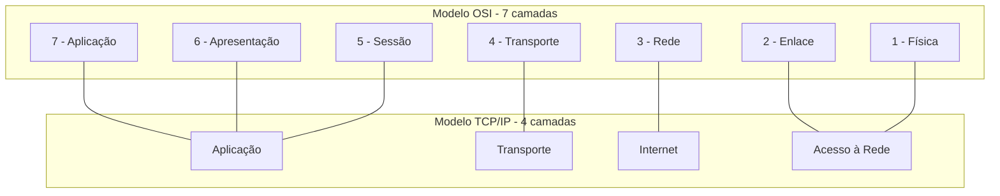
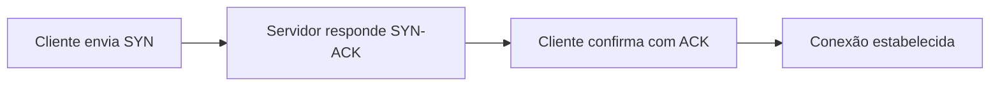

# Capítulo 003 — Modelo TCP/IP

> **Entender antes de decorar.**

---

| Informação | Detalhes |
|---|---|
| **Módulo** | 02 — Redes |
| **Nível** | Iniciante |
| **Tempo estimado** | 10 a 15 minutos |
| **Pré-requisito** | [Capítulo 002 — Modelo OSI](002-modelo-osi.md) |

---

## Objetivo deste capítulo

Ao final deste capítulo, você será capaz de:

- explicar o que é o Modelo TCP/IP e por que ele existe;
- relacionar as 4 camadas do TCP/IP às 7 camadas do OSI;
- diferenciar TCP e UDP e saber quando cada um é usado;
- entender o que é o *three-way handshake* e por que ele importa para segurança;
- reconhecer por que profissionais de segurança usam termos dos dois modelos ao mesmo tempo;
- interpretar, de forma básica, como uma ferramenta de captura de tráfego organiza os dados por camada.

---

## Como sempre, vamos começar utilizando nossa imaginação.

Imagine que você acabou de instalar o Wireshark e capturou seu primeiro tráfego de rede.

Abre o primeiro pacote da lista e vê algo assim:

```text
Frame 1: 74 bytes
Ethernet II
Internet Protocol Version 4
Transmission Control Protocol
Hypertext Transfer Protocol
```

Você franze a testa.

Cadê "Camada 5 — Sessão"? Cadê "Camada 6 — Apresentação"?

```text
Opção A
"Alguma coisa está errada. Isso não bate com o que eu estudei."

Opção B
"Talvez o que roda de verdade na rede siga outro modelo, mais enxuto."
```

Nada está errado. O que você está vendo é o **Modelo TCP/IP** — o modelo que efetivamente é implementado na internet. O OSI, que vimos no capítulo anterior, é a referência conceitual; o TCP/IP é a prática.

> **Você vai ouvir os dois modelos sendo usados o tempo todo, muitas vezes na mesma frase. Por isso, entender os dois — e como se conectam — é essencial.**

---

# O que é o Modelo TCP/IP?

O **TCP/IP** é o conjunto de protocolos que realmente faz a internet funcionar. Foi desenvolvido pelo Departamento de Defesa dos EUA (DoD) ainda nos anos 1970, antes mesmo do modelo OSI existir.

Diferente do OSI, que tem 7 camadas conceituais, o TCP/IP é organizado em **4 camadas práticas**:

| Camada | Nome | Função resumida |
|---|---|---|
| 4 | Aplicação | Onde os programas e protocolos de usuário operam (HTTP, DNS, SMTP) |
| 3 | Transporte | Garante (ou não) a entrega confiável dos dados (TCP e UDP) |
| 2 | Internet | Endereçamento e roteamento dos pacotes (IP) |
| 1 | Acesso à Rede | Comunicação física e local (equivalente a Enlace + Física do OSI) |

!!! tip "Por que existem dois modelos?"
    O OSI foi pensado como referência **didática e universal**, cobrindo qualquer tipo de rede. O TCP/IP nasceu **da prática**, para resolver o problema real de conectar redes diferentes — e acabou virando o padrão mundial. Por isso o TCP/IP tem menos camadas: ele simplifica o que, na prática, sempre andou junto.

---

# TCP/IP vs OSI — Comparando os modelos

A forma mais simples de entender o TCP/IP é enxergando como ele se sobrepõe ao OSI:



Ou seja: a camada de Aplicação do TCP/IP "absorve" as camadas 5, 6 e 7 do OSI. E a camada de Acesso à Rede absorve as camadas 1 e 2.

!!! tip "Na prática, os dois vocabulários se misturam"
    É comum ouvir alguém falando "firewall de camada 3/4" (termo do OSI) para descrever uma regra que, tecnicamente, opera na camada de Internet e Transporte do TCP/IP. Isso não é erro — é só o jeito como o mercado historicamente misturou os dois modelos. Entender ambos evita que essa mistura vire confusão.

---

# As 4 camadas do modelo TCP/IP

### Camada de Aplicação

Onde vivem os protocolos que o usuário e os sistemas realmente utilizam: HTTP, HTTPS, DNS, SMTP, FTP.

**Relevância para segurança:** é aqui que a maioria dos ataques "visíveis" acontece — phishing, exploração de aplicações web, abuso de APIs.

### Camada de Transporte

Responsável por levar os dados de um ponto a outro, usando **portas** para identificar o serviço de destino. Os dois protocolos principais são **TCP** e **UDP** — que vamos comparar em detalhe a seguir.

**Relevância para segurança:** varredura de portas, ataques de negação de serviço e boa parte das regras de firewall acontecem aqui.

### Camada de Internet

Cuida do **endereçamento** (endereços IP) e do **roteamento** — como os pacotes encontram o caminho até o destino, mesmo passando por várias redes diferentes.

**Relevância para segurança:** IP spoofing e ataques de roteamento atuam nessa camada.

### Camada de Acesso à Rede

Cobre a comunicação física e local — cabos, sinais, endereços MAC, switches. É a junção das camadas Física e Enlace do OSI.

**Relevância para segurança:** ARP spoofing e ataques físicos de rede, como vimos no capítulo anterior.

---

# TCP x UDP — duas formas diferentes de transportar dados

Dentro da camada de Transporte, existem dois protocolos com filosofias opostas.

| | TCP | UDP |
|---|---|---|
| **Confiabilidade** | Garante entrega e ordem dos dados | Não garante entrega nem ordem |
| **Conexão** | Orientado à conexão (handshake) | Sem conexão |
| **Velocidade** | Mais lento (verificação constante) | Mais rápido (sem verificação) |
| **Uso comum** | Navegação web, e-mail, transferência de arquivos | Streaming, chamadas de vídeo, DNS |

### O *three-way handshake* do TCP

Antes de qualquer dado ser trocado, o TCP estabelece uma conexão em três etapas:



**Relevância para segurança:** um **SYN flood** explora justamente essa etapa — o atacante envia muitos pacotes SYN e nunca completa o handshake, esgotando os recursos do servidor que ficam esperando a confirmação.

Já o UDP, por não ter handshake, é explorado de outra forma: em ataques de **amplificação** (como amplificação de DNS), o atacante forja o endereço de origem e faz servidores responderem com um volume de dados muito maior do que o enviado, direcionando essa resposta amplificada para a vítima.

---

# Aplicação em um SOC

### Lendo uma captura de tráfego

Ao abrir uma ferramenta como o Wireshark, os pacotes aparecem organizados de baixo para cima, seguindo a lógica do TCP/IP: Enlace (Ethernet) → Internet (IP) → Transporte (TCP/UDP) → Aplicação (HTTP, DNS, etc.). Saber disso ajuda a entender **onde procurar** a informação que você precisa dentro de um pacote.

### Categorizando alertas

- um alerta sobre volume anormal de conexões incompletas pode indicar SYN flood (camada de Transporte);
- um alerta sobre resposta DNS anormalmente grande pode indicar amplificação (camada de Transporte, protocolo UDP);
- um alerta sobre conteúdo malicioso em uma requisição HTTP está na camada de Aplicação.

---

# Cenário prático — Voltando ao Wireshark

Lembra da captura do início do capítulo?

```text
Frame 1: 74 bytes
Ethernet II
Internet Protocol Version 4
Transmission Control Protocol
Hypertext Transfer Protocol
```

Agora, com o modelo em mente, cada linha faz sentido:

> **Ethernet II** → camada de Acesso à Rede (endereços MAC envolvidos)

> **Internet Protocol Version 4** → camada de Internet (endereços IP de origem e destino)

> **Transmission Control Protocol** → camada de Transporte (portas envolvidas, número de sequência do handshake)

> **Hypertext Transfer Protocol** → camada de Aplicação (o conteúdo da requisição web em si)

Esse é exatamente o tipo de leitura que vamos aprofundar quando chegarmos ao capítulo de Wireshark e tcpdump, mais adiante neste módulo.

---

## Perguntas de investigação

??? question "1. Por que o Modelo TCP/IP tem menos camadas que o OSI?"
    Porque ele nasceu de uma necessidade prática de implementação, agrupando funções que o OSI separa de forma mais didática — por exemplo, unindo Sessão, Apresentação e Aplicação em uma única camada de Aplicação.

??? question "2. Por que um servidor de streaming de vídeo normalmente usa UDP em vez de TCP?"
    Porque em streaming, velocidade e continuidade importam mais do que a garantia de entrega de cada pacote individual. Perder um pacote ocasional é menos prejudicial do que atrasar o fluxo esperando confirmações.

??? question "3. O que caracteriza um ataque de SYN flood?"
    O envio de muitos pacotes SYN sem completar o handshake, fazendo o servidor reservar recursos para conexões que nunca são finalizadas, até esgotar sua capacidade.

??? question "4. Por que um ataque de amplificação costuma usar UDP em vez de TCP?"
    Porque o UDP não verifica a origem da requisição antes de responder, permitindo que um atacante forje o endereço de origem e direcione a resposta amplificada para a vítima — algo mais difícil de fazer com o handshake do TCP.

??? question "5. Por que profissionais de segurança falam em 'camada 3/4' mesmo trabalhando sobre o TCP/IP?"
    Porque o vocabulário do OSI se popularizou como referência de mercado, mesmo com o TCP/IP sendo o que roda de fato. Os dois vocabulários convivem na prática.

---

# O que não fazer

- não trate TCP/IP e OSI como "a mesma coisa com nomes diferentes" — são modelos com propósitos diferentes;
- não assuma que UDP é "pior" só por não garantir entrega — ele é uma escolha de design, não uma falha;
- não interprete um SYN flood apenas como "muito tráfego" — é a exploração específica de uma etapa do handshake;
- não ignore o vocabulário do OSI ao trabalhar com TCP/IP — o mercado usa os dois o tempo todo.

---

# Erros comuns

### "TCP/IP e OSI são a mesma coisa, só com nomes diferentes"

Não.

São modelos com origens e propósitos diferentes. O OSI é referência conceitual; o TCP/IP é o que roda de fato — e as camadas não têm uma correspondência perfeita de um para um.

### "UDP é pior que TCP porque não garante entrega"

Não.

UDP é mais rápido justamente por não ter a verificação do TCP. Para casos como streaming e DNS, essa característica é uma vantagem, não um defeito.

### "SYN flood é só um problema de volume de tráfego"

Não.

É a exploração de uma etapa específica do handshake do TCP — o problema não é só a quantidade, é o fato das conexões nunca serem completadas, prendendo recursos do servidor.

---

# Resumo

Neste capítulo, aprendemos que:

- o **Modelo TCP/IP** é o conjunto de protocolos que realmente roda na internet, organizado em **4 camadas**;
- ele se relaciona ao OSI, mas agrupa funções de forma mais enxuta;
- **TCP** garante entrega e ordem, usando um handshake de três etapas antes de transmitir dados;
- **UDP** é mais rápido, mas não garante entrega nem ordem;
- um **SYN flood** explora o handshake do TCP; ataques de **amplificação** costumam explorar características do UDP;
- ferramentas como o Wireshark organizam o tráfego capturado seguindo a lógica de camadas do TCP/IP.

```text
Não pergunte apenas:

"É TCP ou UDP?"

Pergunte também:

"Esse protocolo precisa de confiabilidade ou de velocidade?"
"Faz sentido esse volume de conexões incompletas?"
"Essa resposta é proporcional à requisição que a originou?"
```

> **O OSI te dá o mapa conceitual. O TCP/IP é o território onde você realmente vai investigar.**

---

# Checkpoint

Antes de seguir para o próximo capítulo, confirme se você consegue responder:

- [ ] O que é o Modelo TCP/IP e por que ele existe?
- [ ] Quais são as 4 camadas do TCP/IP?
- [ ] Como as camadas do TCP/IP se relacionam às do OSI?
- [ ] Qual a diferença fundamental entre TCP e UDP?
- [ ] O que é o *three-way handshake*?
- [ ] O que caracteriza um ataque de SYN flood?
- [ ] Por que ataques de amplificação costumam explorar o UDP?
- [ ] Por que profissionais de segurança misturam terminologia do OSI e do TCP/IP?

---

# Glossário

| Termo | Definição |
|---|---|
| **TCP/IP** | Conjunto de protocolos organizados em 4 camadas que efetivamente implementa a comunicação na internet. |
| **TCP** | Transmission Control Protocol; protocolo de transporte confiável, orientado à conexão. |
| **UDP** | User Datagram Protocol; protocolo de transporte rápido, sem garantia de entrega. |
| **Three-way handshake** | Processo de três etapas (SYN, SYN-ACK, ACK) usado pelo TCP para estabelecer uma conexão. |
| **SYN Flood** | Ataque que explora o handshake do TCP, enviando pacotes SYN sem completar a conexão. |
| **Amplificação** | Técnica de ataque que usa respostas desproporcionalmente grandes, direcionadas a uma vítima com origem forjada. |

---

# Referências

- [Cloudflare — O que é o Modelo TCP/IP?](https://www.cloudflare.com/learning/ddos/glossary/tcp-ip/)
- [Cloudflare — O que é UDP?](https://www.cloudflare.com/learning/ddos/glossary/user-datagram-protocol-udp/)
- [Cloudflare — Ataque de amplificação de DNS](https://www.cloudflare.com/learning/ddos/dns-amplification-ddos-attack/)
- [Cisco Networking Academy](https://www.netacad.com/courses/networking)

---

# Próximo capítulo

No próximo capítulo, vamos estudar **Endereçamento IP e Máscaras de Sub-rede** — como os dispositivos são identificados e organizados dentro de uma rede.

[← Capítulo anterior: Modelo OSI](002-modelo-osi.md){ .md-button }

[Próximo: Endereçamento IP →](004-enderecamento-ip-e-mascaras-de-sub-rede.md){ .md-button .md-button--primary }

---

> **Entender antes de decorar.**
