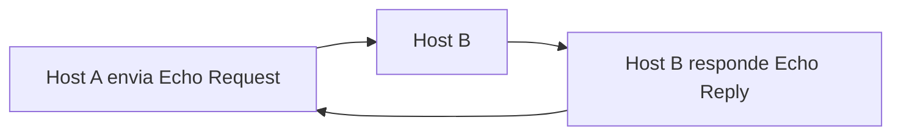

# Capítulo 005 — Portas e Protocolos Essenciais (TCP, UDP, ICMP)

> **Entender antes de decorar.**

---

| Informação | Detalhes |
|---|---|
| **Módulo** | 02 — Redes |
| **Nível** | Iniciante |
| **Tempo estimado** | 10 a 15 minutos |
| **Pré-requisito** | [Capítulo 004 — Endereçamento IP e Máscaras de Sub-rede](004-enderecamento-ip-e-mascaras-de-sub-rede.md) |

---

## Objetivo deste capítulo

Ao final deste capítulo, você será capaz de:

- explicar o que é uma porta e como ela se diferencia de um endereço IP;
- reconhecer as faixas de portas (bem conhecidas, registradas e dinâmicas);
- identificar as portas mais importantes para o dia a dia de um analista de segurança;
- entender o que é o protocolo ICMP e para que ele serve;
- reconhecer por que uma porta incomum costuma ser um sinal de alerta;
- entender por que uma porta "conhecida" não é garantia de tráfego legítimo.

---

## Como sempre, vamos começar utilizando nossa imaginação.

Lembra do primeiríssimo capítulo deste projeto?

```text
Alerta: Conexão de saída suspeita

Host: WORKSTATION-042
Destino: 185.220.101.47
Porta: 4444
Protocolo: TCP
```

Na época, prometemos voltar a essa porta quando tivéssemos base suficiente pra entender o que ela realmente significa.

Chegou a hora.

```text
Opção A
"Porta é só um número, não deveria fazer tanta diferença."

Opção B
"Certas portas contam uma história só de aparecerem onde não deveriam."
```

Ao final deste capítulo, você vai conseguir explicar exatamente por que aquela porta 4444, sozinha, já era motivo suficiente para tirar o sono de qualquer analista de plantão.

> **Uma porta é só um número. Mas alguns números têm reputação.**

---

# O que é uma porta, afinal?

Se o endereço IP identifica **o dispositivo** em uma rede, a **porta** identifica **qual serviço ou aplicação**, dentro daquele dispositivo, deve receber os dados.

```text
Endereço IP  → "para qual prédio enviar"
Porta        → "para qual sala dentro do prédio"
```

Portas são divididas em três faixas:

| Faixa | Intervalo | Uso |
|---|---|---|
| **Bem conhecidas** (Well-known) | 0 – 1023 | Serviços padronizados (HTTP, DNS, SSH, etc.) |
| **Registradas** | 1024 – 49151 | Aplicações específicas registradas na IANA |
| **Dinâmicas / Privadas** | 49152 – 65535 | Atribuídas temporariamente por conexões de saída |

!!! tip "Quem define isso oficialmente?"
    A **IANA** (Internet Assigned Numbers Authority) mantém o registro oficial de portas e os serviços associados a elas. É a fonte mais confiável quando você precisar confirmar se uma porta tem uso padronizado.

---

# Portas essenciais que todo analista deveria reconhecer

Não é necessário decorar centenas de portas — mas algumas aparecem com tanta frequência em logs e investigações que vale a pena internalizar:

| Porta | Serviço | Observação de segurança |
|---|---|---|
| 21 | FTP | Transferência de arquivos, tráfego não criptografado |
| 22 | SSH | Acesso remoto seguro — alvo comum de força bruta |
| 23 | Telnet | Acesso remoto **não criptografado** — presença já é um alerta em redes modernas |
| 25 | SMTP | Envio de e-mail — relevante em investigações de phishing |
| 53 | DNS | Resolução de nomes — também usado em técnicas de exfiltração via DNS |
| 80 | HTTP | Tráfego web não criptografado |
| 443 | HTTPS | Tráfego web criptografado — mas também usado por malware para se camuflar |
| 445 | SMB | Compartilhamento de arquivos Windows — vetor clássico de movimentação lateral |
| 3389 | RDP | Acesso remoto Windows — alvo frequente de força bruta e ransomware |

!!! tip "Você já configurou algumas dessas na prática"
    No laboratório de firewall com pfSense deste projeto, você já lidou com o conceito de portas ao criar regras baseadas em protocolo e destino. Essas mesmas ideias se aplicam a qualquer uma das portas desta tabela.

---

# ICMP — o protocolo por trás do ping

Nem todo protocolo de rede usa TCP ou UDP. O **ICMP** (Internet Control Message Protocol) opera em um nível diferente: ele não transporta dados de aplicação, mas sim **mensagens de controle e diagnóstico** entre dispositivos.

O uso mais conhecido do ICMP é o comando `ping`, que envia uma mensagem *Echo Request* e espera uma *Echo Reply* de volta — testando se um host está acessível.



**Relevância para segurança:**

- **Ping sweep**: um atacante pode enviar ICMP para uma faixa inteira de IPs só para descobrir quais hosts estão ativos — uma técnica clássica de reconhecimento;
- **ICMP tunneling**: como muitas redes permitem ICMP livremente (para diagnóstico), atacantes às vezes escondem dados dentro de pacotes ICMP como canal secreto de comunicação;
- por isso, é comum organizações restringirem ICMP vindo da internet, mesmo sabendo que isso limita ferramentas legítimas de diagnóstico.

---

# Porta incomum = bandeira vermelha (mas não prova definitiva)

Voltando à porta do início do capítulo: **4444** não está na lista de portas bem conhecidas, nem tem um uso oficialmente registrado e amplamente adotado. Na prática, ela ficou historicamente associada ao **Metasploit**, uma das ferramentas de exploração mais usadas no mundo, que a utiliza como porta padrão para shells reversos.

Ou seja: ver uma conexão de saída de uma estação de trabalho para a porta 4444, de madrugada, para um IP externo desconhecido, é exatamente o tipo de padrão que aparece quando uma máquina foi comprometida e está "telefonando para casa" — se conectando de volta ao atacante.

!!! tip "Mas cuidado com o raciocínio inverso"
    Isso não significa que toda porta "estranha" é maliciosa, nem que toda porta "conhecida" é segura. Um atacante experiente evita portas óbvias como 4444 justamente para não chamar atenção, preferindo se camuflar em portas comuns como 443. A porta é **uma pista**, não um veredito.

---

# Aplicação em um SOC

### Ao investigar um alerta

- a porta de destino corresponde a um serviço esperado para aquele host?
- a porta está entre as bem conhecidas, registradas, ou é dinâmica?
- o volume ou o padrão de conexões sugere varredura de portas?

### Ao definir uma linha de base

- que portas cada tipo de host deveria normalmente usar?
- uma workstation comum geralmente não deveria estar recebendo conexões RDP de fora, por exemplo.

---

# Cenário prático — Resolvendo o alerta do capítulo 001

Agora, com todo o contexto deste módulo, o alerta original pode finalmente ser lido por completo:

```text
Host: WORKSTATION-042
Destino: 185.220.101.47
Porta: 4444
Protocolo: TCP
Horário: 3h14 da manhã
```

> **Endereço IP** (capítulo 004): `185.220.101.47` é um IP público, fora de qualquer faixa privada — a conexão está saindo para a internet.

> **Porta** (este capítulo): `4444` não é uma porta de serviço padronizado — está historicamente associada a shells reversos via Metasploit.

> **Protocolo** (capítulo 003): TCP, orientado à conexão — compatível com uma sessão de controle remoto contínua, não uma requisição pontual.

> **Contexto** (capítulo 001): horário atípico, sem atividade esperada do usuário.

Juntando as quatro camadas de análise construídas até aqui neste módulo, esse alerta deixa de ser "só uma linha de log" e passa a ser um forte indício de **Comando e Controle** — exatamente o tipo de conclusão que só é possível quando você entende rede de verdade, não apenas opera uma ferramenta.

---

## Perguntas de investigação

??? question "1. Em qual faixa está a porta 443, e o que isso indica?"
    Está na faixa de portas bem conhecidas (0-1023), reservada oficialmente para HTTPS. Isso indica um uso padronizado, embora atacantes também a explorem para camuflar tráfego malicioso.

??? question "2. Por que RDP (porta 3389) é um alvo tão comum de ataques?"
    Porque, quando exposto diretamente à internet, permite tentativas de força bruta de credenciais, e é um vetor de entrada frequente em ataques de ransomware.

??? question "3. O ICMP usa TCP ou UDP como transporte?"
    Nenhum dos dois. O ICMP opera diretamente sobre o IP, sem usar portas TCP ou UDP — é por isso que ferramentas de firewall tratam ICMP de forma diferente das regras baseadas em porta.

??? question "4. Por que uma porta incomum não é, sozinha, prova definitiva de comprometimento?"
    Porque pode haver aplicações internas legítimas usando portas não convencionais. A porta é um indicador que precisa ser combinado com outros elementos de contexto antes de uma conclusão.

??? question "5. Por que um atacante mais cauteloso evitaria usar a porta 4444?"
    Porque essa porta é amplamente reconhecida como associada a ferramentas de exploração, tornando a detecção mais fácil. Atacantes mais sofisticados preferem se misturar a portas comuns, como 443, para dificultar a identificação.

---

# O que não fazer

- não trate toda porta incomum como prova automática de ataque;
- não trate toda porta conhecida como sinônimo de tráfego seguro;
- não ignore o ICMP como "só o ping" — ele também é vetor de reconhecimento e de canais ocultos;
- não analise a porta isoladamente, sem cruzar com IP, protocolo e comportamento.

---

# Erros comuns

### "Toda porta incomum é maliciosa"

Não.

Aplicações internas e ferramentas legítimas também usam portas fora do padrão. O contexto é o que decide.

### "Toda porta conhecida é segura"

Não.

Atacantes deliberadamente usam portas como 80 e 443 para se misturar ao tráfego legítimo e dificultar a detecção.

### "ICMP é só o ping, não tem risco de segurança"

Não.

Ping sweeps e tunelamento ICMP são técnicas reais de reconhecimento e exfiltração que exploram justamente esse protocolo.

---

# Resumo

Neste capítulo, aprendemos que:

- uma **porta** identifica qual serviço, dentro de um host, deve receber os dados;
- portas se dividem em bem conhecidas (0-1023), registradas (1024-49151) e dinâmicas (49152-65535);
- algumas portas (22, 80, 443, 445, 3389, entre outras) aparecem constantemente em investigações de segurança;
- o **ICMP** é usado para diagnóstico (como o `ping`), mas também pode ser explorado para reconhecimento e canais ocultos;
- uma porta incomum é um forte indício de atenção — mas precisa de contexto para virar conclusão;
- juntando IP, porta, protocolo e comportamento, um simples alerta de log pode revelar um incidente de Comando e Controle.

```text
Não pergunte apenas:

"Essa porta é conhecida ou desconhecida?"

Pergunte também:

"Esse serviço faz sentido para esse host?"
"O protocolo usado é compatível com o que essa porta sugere?"
"Que outros elementos do log confirmam ou refutam essa suspeita?"
```

> **Porta 4444 não é perigosa por acaso. É perigosa porque conta uma história — e agora você sabe lê-la.**

---

# Checkpoint

Antes de seguir para o próximo capítulo, confirme se você consegue responder:

- [ ] O que é uma porta e como ela difere de um endereço IP?
- [ ] Quais são as três faixas de portas?
- [ ] Por que a porta 3389 é um alvo comum de ataques?
- [ ] O que é o protocolo ICMP e para que ele serve?
- [ ] O que é um ping sweep?
- [ ] Por que a porta 4444 chamou atenção no alerta do capítulo 001?
- [ ] Por que uma porta conhecida não garante tráfego seguro?

---

# Glossário

| Termo | Definição |
|---|---|
| **Porta** | Número que identifica qual serviço ou aplicação, dentro de um host, deve receber determinada comunicação. |
| **Portas bem conhecidas** | Faixa de 0 a 1023, reservada a serviços padronizados. |
| **Portas registradas** | Faixa de 1024 a 49151, registrada na IANA para aplicações específicas. |
| **Portas dinâmicas** | Faixa de 49152 a 65535, atribuída temporariamente em conexões de saída. |
| **ICMP** | Internet Control Message Protocol; protocolo usado para diagnóstico e mensagens de controle, como o `ping`. |
| **Ping sweep** | Técnica de reconhecimento que usa ICMP para identificar hosts ativos em uma faixa de rede. |

---

# Referências

- [IANA — Service Name and Transport Protocol Port Number Registry](https://www.iana.org/assignments/service-names-port-numbers/service-names-port-numbers.xhtml)
- [Cloudflare — O que é o ICMP?](https://www.cloudflare.com/learning/ddos/glossary/internet-control-message-protocol-icmp/)
- [Cisco Networking Academy](https://www.netacad.com/courses/networking)

---

# Próximo capítulo

No próximo capítulo, vamos estudar **DNS: Funcionamento e Riscos de Segurança** — um dos protocolos mais usados e mais explorados por atacantes.

[← Capítulo anterior: Endereçamento IP](004-enderecamento-ip-e-mascaras-de-sub-rede.md){ .md-button }

[Próximo: DNS →](006-dns-funcionamento-e-riscos-de-seguranca.md){ .md-button .md-button--primary }

---

> **Entender antes de decorar.**
