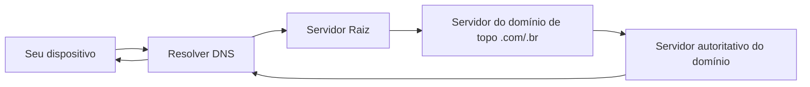

# Capítulo 006 — DNS: Funcionamento e Riscos de Segurança

> **Entender antes de decorar.**

---

| Informação | Detalhes |
|---|---|
| **Módulo** | 02 — Redes |
| **Nível** | Iniciante |
| **Tempo estimado** | 10 a 15 minutos |
| **Pré-requisito** | [Capítulo 005 — Portas e Protocolos Essenciais](005-portas-e-protocolos-essenciais.md) |

---

## Objetivo deste capítulo

Ao final deste capítulo, você será capaz de:

- explicar o que é o DNS e por que ele existe;
- descrever, de forma simplificada, como funciona uma resolução DNS;
- reconhecer os principais tipos de registro DNS;
- entender por que o DNS é um dos protocolos mais explorados por atacantes;
- diferenciar DNS spoofing de DNS tunneling;
- identificar padrões suspeitos em logs de consultas DNS.

---

## Como sempre, vamos começar utilizando nossa imaginação.

Você está revisando logs de rede e percebe algo estranho: uma sequência de consultas DNS para subdomínios longos, praticamente ilegíveis, todos apontando para o mesmo domínio raiz.

```text
8f3a9c1b2e7d.dados-servico.com
a91f4c8e3b02.dados-servico.com
2d7e9f1a4c88.dados-servico.com
```

Dezenas de consultas parecidas, em sequência, em poucos minutos.

```text
Opção A
"DNS é só tradução de nome pra IP. Não tem porque isso ser perigoso."

Opção B
"Preciso entender como DNS funciona de verdade antes de descartar isso."
```

Ao final deste capítulo, você vai conseguir explicar exatamente por que esse padrão de subdomínios estranhos é um dos sinais mais clássicos de exfiltração de dados via DNS.

> **DNS é um dos protocolos mais confiados da internet — e é exatamente por isso que ele é tão explorado.**

---

# O que é o DNS, e por que ele existe?

O **DNS** (Domain Name System) é o serviço responsável por traduzir nomes de domínio, como `willianhirata.github.io`, em endereços IP, como `185.199.108.153`.

```text
Sem DNS:
você precisaria memorizar o endereço IP de cada site que visita

Com DNS:
basta lembrar do nome — a tradução acontece nos bastidores
```

Pense no DNS como a agenda de contatos do seu celular: você digita "Mãe" e o telefone sabe qual número discar. Você não precisa decorar o número — só o nome.

---

# Como funciona uma consulta DNS (resolução)

De forma simplificada, quando você digita um endereço no navegador, acontece uma cadeia de perguntas até alguém saber a resposta:



O **resolver DNS** (geralmente do seu provedor de internet ou um serviço público como `8.8.8.8`) faz esse trabalho por você, e costuma guardar a resposta em cache por um tempo, evitando repetir toda a cadeia a cada consulta.

Alguns tipos de registro DNS que você vai encontrar com frequência:

| Registro | Função |
|---|---|
| **A** | Aponta um nome de domínio para um endereço IPv4 |
| **AAAA** | Aponta um nome de domínio para um endereço IPv6 |
| **CNAME** | Cria um "apelido" apontando para outro nome de domínio |
| **MX** | Indica qual servidor é responsável por receber e-mails do domínio |
| **TXT** | Armazena informações em texto livre, usado por exemplo em verificações de propriedade e proteção contra spoofing de e-mail |
| **NS** | Indica quais servidores são autoritativos para aquele domínio |

!!! tip "DNS roda sobre a porta 53"
    Lembra do capítulo anterior? DNS normalmente opera na porta 53, majoritariamente via UDP — o que faz sentido, já que a maioria das consultas é curta e não exige toda a confiabilidade (e o custo) do handshake do TCP.

---

# Por que o DNS é um alvo tão atraente para atacantes

O DNS tem três características que, juntas, o tornam extremamente atraente para quem quer atacar uma rede:

- **é essencial** — praticamente nenhuma rede funciona sem DNS;
- **é onipresente** — qualquer dispositivo faz consultas DNS o tempo todo, sem chamar atenção;
- **é raramente bloqueado** — a maioria dos firewalls permite tráfego DNS livremente, já que bloquear DNS quebraria a navegação normal.

Essa combinação de "essencial + confiável + pouco filtrado" é o que torna o DNS um canal ideal para abuso.

### DNS Spoofing / Cache Poisoning

Um atacante injeta uma resposta DNS falsa, fazendo a vítima ser redirecionada para um IP malicioso mesmo digitando o endereço correto.

### DNS Tunneling

Como o DNS quase sempre é permitido pelo firewall, atacantes podem codificar dados dentro de consultas e respostas DNS, criando um canal de comunicação escondido — útil tanto para Comando e Controle quanto para contornar bloqueios de rede.

### Exfiltração via DNS

Uma aplicação específica do tunneling: em vez de apenas se comunicar, o atacante **codifica dados roubados** como se fossem subdomínios, enviando-os disfarçados de consultas DNS normais para um domínio que ele mesmo controla.

---

# Como isso aparece nos logs (padrões de suspeita)

- subdomínios anormalmente longos ou com aparência de texto codificado;
- volume alto de consultas para o mesmo domínio raiz em curto espaço de tempo;
- consultas para domínios registrados muito recentemente;
- consultas DNS sem nenhum tráfego HTTP/HTTPS correspondente logo em seguida — sinal de que a "resposta" não estava sendo usada para navegar, e sim como canal de dados.

---

# Aplicação em um SOC

### Monitorando DNS

- consultas para domínios com reputação desconhecida ou maliciosa merecem investigação;
- picos de volume de consultas de um único host podem indicar automação (malware), não um usuário navegando manualmente;
- verificar a idade de registro de um domínio (via WHOIS) ajuda a avaliar sua legitimidade — algo que vamos aprofundar quando chegarmos ao módulo de OSINT, mais adiante neste projeto.

### Correlacionando com outras camadas já vistas

- um domínio suspeito resolvendo para um IP incomum (capítulo 004) reforça a suspeita;
- uma consulta DNS seguida de conexão em porta atípica (capítulo 005) fecha um padrão ainda mais forte.

---

# Cenário prático — Resolvendo os subdomínios estranhos

Voltando ao início do capítulo:

```text
8f3a9c1b2e7d.dados-servico.com
a91f4c8e3b02.dados-servico.com
2d7e9f1a4c88.dados-servico.com
```

Com o que vimos até aqui, esse padrão fala por si:

> Cada subdomínio parece uma sequência aleatória — típico de dados **codificados**, não de nomes reais de servidor.

> Todas as consultas apontam para o **mesmo domínio raiz** — sugerindo que esse domínio pertence a quem está recebendo os dados.

> O volume alto e repetitivo em pouco tempo é incompatível com navegação humana normal.

Esse é o retrato clássico de uma tentativa de **exfiltração de dados via DNS** — usando um protocolo que, na maioria das redes, passa despercebido por trafegar livremente.

---

## Perguntas de investigação

??? question "1. Por que o DNS costuma ser permitido por padrão na maioria dos firewalls?"
    Porque bloquear DNS indiscriminadamente quebraria a navegação normal da rede — praticamente todo serviço depende de resolução de nomes para funcionar.

??? question "2. O que diferencia DNS tunneling de uma consulta DNS legítima?"
    Uma consulta legítima busca resolver um nome real de domínio. No tunneling, as consultas carregam dados codificados dentro do nome consultado, usando o protocolo como canal de comunicação, não para sua função original.

??? question "3. Por que domínios recém-registrados costumam ser tratados com mais suspeita?"
    Porque atacantes frequentemente registram domínios descartáveis pouco antes de uma campanha, enquanto domínios legítimos de empresas estabelecidas geralmente têm anos de existência.

??? question "4. Qual a diferença entre DNS spoofing e DNS tunneling?"
    DNS spoofing falsifica uma resposta para redirecionar a vítima a um destino malicioso. DNS tunneling usa o protocolo DNS como canal de transporte de dados, sem necessariamente falsificar respostas.

??? question "5. Por que a ausência de tráfego HTTP/HTTPS após uma consulta DNS pode ser um indício de exfiltração?"
    Porque uma consulta DNS normal, feita por um navegador, costuma ser seguida de uma conexão real ao site resolvido. Se isso não acontece, é possível que a consulta DNS em si já fosse o propósito da comunicação.

---

# O que não fazer

- não trate o DNS como "só tradução de nome" sem risco de segurança;
- não assuma que bloquear todo o tráfego DNS resolve o problema — isso quebra a rede;
- não confunda DNS spoofing com DNS tunneling — são técnicas diferentes, com objetivos diferentes;
- não ignore picos de consultas DNS só porque "é tráfego normal" na maioria das vezes.

---

# Erros comuns

### "DNS é só tradução de nome, não tem risco de segurança"

Não.

Justamente por ser tão confiado e pouco filtrado, o DNS é um dos canais favoritos para tunneling e exfiltração de dados.

### "Bloquear todo tráfego DNS resolve o problema"

Não.

Isso inviabilizaria a navegação normal. A resposta está em monitorar e analisar padrões, não em eliminar o protocolo.

### "DNS spoofing e DNS tunneling são a mesma coisa"

Não.

Spoofing falsifica uma resposta para enganar o destino. Tunneling usa o protocolo como canal de dados. São técnicas com mecânicas e objetivos diferentes.

---

# Resumo

Neste capítulo, aprendemos que:

- o **DNS** traduz nomes de domínio em endereços IP, evitando que precisemos memorizar números;
- uma resolução DNS passa por uma cadeia de servidores até chegar à resposta final, geralmente via porta 53/UDP;
- o DNS é atraente para atacantes por ser essencial, onipresente e raramente bloqueado;
- **DNS spoofing** falsifica respostas; **DNS tunneling** usa o protocolo como canal de comunicação; **exfiltração via DNS** é uma aplicação específica do tunneling para roubo de dados;
- subdomínios longos e aleatórios, alto volume de consultas e ausência de tráfego correspondente são sinais clássicos de abuso do protocolo.

```text
Não pergunte apenas:

"Essa consulta DNS resolveu para algum lugar?"

Pergunte também:

"Esse nome de domínio parece real ou parece codificado?"
"Esse volume de consultas é compatível com uso humano normal?"
"Existe tráfego real acontecendo depois dessa resolução?"
```

> **O DNS é a agenda de contatos da internet. Mas nas mãos erradas, também pode virar um canal secreto de comunicação.**

---

# Checkpoint

Antes de seguir para o próximo capítulo, confirme se você consegue responder:

- [ ] O que é o DNS e por que ele existe?
- [ ] Como funciona, de forma simplificada, uma resolução DNS?
- [ ] O que são os registros A, CNAME e MX?
- [ ] Por que o DNS é tão explorado por atacantes?
- [ ] Qual a diferença entre DNS spoofing e DNS tunneling?
- [ ] Que padrões em logs de DNS podem indicar exfiltração de dados?
- [ ] Por que bloquear todo o tráfego DNS não é uma solução viável?

---

# Glossário

| Termo | Definição |
|---|---|
| **DNS** | Domain Name System; serviço que traduz nomes de domínio em endereços IP. |
| **Resolver DNS** | Servidor responsável por realizar a busca e devolver a resposta de uma consulta DNS. |
| **Registro A** | Tipo de registro DNS que aponta um domínio para um endereço IPv4. |
| **DNS Spoofing / Cache Poisoning** | Técnica que injeta respostas DNS falsas para redirecionar a vítima a um destino malicioso. |
| **DNS Tunneling** | Técnica que usa consultas e respostas DNS como canal de comunicação escondido. |
| **WHOIS** | Serviço público de consulta que mostra informações de registro de um domínio, como data de criação. |

---

# Referências

- [Cloudflare — O que é DNS?](https://www.cloudflare.com/learning/dns/what-is-dns/)
- [Cloudflare — DNS Spoofing / Cache Poisoning](https://www.cloudflare.com/learning/dns/dns-cache-poisoning/)
- [Cloudflare — DNS Tunneling](https://www.cloudflare.com/learning/dns/dns-tunneling/)

---

# Próximo capítulo

No próximo capítulo, vamos estudar **HTTP, HTTPS e Certificados TLS/SSL** — como a navegação web funciona por baixo dos panos e onde a criptografia entra nessa história.

[← Capítulo anterior: Portas e Protocolos Essenciais](005-portas-e-protocolos-essenciais.md){ .md-button }

[Próximo: HTTP, HTTPS e TLS/SSL →](007-http-https-e-certificados-tls-ssl.md){ .md-button .md-button--primary }

---

> **Entender antes de decorar.**
