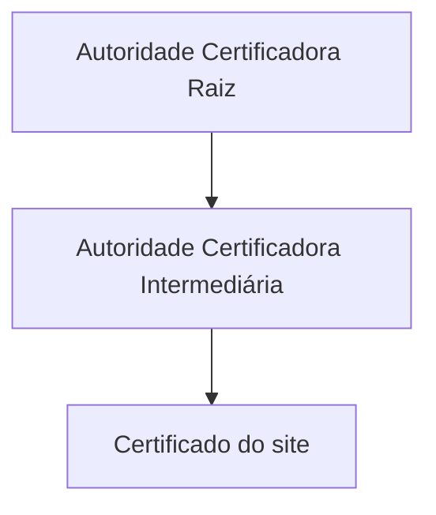
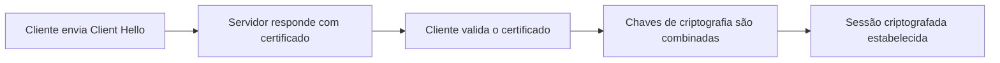

# Capítulo 007 — HTTP, HTTPS e Certificados TLS/SSL

> **Entender antes de decorar.**

---

| Informação | Detalhes |
|---|---|
| **Módulo** | 02 — Redes |
| **Nível** | Iniciante |
| **Tempo estimado** | 15 a 20 minutos |
| **Pré-requisito** | [Capítulo 006 — DNS: Funcionamento e Riscos de Segurança](006-dns-funcionamento-e-riscos-de-seguranca.md) |

---

## Objetivo deste capítulo

Ao final deste capítulo, você será capaz de:

- explicar a diferença entre HTTP e HTTPS;
- identificar os elementos básicos de uma requisição e resposta HTTP;
- entender o que um certificado digital realmente atesta, e quais campos ele carrega;
- descrever, de forma simplificada, como funciona o handshake TLS;
- explicar o que é um ataque Man-in-the-Middle (MITM) e como HTTPS o dificulta;
- reconhecer por que "cadeado verde" não significa "site seguro";
- entender por que um aviso de certificado nem sempre indica um ataque.

---

## Como sempre, vamos começar utilizando nossa imaginação.

Lembra de quando você acessou a interface web do pfSense pela primeira vez, no Lab-004 deste projeto?

```text
Aviso do navegador:
"Sua conexão não é particular"
"O certificado deste site não é confiável"
```

Você clicou em "Avançado" e depois em "Prosseguir mesmo assim", sem pensar muito — só queria chegar na tela de login.

```text
Opção A
"É só um aviso chato que aparece sempre. Sigo em frente."

Opção B
"O que exatamente esse aviso está tentando me proteger?"
```

Esse aviso não é frescura do navegador. Ele existe porque, sem ele, seria muito mais fácil para alguém se passar por um site (ou por um firewall) que não é quem diz ser — e você nunca perceberia a diferença, porque a página se pareceria idêntica.

> **HTTPS não é só "o site que abre com cadeado". É uma promessa de identidade e privacidade — e certificados são a forma como essa promessa é verificada.**

---

# O que é HTTP?

**HTTP** (Hypertext Transfer Protocol) é o protocolo que permite que um navegador (cliente) peça informações a um servidor, e o servidor responda. Toda navegação na web, por baixo dos panos, é uma sequência de pedidos e respostas desse tipo.

```text
Cliente → GET /pagina.html HTTP/1.1
          Host: exemplo.com
          User-Agent: Mozilla/5.0

Servidor → HTTP/1.1 200 OK
           Content-Type: text/html
           [conteúdo da página]
```

Repare que, mesmo em uma requisição simples, já viaja informação sobre você: qual navegador está usando, qual página está pedindo, e — em requisições autenticadas — até cookies de sessão.

Alguns elementos que você vai encontrar constantemente em logs:

| Elemento | Exemplos | Função |
|---|---|---|
| **Método** | GET, POST, PUT, DELETE | O que o cliente está pedindo para o servidor fazer |
| **Cabeçalhos (Headers)** | Host, User-Agent, Cookie | Metadados sobre a requisição ou resposta |
| **Código de status** | 200, 301, 404, 500 | Como o servidor respondeu ao pedido |

| Código | Significado |
|---|---|
| 200 | Sucesso |
| 301 / 302 | Redirecionamento |
| 403 | Acesso proibido |
| 404 | Recurso não encontrado |
| 500 | Erro interno do servidor |

---

# O problema do HTTP puro

O HTTP, por padrão, transmite dados **em texto claro** — qualquer pessoa capaz de observar o tráfego (na mesma rede Wi-Fi, em um roteador comprometido, ou interceptando o caminho) consegue ler o conteúdo exato da comunicação.

Isso vale tanto para um formulário de login quanto para algo mais sutil, como um cookie de sessão:

```text
POST /login HTTP/1.1
usuario=willian&senha=minhasenha123
```

```text
GET /painel HTTP/1.1
Cookie: sessao_id=8f3a9c1b2e7d4f21
```

Se qualquer uma dessas duas requisições trafegar sem proteção, um atacante não precisa nem da senha: capturando o cookie de sessão, ele consegue se passar pelo usuário autenticado sem nunca ter visto login ou senha nenhum — uma técnica chamada **sequestro de sessão**, que já mencionamos rapidamente no capítulo sobre o Modelo OSI.

---

# HTTPS — HTTP com uma camada de proteção

**HTTPS** é HTTP combinado com **TLS** (Transport Layer Security, sucessor do antigo SSL). O TLS adiciona três garantias importantes:

- **Confidencialidade** — os dados são criptografados, ilegíveis para quem intercepta;
- **Integridade** — qualquer alteração no meio do caminho é detectável;
- **Autenticação** — há uma forma de confirmar que você está falando com o site que acredita estar falando.

É essa terceira garantia — autenticação — que depende diretamente de **certificados digitais**.

---

# Certificados digitais e a cadeia de confiança

Um **certificado digital** é como um documento de identidade de um site, emitido por uma **Autoridade Certificadora (CA)** — uma entidade confiável que atesta: "eu verifiquei, esse domínio realmente pertence a quem afirma ser o dono".



Um certificado carrega, entre outras informações, os seguintes campos — que você vai revisitar sempre que precisar investigar algo relacionado a HTTPS:

| Campo | O que representa |
|---|---|
| **Subject (Assunto)** | O domínio para o qual o certificado foi emitido |
| **Issuer (Emissor)** | Qual Autoridade Certificadora emitiu o certificado |
| **Validade (Not Before / Not After)** | Período em que o certificado é considerado válido |
| **SAN (Subject Alternative Name)** | Outros domínios cobertos pelo mesmo certificado |

Seu navegador já vem com uma lista de Autoridades Certificadoras em quem ele confia por padrão. Quando um certificado foi emitido por uma dessas autoridades (ou por alguém na cadeia delas), o navegador confia automaticamente.

!!! tip "Por que o pfSense mostrou aquele aviso?"
    Quando você instala o pfSense, ele gera um certificado **autoassinado** — ou seja, ele mesmo assina seu próprio certificado, sem passar por nenhuma Autoridade Certificadora reconhecida. O navegador não tem como verificar essa cadeia de confiança, e por isso exibe o aviso. Em um ambiente de laboratório controlado, como o seu, isso é esperado e você sabe exatamente o que está acessando. **O problema seria ver esse mesmo aviso em um site desconhecido na internet aberta.**

---

# TLS Handshake (simplificado)

Antes de qualquer dado ser trocado de forma criptografada, cliente e servidor negociam os parâmetros da conexão segura:



No **Client Hello**, o navegador informa quais versões de TLS e quais algoritmos de criptografia suporta. O servidor responde com seu **certificado** e escolhe os parâmetros que serão usados na sessão. Se o certificado não é confiável (autoassinado, expirado, ou emitido para outro domínio), o navegador interrompe esse processo e mostra o aviso — dando a você, usuário, a decisão final de prosseguir ou não.

Depois que ambos os lados concordam com as chaves de criptografia, toda a comunicação seguinte passa a ser ilegível para quem estiver observando o tráfego pelo caminho.

---

# Riscos de segurança relacionados a HTTP, HTTPS e certificados

### Man-in-the-Middle (MITM)

Lembra que, no capítulo sobre o Modelo OSI, mencionamos rapidamente esse termo? Chegou a hora de explicar de verdade.

Um ataque **Man-in-the-Middle** acontece quando um atacante se posiciona entre o cliente e o servidor, interceptando — e às vezes alterando — a comunicação sem que nenhuma das partes perceba.

```text
Cliente  ←→  Atacante (no meio)  ←→  Servidor
```

Um cenário clássico: você se conecta a uma rede Wi-Fi pública em um aeroporto ou cafeteria. Se essa rede foi comprometida (ou é, ela mesma, controlada por um atacante disfarçado de "Wi-Fi grátis"), todo o seu tráfego passa por esse ponto antes de chegar à internet real.

O HTTPS foi projetado justamente para dificultar esse tipo de ataque: mesmo que o atacante intercepte o tráfego, ele não consegue ler o conteúdo criptografado nem se passar convincentemente pelo servidor real — a menos que consiga um certificado que o navegador aceite como válido, ou convença a vítima a ignorar o aviso de certificado inválido.

### SSL Stripping

Uma técnica onde o atacante, posicionado como um MITM, força a conexão a "regredir" de HTTPS para HTTP, fazendo a vítima navegar sem criptografia sem perceber a diferença — especialmente se não prestar atenção à ausência do cadeado. Ferramentas como o histórico *sslstrip* tornaram essa técnica conhecida por explorar justamente o momento em que um site redireciona de HTTP para HTTPS.

### Certificados inválidos, expirados ou autoassinados

Cada um desses avisos existe por um motivo diferente: certificado expirado pode indicar simples falta de manutenção (ou site abandonado); certificado emitido para outro domínio pode indicar configuração incorreta — ou tentativa de engano; certificado autoassinado, fora de um ambiente controlado como um laboratório, é motivo de desconfiança imediata.

### "Cadeado verde não significa site seguro"

Esse é um dos erros de percepção mais comuns, inclusive fora da área técnica: HTTPS garante que a **conexão** está criptografada — não que o **conteúdo** do site é confiável. Hoje em dia, é trivial para qualquer pessoa (inclusive atacantes) obter um certificado HTTPS válido e gratuito para um site de phishing, através de serviços legítimos como o Let's Encrypt. O cadeado protege a "carta" no caminho; não diz nada sobre quem a escreveu.

---

# Aplicação em um SOC

### Ao inspecionar certificados

- verificar emissor, validade e domínio correspondente durante uma investigação;
- observar mudanças inesperadas de certificado em um site frequentemente acessado (pode indicar MITM);
- desconfiar de certificados emitidos há poucos dias para domínios que deveriam ser antigos e estabelecidos.

### Ao lidar com tráfego criptografado

- um WAF (mencionado no capítulo de OSI) frequentemente precisa inspecionar tráfego HTTPS decriptografado para funcionar de verdade — o que exige que a organização "quebre" a criptografia em um ponto controlado (proxy de inspeção TLS);
- tráfego criptografado limita a visibilidade de ferramentas tradicionais de rede, deslocando parte da detecção para o endpoint.

### Ao avaliar a legitimidade de um site

- nunca validar a legitimidade de um site apenas pela presença do cadeado;
- cruzar a idade e o histórico do domínio (algo que vamos aprofundar no módulo de OSINT) com a análise do certificado.

---

# Cenário prático — Voltando ao aviso do pfSense

Fechando o raciocínio do início do capítulo:

> O pfSense gerou um certificado **autoassinado**, sem CA reconhecida por trás.

> O navegador não conseguiu validar a cadeia de confiança, e por isso avisou.

> Como você mesmo instalou o pfSense e sabe exatamente o que está acessando (`192.168.1.1`, dentro do seu próprio ambiente de lab), prosseguir foi uma decisão informada, não um risco cego.

Agora imagine o mesmo aviso aparecendo ao tentar acessar o site do seu banco. Nesse caso, o contexto muda completamente: você não instalou o servidor do banco, não sabe por que o certificado falhou, e a resposta correta seria não prosseguir, e investigar por quê aquele certificado não está sendo validado — pode ser um problema temporário do banco, ou pode ser um sinal de MITM em andamento na rede que você está usando.

---

## Perguntas de investigação

??? question "1. Por que o HTTP sozinho não protege dados sensíveis?"
    Porque transmite informações em texto claro, permitindo que qualquer um capaz de observar o tráfego leia o conteúdo exato da comunicação, incluindo credenciais e cookies de sessão.

??? question "2. O que uma Autoridade Certificadora (CA) realmente atesta em um certificado?"
    Ela atesta que verificou e confirma que o domínio pertence a quem solicitou o certificado — não que o conteúdo do site seja seguro ou confiável.

??? question "3. Por que um site de phishing pode ter um certificado HTTPS totalmente válido?"
    Porque certificados HTTPS gratuitos são fáceis de obter para qualquer domínio registrado, através de serviços legítimos como o Let's Encrypt, incluindo domínios criados especificamente para phishing. HTTPS protege a conexão, não garante a idoneidade de quem está do outro lado.

??? question "4. O que caracteriza um ataque de SSL stripping?"
    O atacante, posicionado como um MITM, força a conexão da vítima a operar em HTTP em vez de HTTPS, removendo a camada de criptografia sem que a vítima perceba facilmente — muitas vezes explorando o momento do redirecionamento inicial de HTTP para HTTPS.

??? question "5. Por que o aviso de certificado do pfSense, no seu próprio laboratório, não indica um ataque?"
    Porque o certificado autoassinado foi gerado pelo próprio pfSense que você instalou, dentro de um ambiente que você controla e reconhece — diferente de receber esse mesmo aviso inesperadamente em um site desconhecido na internet.

---

# O que não fazer

- não assuma que "tem cadeado, então é seguro" — HTTPS protege a conexão, não o conteúdo;
- não ignore avisos de certificado em sites públicos desconhecidos;
- não confunda "certificado autoassinado em ambiente controlado" com "certificado inválido em produção" — o contexto muda tudo;
- não subestime o quanto HTTP puro expõe dados sensíveis em texto claro, incluindo cookies de sessão.

---

# Erros comuns

### "Cadeado verde = site seguro"

Não.

Significa apenas que a conexão está criptografada. O conteúdo do site pode ser malicioso mesmo assim, e obter um certificado válido é trivial mesmo para quem tem más intenções.

### "Ignorar aviso de certificado é sempre perigoso"

Depende do contexto.

Em um laboratório controlado que você mesmo configurou, é uma decisão informada. Na internet aberta, é um risco real que merece investigação antes de prosseguir.

### "HTTPS impede qualquer tipo de ataque"

Não.

HTTPS mitiga interceptação e adulteração de dados em trânsito, mas não impede phishing, engenharia social ou vulnerabilidades na aplicação em si.

---

# Resumo

Neste capítulo, aprendemos que:

- **HTTP** transmite dados em texto claro; **HTTPS** adiciona criptografia, integridade e autenticação via TLS;
- **certificados digitais** são atestados de identidade emitidos por Autoridades Certificadoras, carregando campos como Subject, Issuer, validade e SAN;
- o **TLS handshake** valida essa identidade antes de estabelecer uma sessão criptografada;
- um ataque **Man-in-the-Middle** se posiciona entre cliente e servidor, algo que HTTPS dificulta mas não elimina totalmente;
- **SSL stripping** força a regressão de HTTPS para HTTP;
- "cadeado verde" garante conexão criptografada, não garante que o site é confiável.

```text
Não pergunte apenas:

"Esse site tem cadeado?"

Pergunte também:

"Esse certificado foi emitido para o domínio correto, e há quanto tempo?"
"Esse aviso apareceu em um ambiente que eu controlo, ou na internet aberta?"
"O conteúdo desse site é confiável, independente da criptografia?"
```

> **O cadeado protege a conversa. Não garante quem está do outro lado dela.**

---

# Checkpoint

Antes de seguir para o próximo capítulo, confirme se você consegue responder:

- [ ] Qual a diferença entre HTTP e HTTPS?
- [ ] Quais campos um certificado digital carrega?
- [ ] O que é uma Autoridade Certificadora (CA)?
- [ ] O que acontece, de forma simplificada, no handshake TLS?
- [ ] O que é um ataque Man-in-the-Middle?
- [ ] O que é SSL stripping?
- [ ] Por que "cadeado verde" não significa "site seguro"?
- [ ] Por que o aviso de certificado do pfSense no seu lab não era motivo de alarme?

---

# Glossário

| Termo | Definição |
|---|---|
| **HTTP** | Hypertext Transfer Protocol; protocolo de comunicação entre cliente e servidor na web. |
| **HTTPS** | HTTP combinado com criptografia TLS, adicionando confidencialidade, integridade e autenticação. |
| **TLS/SSL** | Transport Layer Security (sucessor do SSL); protocolo criptográfico que protege comunicações na rede. |
| **Certificado digital** | Documento eletrônico que atesta a identidade de um domínio, emitido por uma Autoridade Certificadora. |
| **Autoridade Certificadora (CA)** | Entidade confiável responsável por verificar e emitir certificados digitais. |
| **Man-in-the-Middle (MITM)** | Ataque em que o atacante se posiciona entre duas partes, interceptando ou alterando a comunicação. |
| **SSL Stripping** | Técnica que força a regressão de uma conexão HTTPS para HTTP não criptografado. |

---

# Referências

- [Cloudflare — O que é HTTPS?](https://www.cloudflare.com/learning/ssl/what-is-https/)
- [Cloudflare — O que é TLS?](https://www.cloudflare.com/learning/ssl/transport-layer-security-tls/)
- [Cloudflare — O que é um ataque Man-in-the-Middle?](https://www.cloudflare.com/learning/ssl/what-is-a-man-in-the-middle-attack/)

---

# Próximo capítulo

No próximo capítulo, vamos estudar **Switches, VLANs e Segmentação de Rede** — como organizar e isolar diferentes partes de uma rede local.

[← Capítulo anterior: DNS](006-dns-funcionamento-e-riscos-de-seguranca.md){ .md-button }

[Próximo: Switches, VLANs e Segmentação →](008-switches-vlans-e-segmentacao-de-rede.md){ .md-button .md-button--primary }

---

> **Entender antes de decorar.**
