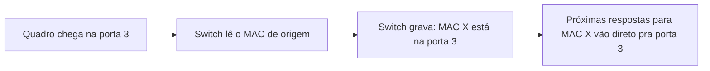
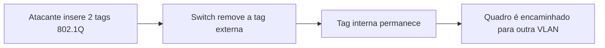

# Capítulo 008 — Switches, VLANs e Segmentação de Rede

> **Entender antes de decorar.**

---

| Informação | Detalhes |
|---|---|
| **Módulo** | 02 — Redes |
| **Nível** | Iniciante |
| **Tempo estimado** | 15 a 20 minutos |
| **Pré-requisito** | [Capítulo 007 — HTTP, HTTPS e Certificados TLS/SSL](007-http-https-e-certificados-tls-ssl.md) |

---

## Objetivo deste capítulo

Ao final deste capítulo, você será capaz de:

- explicar como um switch aprende e encaminha tráfego na rede local;
- entender o que é a tabela CAM e o que acontece quando ela é esgotada;
- diferenciar domínio de colisão e domínio de broadcast;
- explicar o que é uma VLAN e por que ela é usada para segmentação;
- diferenciar uma porta de acesso de uma porta trunk;
- entender como funciona um ataque de VLAN hopping;
- relacionar segmentação de rede ao princípio de Defesa em Profundidade.

---

## Como sempre, vamos começar utilizando nossa imaginação.

Um colega do time de rede te procura preocupado:

> "Uma estação de trabalho que deveria enxergar só o próprio tráfego começou a capturar pacotes de outras máquinas na mesma rede. Isso é normal?"

```text
Opção A
"Deve ser algum bug no switch. Vamos reiniciar e ver se resolve."

Opção B
"Isso pode ser MAC flooding fazendo o switch se comportar como um hub."
```

Lá no capítulo sobre o Modelo OSI, mencionamos rapidamente "MAC flooding" e "VLAN hopping" como ataques clássicos da camada de Enlace. Chegou a hora de entender como cada um funciona de verdade — e por que o comportamento que seu colega descreveu é um sintoma clássico do primeiro.

> **Um switch não é mágico. Ele toma decisões baseado em uma tabela — e toda tabela pode ser esgotada.**

---

# Switch: o "carteiro" da rede local

Diferente de um hub antigo, que simplesmente repete qualquer sinal recebido para todas as portas, um **switch** é mais inteligente: ele aprende qual dispositivo está conectado a cada porta e envia o tráfego **apenas** para o destino correto.

```text
Hub:
recebe em uma porta → repete para todas as outras

Switch:
recebe em uma porta → verifica o destino → envia só para a porta correta
```

Essa inteligência vem de uma estrutura chamada **tabela CAM** (Content Addressable Memory) — também chamada de tabela MAC.

---

# Como o switch aprende (e o que acontece quando ele "esquece")

Toda vez que um quadro chega em uma porta, o switch anota o endereço **MAC de origem** e associa aquela porta a esse endereço na tabela CAM.



O problema é que essa tabela tem **tamanho limitado** — geralmente alguns milhares de entradas, dependendo do modelo do switch. E é exatamente isso que o ataque de **MAC flooding** explora.

### MAC Flooding

O atacante envia uma quantidade massiva de quadros com endereços MAC de origem falsos e diferentes entre si — ferramentas conhecidas nesse tipo de teste, como o clássico *macof*, conseguem gerar milhares desses endereços por segundo. A tabela CAM enche rapidamente, e o switch não consegue mais aprender novas associações válidas.

Quando isso acontece, muitos switches adotam um comportamento de segurança "fail open": para não perder conectividade, passam a se comportar como um **hub**, enviando todo o tráfego para todas as portas.

Foi exatamente isso que aconteceu no cenário do início do capítulo: a estação de trabalho não estava com bug — ela passou a receber tráfego que não era destinado a ela, porque o switch, sobrecarregado, começou a "vazar" tráfego para todas as portas.

!!! tip "Por que isso importa para você, especificamente"
    MAC flooding é frequentemente usado como **passo intermediário** para permitir sniffing de tráfego (capturar senhas, sessões, dados sensíveis) em uma rede comutada, que normalmente dificultaria esse tipo de escuta. Vamos ver essa técnica de sniffing com mais detalhe no último capítulo deste módulo.

---

# Domínio de colisão x domínio de broadcast

Dois conceitos que aparecem sempre que se fala de switches e segmentação, e que vale a pena diferenciar com clareza:

| Conceito | Definição | Quem limita |
|---|---|---|
| **Domínio de colisão** | Conjunto de dispositivos onde dois sinais podem "colidir" se transmitidos ao mesmo tempo | Cada porta de um switch já é seu próprio domínio de colisão |
| **Domínio de broadcast** | Conjunto de dispositivos que recebem um mesmo quadro de broadcast | Um switch, sozinho, **não** separa domínios de broadcast — todas as portas continuam no mesmo domínio |

Switches modernos praticamente eliminaram o problema de colisão (cada porta já opera isoladamente nesse sentido). O problema que **continua existindo** é o domínio de broadcast: se um dispositivo envia um quadro de broadcast (por exemplo, uma requisição ARP perguntando "quem tem esse IP?"), **todas** as portas do switch recebem essa mensagem — mesmo que sejam centenas de dispositivos.

Isso tem duas consequências práticas:

- **desempenho**: broadcast em excesso consome banda de toda a rede, mesmo dispositivos que não precisam da informação;
- **segurança**: um domínio de broadcast grande demais significa que um problema (ou um atacante) tem visibilidade sobre um número maior de dispositivos.

É exatamente esse segundo ponto que motiva a próxima seção.

---

# VLANs — segmentando uma rede física em redes lógicas

Uma **VLAN** (Virtual LAN) permite dividir uma única infraestrutura física de switches em múltiplos **domínios de broadcast** separados — como se fossem redes fisicamente distintas, mesmo compartilhando o mesmo hardware.

```text
Sem VLAN:
todo dispositivo conectado ao switch está no mesmo domínio de broadcast

Com VLAN:
o mesmo switch físico pode hospedar vários domínios de broadcast isolados entre si
```

Isso conecta diretamente com o que vimos em Fundamentos sobre **Defesa em Profundidade**: VLANs são uma das formas mais práticas de aplicar segmentação de rede, limitando o alcance de um possível comprometimento — tanto em termos de desempenho quanto de superfície de ataque.

Alguns usos comuns:

- separar rede de convidados da rede corporativa;
- isolar dispositivos IoT (câmeras, sensores) de servidores críticos;
- segmentar diferentes departamentos de uma empresa, como Financeiro e Desenvolvimento;
- isolar ambientes de laboratório ou testes (como o seu próprio Lab-004) da rede de produção.

---

# Portas de acesso e portas trunk

| Tipo de porta | Função |
|---|---|
| **Acesso (Access)** | Conecta um dispositivo final, pertence a uma única VLAN |
| **Trunk** | Conecta switches entre si, carregando tráfego de múltiplas VLANs simultaneamente |

Para o switch saber a qual VLAN cada quadro pertence quando trafega por uma porta trunk, é usada uma marcação chamada **802.1Q** — uma "etiqueta" (tag) inserida no cabeçalho do quadro identificando sua VLAN de origem. Quando o quadro chega à porta de acesso do destino, essa etiqueta é removida antes de ser entregue ao dispositivo final — que nunca "sabe" que VLANs existem, apenas recebe seu tráfego normalmente.

---

# VLAN Hopping — atacando os limites entre VLANs

Voltando ao segundo termo mencionado no capítulo de OSI: **VLAN hopping** é uma técnica que permite a um atacante, partindo de uma VLAN à qual tem acesso legítimo, alcançar o tráfego de outra VLAN à qual não deveria ter acesso. Duas técnicas são as mais conhecidas:

### Switch Spoofing

Se a porta do switch estiver configurada para negociar automaticamente o modo trunk (um recurso pensado para facilitar a administração, conectando switches sem configuração manual), um atacante pode fazer seu dispositivo se passar por outro switch, convencendo a porta a virar trunk — e, com isso, ganhar acesso ao tráfego de todas as VLANs que passam por ali.

### Double Tagging



O atacante insere **duas** etiquetas 802.1Q no mesmo quadro. Alguns switches removem apenas a primeira etiqueta ao processar o quadro, encaminhando o restante — com a segunda etiqueta ainda intacta — para uma VLAN diferente da esperada, efetivamente "pulando" para outra rede lógica. Essa técnica costuma funcionar apenas em uma direção (sem retorno de tráfego), mas já é suficiente para, por exemplo, uma exfiltração de dados.

!!! tip "A defesa começa na configuração"
    Ambas as técnicas de VLAN hopping dependem de configurações permissivas (negociação automática de trunk habilitada, VLAN nativa mal configurada). Desabilitar a negociação automática e definir explicitamente o papel de cada porta reduz drasticamente essa superfície de ataque.

---

# Aplicação em um SOC

### Monitorando comportamento anômalo de endereços MAC

- o mesmo endereço MAC aparecendo em múltiplas portas em curto intervalo — possível spoofing ou sintoma de flooding;
- volume anormal de endereços MAC novos aparecendo em uma única porta — possível MAC flooding em andamento.

### Auditando configuração de portas e VLANs

- alertar sobre tentativas de negociação de trunk vindas de portas que deveriam ser apenas de acesso;
- validar, durante uma investigação, se o tráfego observado realmente deveria estar naquela VLAN;
- revisar periodicamente quais portas têm negociação automática de trunk habilitada — muitas vezes um resquício de configuração padrão de fábrica, nunca revisado.

### Correlacionando com outras camadas

- um pico de tráfego ARP (capítulo 002) combinado com sintomas de flooding reforça a suspeita de um ataque em andamento na camada de Enlace;
- tráfego cruzando indevidamente uma fronteira de VLAN pode ser o primeiro sinal de movimentação lateral.

---

# Cenário prático — Fechando o caso do início do capítulo

Retomando a situação do colega de rede:

> A estação começou a capturar tráfego que não era dela.

> Não havia bug no switch — havia uma tabela CAM esgotada.

> Um volume anormal de endereços MAC novos, observado pouco antes do incidente, é a assinatura clássica de um ataque de MAC flooding.

> Diagnóstico: o switch, sobrecarregado, entrou em modo "fail open" e passou a se comportar como um hub, expondo tráfego que normalmente estaria isolado por porta — mesmo dentro do mesmo domínio de broadcast, já que MAC flooding não depende de VLANs para funcionar.

A correção imediata envolve reiniciar o switch (limpando a tabela CAM) e implementar **port security** — um recurso que limita quantos endereços MAC diferentes uma porta pode aprender, prevenindo esse tipo de esgotamento no futuro.

---

## Perguntas de investigação

??? question "1. O que é a tabela CAM de um switch, e para que ela serve?"
    É a estrutura onde o switch armazena a associação entre endereços MAC e as portas físicas correspondentes, permitindo encaminhar tráfego apenas para o destino correto, em vez de transmitir para todas as portas.

??? question "2. O que acontece quando a tabela CAM de um switch é esgotada por MAC flooding?"
    Muitos switches, para não perder conectividade, entram em modo "fail open" e passam a se comportar como um hub, encaminhando todo o tráfego para todas as portas — o que permite a um atacante capturar tráfego que não deveria conseguir ver.

??? question "3. Qual a diferença entre domínio de colisão e domínio de broadcast?"
    Domínio de colisão é o conjunto de dispositivos onde sinais podem colidir se transmitidos simultaneamente — cada porta de switch já é seu próprio domínio. Domínio de broadcast é o conjunto de dispositivos que recebem um mesmo quadro de broadcast — um switch sozinho não separa isso, apenas VLANs conseguem.

??? question "4. Qual a diferença entre uma porta de acesso e uma porta trunk?"
    Uma porta de acesso pertence a uma única VLAN e conecta dispositivos finais. Uma porta trunk carrega tráfego de múltiplas VLANs simultaneamente, geralmente conectando switches entre si, usando marcação 802.1Q para identificar cada VLAN.

??? question "5. Quais são as duas técnicas mais comuns de VLAN hopping?"
    Switch spoofing, onde o atacante negocia modo trunk indevidamente, e double tagging, onde duas etiquetas 802.1Q são inseridas no mesmo quadro para escapar da VLAN original.

---

# O que não fazer

- não trate um comportamento de captura de tráfego inesperado como "bug do switch" sem investigar;
- não assuma que VLAN, sozinha, garante isolamento total sem configuração adequada de portas;
- não deixe negociação automática de trunk habilitada em portas que não precisam dela;
- não ignore picos de novos endereços MAC aparecendo em uma mesma porta;
- não confunda domínio de colisão (praticamente resolvido por switches modernos) com domínio de broadcast (que ainda exige VLANs para ser segmentado).

---

# Erros comuns

### "VLAN é suficiente pra isolar completamente o tráfego, sem mais nada"

Não.

VLANs mal configuradas (como negociação automática de trunk habilitada) podem ser contornadas via VLAN hopping. Segmentação exige configuração cuidadosa, não é automática.

### "MAC flooding é só um problema de performance"

Não.

Além de degradar a rede, é frequentemente usado como técnica facilitadora para sniffing de tráfego sensível.

### "Segmentação de rede é coisa só de time de infraestrutura, não afeta segurança"

Não.

Segmentação é uma das aplicações mais diretas do princípio de Defesa em Profundidade — decisão de rede com impacto direto em segurança.

---

# Resumo

Neste capítulo, aprendemos que:

- um **switch** aprende endereços MAC e encaminha tráfego de forma direcionada, usando a **tabela CAM**;
- **MAC flooding** esgota essa tabela, podendo forçar o switch a se comportar como um hub;
- switches resolvem o problema de **domínio de colisão**, mas não separam **domínios de broadcast** sozinhos;
- **VLANs** permitem segmentar uma infraestrutura física em domínios de broadcast isolados;
- portas de **acesso** pertencem a uma única VLAN; portas **trunk** carregam múltiplas VLANs via marcação 802.1Q;
- **VLAN hopping** (por switch spoofing ou double tagging) pode contornar essa segmentação se as portas estiverem mal configuradas;
- segmentação de rede é uma aplicação prática e concreta do princípio de Defesa em Profundidade.

```text
Não pergunte apenas:

"O switch está com problema?"

Pergunte também:

"A tabela CAM está sendo esgotada?"
"Essa porta deveria estar negociando trunk?"
"Esse tráfego deveria estar cruzando essa fronteira de VLAN?"
```

> **Segmentar uma rede não é burocracia de infraestrutura. É reduzir, na prática, até onde um problema pode se espalhar.**

---

# Checkpoint

Antes de seguir para o próximo capítulo, confirme se você consegue responder:

- [ ] Como um switch decide para qual porta enviar um quadro?
- [ ] O que é a tabela CAM?
- [ ] O que acontece quando a tabela CAM é esgotada por MAC flooding?
- [ ] Qual a diferença entre domínio de colisão e domínio de broadcast?
- [ ] O que é uma VLAN e por que ela é usada?
- [ ] Qual a diferença entre porta de acesso e porta trunk?
- [ ] Como funcionam switch spoofing e double tagging?
- [ ] Por que segmentação de rede se conecta com Defesa em Profundidade?

---

# Glossário

| Termo | Definição |
|---|---|
| **Switch** | Dispositivo de rede que encaminha tráfego com base em endereços MAC aprendidos. |
| **Tabela CAM** | Estrutura de memória do switch que associa endereços MAC às portas correspondentes. |
| **MAC Flooding** | Ataque que esgota a tabela CAM de um switch, podendo forçá-lo a se comportar como um hub. |
| **Domínio de colisão** | Conjunto de dispositivos onde sinais podem colidir se transmitidos simultaneamente. |
| **Domínio de broadcast** | Conjunto de dispositivos que recebem um mesmo quadro de broadcast. |
| **VLAN** | Virtual LAN; domínio de broadcast isolado dentro de uma infraestrutura física compartilhada. |
| **Porta de acesso** | Porta de switch que pertence a uma única VLAN, conectando dispositivos finais. |
| **Porta trunk** | Porta de switch que carrega tráfego de múltiplas VLANs, usada entre switches. |
| **802.1Q** | Padrão de marcação (tagging) que identifica a qual VLAN um quadro pertence. |
| **VLAN Hopping** | Técnica que permite a um atacante acessar o tráfego de uma VLAN diferente da que possui acesso legítimo. |

---

# Referências

- [Cisco Networking Academy](https://www.netacad.com/courses/networking)
- [Fortinet — O que é VLAN Hopping?](https://www.fortinet.com/resources/cyberglossary/vlan-hopping)

---

# Próximo capítulo

No próximo capítulo, vamos estudar **Roteamento e Firewalls** — como o tráfego encontra seu caminho entre redes diferentes, e como controlá-lo nas fronteiras.

[← Capítulo anterior: HTTP, HTTPS e TLS/SSL](007-http-https-e-certificados-tls-ssl.md){ .md-button }

[Próximo: Roteamento e Firewalls →](009-roteamento-e-firewalls.md){ .md-button .md-button--primary }

---

> **Entender antes de decorar.**
