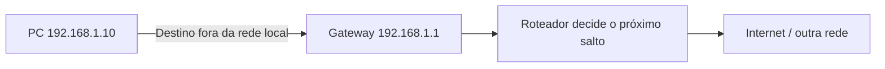
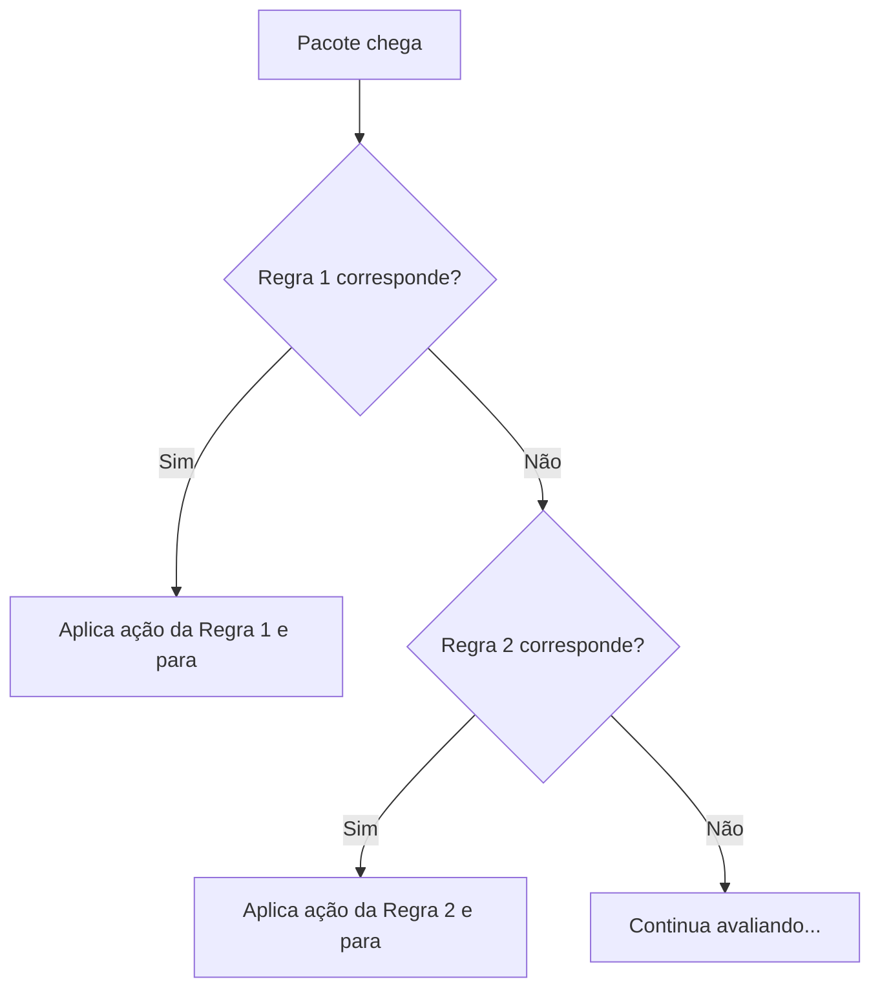

# Capítulo 009 — Roteamento e Firewalls

> **Entender antes de decorar.**

---

| Informação | Detalhes |
|---|---|
| **Módulo** | 02 — Redes |
| **Nível** | Iniciante |
| **Tempo estimado** | 15 a 20 minutos |
| **Pré-requisito** | [Capítulo 008 — Switches, VLANs e Segmentação de Rede](008-switches-vlans-e-segmentacao-de-rede.md) |

---

## Objetivo deste capítulo

Ao final deste capítulo, você será capaz de:

- diferenciar o papel de um roteador do papel de um switch;
- explicar o que é uma tabela de roteamento e um gateway padrão;
- diferenciar roteamento estático de roteamento dinâmico, em termos conceituais;
- entender o que é NAT (e PAT) e por que ele não substitui um firewall;
- descrever a anatomia de uma regra de firewall;
- explicar por que a ordem das regras de firewall é tão importante quanto seu conteúdo;
- reconhecer o que é uma regra "sombreada".

---

## Como sempre, vamos começar utilizando nossa imaginação.

Se você já fez o Lab-004 deste projeto, viveu isso na pele: criou uma regra de bloqueio no pfSense, aplicou, testou — e o site continuou acessando normalmente, como se a regra nem existisse.

```text
Opção A
"A regra deve estar quebrada. Vou apagar e criar de novo do zero."

Opção B
"Talvez o problema não seja a regra em si, mas a ordem em que ela é avaliada."
```

Spoiler: era a opção B. E entender exatamente por que isso acontece é o coração deste capítulo.

> **Um firewall não avalia "qual regra é a certa". Ele avalia "qual regra bate primeiro" — e para assim que encontra uma.**

---

# O que é roteamento?

Enquanto um switch (capítulo anterior) encaminha tráfego **dentro** da mesma rede local usando endereços MAC, um **roteador** decide o caminho do tráfego **entre redes diferentes**, usando endereços IP.



Um roteador mantém uma **tabela de roteamento**, que pode ser visualizada, de forma simplificada, assim:

| Rede de destino | Máscara | Próximo salto | Interface |
|---|---|---|---|
| 192.168.1.0 | 255.255.255.0 | Conectado diretamente | LAN |
| 10.10.0.0 | 255.255.0.0 | 192.168.1.254 | LAN |
| 0.0.0.0 (padrão) | 0.0.0.0 | 203.0.113.1 | WAN |

A última linha, com destino `0.0.0.0`, representa a **rota padrão** — usada quando nenhuma outra rota mais específica corresponde ao destino. É para essa rota que a maior parte do tráfego de navegação normal acaba sendo direcionada.

Quando um dispositivo precisa se comunicar com algo fora da sua própria rede, ele envia o tráfego para o **gateway padrão** — geralmente o próprio roteador, responsável por consultar sua tabela e decidir o próximo salto a partir dali.

!!! tip "Você já configurou isso"
    No Lab-004, o próprio pfSense atuou como gateway padrão da sua rede LAN (`192.168.1.1`) — todo tráfego saindo da rede protegida passa por ele antes de seguir adiante.

### Roteamento estático x dinâmico

Rotas podem ser configuradas manualmente pelo administrador (**roteamento estático**) — como fizemos, na prática, ao definir o pfSense como gateway padrão — ou aprendidas automaticamente através de protocolos de roteamento, como OSPF ou BGP (**roteamento dinâmico**), onde roteadores trocam informações entre si sobre os melhores caminhos disponíveis. Redes pequenas, como a do seu laboratório, costumam usar apenas rotas estáticas; redes de grande porte e provedores de internet dependem fortemente de roteamento dinâmico.

---

# NAT — Network Address Translation

Lembra que, no capítulo de Endereçamento IP, vimos que endereços privados não são roteáveis diretamente pela internet? É aí que entra o **NAT**.

O NAT traduz endereços IP privados para um único endereço IP público (ou um conjunto pequeno deles), permitindo que múltiplos dispositivos internos compartilhem uma única identidade externa.

```text
192.168.1.10  ┐
192.168.1.11  ├──► NAT ──► 203.0.113.5 (IP público único)
192.168.1.12  ┘
```

Na prática, a forma mais comum de NAT usada em redes domésticas e pequenos escritórios é chamada de **PAT** (Port Address Translation, também conhecida como NAT overload): além de traduzir o endereço IP, o roteador também associa cada conexão a uma porta de origem diferente, permitindo distinguir qual dispositivo interno corresponde a qual resposta externa — mesmo todos compartilhando o mesmo IP público.

!!! tip "Você já configurou isso também"
    A interface **WAN** do seu pfSense, no Lab-004, foi configurada em modo **NAT** — exatamente esse mecanismo permitindo que sua rede interna acessasse a internet através de um único ponto de saída.

**Importante:** NAT esconde a estrutura interna da rede como efeito colateral (dispositivos internos não são diretamente endereçáveis a partir da internet) — mas isso **não é a mesma coisa** que um firewall. NAT não decide o que é permitido ou bloqueado; ele só traduz endereços.

---

# Firewall — controlando o que atravessa a fronteira

Um **firewall** aplica uma política de segurança sobre o tráfego que tenta atravessar uma fronteira de rede, decidindo o que é permitido ou bloqueado.

| Tipo | Como funciona |
|---|---|
| **Stateless (filtro de pacotes)** | Avalia cada pacote isoladamente, sem lembrar de conexões anteriores — mais rápido, porém mais limitado |
| **Stateful** | Acompanha o estado de cada conexão, entendendo se um pacote faz parte de uma comunicação já estabelecida e legítima |
| **NGFW (Next-Generation Firewall)** | Adiciona inspeção mais profunda, muitas vezes com reconhecimento de aplicação e integração com listas de reputação |
| **WAF** | Como vimos no capítulo de OSI, especializado em tráfego HTTP (camada 7) |

A maioria dos firewalls modernos, incluindo o pfSense, opera no modo **stateful** por padrão: uma vez que uma conexão de saída é permitida, o tráfego de resposta correspondente é automaticamente aceito, sem precisar de uma regra explícita para o sentido inverso.

Toda regra de firewall — como você já viu na prática — costuma ter a mesma anatomia básica:

```text
Origem | Destino | Porta | Protocolo | Ação (permitir/bloquear)
```

---

# A ordem das regras importa (e muito)

Aqui está o ponto central deste capítulo: a maioria dos firewalls avalia as regras **de cima para baixo**, e **para na primeira que corresponder** ao tráfego analisado — ignorando qualquer regra abaixo dela, mesmo que fosse mais específica.



Um exemplo genérico de conjunto de regras ajuda a visualizar o problema:

| # | Origem | Destino | Ação |
|---|---|---|---|
| 1 | Qualquer | Qualquer | Permitir |
| 2 | LAN | 8.8.8.8 | Bloquear |

Nesse exemplo, a Regra 2 **nunca** será avaliada para tráfego saindo da LAN — porque a Regra 1, mais ampla, já capturou e permitiu esse tráfego antes. Isso explica exatamente o que aconteceu no início do capítulo: se uma regra ampla de "permitir tudo" está **acima** de uma regra específica de bloqueio, o tráfego é liberado antes mesmo de chegar até a regra de bloqueio — que fica, na prática, **inalcançável**. Isso se chama uma regra **sombreada** (shadowed rule).

!!! tip "Default allow x default deny"
    O pfSense, por padrão, cria uma regra ampla de "permitir tudo saindo da LAN" — uma filosofia de **default allow**. Muitos ambientes corporativos mais rígidos preferem o oposto: **default deny**, bloqueando tudo por padrão e liberando apenas o que é explicitamente necessário. Nenhuma das duas é "errada" — são filosofias diferentes de gestão de risco, e a escolha costuma refletir o quanto uma organização prioriza segurança sobre praticidade operacional.

---

# Aplicação em um SOC

### Ao investigar por que um tráfego passou (ou não passou)

- sempre verificar **qual regra específica** foi acionada — não assumir pela intenção da configuração;
- checar os logs do próprio firewall, que geralmente indicam o número ou nome da regra responsável pela decisão.

### Ao auditar um conjunto de regras

- procurar por regras sombreadas — regras específicas posicionadas abaixo de regras amplas que nunca chegam a ser avaliadas;
- verificar se a filosofia geral é default allow ou default deny, e se isso está alinhado com o apetite de risco da organização.

### Ao lidar com NAT

- lembrar que logs de NAT podem mostrar múltiplos hosts internos "camuflados" atrás de um único IP externo, exigindo correlação com logs internos (e, no caso de PAT, com a porta de origem) para identificar a origem real de uma conexão.

---

# Cenário prático — Formalizando o que você já viveu

Voltando ao Lab-004:

```text
Regra 1: Default allow LAN to any rule   (ampla, permite tudo)
Regra 2: Bloqueio de teste - 8.8.8.8      (específica, bloqueia um destino)
```

Como o pfSense avalia de cima para baixo e para na primeira correspondência, qualquer tráfego saindo da LAN — incluindo o destinado a `8.8.8.8` — já era permitido pela Regra 1, antes mesmo de a Regra 2 ser avaliada.

A correção não estava no conteúdo da regra de bloqueio (que estava certa desde o início) — estava em **reordenar**, colocando a regra específica de bloqueio **acima** da regra ampla de permissão.

Esse é, provavelmente, o erro mais comum entre iniciantes configurando firewall pela primeira vez — e agora você entende exatamente por que ele acontece.

---

## Perguntas de investigação

??? question "1. Qual a diferença fundamental entre o que um switch faz e o que um roteador faz?"
    Um switch encaminha tráfego dentro da mesma rede local, usando endereços MAC. Um roteador decide o caminho do tráfego entre redes diferentes, usando endereços IP e uma tabela de roteamento.

??? question "2. Qual a diferença entre roteamento estático e dinâmico?"
    No roteamento estático, as rotas são configuradas manualmente pelo administrador. No roteamento dinâmico, roteadores trocam informações entre si através de protocolos como OSPF ou BGP, aprendendo e ajustando rotas automaticamente.

??? question "3. Por que NAT não deve ser confundido com um firewall?"
    Porque NAT apenas traduz endereços IP privados para um endereço público compartilhado (frequentemente usando PAT para distinguir conexões por porta) — ele não avalia nem decide o que é permitido ou bloqueado. Essa decisão é responsabilidade do firewall.

??? question "4. Por que a ordem das regras de firewall pode ser tão importante quanto seu conteúdo?"
    Porque a maioria dos firewalls para na primeira regra que corresponde ao tráfego. Uma regra correta, mas posicionada abaixo de uma regra mais ampla que já libera o mesmo tráfego, nunca chega a ser avaliada.

??? question "5. Qual a diferença entre um firewall stateless e um stateful?"
    Um firewall stateless avalia cada pacote isoladamente, sem memória de conexões anteriores. Um firewall stateful acompanha o estado de cada conexão, entendendo se um pacote faz parte de uma comunicação já estabelecida e legítima — permitindo automaticamente o tráfego de retorno de uma conexão já aprovada.

---

# O que não fazer

- não assuma que NAT oferece proteção equivalente a um firewall;
- não conclua que uma regra "está quebrada" sem antes verificar sua posição na lista;
- não ignore regras amplas de permissão ao investigar por que um bloqueio específico não funcionou;
- não trate a ordenação de regras como um detalhe menor de configuração;
- não confunda roteamento estático (simples, previsível) com dinâmico (mais complexo, mas necessário em redes maiores) como se um fosse sempre superior ao outro.

---

# Erros comuns

### "NAT já me protege, não preciso de firewall"

Não.

NAT esconde a estrutura interna como efeito colateral, mas não decide o que é permitido ou bloqueado. Essas são funções complementares, não substitutas uma da outra.

### "Se a regra existe, ela está funcionando"

Não.

Uma regra pode existir, estar tecnicamente correta, e ainda assim nunca ser avaliada, se houver uma regra mais ampla acima dela capturando o mesmo tráfego antes.

### "A ordem das regras não importa, só o conteúdo delas"

Não.

Como vimos no cenário prático deste capítulo, foi exatamente a ordem — não o conteúdo — que impediu a regra de bloqueio de funcionar.

---

# Resumo

Neste capítulo, aprendemos que:

- um **roteador** decide caminhos entre redes diferentes, usando uma tabela de roteamento e um gateway padrão;
- rotas podem ser **estáticas** (manuais) ou **dinâmicas** (aprendidas via protocolos como OSPF/BGP);
- **NAT** (frequentemente na forma de **PAT**) traduz endereços privados para um IP público compartilhado, mas não é um mecanismo de controle de acesso;
- um **firewall** aplica uma política de segurança sobre o tráfego que cruza uma fronteira de rede, podendo ser stateless, stateful, NGFW ou WAF;
- a maioria dos firewalls avalia regras de cima para baixo, parando na primeira correspondência;
- uma regra correta pode ficar **sombreada** por uma regra mais ampla posicionada acima dela;
- esse foi exatamente o problema enfrentado no Lab-004 — resolvido reordenando, não reescrevendo, a regra.

```text
Não pergunte apenas:

"Essa regra está certa?"

Pergunte também:

"Essa regra está na posição certa?"
"Existe alguma regra acima dela capturando o mesmo tráfego antes?"
"NAT está sendo confundido com controle de acesso nessa análise?"
```

> **Uma regra de firewall correta, na posição errada, se comporta exatamente como uma regra que não existe.**

---

# Checkpoint

Antes de seguir para o próximo capítulo, confirme se você consegue responder:

- [ ] Qual a diferença entre o papel de um switch e o de um roteador?
- [ ] O que é uma tabela de roteamento e o que é uma rota padrão?
- [ ] Qual a diferença entre roteamento estático e dinâmico?
- [ ] O que é NAT (e PAT) e o que ele resolve?
- [ ] Por que NAT não substitui um firewall?
- [ ] Qual a anatomia básica de uma regra de firewall?
- [ ] Por que a ordem das regras de firewall é crítica?
- [ ] O que é uma regra sombreada?

---

# Glossário

| Termo | Definição |
|---|---|
| **Roteador** | Dispositivo que decide o caminho do tráfego entre redes diferentes, usando endereços IP. |
| **Tabela de roteamento** | Estrutura que armazena os caminhos conhecidos por um roteador até diferentes redes de destino. |
| **Rota padrão** | Rota usada quando nenhuma outra mais específica corresponde ao destino do tráfego. |
| **Gateway padrão** | Dispositivo (geralmente um roteador) para onde o tráfego é enviado quando o destino está fora da rede local. |
| **Roteamento estático** | Rotas configuradas manualmente pelo administrador. |
| **Roteamento dinâmico** | Rotas aprendidas automaticamente através de protocolos como OSPF ou BGP. |
| **NAT** | Network Address Translation; tradução de endereços IP privados para um endereço público compartilhado. |
| **PAT** | Port Address Translation; forma de NAT que também traduz portas, permitindo múltiplos hosts compartilharem um único IP público. |
| **Firewall** | Dispositivo ou software que aplica uma política de segurança sobre o tráfego que cruza uma fronteira de rede. |
| **Firewall stateless** | Firewall que avalia cada pacote isoladamente, sem considerar o estado da conexão. |
| **Firewall stateful** | Firewall que acompanha o estado de cada conexão para tomar decisões mais informadas. |
| **Regra sombreada (shadowed rule)** | Regra de firewall que nunca é avaliada porque uma regra anterior, mais ampla, já processa o mesmo tráfego. |

---

# Referências

- [Cloudflare — O que é um firewall?](https://www.cloudflare.com/learning/security/what-is-a-firewall/)
- [Cloudflare — O que é NAT?](https://www.cloudflare.com/learning/network-layer/what-is-nat/)
- [Cisco Networking Academy](https://www.netacad.com/courses/networking)

---

# Próximo capítulo

No próximo capítulo, vamos estudar **VPNs e Criptografia em Trânsito** — como proteger dados que precisam atravessar redes não confiáveis.

[← Capítulo anterior: Switches, VLANs e Segmentação](008-switches-vlans-e-segmentacao-de-rede.md){ .md-button }

[Próximo: VPNs e Criptografia em Trânsito →](010-vpns-e-criptografia-em-transito.md){ .md-button .md-button--primary }

---

> **Entender antes de decorar.**
