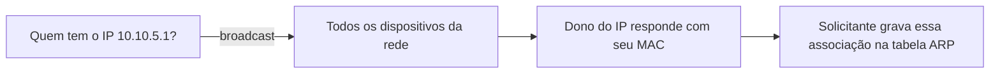
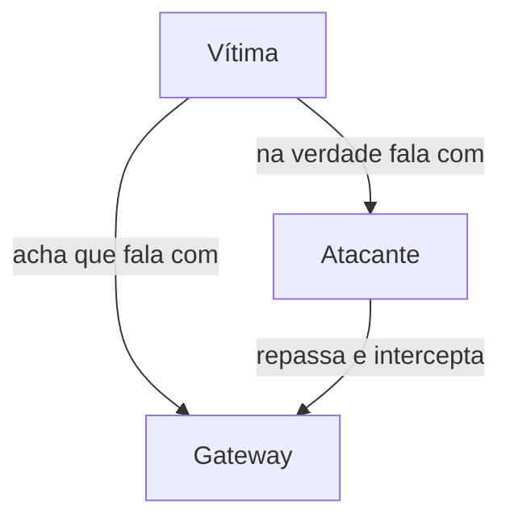
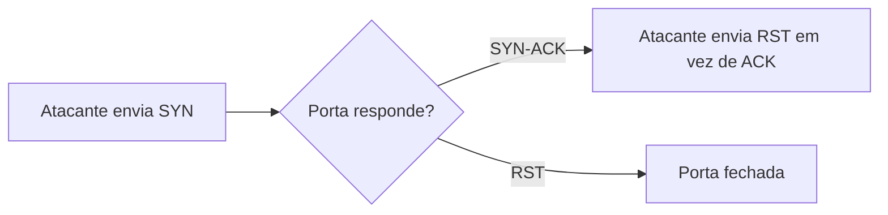

# Capítulo 012 — Ataques Comuns em Redes (Sniffing, MITM, ARP Spoofing, Port Scanning)

> **Entender antes de decorar.**

---

| Informação | Detalhes |
|---|---|
| **Módulo** | 02 — Redes |
| **Nível** | Iniciante |
| **Tempo estimado** | 20 a 25 minutos |
| **Pré-requisito** | [Capítulo 011 — Análise de Tráfego com Wireshark e tcpdump](011-analise-de-trafego-com-wireshark-e-tcpdump.md) |

---

## Objetivo deste capítulo

Ao final deste capítulo, você será capaz de:

- explicar o que é sniffing e por que redes comutadas dificultam (mas não impedem) essa técnica;
- entender, de verdade, como funciona um ataque de ARP Spoofing;
- relacionar ARP Spoofing ao conceito de Man-in-the-Middle, visto no capítulo de HTTPS;
- diferenciar os principais tipos de port scanning (Connect Scan, SYN Scan e UDP Scan);
- reconhecer, em uma investigação, os sinais de cada uma dessas técnicas;
- conectar os quatro ataques em um cenário coerente de incidente.

---

## Como sempre, vamos começar utilizando nossa imaginação.

Este é o último capítulo do módulo, e o cenário de hoje não é um alerta isolado — são quatro, chegando ao SOC dentro da mesma janela de tempo:

```text
Alerta 1: volume anormal de tráfego ARP na sub-rede 10.10.5.0/24
Alerta 2: uma estação capturando tráfego que não é dela (10.10.5.23)
Alerta 3: credenciais em texto claro identificadas em uma sessão HTTP
Alerta 4: tentativas de conexão sequenciais em dezenas de portas do servidor 10.10.5.10
```

```text
Opção A
"São quatro problemas separados. Vou abrir quatro tickets diferentes."

Opção B
"Isso pode ser um único ataque, em estágios diferentes."
```

Ao final deste capítulo, você vai conseguir ler esses quatro alertas não como eventos soltos, mas como capítulos de uma mesma história — e essa é exatamente a habilidade que separa um analista que opera um SIEM de um analista que investiga de verdade.

> **Um ataque raramente aparece como um evento único. Aparece como uma sequência — e cada técnica deste capítulo é, tipicamente, um elo dessa cadeia.**

---

# Sniffing — capturando tráfego que não é seu

**Sniffing** é a captura de tráfego de rede, mesmo que esse tráfego não seja endereçado ao dispositivo que está capturando. Você já fez isso, de forma legítima, no capítulo anterior, usando Wireshark e tcpdump.

O problema de segurança começa quando alguém sem autorização consegue capturar tráfego alheio. Em uma rede comutada moderna (baseada em switches, como vimos no capítulo 008), isso **não deveria** acontecer naturalmente — um switch encaminha cada quadro apenas para a porta correspondente ao destino, diferente de um hub antigo que replicava tudo para todas as portas.

Isso significa que, para conseguir capturar tráfego alheio em uma rede comutada, um atacante geralmente precisa **forçar** essa exposição de alguma forma. Duas técnicas fazem exatamente isso — e ambas já apareceram neste projeto:

| Técnica | Como força a exposição | Onde vimos |
|---|---|---|
| **MAC Flooding** | Esgota a tabela CAM do switch, forçando-o a se comportar como hub, expondo tráfego a todas as portas | Capítulo 008 |
| **ARP Spoofing** | Engana os dispositivos para que enviem o tráfego através do atacante | Este capítulo |

Note a diferença de abordagem: MAC flooding é **barulhento** — afeta o switch inteiro, expondo o tráfego de todo mundo. ARP Spoofing é **cirúrgico** — mira especificamente em um par de dispositivos, sem alarme geral. Vamos entender exatamente como.

!!! tip "Modo promíscuo"
    Para conseguir capturar e processar tráfego que não é endereçado a ela, a placa de rede do atacante precisa operar em **modo promíscuo** — uma configuração que instrui a interface a não descartar quadros destinados a outros endereços MAC, processando tudo que chega fisicamente até ela.

---

# ARP Spoofing — finalmente explicando de verdade

Desde o capítulo sobre o Modelo OSI, "ARP Spoofing" aparece mencionado como um clássico ataque de camada 2. Chegou a hora de abrir essa caixa.

### Como o ARP funciona normalmente

O **ARP** (Address Resolution Protocol) resolve endereços IP para endereços MAC dentro da rede local. Quando um dispositivo precisa se comunicar com um IP na mesma sub-rede mas ainda não sabe o MAC correspondente, ele envia uma pergunta em **broadcast**:



O problema: **ARP não tem autenticação nenhuma**. Qualquer dispositivo pode responder afirmando ser dono de qualquer IP — e, pior, a maioria dos sistemas aceita até respostas ARP que **ninguém pediu** (chamadas de ARP gratuito), atualizando sua tabela sem questionar.

### O ataque

O atacante explora exatamente essa ausência de verificação, enviando respostas ARP forjadas para duas vítimas ao mesmo tempo:

```text
Para a vítima:     "Eu sou o gateway (10.10.5.1)" — mas com o MAC do atacante
Para o gateway:    "Eu sou a vítima (10.10.5.23)" — mas com o MAC do atacante
```



Depois desse "envenenamento" das tabelas ARP dos dois lados, todo o tráfego entre vítima e gateway passa a fluir **através do atacante** antes de seguir adiante — muitas vezes sem que a vítima perceba qualquer diferença na navegação.

Reconhece essa estrutura? É exatamente o conceito de **Man-in-the-Middle** que vimos no capítulo sobre HTTPS. ARP Spoofing é, na prática, uma das formas mais comuns de **posicionar** um ataque MITM dentro de uma rede local — o mecanismo por trás do termo que só havíamos mencionado até agora.

!!! tip "Por que HTTPS ainda ajuda aqui"
    Mesmo com o tráfego passando pelo atacante, se a comunicação for HTTPS, o conteúdo continua criptografado — o atacante intercepta o caminho, mas não necessariamente consegue ler o conteúdo, a menos que também consiga contornar a validação de certificado (algo que vimos ser bem mais difícil, e detectável, no capítulo 007).

---

# Port Scanning — mapeando a superfície de ataque

Antes de atacar algo, um atacante geralmente precisa saber **o que existe** para atacar. **Port scanning** é a técnica de testar sistematicamente um conjunto de portas em um ou mais hosts, para descobrir quais serviços estão ativos e potencialmente vulneráveis.

Lembra do *three-way handshake* do TCP, no capítulo 003? Os diferentes tipos de scan exploram justamente as etapas desse handshake:

### TCP Connect Scan

Completa o handshake inteiro (SYN → SYN-ACK → ACK) para cada porta testada. É o método mais confiável, mas também o mais "barulhento": cada tentativa gera uma conexão completa, registrada por qualquer sistema de log de conexões.

### SYN Scan ("half-open")

Envia o SYN inicial e, se receber SYN-ACK (indicando porta aberta), responde com um **RST** em vez de completar o handshake com o ACK final.



Como a conexão nunca é completada, esse método é mais discreto — muitas aplicações só registram conexões totalmente estabelecidas. Ainda assim, deixa rastro: um firewall ou IDS atento percebe o volume incomum de SYN sem ACK correspondente, um padrão que lembra (em menor escala e com intenção diferente) o SYN flood que vimos no capítulo 003.

### UDP Scan

Como UDP não tem handshake (também do capítulo 003), esse tipo de scan funciona por **inferência**: se uma porta UDP estiver fechada, o host costuma responder com uma mensagem ICMP "porta inacessível" (lembra do capítulo 005?); se não houver resposta nenhuma, a porta pode estar aberta — ou o pacote simplesmente se perdeu, tornando esse tipo de varredura mais lento e menos preciso que as baseadas em TCP.

!!! tip "A ferramenta mais conhecida"
    O **Nmap** é, disparado, a ferramenta mais usada para port scanning — tanto por profissionais de segurança validando sua própria rede quanto por atacantes em fase de reconhecimento. Ver `nmap` nos logs de um servidor não é, por si só, prova de ataque (times de segurança também o usam legitimamente) — mas o padrão de origem, frequência e escopo do scan ajuda a diferenciar uso legítimo de reconhecimento hostil.

---

# Aplicação em um SOC

### Detectando ARP Spoofing

- múltiplas respostas ARP reivindicando o mesmo IP com MACs diferentes em curto intervalo;
- mudanças repentinas e repetidas na tabela ARP de hosts críticos, como o gateway;
- volume incomum de ARP gratuito, especialmente partindo de um host que normalmente não teria motivo para anunciar mudanças de endereço.

### Detectando Sniffing

- sniffing passivo é, por natureza, difícil de detectar diretamente — ele não gera tráfego próprio;
- por isso, a detecção prática costuma depender do que **habilita** o sniffing: os sintomas de MAC flooding (capítulo 008) ou de ARP spoofing (este capítulo) funcionam como sinal indireto de que sniffing pode estar em andamento;
- em ambientes mais controlados, é possível testar interfaces suspeitas de estarem em modo promíscuo através de sondas específicas de rede.

### Detectando Port Scanning

- tentativas de conexão sequenciais, em muitas portas diferentes, partindo de um único host em curto espaço de tempo;
- alto volume de pacotes SYN sem ACK correspondente (indício de SYN scan);
- correlacionar a origem do scan com sua posição na rede: um scan partindo de dentro da rede interna tem implicações bem diferentes de um partindo da internet.

---

# Cenário prático — Conectando os quatro alertas

Voltando aos quatro alertas do início do capítulo, agora com todo o repertório deste módulo:

> **Alerta 4** (port scan no servidor `10.10.5.10`): reconhecimento inicial — o atacante mapeando quais portas e serviços estão disponíveis na rede antes de agir.

> **Alerta 1** (volume anormal de ARP): o atacante iniciando um envenenamento de ARP, se posicionando entre a estação `10.10.5.23` e o gateway da rede.

> **Alerta 2** (estação capturando tráfego alheio): consequência direta do ARP spoofing — o tráfego da vítima passou a fluir através do atacante, permitindo sniffing sem precisar de MAC flooding.

> **Alerta 3** (credenciais em texto claro): o resultado prático de tudo isso — uma sessão HTTP (não HTTPS, como vimos ser um risco desde o capítulo 007) sendo interceptada, expondo credenciais reais.

Quatro alertas, uma única cadeia de ataque: **reconhecimento → posicionamento (MITM via ARP spoofing) → interceptação (sniffing) → coleta de credenciais**. Isso não seria visível para quem tratasse cada alerta isoladamente — só faz sentido para quem entende o que cada peça representa, e como elas se encaixam.

---

## Perguntas de investigação

??? question "1. Por que uma rede comutada normalmente dificulta o sniffing passivo, e quais duas técnicas conseguem contornar isso?"
    Porque um switch encaminha tráfego apenas para a porta de destino correspondente, ao contrário de um hub. MAC flooding contorna isso esgotando a tabela CAM do switch; ARP spoofing contorna isso redirecionando o tráfego da vítima através do atacante.

??? question "2. Por que o protocolo ARP é vulnerável a spoofing?"
    Porque ARP não possui mecanismo de autenticação — qualquer dispositivo pode responder afirmando ser dono de um IP, e a maioria dos sistemas aceita até respostas não solicitadas (ARP gratuito) sem verificação.

??? question "3. Qual a diferença entre uma TCP Connect Scan e uma SYN Scan?"
    A Connect Scan completa o handshake TCP inteiro para cada porta testada, sendo mais confiável mas mais fácil de registrar em log. A SYN Scan envia apenas o SYN inicial e responde com RST ao receber SYN-ACK, sem completar a conexão — mais discreta, mas ainda detectável pelo padrão de SYNs sem ACK correspondente.

??? question "4. Por que port scanning costuma ser a primeira etapa observável de um ataque, mesmo sem ser destrutivo em si?"
    Porque scanning é uma atividade de reconhecimento: o atacante precisa entender quais serviços estão disponíveis antes de decidir como (e se) atacar. Embora não seja destrutivo, geralmente precede as etapas seguintes de um ataque.

??? question "5. Como MAC flooding e ARP spoofing diferem como técnicas para habilitar sniffing?"
    MAC flooding afeta o switch inteiro, expondo indiscriminadamente o tráfego de todos os dispositivos conectados a ele. ARP spoofing é direcionado, posicionando o atacante especificamente entre dois dispositivos escolhidos, sem afetar o restante da rede.

---

# O que não fazer

- não trate alertas de rede diferentes como necessariamente não relacionados — investigue a possibilidade de fazerem parte de uma mesma cadeia;
- não assuma que uma rede com switch está automaticamente protegida contra sniffing;
- não descarte um SYN scan como inofensivo só porque não completa conexões;
- não confunda uso legítimo de ferramentas como Nmap (comum em times de segurança) com evidência automática de ataque — o contexto de origem e escopo é o que diferencia.

---

# Erros comuns

### "Rede com switch já está protegida contra sniffing"

Não.

Switches resolvem o problema de tráfego indiscriminado por padrão, mas tanto MAC flooding quanto ARP spoofing conseguem contornar essa proteção — o segundo, inclusive, sem gerar o alarme generalizado do primeiro.

### "SYN scan é indetectável"

Não.

Embora mais discreto que uma Connect Scan completa, um SYN scan ainda gera um padrão reconhecível: muitos pacotes SYN sem o ACK final correspondente, visível para firewalls e IDS bem configurados.

### "ARP spoofing exige acesso físico ao cabo de rede"

Não.

Basta que o atacante esteja no mesmo segmento lógico de rede (a mesma sub-rede ou VLAN) — não é necessário acesso físico direto a nenhum cabo ou porta específica.

---

# Resumo

Neste capítulo, que fecha o módulo de Redes, aprendemos que:

- **sniffing** é a captura de tráfego alheio, dificultada (mas não impedida) por redes comutadas;
- **MAC flooding** e **ARP spoofing** são as duas técnicas clássicas para contornar essa proteção — uma ampla e barulhenta, outra cirúrgica e direcionada;
- **ARP spoofing** explora a ausência de autenticação do protocolo ARP para se posicionar como intermediário entre duas vítimas, sendo o mecanismo por trás de muitos ataques **Man-in-the-Middle**;
- **port scanning** mapeia portas e serviços ativos como etapa de reconhecimento, com variações como Connect Scan, SYN Scan e UDP Scan explorando diferentes partes do handshake TCP;
- alertas de rede aparentemente isolados frequentemente representam **estágios diferentes de uma mesma cadeia de ataque**.

```text
Não pergunte apenas:

"Esse alerta, sozinho, é grave?"

Pergunte também:

"Esse alerta poderia ser uma etapa de algo maior?"
"Que outros alertas, próximos no tempo, poderiam se conectar a esse?"
"Que técnica deste módulo explicaria esse comportamento?"
```

> **Um ataque raramente é um evento. É uma sequência — e cada capítulo deste módulo te deu uma peça diferente para reconhecer essa sequência quando ela aparecer.**

---

# Checkpoint

Antes de considerar este módulo concluído, confirme se você consegue responder:

- [ ] O que é sniffing, e por que redes comutadas normalmente dificultam essa técnica?
- [ ] Como MAC flooding e ARP spoofing diferem como técnicas de habilitar sniffing?
- [ ] Como funciona, passo a passo, um ataque de ARP spoofing?
- [ ] Por que ARP spoofing é considerado uma forma de ataque Man-in-the-Middle?
- [ ] Quais são os três tipos principais de port scanning, e como cada um se relaciona ao handshake TCP?
- [ ] Como conectar múltiplos alertas de rede em uma única narrativa de incidente?

---

# Glossário

| Termo | Definição |
|---|---|
| **Sniffing** | Captura de tráfego de rede, incluindo tráfego não endereçado ao dispositivo que captura. |
| **Modo promíscuo** | Configuração de uma interface de rede que permite capturar todo o tráfego que chega até ela, não apenas o destinado ao seu próprio endereço. |
| **ARP Spoofing** | Ataque que forja respostas ARP para se posicionar como intermediário entre duas vítimas em uma rede local. |
| **ARP Gratuito** | Resposta ARP enviada sem que tenha sido solicitada, aceita por padrão pela maioria dos sistemas. |
| **TCP Connect Scan** | Tipo de port scan que completa o handshake TCP inteiro para cada porta testada. |
| **SYN Scan** | Tipo de port scan que envia apenas o SYN inicial, sem completar a conexão — também chamado de "half-open scan". |
| **UDP Scan** | Tipo de port scan que infere portas abertas pela ausência de resposta ICMP de "porta inacessível". |

---

# Referências

- [Cloudflare — O que é ARP Spoofing?](https://www.cloudflare.com/learning/security/glossary/arp-spoofing/)
- [Nmap — Técnicas de Port Scanning (documentação oficial)](https://nmap.org/book/man-port-scanning-techniques.html)
- [Cisco Networking Academy](https://www.netacad.com/courses/networking)

---

# Módulo concluído

Com este capítulo, o **Módulo 02 — Redes** chega ao fim: 12 capítulos, da pergunta "por que redes importam para segurança" até uma cadeia completa de ataque envolvendo ARP spoofing, sniffing e exfiltração de credenciais.

O próximo módulo do projeto — **Módulo 03 — Linux** — começa a construir a base de sistemas operacionais que, junto com o que vimos aqui, sustenta praticamente toda investigação de Blue Team daqui em diante.

[← Capítulo anterior: Wireshark e tcpdump](011-analise-de-trafego-com-wireshark-e-tcpdump.md){ .md-button }

---

> **Entender antes de decorar.**
